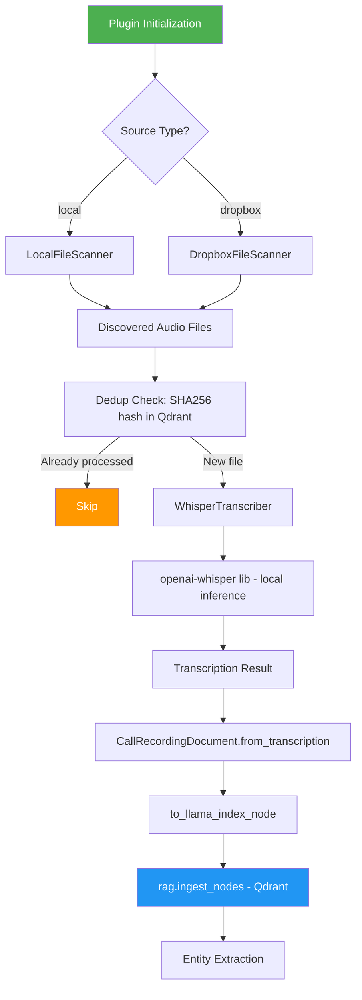
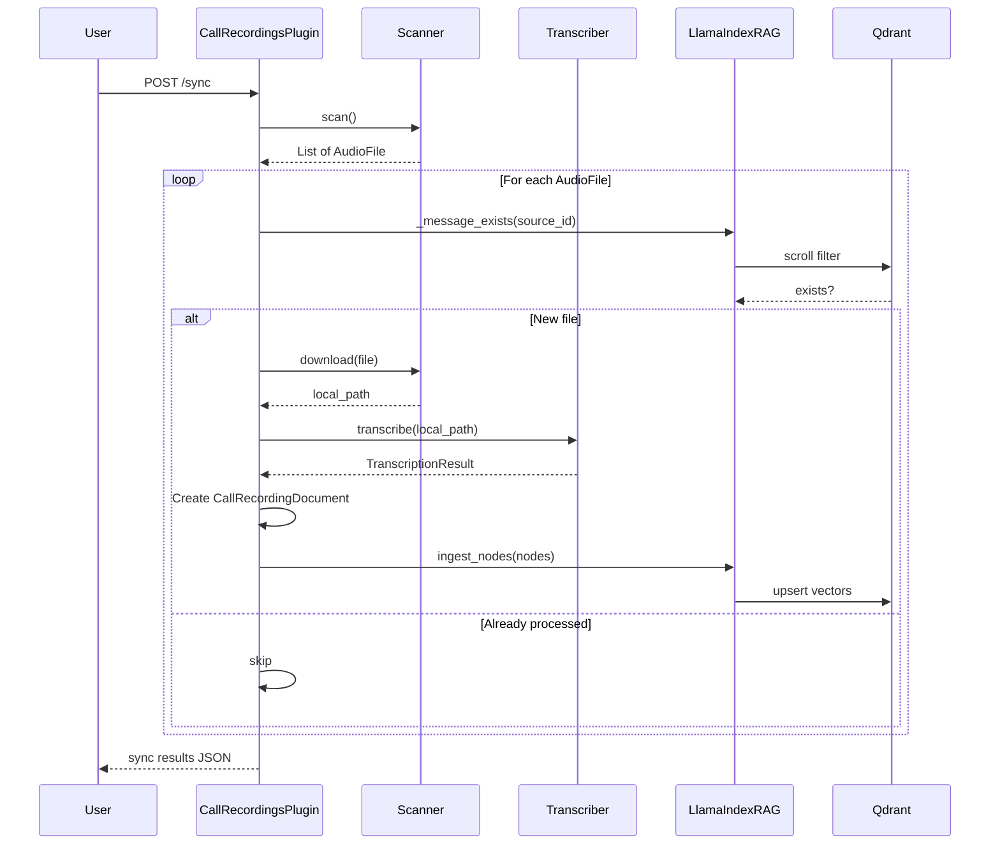
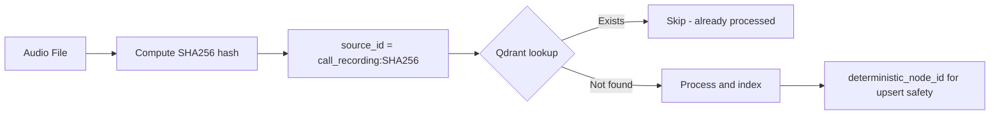

# Call Recordings Plugin — Architecture Plan

## Overview

A new plugin (`call_recordings`) that scans a local directory or Dropbox folder for audio call recordings, transcribes them using OpenAI Whisper, and indexes the transcriptions into the Qdrant vector store for RAG retrieval.

## Architecture Diagram



## Component Design

### 1. File Structure

```
src/plugins/call_recordings/
├── __init__.py          # Package init
├── plugin.py            # ChannelPlugin implementation
├── sync.py              # CallRecordingSyncer - orchestrates scan → transcribe → index
├── transcriber.py       # Whisper transcription wrapper - local and API modes
└── scanner.py           # File discovery - LocalFileScanner + DropboxFileScanner
```

### 2. Scanner Module — `scanner.py`

Responsible for discovering audio files from either a local directory or Dropbox.

**Interface:**

```python
class AudioFile:
    """Discovered audio file metadata."""
    filename: str           # Original filename
    path: str               # Full path or Dropbox path
    size: int               # File size in bytes
    modified_at: datetime   # Last modified time
    content_hash: str       # SHA256 of file content for dedup
    extension: str          # File extension without dot

class BaseFileScanner(ABC):
    def scan() -> List[AudioFile]
    def download(audio_file: AudioFile) -> Path  # Returns local temp path

class LocalFileScanner(BaseFileScanner):
    """Scans a local directory recursively for audio files."""
    
class DropboxFileScanner(BaseFileScanner):
    """Scans a Dropbox folder for audio files using Dropbox API."""
```

**Supported audio extensions:** `mp3, wav, m4a, ogg, flac, wma, aac, opus, webm, mp4`

**Local scanner behavior:**
- Recursively walks the configured directory
- Filters by supported audio extensions
- Computes SHA256 hash of each file for dedup
- Returns `AudioFile` objects; `download()` is a no-op (returns the existing local path)

**Dropbox scanner behavior:**
- Uses `dropbox` Python SDK to list files in the configured folder
- Uses Dropbox `content_hash` for dedup (avoids downloading just for hashing)
- `download()` fetches the file to a temp directory, returns the temp path
- Temp files are cleaned up after transcription

### 3. Transcriber Module — `transcriber.py`

Uses local OpenAI Whisper for audio-to-text transcription with configurable model size.

**Interface:**

```python
@dataclass
class TranscriptionResult:
    text: str                    # Full transcription text
    language: Optional[str]      # Detected language
    duration_seconds: int        # Audio duration
    segments: List[dict]         # Timestamped segments from Whisper
    confidence: float            # Average confidence score

class WhisperTranscriber:
    def __init__(self, model_size: str = "medium"):
        """
        Args:
            model_size: 'small', 'medium', or 'large'
        """
    
    def transcribe(self, audio_path: Path) -> TranscriptionResult
```

**Behavior:**
- Uses `openai-whisper` Python package (local inference only, no API calls)
- Loads model based on configured size: `small`, `medium`, `large`
- Model is loaded lazily on first use and cached for subsequent calls
- Returns language detection, timestamped segments, and confidence
- Automatically uses GPU (CUDA) if available, falls back to CPU

### 4. Sync Module — `sync.py`

Orchestrates the full pipeline: scan → dedup → transcribe → index.

**Class: `CallRecordingSyncer`**

Follows the same pattern as `EmailSyncer` and `DocumentSyncer`:

```python
class CallRecordingSyncer:
    def __init__(self, scanner: BaseFileScanner, transcriber: WhisperTranscriber, rag):
        ...
    
    def sync_recordings(self, max_files: int, force: bool) -> dict:
        """
        1. scanner.scan() → list of AudioFile
        2. For each file:
           a. Dedup check: rag._message_exists(source_id=f'call_recording:{content_hash}')
           b. If new: scanner.download() → local path
           c. transcriber.transcribe(local_path) → TranscriptionResult
           d. Parse filename for metadata: date, participants, call type
           e. Create CallRecordingDocument.from_transcription(...)
           f. Convert to TextNode via .to_llama_index_node()
           g. rag.ingest_nodes([node])
           h. Entity extraction
           i. Cleanup temp files if Dropbox
        3. Return sync results dict
        """
```

**Dedup strategy:**
- Primary: SHA256 content hash as part of `source_id` → `call_recording:{sha256_hash}`
- Uses `rag._message_exists(source_id)` which checks Qdrant's keyword index on `source_id`
- Deterministic node IDs via `deterministic_node_id('call_recording', source_id, chunk_idx)` for idempotent upserts
- When `force=True`, skips dedup check (like Gmail/Paperless plugins)

**Filename metadata extraction:**
- Attempts to parse date from filename patterns like `2024-01-15_call.mp3` or `recording_20240115.wav`
- Attempts to parse participant names from filename if present
- Falls back to file modification time for timestamp
- Falls back to `call_recordings_default_participants` setting

**Long transcript chunking:**
- Uses `split_text()` from `utils/text_processing.py` for transcripts exceeding embedding limits
- Each chunk gets a deterministic node ID with chunk_index

### 5. Plugin Module — `plugin.py`

Standard `ChannelPlugin` implementation.

**Identity:**
- `name`: `"call_recordings"`
- `display_name`: `"Call Recordings"`
- `icon`: `"📞"`
- `version`: `"1.0.0"`

**Settings:**

| Key | Default | Type | Description |
|-----|---------|------|-------------|
| `call_recordings_source_type` | `local` | select | Source: local directory or dropbox |
| `call_recordings_source_path` | `/app/data/call_recordings` | text | Local directory path or Dropbox folder path |
| `call_recordings_dropbox_token` | `` | secret | Dropbox API access token |
| `call_recordings_whisper_model` | `medium` | select | Whisper model size: small, medium, large |
| `call_recordings_file_extensions` | `mp3,wav,m4a,ogg,flac` | text | Comma-separated audio file extensions to process |
| `call_recordings_max_files` | `100` | int | Maximum files to process per sync run |
| `call_recordings_sync_interval` | `3600` | int | Sync interval in seconds, 0 = manual only |
| `call_recordings_default_participants` | `` | text | Default participant names if not detectable from filename |

**Flask Blueprint Routes:**

| Method | Path | Description |
|--------|------|-------------|
| `POST` | `/plugins/call_recordings/sync` | Trigger manual sync. `?force=true` to skip dedup |
| `GET` | `/plugins/call_recordings/sync/status` | Get sync status: is_syncing, last_sync, synced_count |
| `GET` | `/plugins/call_recordings/test` | Test source connectivity: verify path/Dropbox access |
| `GET` | `/plugins/call_recordings/files` | List discovered audio files with their processing status |

**Lifecycle:**
- `initialize()`: Creates scanner + transcriber based on settings, gets RAG instance
- `shutdown()`: Cleans up resources, unloads Whisper model if loaded

### 6. Changes to Existing Files

#### `src/models/base.py`
- No changes needed — `Source.MANUAL` is appropriate for call recordings from a file source, matching the existing `CallRecordingDocument.get_source()` default. The `from_transcription()` factory already accepts a `source` parameter for override.

#### `src/llamaindex_rag.py`
- Add `"call_recording": "Call Recording"` to `_SOURCE_LABELS` dict so transcribed recordings display with a proper label in retrieved context.

#### `requirements.txt`
- Add `openai-whisper>=20231117` — local Whisper transcription
- Add `dropbox>=12.0` — Dropbox API access
- Add `soundfile>=0.12` — audio file metadata reading (duration)

#### `.env.example`
- Add call recordings configuration section with env vars

## Data Flow



## Dedup Flow



## Key Design Decisions

1. **SHA256 content hash for dedup** — Handles file renames/moves without reprocessing. The hash is computed once during scanning and stored as `source_id` in Qdrant.

2. **Reuse existing `CallRecordingDocument` model** — The model already has all needed fields: transcript, duration, participants, call_type, confidence_score, audio_file_path, transcription_provider, language_detected.

3. **Dual transcription modes** — Local Whisper for privacy/cost control, OpenAI API for simplicity. Configurable per deployment.

4. **Follow Gmail/Paperless sync pattern** — Same syncer structure, same dedup approach, same batch ingestion via `ingest_nodes()`, same entity extraction post-hook.

5. **Scanner abstraction** — `BaseFileScanner` interface lets us swap local/Dropbox backends without changing sync logic. Easy to add S3/GCS/NFS in the future.

6. **Lazy Whisper model loading** — The local Whisper model is only loaded on first transcription request, not at plugin init. This avoids slowing down app startup when the plugin is enabled but hasn't been used yet.
