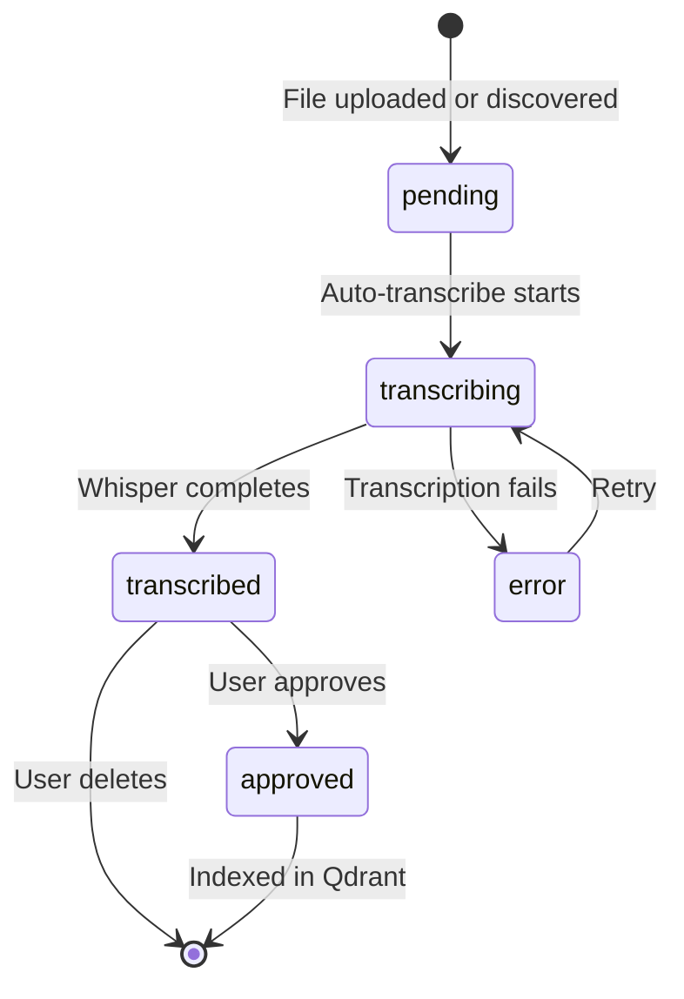

# Call Recordings: Review & Approve Workflow

## Overview

Transform the call recordings plugin from a "blind sync" model (upload → auto-index)
into a **review-and-approve** pipeline where users can see transcription progress,
review results, edit metadata, and approve/delete recordings before they enter the
RAG vector store.

## Workflow



## Architecture

### 1. New SQLite Table: `call_recording_files`

Tracks the lifecycle of each audio file from discovery through approval.

| Column | Type | Description |
|--------|------|-------------|
| `id` | INTEGER PK | Auto-increment row ID |
| `content_hash` | TEXT UNIQUE | SHA256 hash for dedup |
| `filename` | TEXT | Original filename |
| `file_path` | TEXT | Full path on disk |
| `file_size` | INTEGER | File size in bytes |
| `extension` | TEXT | Audio format |
| `modified_at` | TEXT | File modification timestamp |
| `status` | TEXT | pending, transcribing, transcribed, approved, error |
| `transcript_text` | TEXT | Full transcription result |
| `language` | TEXT | Detected language code |
| `duration_seconds` | INTEGER | Audio duration |
| `confidence` | REAL | Whisper confidence score |
| `participants` | TEXT | JSON array of participant names |
| `contact_name` | TEXT | User-editable contact name |
| `phone_number` | TEXT | User-editable phone number |
| `error_message` | TEXT | Error details if status=error |
| `source_id` | TEXT | Qdrant source_id after approval |
| `created_at` | TEXT | Row creation timestamp |
| `updated_at` | TEXT | Last update timestamp |

**Location**: New file `src/plugins/call_recordings/db.py`

### 2. Backend API Endpoints

All under `/plugins/call_recordings/`:

| Method | Path | Description |
|--------|------|-------------|
| `GET` | `/files` | List all tracked files with status, metadata, transcript preview |
| `GET` | `/files/<hash>` | Get full detail for a single file including full transcript |
| `POST` | `/files/<hash>/transcribe` | Retry transcription for a failed file |
| `PUT` | `/files/<hash>/metadata` | Update contact_name, phone_number, participants |
| `POST` | `/files/<hash>/approve` | Index transcription into Qdrant, set status=approved |
| `DELETE` | `/files/<hash>` | Delete file from disk and tracking table |
| `POST` | `/scan` | Trigger a scan that discovers new files and auto-transcribes them |

**Changes to existing endpoints:**
- `POST /upload` → After saving files, insert rows into tracking table with `status=pending`, then kick off background transcription
- `POST /sync` → Replaced by `/scan` which only transcribes; indexing requires explicit approve

### 3. Refactored Sync Pipeline

Split the current monolithic `sync_recordings()` into composable steps:

```
CallRecordingSyncer
├── scan_and_register()     → Discover files, insert into DB as pending
├── transcribe_file(hash)   → Transcribe one file, update DB with result
├── approve_file(hash)      → Build nodes, index to Qdrant
└── delete_file(hash)       → Remove from disk + DB
```

**Auto-transcribe**: After `scan_and_register()` or upload, iterate pending files
and call `transcribe_file()` for each. Runs in the request thread since Whisper
is CPU-bound and blocking.

### 4. Frontend: Recordings Table

Added below the upload area in the Call Recordings plugin section.

#### Table Columns

| Column | Content |
|--------|---------|
| Status | Colored badge: pending/transcribing/transcribed/approved/error |
| Filename | File name with extension icon |
| Duration | MM:SS format |
| Language | Detected language |
| Contact | Editable text field for contact name |
| Phone | Editable text field for phone number |
| Transcript | First 100 chars with expand/collapse |
| Actions | Approve button, Delete button, Retry button if error |

#### UI Interactions

- **Load**: Fetch `/files` on plugin tab open; poll or manual refresh
- **Edit metadata**: Inline edit for contact name + phone; auto-saves via PUT
- **Approve**: POST `/files/<hash>/approve` → row turns green, approve button disabled
- **Delete**: DELETE `/files/<hash>` → row removed from table
- **Retry**: POST `/files/<hash>/transcribe` → status goes back to transcribing

### 5. State Variables

New state vars in `AppState`:

```python
# Recording files list
call_recordings_files: list[dict[str, str]] = []
call_recordings_files_loading: bool = False
call_recordings_selected_hash: str = ""  # For detail view
call_recordings_detail: dict[str, str] = {}
```

### 6. File Changes Summary

| File | Change |
|------|--------|
| `src/plugins/call_recordings/db.py` | **NEW** — SQLite table management for file tracking |
| `src/plugins/call_recordings/sync.py` | Refactor into composable steps |
| `src/plugins/call_recordings/plugin.py` | New endpoints, wire up DB + refactored sync |
| `ui-reflex/ui_reflex/api_client.py` | New async functions for file operations |
| `ui-reflex/ui_reflex/state.py` | New state vars + event handlers for recordings table |
| `ui-reflex/ui_reflex/components/settings_page.py` | Recordings table component |
