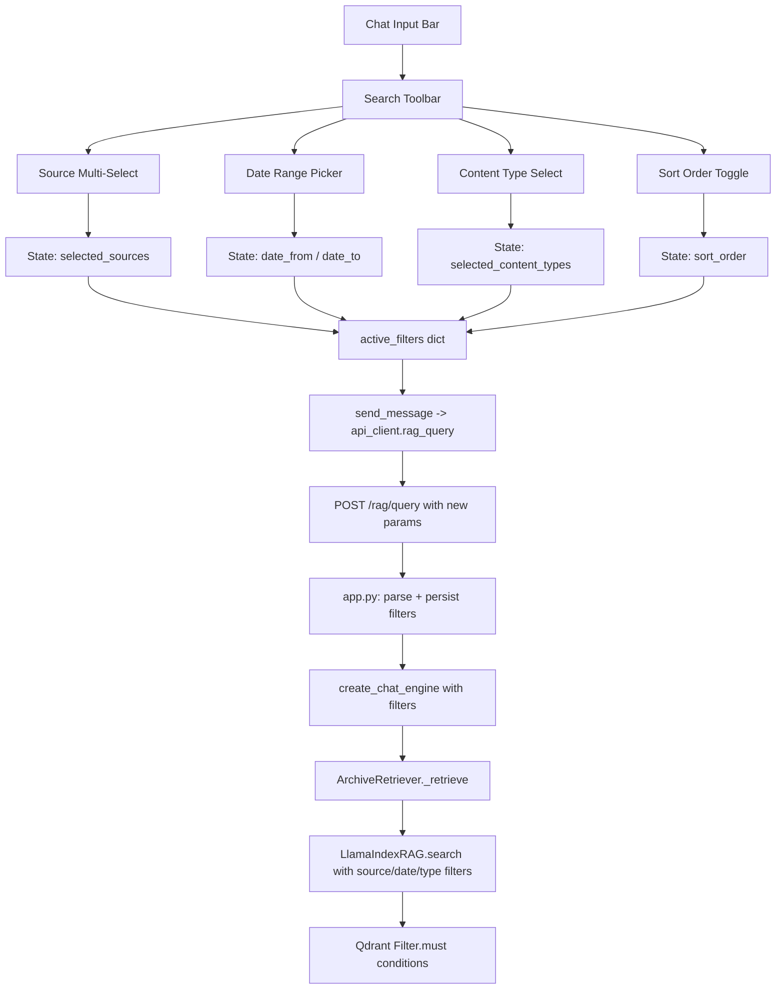

# Chat Page — Advanced Search Filters

## Overview

Add a search toolbar to the chat page that lets users refine RAG queries with:

1. **Source filter** (multi-select) — query only WhatsApp, Paperless, Gmail, etc.
2. **Date range** — from/to date pickers instead of just "last N days"
3. **Content type filter** — text messages vs documents vs emails
4. **Sort order toggle** — relevance (semantic) vs chronological (newest first)

## Current State

- Filter chips already exist for `chat_name`, `sender`, `days` — rendered in [`_filter_chips()`](ui-reflex/ui_reflex/components/chat_area.py:61)
- Qdrant has an indexed `source` keyword field with values: `"whatsapp"`, `"paperless"`, `"gmail"`
- Qdrant has an indexed `content_type` keyword field with values: `"text"`, `"document"`, etc.
- Qdrant has an indexed `timestamp` integer field for range queries
- The [`/plugins`](ui-reflex/ui_reflex/api_client.py:247) endpoint returns plugin metadata (name, icon, enabled)
- [`plugins_data`](ui-reflex/ui_reflex/state.py:121) is already loaded in UI state on settings page load

## Architecture



## Data Flow

### 1. New Filter Parameters

| Filter | UI Control | State Var | API Param | Backend Field | Qdrant Condition |
|--------|-----------|-----------|-----------|---------------|-----------------|
| Sources | Multi-select chips | `selected_sources: list[str]` | `filter_sources: list[str]` | `source` | `should` with `MatchValue` per source |
| Date From | Date input | `filter_date_from: str` | `filter_date_from: str` (ISO) | `timestamp` | `Range(gte=unix_ts)` |
| Date To | Date input | `filter_date_to: str` | `filter_date_to: str` (ISO) | `timestamp` | `Range(lte=unix_ts)` |
| Content Types | Multi-select | `selected_content_types: list[str]` | `filter_content_types: list[str]` | `content_type` | `should` with `MatchValue` |
| Sort Order | Toggle button | `sort_order: str` | `sort_order: str` | N/A | Changes retrieval strategy |

### 2. Source Filter Logic

When multiple sources are selected, use Qdrant `should` (OR) inside a `must` wrapper:

```python
# If filter_sources = ["whatsapp", "gmail"]
source_conditions = [
    FieldCondition(key="source", match=MatchValue(value=s))
    for s in filter_sources
]
must_conditions.append(Filter(should=source_conditions))
```

When no sources are selected, query all sources (no filter applied).

### 3. Date Range Logic

Replace or augment the existing `filter_days` with explicit date boundaries:

```python
if filter_date_from:
    ts_from = int(datetime.fromisoformat(filter_date_from).timestamp())
    must_conditions.append(FieldCondition(key="timestamp", range=Range(gte=ts_from)))

if filter_date_to:
    # Add 1 day to include the full end date
    ts_to = int((datetime.fromisoformat(filter_date_to) + timedelta(days=1)).timestamp())
    must_conditions.append(FieldCondition(key="timestamp", range=Range(lte=ts_to)))
```

The existing `filter_days` continues to work — it simply becomes syntactic sugar that sets `filter_date_from` to `now - N days`.

## UI Design

### Search Toolbar (above input bar)

A collapsible toolbar row that appears when the user clicks a filter/tune icon next to the input. Contains:

```
┌─────────────────────────────────────────────────────────────┐
│ 🔧 [WhatsApp ✓] [Paperless ✓] [Gmail] │ 📅 From [___] To [___] │ ↕ Relevance │
└─────────────────────────────────────────────────────────────┘
```

**Source chips:** Toggle buttons for each enabled plugin source. Shows icon + name. Multiple can be active. If none are active = all sources.

**Date range:** Two compact date inputs (native HTML date inputs work well with Reflex).

**Sort toggle:** Switch between "Relevance" (default semantic) and "Newest First" (chronological).

### Filter Chips (above messages)

Extend the existing filter chips to show new filter types:

- `📦 WhatsApp, Gmail` — active source filter
- `📅 Feb 1 – Feb 15, 2026` — active date range
- `📄 Documents only` — content type filter

Each chip has an ✕ to remove that filter.

## Files to Modify

### Backend (src/)

1. **`src/llamaindex_rag.py`** — Add `filter_sources`, `filter_date_from`, `filter_date_to`, `filter_content_types`, `sort_order` to:
   - `search()` method
   - `_fulltext_search()` method
   - `recency_search()` method
   - `expand_context()` method
   - `ArchiveRetriever.__init__()` and `_retrieve()`
   - `create_chat_engine()` method

2. **`src/app.py`** — Update `/rag/query` endpoint to:
   - Parse new filter params from request JSON
   - Persist them in Redis filter state
   - Pass them to `create_chat_engine()`

### UI Frontend (ui-reflex/)

3. **`ui-reflex/ui_reflex/api_client.py`** — Update `rag_query()` to accept and send:
   - `filter_sources: list[str] | None`
   - `filter_date_from: str | None`
   - `filter_date_to: str | None`
   - `filter_content_types: list[str] | None`
   - `sort_order: str | None`

4. **`ui-reflex/ui_reflex/state.py`** — Add:
   - State vars: `selected_sources`, `filter_date_from`, `filter_date_to`, `selected_content_types`, `sort_order`, `show_search_toolbar`
   - Computed var: `available_sources` (from plugins_data)
   - Setters: `toggle_source()`, `set_date_from()`, `set_date_to()`, `toggle_content_type()`, `toggle_sort_order()`, `toggle_search_toolbar()`
   - Update `send_message()` to include new filters
   - Update `filter_chips` to include new filter types
   - Update `active_filters` dict to include new keys
   - Load available sources on `on_load()`

5. **`ui-reflex/ui_reflex/components/chat_area.py`** — Add:
   - `_search_toolbar()` component with source chips, date pickers, sort toggle
   - Filter icon button next to the input textarea to toggle toolbar
   - Updated filter chip rendering for new types

6. **`ui-reflex/ui_reflex/components/chat_area.py`** or new file **`ui-reflex/ui_reflex/components/search_toolbar.py`** — Search toolbar component
