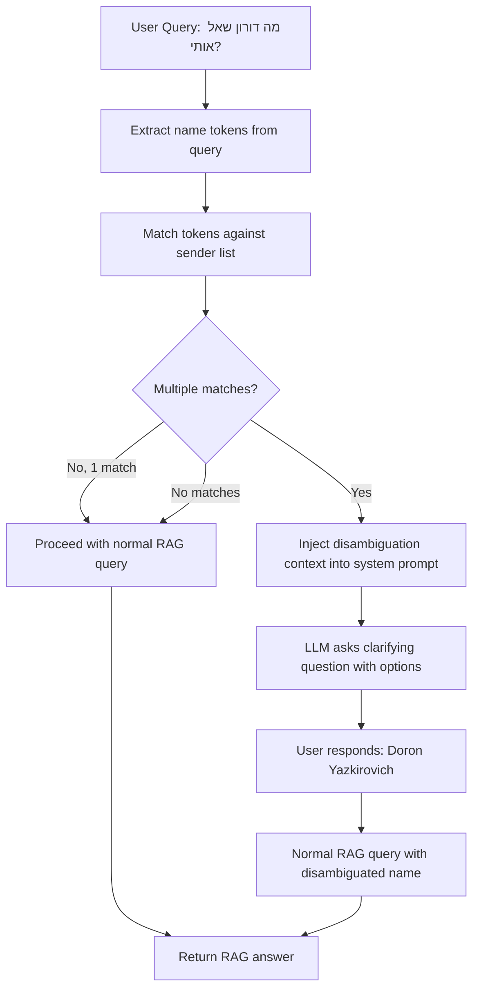

# Contact Disambiguation Plan

## Problem

When a user asks "מה דורון שאל אותי?" (What did Doron ask me?), Lucy returns results for **דורון עלאני** (from Paperless documents) instead of **Doron Yazkirovich** (from WhatsApp). This happens because:

1. **Cross-language name mismatch**: The Hebrew token "דורון" matches "דורון עלאני" via fulltext search (score 0.95), but doesn't match the English-spelled "Doron Yazkirovich" in the `sender` field
2. **No disambiguation**: The LLM has no awareness of the full contact/sender list, so it can't detect that "Doron" is ambiguous and ask the user to clarify

### Expected Behavior
When a name in the query matches multiple people in the archive, Lucy should ask a clarifying question like:
> "I found multiple people named Doron in your archive. Did you mean:
> 1. Doron Yazkirovich
> 2. דורון עלאני
> 
> Please specify which one."

## Architecture



## Solution: Two-Layer Approach

### Layer 1: Name Matching Utility (`src/utils/name_matcher.py`)

A new utility that detects ambiguous person names in queries by matching against the known sender list.

#### Key Functions:

1. **`transliterate_hebrew_to_latin(text)`** — Basic phonetic Hebrew→Latin transliteration
   - Maps Hebrew characters to their Latin phonetic equivalents
   - Example: דורון → "doron", דוד → "david", ליאור → "lior"
   - Uses a character-by-character mapping with common vowel patterns

2. **`transliterate_latin_to_hebrew(text)`** — Basic Latin→Hebrew transliteration
   - Reverse mapping for matching English names against Hebrew senders
   - Example: "doron" → "דורון", "david" → "דויד"

3. **`find_matching_senders(query, sender_list)`** — Main disambiguation function
   - Tokenizes the query into name-candidate tokens (≥2 chars for Hebrew, ≥3 for Latin)
   - Filters out common stop words and non-name tokens
   - For each token, searches the sender list using:
     - Direct case-insensitive substring match
     - Hebrew→Latin transliterated match
     - Latin→Hebrew transliterated match
   - Returns a dict: `{token: [list of matching sender names]}`
   - Only returns entries where **2+ senders match** the same token (ambiguous)

4. **`format_disambiguation_prompt(matches)`** — Formats the disambiguation info
   - Takes the ambiguous matches dict
   - Returns a string suitable for injection into the system prompt
   - Example: "The name 'דורון' matches multiple people: Doron Yazkirovich, דורון עלאני. Ask the user which one they mean."

### Layer 2: Integration into Query Flow

#### Option A: System Prompt Injection (Recommended)

Modify `_build_system_prompt()` or `create_chat_engine()` in `llamaindex_rag.py` to accept disambiguation context, and modify `rag_query()` in `app.py` to detect ambiguity before creating the chat engine.

**Flow in `rag_query()` (app.py):**
```python
# Before creating the chat engine:
sender_list = rag.get_sender_list()
ambiguous = find_matching_senders(question, sender_list)

if ambiguous:
    disambiguation_context = format_disambiguation_prompt(ambiguous)
    # Pass to chat engine creation
    chat_engine = rag.create_chat_engine(
        ...,
        disambiguation_context=disambiguation_context,
    )
```

**In `create_chat_engine()` (llamaindex_rag.py):**
- Accept optional `disambiguation_context` parameter
- Append it to the system prompt when present:
```
DISAMBIGUATION NOTICE: {disambiguation_context}
When you detect that the user's question refers to a name that matches
multiple people, you MUST ask a clarifying question before answering.
List all matching names as numbered options for the user to choose from.
```

#### Option B: Pre-query Intercept (Alternative)

Intercept in `rag_query()` before running the chat engine. If ambiguity detected, return a clarification response immediately without running RAG.

**Pros**: Saves RAG query cost, faster response
**Cons**: Doesn't leverage conversation context (the LLM might be able to disambiguate from chat history)

**Recommendation**: Use **Option A** because the LLM might have enough context from conversation history to disambiguate without asking. For example, if the user previously mentioned "Doron Yazkirovich", the LLM can resolve the ambiguity itself.

### Layer 3: System Prompt Enhancement

Add to the default system prompt (or as a separate instruction block):

```
9. DISAMBIGUATION: When a person's name in the query could refer to multiple 
   people in your archive, ASK the user to clarify before answering. 
   Present the matching names as numbered options. For example:
   "I found multiple people named Doron: 1) Doron Yazkirovich 2) דורון עלאני. 
   Which one did you mean?"
   Only ask if the retrieved context actually contains results from multiple 
   different people with similar names, or if the disambiguation notice below 
   indicates multiple matches.
```

### Layer 4: Cross-Language Fulltext Search Enhancement

Enhance `_fulltext_search()` in `llamaindex_rag.py` to also search for transliterated name variants:

In `_fulltext_search()`, after tokenizing the query:
1. For each Hebrew token, also generate a Latin transliteration
2. For each Latin token, also generate a Hebrew transliteration  
3. Include these transliterated tokens in the sender field search

This ensures that even if disambiguation isn't triggered, the retrieval itself finds results across languages.

## Files to Modify

| File | Change |
|------|--------|
| `src/utils/name_matcher.py` | **NEW** — Name matching utility with transliteration |
| `src/llamaindex_rag.py` | Modify `create_chat_engine()` to accept disambiguation context; enhance `_fulltext_search()` with transliterated tokens for sender field |
| `src/app.py` | Add disambiguation check in `rag_query()` before creating chat engine |
| `src/settings_db.py` | Update default system prompt with disambiguation instruction |

## Hebrew↔Latin Transliteration Map

Basic character mapping (sufficient for name matching, not full linguistic accuracy):

| Hebrew | Latin | Notes |
|--------|-------|-------|
| א | a | Sometimes silent |
| ב | b, v | |
| ג | g | |
| ד | d | |
| ה | h | Often silent at end |
| ו | o, u, v | Vowel or consonant |
| ז | z | |
| ח | ch, h | |
| ט | t | |
| י | y, i | Vowel or consonant |
| כ/ך | k, ch | |
| ל | l | |
| מ/ם | m | |
| נ/ן | n | |
| ס | s | |
| ע | a | Usually silent in transliteration |
| פ/ף | p, f | |
| צ/ץ | ts, tz | |
| ק | k, q | |
| ר | r | |
| ש | sh, s | |
| ת | t | |

The matching algorithm should:
- Generate the **primary** transliteration (most common mapping)
- Do case-insensitive comparison
- Use "starts with" matching for partial names (e.g., "דורון" transliterates to "doron" which matches "Doron Yazkirovich")

## Edge Cases

1. **Single match** — No disambiguation needed, proceed normally
2. **No matches** — Proceed normally (the name might be in the message content, not sender)
3. **User already specified full name** — "מה דורון יזקירוביץ שאל?" → should match exactly 1 sender, no disambiguation
4. **Conversation context resolves ambiguity** — If the user said "Doron Yazkirovich" in a previous turn, the LLM should use that context instead of asking again
5. **Chat name vs sender name** — Some names appear in chat_name (group names, DM chat names) not just sender. The matcher should check both
6. **Very common first names** — Names like "David" or "דוד" might match many senders. The system should still list them all as options
7. **Mixed script names** — Some contacts might have both Hebrew and Latin in their name (e.g., "Doron דורון"). Handle gracefully
