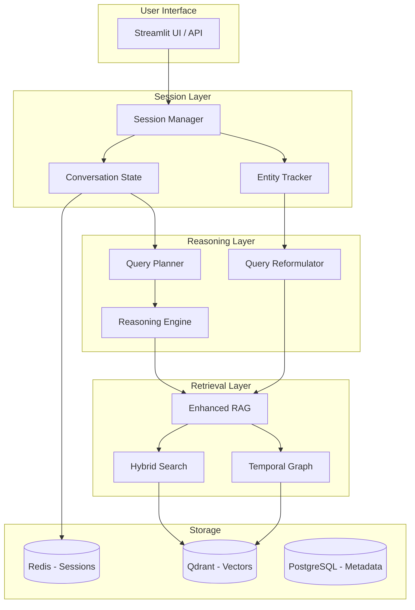
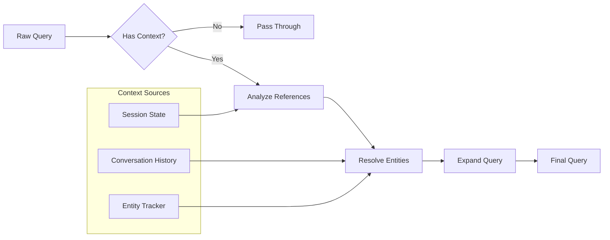
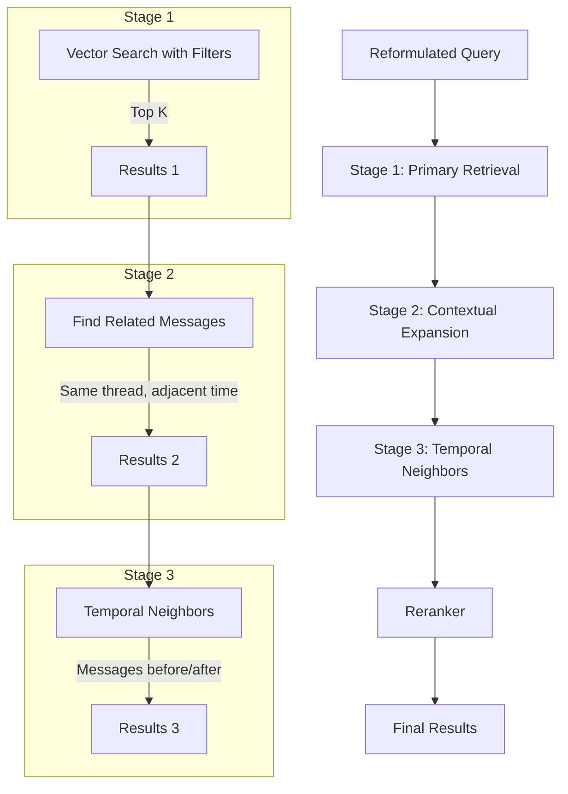
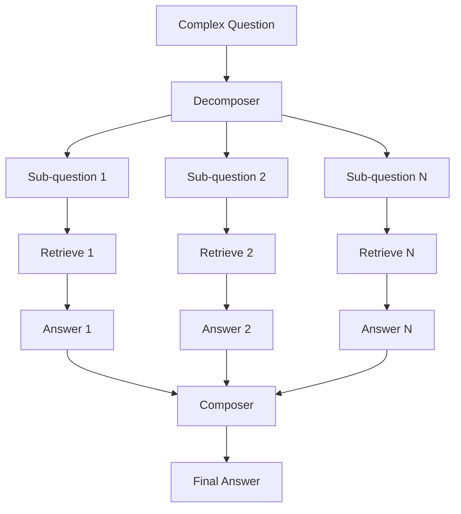
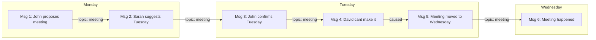

# Context Management and Reasoning Architecture

## Executive Summary

This document outlines a comprehensive architecture for maintaining context and enabling advanced reasoning when querying WhatsApp group chats. The solution addresses three critical capabilities:

1. **Conversation Session Management** - Persistent context across multi-turn conversations
2. **Enhanced RAG Retrieval** - Context-aware retrieval that uses conversation state
3. **Multi-hop & Temporal Reasoning** - Connecting information across messages and time

---

## Problem Statement

When querying about a specific group chat, the current system loses context in several ways:

| Problem | Example | Current Behavior |
|---------|---------|------------------|
| Session context loss | "What did John say?" → "And what about Sarah?" | Second query loses John/group context |
| No query reformulation | "Tell me more" | Retrieves random content, not related to previous answer |
| Shallow history use | Follow-up questions | History appended but not used to guide retrieval |
| No entity tracking | "What happened in the family group?" → "Who mentioned the party?" | Party context lost |
| Single-shot retrieval | Complex questions | One retrieval pass, may miss connections |
| No temporal awareness | "What changed since Monday?" | No timeline construction |

---

## Architecture Overview



---

## Component 1: Session Manager

### Purpose
Maintains persistent conversation state across multiple turns, tracking what the user is asking about and preserving context.

### Data Model

```python
class ConversationSession:
    session_id: str                    # Unique session identifier
    created_at: datetime               # Session start time
    last_activity: datetime            # Last interaction timestamp
    ttl_minutes: int = 30              # Session timeout
    
    # Context State
    active_chat_filter: Optional[str]  # Currently focused chat/group
    active_sender_filter: Optional[str] # Currently focused sender
    active_time_range: Optional[tuple]  # date_from, date_to
    
    # Entity Memory
    mentioned_entities: Dict[str, EntityInfo]  # People, places, topics mentioned
    resolved_references: List[Reference]       # Resolved anaphora like it, they, that
    
    # Conversation History
    turns: List[ConversationTurn]      # Q&A pairs with metadata
    retrieved_context: List[str]       # IDs of previously retrieved messages
    
    # Reasoning State
    pending_queries: List[str]         # For multi-hop reasoning
    established_facts: List[Fact]      # Conclusions reached
```

### Key Features

1. **Automatic Chat Context Locking**
   - When user mentions a specific group, lock that as `active_chat_filter`
   - Carry forward until explicitly changed or session expires

2. **Reference Resolution**
   - Track entities mentioned in queries and responses
   - Resolve pronouns and demonstratives using session context

3. **Session Persistence**
   - Store in Redis with configurable TTL
   - Restore on reconnection within window

### Implementation Location
- New file: `src/session/manager.py`
- New file: `src/session/models.py`

---

## Component 2: Query Reformulator

### Purpose
Transform user queries using conversation context to create context-aware search queries.

### Process Flow



### Examples

| User Query | Session Context | Reformulated Query |
|------------|-----------------|-------------------|
| "Tell me more" | Last answer about meeting planning | "More details about meeting planning in [Family Group]" |
| "What did she say?" | Sarah mentioned in previous turn | "What did Sarah say in [Family Group]?" |
| "And yesterday?" | Previous query about project updates | "Project updates in [Family Group] from yesterday" |
| "Who else mentioned it?" | Topic: vacation planning | "Who else mentioned vacation planning in [Family Group]?" |

### Key Techniques

1. **Anaphora Resolution**
   - Pronouns: he, she, they, it → resolve to entity from context
   - Demonstratives: this, that, these → resolve to topic/message

2. **Ellipsis Completion**
   - "And Bob?" → "What did Bob say about [topic] in [group]?"
   - "Last week?" → "What happened regarding [topic] in [group] last week?"

3. **Query Expansion**
   - Add implicit filters from session state
   - Include related entities for broader retrieval

### Implementation Location
- New file: `src/reasoning/query_reformulator.py`

---

## Component 3: Enhanced RAG Retrieval

### Purpose
Context-aware retrieval that uses session state to improve result relevance.

### Current vs Enhanced Flow

**Current Flow:**
```
Query → Embed → Vector Search → Results
```

**Enhanced Flow:**
```
Query → Reformulate → Multi-Stage Retrieval → Rerank → Results
                ↓
        Session Context
```

### Multi-Stage Retrieval Strategy



### Changes to `llamaindex_rag.py`

1. **Add session-aware query method:**
```python
def query_with_session(
    self,
    question: str,
    session: ConversationSession,
    k: int = 10
) -> QueryResult:
    # Use session for automatic filtering
    # Track retrieved message IDs in session
    # Return structured result with reasoning trace
```

2. **Add contextual expansion:**
```python
def expand_context(
    self,
    message_ids: List[str],
    window_minutes: int = 30
) -> List[NodeWithScore]:
    # Get messages within time window of retrieved messages
    # Same chat, same thread
```

3. **Add hybrid search:**
```python
def hybrid_search(
    self,
    query: str,
    keywords: List[str],
    filters: Dict
) -> List[NodeWithScore]:
    # Combine semantic + keyword search
    # Better for names, specific terms
```

### Implementation Location
- Modify: `src/llamaindex_rag.py`
- New file: `src/retrieval/contextual.py`

---

## Component 4: Multi-Hop Reasoning Engine

### Purpose
Handle complex questions that require connecting information from multiple messages or sources.

### When Multi-Hop is Needed

| Question Type | Example | Hops Required |
|--------------|---------|---------------|
| Simple | "What time is the meeting?" | 1 |
| Reference | "Who did John mention?" | 2 - find John's message, then find who |
| Comparison | "How did plans change?" | 2+ - find old plans, new plans, compare |
| Aggregation | "Who's coming to the party?" | N - collect all responses |
| Causal | "Why was the meeting moved?" | 2+ - find change, find reason |

### Reasoning Process



### Implementation Approaches

#### Option A: LLM-Driven Decomposition
Use the LLM to break down complex queries into sub-queries:

```python
class ReasoningEngine:
    def reason(self, question: str, session: ConversationSession) -> ReasoningResult:
        # Step 1: Analyze if decomposition needed
        plan = self.planner.create_plan(question, session)
        
        if plan.is_simple:
            return self.single_hop(question, session)
        
        # Step 2: Execute sub-queries
        intermediate_results = []
        for sub_query in plan.sub_queries:
            result = self.rag.query_with_session(sub_query, session)
            intermediate_results.append(result)
            # Update session with new facts
            session.established_facts.extend(result.facts)
        
        # Step 3: Compose final answer
        return self.composer.compose(question, intermediate_results)
```

#### Option B: ReAct Pattern
Use iterative reasoning with tool calls:

```python
TOOLS = [
    "search_messages(query, filters) - Search for relevant messages",
    "get_context(message_id, window) - Get surrounding messages",
    "get_timeline(chat, date_range) - Get chronological message list",
    "compare(topic, time1, time2) - Compare what was said at different times"
]

# LLM iteratively decides which tool to use until answer is complete
```

#### Option C: Graph-Based Reasoning
Build a knowledge graph from retrieved messages:

```python
class MessageGraph:
    def build_from_messages(self, messages: List[Message]) -> nx.DiGraph:
        # Nodes: messages, people, topics, events
        # Edges: mentions, replies_to, same_topic, temporal_sequence
        pass
    
    def answer_query(self, query: str, graph: nx.DiGraph) -> str:
        # Traverse graph to find answer path
        pass
```

### Recommended Approach
**Hybrid: LLM Decomposition + ReAct for execution**

This balances flexibility with control and is most practical to implement.

### Implementation Location
- New file: `src/reasoning/engine.py`
- New file: `src/reasoning/planner.py`
- New file: `src/reasoning/composer.py`

---

## Component 5: Temporal Reasoning

### Purpose
Enable queries about time-based relationships and changes in conversations.

### Temporal Query Types

| Type | Example | Approach |
|------|---------|----------|
| Point-in-time | "What was said on Monday?" | Filter by timestamp |
| Duration | "What happened last week?" | Range filter |
| Sequence | "What did they say before the decision?" | Temporal ordering |
| Change | "How did the plan change?" | Diff comparison |
| Frequency | "How often did John mention this?" | Aggregation |
| Recency | "What's the latest on project X?" | Sort by timestamp DESC |

### Temporal Graph Structure



### Implementation

1. **Timeline Construction:**
```python
def build_timeline(
    self,
    chat_name: str,
    topic: Optional[str] = None,
    start_date: Optional[datetime] = None,
    end_date: Optional[datetime] = None
) -> List[TimelineEvent]:
    # Query messages in time order
    # Group by day/topic
    # Identify key events and changes
```

2. **Change Detection:**
```python
def detect_changes(
    self,
    topic: str,
    messages: List[Message]
) -> List[Change]:
    # Find messages about the topic
    # Identify when information changed
    # Return list of changes with before/after
```

3. **Temporal Queries in Prompt:**
```
Current Date: February 12, 2026
Query: "What's the latest on the vacation plans?"

Timeline of vacation-related messages:
- Feb 10: John proposed dates (Feb 20-25)
- Feb 11: Sarah suggested different dates (Feb 22-27)
- Feb 12 (today): No messages yet

Based on this timeline, the latest is...
```

### Implementation Location
- New file: `src/reasoning/temporal.py`
- Modify: `src/llamaindex_rag.py` - add timeline methods

---

## Implementation Plan

### Phase 1: Session Management (Foundation)
**Effort: Medium | Impact: High**

- [ ] Create `src/session/` module
- [ ] Implement `ConversationSession` model with Redis persistence
- [ ] Implement `SessionManager` with create/get/update/expire
- [ ] Add session ID to API endpoints
- [ ] Update UI to maintain session across interactions
- [ ] Add automatic chat context locking

### Phase 2: Query Reformulation
**Effort: Medium | Impact: High**

- [ ] Create `src/reasoning/query_reformulator.py`
- [ ] Implement reference resolution for pronouns/demonstratives
- [ ] Implement ellipsis completion
- [ ] Implement query expansion with session context
- [ ] Add unit tests for reformulation

### Phase 3: Enhanced Retrieval
**Effort: Medium | Impact: Medium**

- [ ] Add `query_with_session()` to RAG
- [ ] Implement contextual expansion to get surrounding messages
- [ ] Add hybrid search combining semantic and keyword
- [ ] Implement result reranking based on session context
- [ ] Track retrieved message IDs in session

### Phase 4: Multi-Hop Reasoning
**Effort: High | Impact: High**

- [ ] Create `src/reasoning/engine.py`
- [ ] Implement query decomposition using LLM
- [ ] Implement ReAct-style tool execution
- [ ] Implement answer composition from sub-results
- [ ] Add reasoning trace to responses

### Phase 5: Temporal Reasoning
**Effort: Medium | Impact: Medium**

- [ ] Implement timeline construction
- [ ] Implement change detection
- [ ] Add temporal query handlers
- [ ] Integrate temporal context into prompts

---

## API Changes

### New Endpoints

```python
# Session management
POST /session/create -> {session_id}
GET /session/{id}/state -> ConversationSession
DELETE /session/{id} -> {status}

# Enhanced query with session
POST /rag/query
{
    "question": "...",
    "session_id": "...",        # NEW - links to session
    "reasoning_mode": "auto",   # NEW - auto|simple|multi_hop
    "include_trace": false      # NEW - return reasoning steps
}
```

### Response Changes

```python
{
    "answer": "...",
    "session_id": "...",
    "context_used": {
        "chat_filter": "Family Group",
        "time_range": "last 7 days",
        "entities_tracked": ["John", "vacation", "meeting"]
    },
    "reasoning_trace": [        # Optional
        {"step": 1, "action": "search", "query": "..."},
        {"step": 2, "action": "expand", "found": 5}
    ],
    "retrieved_messages": [...]  # Optional
}
```

---

## UI Changes

### Session Indicator
Show current session context in the UI:

```
┌─────────────────────────────────────────┐
│ 💬 Context: Family Group                │
│ 👤 Focus: John, Sarah                   │
│ 📅 Range: Last 7 days                   │
│ [Clear Context]                         │
└─────────────────────────────────────────┘
```

### Reasoning Transparency
Optionally show reasoning steps:

```
Q: "Who else mentioned the vacation?"

🔍 Reasoning:
1. Identified topic: "vacation" from previous context
2. Searching Family Group for vacation mentions
3. Found 5 messages from 3 people
4. Excluding previously shown messages from John

A: Besides John, Sarah and David also mentioned the vacation...
```

---

## Configuration

New environment variables:

```env
# Session Configuration
SESSION_TTL_MINUTES=30
SESSION_MAX_HISTORY=20

# Reasoning Configuration
REASONING_MODE=auto          # auto|simple|multi_hop
MAX_REASONING_HOPS=3
ENABLE_QUERY_DECOMPOSITION=true

# Retrieval Configuration
CONTEXTUAL_WINDOW_MINUTES=30
HYBRID_SEARCH_ALPHA=0.7      # semantic vs keyword weight
RERANKING_ENABLED=true
```

---

## File Structure

```
src/
├── session/
│   ├── __init__.py
│   ├── models.py           # ConversationSession, EntityInfo, etc.
│   └── manager.py          # SessionManager with Redis ops
├── reasoning/
│   ├── __init__.py
│   ├── query_reformulator.py
│   ├── planner.py          # Query decomposition
│   ├── engine.py           # Multi-hop reasoning
│   ├── composer.py         # Answer composition
│   └── temporal.py         # Timeline and change detection
├── retrieval/
│   ├── __init__.py
│   └── contextual.py       # Enhanced retrieval strategies
├── llamaindex_rag.py       # Modified with new methods
└── app.py                  # Modified with session endpoints
```

---

## Success Metrics

| Metric | Current | Target |
|--------|---------|--------|
| Follow-up query accuracy | ~40% | >85% |
| Multi-hop question success | ~20% | >70% |
| Temporal query accuracy | ~30% | >75% |
| User needs to repeat context | Often | Rare |
| Average reasoning hops | 1 | 1-3 as needed |

---

## Risks and Mitigations

| Risk | Impact | Mitigation |
|------|--------|------------|
| Increased latency from multi-hop | Medium | Parallel sub-queries, caching |
| Session storage overhead | Low | Redis TTL, cleanup job |
| Query reformulation errors | Medium | Confidence scoring, fallback to original |
| Over-decomposition | Medium | Limit max hops, cost tracking |
| Complexity in debugging | Medium | Reasoning trace, logging |

---

## Open Questions for Discussion

1. **Session Lifetime**: Should sessions persist across browser sessions (with auth) or be ephemeral?

2. **Reasoning Transparency**: How much of the reasoning process should be shown to users?

3. **Multi-Chat Queries**: Should we support queries that span multiple groups in one session?

4. **Caching Strategy**: Should we cache reasoning results for common patterns?

5. **Fallback Behavior**: When reasoning fails, should we fall back to simple search or show error?
