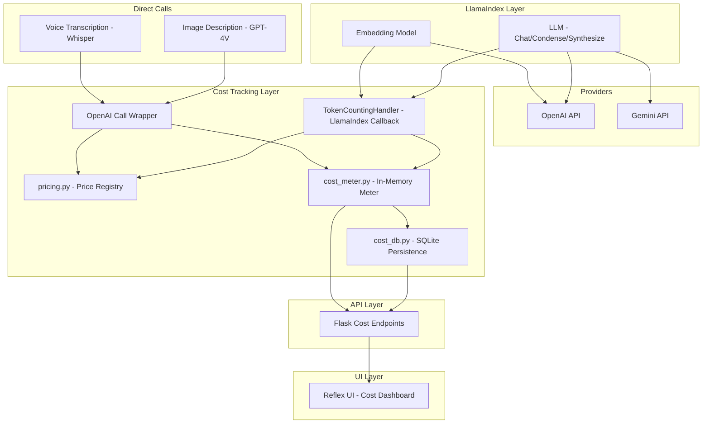
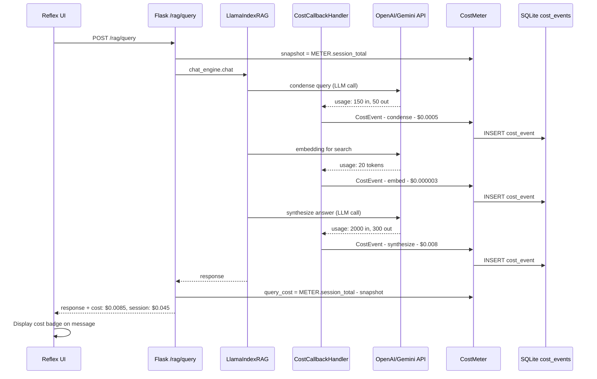

# Real-Time LLM Cost Tracking — Architecture Plan

## Overview

Add real-time cost tracking to the Lucy RAG assistant, covering all LLM and embedding API calls across OpenAI and Gemini providers. The system will track per-request costs, session totals, and daily aggregates — persisted to SQLite and displayed in the Reflex UI.

## Current LLM Call Points (5 Cost Centers)

| # | Call Point | Location | Provider | Type |
|---|-----------|----------|----------|------|
| 1 | RAG Chat (condense + synthesize) | `llamaindex_rag.py` → `CondensePlusContextChatEngine.chat()` | OpenAI or Gemini | LLM chat |
| 2 | Embedding for search queries | `llamaindex_rag.py` → `Settings.embed_model.get_query_embedding()` | OpenAI | Embedding |
| 3 | Embedding for ingestion | `llamaindex_rag.py` → `index.insert_nodes()` | OpenAI | Embedding |
| 4 | Image description | `plugins/whatsapp/handler.py` → `ImageMessage._describe_image()` | OpenAI | LLM chat (vision) |
| 5 | Voice transcription | `plugins/whatsapp/handler.py` → `VoiceMessage._transcribe_audio()` | OpenAI | Whisper audio |

### Key Architectural Constraint

The app uses **LlamaIndex** as its LLM abstraction layer. LlamaIndex internally makes OpenAI/Gemini API calls — we do NOT call the SDKs directly for chat or embeddings. This means:

- ✅ Use **LlamaIndex's callback system** (`TokenCountingHandler`) to intercept all LLM + embedding calls automatically
- ✅ Wrap **direct OpenAI calls** (image description, voice transcription) individually
- ❌ Do NOT rewrite LlamaIndex calls into raw SDK wrappers — that would break the RAG pipeline

---

## Architecture Diagram



---

## Component Design

### A. Pricing Registry — `src/pricing.py`

Single source of truth for model pricing. Uses the same `provider:model` key format.

```python
PRICING = {
    # OpenAI chat models ($/1K tokens):
    "openai:gpt-4o":             {"in": 0.0025,  "out": 0.010},
    "openai:gpt-4o-mini":        {"in": 0.00015, "out": 0.0006},
    "openai:gpt-4-turbo":        {"in": 0.01,    "out": 0.03},

    # OpenAI embeddings ($/1K tokens):
    "openai:text-embedding-3-small": {"embed": 0.00002},
    "openai:text-embedding-3-large": {"embed": 0.00013},

    # OpenAI other:
    "openai:whisper-1":          {"per_minute": 0.006},
    "openai:dall-e-3":           {"per_image": 0.040},

    # Gemini chat models ($/1K tokens):
    "gemini:gemini-pro":         {"in": 0.00125, "out": 0.005},
    "gemini:gemini-1.5-flash":   {"in": 0.000075, "out": 0.0003},
    "gemini:gemini-1.5-pro":     {"in": 0.00125, "out": 0.005},
    "gemini:gemini-2.0-flash":   {"in": 0.0001,  "out": 0.0004},
}
```

Functions:
- `chat_cost(model_key, in_tokens, out_tokens) -> float`
- `embed_cost(model_key, tokens) -> float`
- `whisper_cost(duration_seconds) -> float`
- `image_cost(model_key) -> float`
- `resolve_model_key(provider, model_name) -> str` — maps settings values to pricing keys

**Design decision**: Prices are hardcoded in the file (not in SQLite settings) because they change infrequently and we want zero-dependency lookups. A `pricing_updated` date constant at the top reminds users to check for price changes.

### B. Cost Meter — `src/cost_meter.py`

In-memory event buffer + session aggregates. Thread-safe for the Flask thread pool.

```python
@dataclass
class CostEvent:
    ts: float              # Unix timestamp
    provider: str          # "openai" | "gemini"
    model: str             # "gpt-4o", "text-embedding-3-large", etc.
    kind: str              # "chat" | "embed" | "whisper" | "image"
    in_tokens: int = 0
    out_tokens: int = 0
    total_tokens: int = 0
    cost_usd: float = 0.0
    conversation_id: str = ""
    request_context: str = ""  # "rag_query" | "condense" | "synthesize" | "ingest" | "image_describe" | "transcribe"
```

`CostMeter` class:
- `add(event)` — appends event, updates session total, persists to SQLite
- `session_total` — running sum
- `events` — in-memory list (bounded, e.g., last 1000)
- `get_summary(days=1)` — aggregated costs from SQLite
- Thread-safe via `threading.Lock`

Singleton `METER = CostMeter()` imported everywhere.

### C. Cost Database — `src/cost_db.py`

Uses the shared SQLite database (`data/settings.db`) for persistence.

**Schema:**

```sql
CREATE TABLE IF NOT EXISTS cost_events (
    id INTEGER PRIMARY KEY AUTOINCREMENT,
    ts REAL NOT NULL,
    provider TEXT NOT NULL,
    model TEXT NOT NULL,
    kind TEXT NOT NULL,
    in_tokens INTEGER DEFAULT 0,
    out_tokens INTEGER DEFAULT 0,
    total_tokens INTEGER DEFAULT 0,
    cost_usd REAL DEFAULT 0.0,
    conversation_id TEXT DEFAULT '',
    request_context TEXT DEFAULT '',
    created_at TIMESTAMP DEFAULT CURRENT_TIMESTAMP
);

CREATE INDEX IF NOT EXISTS idx_cost_events_ts ON cost_events(ts);
CREATE INDEX IF NOT EXISTS idx_cost_events_conv ON cost_events(conversation_id);
```

Functions:
- `insert_cost_event(event: CostEvent)` — write single event
- `get_events(limit, offset, conversation_id?)` — paginated read
- `get_daily_summary(days=7)` — grouped by day
- `get_total_cost(days?)` — simple sum
- `get_cost_by_kind(days?)` — breakdown: chat vs embed vs whisper vs image

### D. LlamaIndex Callback Integration — `src/llamaindex_rag.py`

This is the most critical piece. LlamaIndex's `TokenCountingHandler` intercepts all LLM and embedding calls made through its abstractions.

**Integration point**: [`_ensure_llm_configured()`](src/llamaindex_rag.py:229) and [`_configure_embedding()`](src/llamaindex_rag.py:209)

```python
from llama_index.core.callbacks import CallbackManager, TokenCountingHandler
import tiktoken

# Create token counter
token_counter = TokenCountingHandler(
    tokenizer=tiktoken.encoding_for_model("gpt-4o").encode,
    verbose=False,
)

# Register with LlamaIndex Settings
Settings.callback_manager = CallbackManager([token_counter])
```

**Custom callback handler** (extends `TokenCountingHandler` or wraps it):

After each LLM/embedding event completes, the handler:
1. Reads token counts from the handler's internal counters
2. Resolves the model key using `pricing.resolve_model_key()`
3. Computes cost via `pricing.chat_cost()` or `pricing.embed_cost()`
4. Emits a `CostEvent` to `METER.add()`

**Per-query cost tracking**: Before each `chat_engine.chat()` call in `app.py`, snapshot the meter total. After the call, diff to get the per-query cost. Return it in the API response.

### E. Direct OpenAI Call Wrapping — `src/plugins/whatsapp/handler.py`

**Image description** (`_describe_image`):
- The `response.usage` object from `client.chat.completions.create()` contains `prompt_tokens` and `completion_tokens`
- After the call, compute cost and emit `CostEvent`

**Voice transcription** (`_transcribe_audio`):
- Whisper is priced per minute of audio, not per token
- Estimate audio duration from the decoded bytes size and codec
- Emit `CostEvent` with `kind="whisper"` and the per-minute cost

**Pattern**: Add a helper function `_record_openai_usage(response, model, kind, context)` in the handler module that extracts usage and emits the event.

### F. Backend API Endpoints — `src/app.py`

New Flask routes:

| Method | Path | Description |
|--------|------|-------------|
| `GET` | `/costs/session` | Current session total + last N events |
| `GET` | `/costs/summary` | Daily totals for last N days |
| `GET` | `/costs/events` | Paginated event log with filters |
| `GET` | `/costs/breakdown` | Cost by kind (chat/embed/whisper/image) |

**RAG query response enhancement** — add to the existing `/rag/query` response:

```json
{
    "answer": "...",
    "cost": {
        "query_cost_usd": 0.0023,
        "session_total_usd": 0.0451
    }
}
```

### G. Reflex UI — Cost Display

Three display points:

1. **Per-message cost badge** — Small cost indicator under each assistant response (e.g., `$0.002`)
2. **Session cost metric** — In the sidebar or header: `Session: $0.04`
3. **Cost dashboard** — New tab in settings page or standalone page showing:
   - Today's total
   - 7-day chart (if feasible in Reflex)
   - Cost breakdown by type (chat/embed/whisper)
   - Event log table

**Reflex state additions** (`ui-reflex/ui_reflex/state.py`):
- `session_cost: float = 0.0`
- `query_cost: float = 0.0` (updated per response)
- `cost_events: list[dict]` (for the dashboard)

**API client additions** (`ui-reflex/ui_reflex/api_client.py`):
- `get_cost_session()` → calls `GET /costs/session`
- `get_cost_summary()` → calls `GET /costs/summary`

### H. Settings Registration

Add to `settings_db.py` DEFAULT_SETTINGS:

```python
("cost_tracking_enabled", "true", "app", "bool", "Enable LLM cost tracking"),
```

And expose in the Settings UI so users can disable tracking if they want.

---

## Data Flow — RAG Query Example



---

## File Changes Summary

| File | Action | Description |
|------|--------|-------------|
| `src/pricing.py` | **NEW** | Model pricing registry + cost calculation functions |
| `src/cost_meter.py` | **NEW** | In-memory CostEvent + CostMeter singleton |
| `src/cost_db.py` | **NEW** | SQLite persistence for cost events |
| `src/llamaindex_rag.py` | **MODIFY** | Add TokenCountingHandler callback, emit cost events |
| `src/plugins/whatsapp/handler.py` | **MODIFY** | Record usage from image description + voice transcription |
| `src/app.py` | **MODIFY** | Add /costs/* endpoints, include cost in /rag/query response |
| `src/settings_db.py` | **MODIFY** | Add cost_tracking_enabled setting |
| `ui-reflex/ui_reflex/api_client.py` | **MODIFY** | Add cost API client functions |
| `ui-reflex/ui_reflex/state.py` | **MODIFY** | Add cost state vars + event handlers |
| `ui-reflex/ui_reflex/components/cost_display.py` | **NEW** | Cost badge + dashboard components |
| `ui-reflex/ui_reflex/components/sidebar.py` | **MODIFY** | Add session cost display |
| `ui-reflex/ui_reflex/components/message_bubble.py` | **MODIFY** | Add per-message cost badge |

---

## Implementation Order

1. `src/pricing.py` — Zero dependencies, pure functions
2. `src/cost_meter.py` — Depends on pricing.py
3. `src/cost_db.py` — Depends on settings_db.DB_PATH
4. `src/llamaindex_rag.py` — Add callback handler (core integration)
5. `src/plugins/whatsapp/handler.py` — Wrap direct OpenAI calls
6. `src/app.py` — Add cost endpoints + per-query cost in response
7. `src/settings_db.py` — Register cost_tracking_enabled setting
8. `ui-reflex/ui_reflex/api_client.py` — Cost API functions
9. `ui-reflex/ui_reflex/state.py` — Cost state management
10. `ui-reflex/ui_reflex/components/` — UI components for cost display
