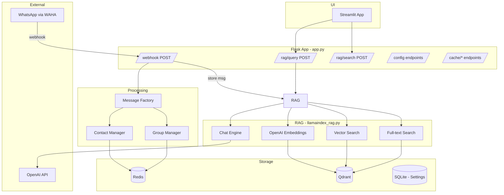

# WhatsApp-GPT: Current Improvement Plan

## Executive Summary

After a thorough review of the entire codebase, this plan identifies **bugs, performance issues, incomplete features, and architectural improvements** organized by priority. The focus is on improving what already exists rather than adding entirely new features.

**Date:** 2026-02-12

---

## Project Architecture (Current State)



---

## 🔴 Priority 1: Critical Bugs & Fixes

### ~~1.1 Crash in `pass_filter()` when payload has no `from` field~~ ✅ DONE

Fixed — `app.py:123` uses `payload.get("from") or ""` with null safety.

---

### ~~1.2 Dockerfile port mismatch~~ ✅ DONE

Fixed — Dockerfile now has `EXPOSE 8765`.

---

### ~~1.3 App service commented out in Docker Compose~~ ✅ DONE

Fixed — app service is uncommented with health checks and dependency management.

---

### 1.4 README project structure is outdated

**File:** [`README.md`](../README.md:31)

**Problem:** Still references `src/session/` which no longer exists. Also references `localhost:5002` instead of `8765`.

**Fix:** Update the Project Structure section and port references to reflect current code.

---

### ~~1.5 PostgreSQL is provisioned but completely unused~~ ✅ DONE

Fixed — PostgreSQL commented out in docker-compose with explanatory note.

---

## 🟡 Priority 2: Performance Issues

### ~~2.1 `get_chat_list()` / `get_sender_list()` full collection scan~~ ✅ DONE

Fixed — Redis SET caching with incremental updates on each `add_message()`. Full Qdrant scan only on cache miss.

---

### ~~2.2 Outdated embedding model~~ ✅ DONE

Fixed — Upgraded to `text-embedding-3-large` with 1024 dimensions for optimal Hebrew+English multilingual support.

---

### ~~2.3 UI fetches lists on every rerun without caching~~ ✅ DONE

Fixed — `@st.cache_data(ttl=300)` on both `get_chat_list()` and `get_sender_list()`.

---

### ~~2.4 Config manually parses `.env` instead of using python-dotenv~~ ✅ DONE

Fixed — Config now uses SQLite-backed `settings_db.py` with `python-dotenv` for first-run seeding.

---

### ~~2.5 Logger uses frame inspection on every log call~~ ✅ DONE

Fixed — Logger now uses Python's built-in `logging` with `%(filename)s` and `%(funcName)s` format specifiers.

---

## 🟠 Priority 3: Incomplete Features (Core Gaps)

### 3.1 No AI response to WhatsApp messages

**Files:** [`src/app.py`](../src/app.py:573), [`.env.example`](../.env.example:5)

**Problem:** `CHAT_PREFIX=??` and `DALLE_PREFIX=!!` are configured in `.env.example` but **no code checks for them**. The webhook handler only stores messages — it never sends a response back.

**Current flow:**
```
WhatsApp msg → webhook → store in RAG → return 200
```

**Expected flow:**
```
WhatsApp msg → webhook → store in RAG
                      → if starts with "??" → query RAG → send response back
                      → if starts with "!!" → generate DALL-E image → send back
```

**Fix:** Add prefix detection in the webhook handler, call [`rag.query()`](../src/llamaindex_rag.py:662) for `??` prefix, and send response via WAHA `sendText` API.

---

### 3.2 Voice message transcription never happens

**File:** [`src/whatsapp/handler.py`](../src/whatsapp/handler.py:390)

**Problem:** `VoiceMessage` has a `transcription` field but it's always `None`. Voice audio is downloaded and base64-encoded but never sent to any transcription service.

**Fix:** After downloading audio in [`_load_media()`](../src/whatsapp/handler.py:274), call OpenAI Whisper API to transcribe, store result in `self.transcription` and `self.message`.

---

### 3.3 Image description never populated

**File:** [`src/whatsapp/handler.py`](../src/whatsapp/handler.py:356)

**Problem:** `ImageMessage.description` is always `None`. Images are downloaded but never analyzed.

**Fix:** After downloading image, call GPT-4 Vision API to generate description. Store in `self.description` and append to `self.message` for RAG storage.

---

### ~~3.4 Entity extraction is purely string matching — no NER~~ ✅ N/A (REMOVED)

The `src/session/` module was deleted as part of the LlamaIndex chat engine migration. Entity tracking is now handled implicitly by the chat engine's condense step.

---

### ~~3.5 Query reformulation not implemented~~ ✅ DONE

Fixed — `CondensePlusContextChatEngine` automatically condenses follow-up questions into standalone queries using the LLM.

---

### 3.6 Tavily web search configured but unused

**File:** [`.env.example`](../.env.example:49)

**Problem:** `TAVILY_API_KEY` is configured but no code uses it. This could enhance the bot's ability to answer questions that aren't in the message archive.

**Fix:** Add a fallback: if RAG returns no relevant results, optionally query Tavily for web-based answers.

---

## 🔵 Priority 4: Architecture Improvements

### 4.1 Synchronous webhook processing

**File:** [`src/app.py`](../src/app.py:573)

**Problem:** The webhook handler processes everything synchronously — parsing, contact lookup, group lookup, embedding generation, and Qdrant insertion. If any step is slow, WAHA may time out and retry, causing duplicate messages.

**Fix options:**
1. **Quick path:** Return 200 immediately, process in a background thread
2. **Better:** Use Redis Queue (RQ) or Celery for async processing
3. **Best:** Migrate to FastAPI with async endpoints

**Recommended:** Option 1 as immediate fix, Option 3 as long-term goal.

---

### ~~4.2 No message deduplication~~ ✅ DONE

Fixed — `_message_exists()` checks for existing `source_id` via Qdrant scroll before inserting.

---

### ~~4.3 No health checks for dependencies~~ ✅ DONE

Fixed — `/health` endpoint checks Redis, Qdrant, and WAHA connectivity with proper status reporting.

---

### 4.4 No rate limiting on API endpoints

**Problem:** Any client can flood the `/rag/query` endpoint, which triggers expensive OpenAI API calls.

**Fix:** Add Flask-Limiter for rate limiting, especially on LLM-consuming endpoints.

---

### 4.5 Mixed singleton patterns

**Problem:** The codebase uses three different singleton patterns:
- `__new__` override in [`LlamaIndexRAG`](../src/llamaindex_rag.py:82)
- Module-level `_instance` + getter in [`get_rag()`](../src/llamaindex_rag.py:854)
- Module-level `_redis_client` in [`redis_conn.py`](../src/utils/redis_conn.py:7)

**Fix:** Standardize on one pattern (module-level instance + getter function).

---

## 🟢 Priority 5: UI Improvements

### 5.1 No source citations in RAG answers

**File:** [`ui/app.py`](../ui/app.py:417)

**Problem:** The RAG query endpoint returns only the answer text. Users have no way to verify the answer or see which messages it's based on.

**Fix:** Return source documents from the search results alongside the answer. Display as expandable citations below the answer.

---

### 5.2 Search tab doesn't use session context

**File:** [`ui/app.py`](../ui/app.py:480)

**Problem:** The Search tab operates independently from the Chat tab's session. Context from chat doesn't carry over.

**Fix:** Share session state between tabs.

---

### 5.3 No message browser

**Problem:** Users can't browse the actual messages stored in Qdrant. They can only search or ask questions.

**Fix:** Add a paginated message browser page using Qdrant scroll API with filters.

---

## 📊 Implementation Priority Matrix

| # | Improvement | Category | Impact | Effort | Status |
|---|------------|----------|--------|--------|--------|
| ~~1.1~~ | ~~Fix pass_filter crash~~ | Bug | Critical | Trivial | ✅ Done |
| ~~1.2~~ | ~~Fix Dockerfile port~~ | Bug | High | Trivial | ✅ Done |
| ~~1.3~~ | ~~Enable app in docker-compose~~ | Bug | High | Low | ✅ Done |
| 1.4 | Update README structure | Docs | Medium | Low | ⏳ Pending |
| ~~1.5~~ | ~~Remove/use PostgreSQL~~ | Cleanup | Low | Low | ✅ Done |
| ~~2.1~~ | ~~Cache chat/sender lists~~ | Perf | High | Low | ✅ Done |
| ~~2.2~~ | ~~Upgrade embedding model~~ | Perf | Medium | Medium | ✅ Done |
| ~~2.3~~ | ~~Add @st.cache_data to UI~~ | Perf | High | Trivial | ✅ Done |
| ~~2.4~~ | ~~Use python-dotenv~~ | Perf | Low | Low | ✅ Done |
| ~~2.5~~ | ~~Fix logger performance~~ | Perf | Low | Low | ✅ Done |
| 3.1 | AI response via prefix | Feature | Very High | Medium | ⏳ Pending |
| 3.2 | Voice transcription | Feature | High | Medium | ⏳ Pending |
| 3.3 | Image description | Feature | Medium | Medium | ⏳ Pending |
| ~~3.4~~ | ~~Better entity extraction~~ | Feature | Medium | Medium | ✅ N/A (removed) |
| ~~3.5~~ | ~~Query reformulation~~ | Feature | High | Medium | ✅ Done |
| 3.6 | Tavily fallback | Feature | Low | Low | ⏳ Pending |
| 4.1 | Async webhook processing | Arch | High | Medium | ⏳ Pending |
| ~~4.2~~ | ~~Message deduplication~~ | Arch | Medium | Low | ✅ Done |
| ~~4.3~~ | ~~Dependency health checks~~ | Arch | Medium | Low | ✅ Done |
| 4.4 | Rate limiting | Arch | Medium | Low | ⏳ Pending |
| 4.5 | Standardize singletons | Arch | Low | Low | ⏳ Pending |
| 5.1 | Source citations in UI | UI | High | Medium | ⏳ Pending |
| 5.2 | Shared session in UI | UI | Medium | Low | ⏳ Pending |
| 5.3 | Message browser page | UI | Medium | Medium | ⏳ Pending |

---

## Remaining Implementation Order

### Next: Core Feature Completion
1. Update [`README.md`](../README.md) project structure (remove `src/session/`, fix port)
2. Implement AI response via `??` prefix in webhook handler
3. Add voice message transcription via Whisper API
4. Add image description via GPT-4 Vision

### Then: Architecture Hardening
5. Add async webhook processing (background thread)
6. Add rate limiting on LLM-consuming endpoints
7. Standardize singleton patterns

### Then: UI Enhancement
8. Add source citations to RAG answers
9. Build message browser page
10. Share session state across UI tabs
11. Add Tavily web search fallback

---

## Files That Still Need Changes

| File | Changes |
|------|---------|
| [`src/app.py`](../src/app.py) | Add AI response handling (`??`/`!!` prefix), async webhook |
| [`src/whatsapp/handler.py`](../src/whatsapp/handler.py) | Voice transcription, image description |
| [`ui/app.py`](../ui/app.py) | Source citations, shared sessions |
| [`README.md`](../README.md) | Update project structure |

---

## New Dependencies Needed

```txt
# For rate limiting
flask-limiter>=3.0

# For async processing (if not using threads)
rq>=1.16  # Redis Queue (optional, threads work too)
```
