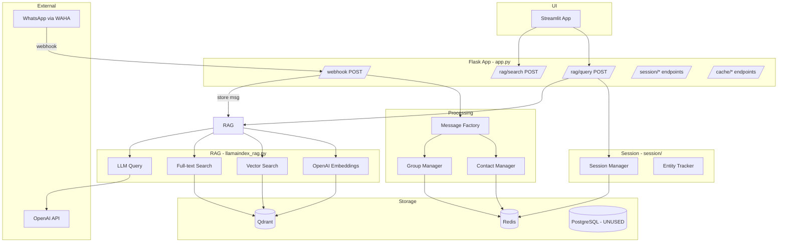

# WhatsApp-GPT: Current Improvement Plan

## Executive Summary

After a thorough review of the entire codebase, this plan identifies **bugs, performance issues, incomplete features, and architectural improvements** organized by priority. The focus is on improving what already exists rather than adding entirely new features.

**Date:** 2026-02-12

---

## Project Architecture (Current State)



---

## 🔴 Priority 1: Critical Bugs & Fixes

### 1.1 Crash in `pass_filter()` when payload has no `from` field

**File:** [`src/app.py`](../src/app.py:47)

**Problem:** `payload.get("from")` can return `None`, and calling `.endswith()` on `None` raises `AttributeError`.

```python
# Current (crashes if "from" is None):
payload.get("from").endswith("@newsletter")
```

**Fix:** Add null check before string operations.

---

### 1.2 Dockerfile port mismatch

**File:** [`Dockerfile`](../Dockerfile:28)

**Problem:** Dockerfile `EXPOSE 5000` but [`src/app.py`](../src/app.py:667) listens on port `8765`. Docker compose webhook URL uses `8765`.

**Fix:** Change Dockerfile to `EXPOSE 8765`.

---

### 1.3 App service commented out in Docker Compose

**File:** [`docker-compose.yml`](../docker-compose.yml:82)

**Problem:** The `app` service is entirely commented out, meaning the Flask application cannot run as a container. This also means the app has no health check and no dependency management.

**Fix:** Uncomment and properly configure the app service with health checks and correct port.

---

### 1.4 README project structure is outdated

**File:** [`README.md`](../README.md:31)

**Problem:** References old files that no longer exist (`src/contact.py`, `src/groups.py`, `src/memory_agent.py`, `src/templates.py`, `src/whatsapp.py`, `src/providers/`, `src/utiles/`). The actual structure uses `src/whatsapp/`, `src/session/`, `src/models/`, `src/utils/`.

**Fix:** Rewrite the Project Structure section to reflect current code.

---

### 1.5 PostgreSQL is provisioned but completely unused

**File:** [`docker-compose.yml`](../docker-compose.yml:37), [`scripts/init.sql`](../scripts/init.sql)

**Problem:** PostgreSQL with pgvector is running, consuming resources, but no application code uses it. The init script creates a `langgraph` database for a feature that was removed.

**Fix:** Either remove PostgreSQL from docker-compose (and pgadmin), or plan to use it for message metadata/analytics.

---

## 🟡 Priority 2: Performance Issues

### 2.1 `get_chat_list()` / `get_sender_list()` full collection scan

**File:** [`src/llamaindex_rag.py`](../src/llamaindex_rag.py:781)

**Problem:** Both methods scroll through the ENTIRE Qdrant collection (1000 records at a time) to collect unique values. This is O(n) for every call. The Streamlit UI calls both on **every page render**.

**Impact:** With 100k messages, each sidebar render triggers 200+ Qdrant scroll requests.

**Fix options (pick one):**
1. **Redis cache with TTL** — Cache the lists in Redis with 5-min TTL, refresh on demand
2. **Qdrant facet/aggregation** — Use Qdrant's scroll with payload-only mode + dedup
3. **Maintain a separate set** — Add to a Redis SET on each `add_message()` call

**Recommended:** Option 1 (Redis cache) — simplest, most effective.

---

### 2.2 Outdated embedding model

**File:** [`src/llamaindex_rag.py`](../src/llamaindex_rag.py:118)

**Problem:** Using `text-embedding-ada-002` which is the legacy model. OpenAI's `text-embedding-3-small` is cheaper (5x), faster, and produces better embeddings.

**Fix:** Change to `text-embedding-3-small` (1536 dimensions, same as ada-002). Note: existing embeddings would need re-indexing, or create a new collection.

---

### 2.3 UI fetches lists on every rerun without caching

**File:** [`ui/app.py`](../ui/app.py:241)

**Problem:** `get_chat_list()` and `get_sender_list()` are called in the sidebar, which re-executes on every Streamlit interaction. No `@st.cache_data` decorator is used.

**Fix:** Add `@st.cache_data(ttl=300)` to both functions.

---

### 2.4 Config manually parses `.env` instead of using python-dotenv

**File:** [`src/config.py`](../src/config.py:76)

**Problem:** Custom `.env` parser that doesn't handle edge cases (multiline values, escaped quotes, inline comments). `python-dotenv` is already in `requirements.txt` but unused.

**Fix:** Replace custom parser with `dotenv.load_dotenv()`.

---

### 2.5 Logger uses frame inspection on every log call

**File:** [`src/utils/logger.py`](../src/utils/logger.py:33)

**Problem:** `inspect.currentframe()` is called on every log statement, walking 3 frames up. This is slow and fragile.

**Fix:** Use Python's built-in `logging` with `%(filename)s` and `%(funcName)s` format specifiers — achieves the same result with zero overhead.

---

## 🟠 Priority 3: Incomplete Features (Core Gaps)

### 3.1 No AI response to WhatsApp messages

**Files:** [`src/app.py`](../src/app.py:573), [`.env.example`](../.env.example:5)

**Problem:** `CHAT_PREFIX=??` and `DALLE_PREFIX=!!` are configured in `.env.example` but **no code checks for them**. The webhook handler only stores messages — it never sends a response back.

**Current flow:**
```
WhatsApp msg → webhook → store in RAG → return 200
```

**Expected flow:**
```
WhatsApp msg → webhook → store in RAG
                      → if starts with "??" → query RAG → send response back
                      → if starts with "!!" → generate DALL-E image → send back
```

**Fix:** Add prefix detection in the webhook handler, call [`rag.query()`](../src/llamaindex_rag.py:662) for `??` prefix, and send response via WAHA `sendText` API.

---

### 3.2 Voice message transcription never happens

**File:** [`src/whatsapp/handler.py`](../src/whatsapp/handler.py:390)

**Problem:** `VoiceMessage` has a `transcription` field but it's always `None`. Voice audio is downloaded and base64-encoded but never sent to any transcription service.

**Fix:** After downloading audio in [`_load_media()`](../src/whatsapp/handler.py:274), call OpenAI Whisper API to transcribe, store result in `self.transcription` and `self.message`.

---

### 3.3 Image description never populated

**File:** [`src/whatsapp/handler.py`](../src/whatsapp/handler.py:356)

**Problem:** `ImageMessage.description` is always `None`. Images are downloaded but never analyzed.

**Fix:** After downloading image, call GPT-4 Vision API to generate description. Store in `self.description` and append to `self.message` for RAG storage.

---

### 3.4 Entity extraction is purely string matching — no NER

**File:** [`src/session/manager.py`](../src/session/manager.py:298)

**Problem:** `extract_and_track_entities()` does simple `string.lower() in text_lower` matching. This means:
- "Dan" matches "Dancing" 
- No recognition of entities not in the known list
- No understanding of context ("John's message" vs "message about John")

**Fix:** Use an LLM call to extract entities from the query, or integrate a lightweight NER model (e.g., spaCy).

---

### 3.5 Query reformulation not implemented

**Problem:** The [`context-and-reasoning-architecture.md`](../plans/context-and-reasoning-architecture.md) plan describes a Query Reformulator component, but it was never built. Follow-up questions like "what about her?" or "tell me more" perform poorly because the raw query is used as-is.

**Fix:** Before RAG query, pass the raw query + session context through an LLM to produce a reformulated, standalone query.

---

### 3.6 Tavily web search configured but unused

**File:** [`.env.example`](../.env.example:49)

**Problem:** `TAVILY_API_KEY` is configured but no code uses it. This could enhance the bot's ability to answer questions that aren't in the message archive.

**Fix:** Add a fallback: if RAG returns no relevant results, optionally query Tavily for web-based answers.

---

## 🔵 Priority 4: Architecture Improvements

### 4.1 Synchronous webhook processing

**File:** [`src/app.py`](../src/app.py:573)

**Problem:** The webhook handler processes everything synchronously — parsing, contact lookup, group lookup, embedding generation, and Qdrant insertion. If any step is slow, WAHA may time out and retry, causing duplicate messages.

**Fix options:**
1. **Quick path:** Return 200 immediately, process in a background thread
2. **Better:** Use Redis Queue (RQ) or Celery for async processing
3. **Best:** Migrate to FastAPI with async endpoints

**Recommended:** Option 1 as immediate fix, Option 3 as long-term goal.

---

### 4.2 No message deduplication

**Problem:** If WAHA retries a webhook (timeout/error), the same message gets stored multiple times in Qdrant. There's no deduplication based on message ID.

**Fix:** Before `rag.add_message()`, check if a document with the same `source_id` (`chat_id:timestamp`) already exists. Use Qdrant scroll with filter.

---

### 4.3 No health checks for dependencies

**File:** [`src/app.py`](../src/app.py:57)

**Problem:** The `/health` endpoint returns `{"status": "up"}` unconditionally — it doesn't check Redis, Qdrant, or WAHA connectivity.

**Fix:** Check each dependency in the health endpoint:
```python
{
    "status": "up",
    "redis": "connected",
    "qdrant": "connected", 
    "waha": "connected"
}
```

---

### 4.4 No rate limiting on API endpoints

**Problem:** Any client can flood the `/rag/query` endpoint, which triggers expensive OpenAI API calls.

**Fix:** Add Flask-Limiter for rate limiting, especially on LLM-consuming endpoints.

---

### 4.5 Mixed singleton patterns

**Problem:** The codebase uses three different singleton patterns:
- `__new__` override in [`LlamaIndexRAG`](../src/llamaindex_rag.py:82)
- Module-level `_instance` + getter in [`get_rag()`](../src/llamaindex_rag.py:854)
- Module-level `_redis_client` in [`redis_conn.py`](../src/utils/redis_conn.py:7)

**Fix:** Standardize on one pattern (module-level instance + getter function).

---

## 🟢 Priority 5: UI Improvements

### 5.1 No source citations in RAG answers

**File:** [`ui/app.py`](../ui/app.py:417)

**Problem:** The RAG query endpoint returns only the answer text. Users have no way to verify the answer or see which messages it's based on.

**Fix:** Return source documents from the search results alongside the answer. Display as expandable citations below the answer.

---

### 5.2 Search tab doesn't use session context

**File:** [`ui/app.py`](../ui/app.py:480)

**Problem:** The Search tab operates independently from the Chat tab's session. Context from chat doesn't carry over.

**Fix:** Share session state between tabs.

---

### 5.3 No message browser

**Problem:** Users can't browse the actual messages stored in Qdrant. They can only search or ask questions.

**Fix:** Add a paginated message browser page using Qdrant scroll API with filters.

---

## 📊 Implementation Priority Matrix

| # | Improvement | Category | Impact | Effort | Priority |
|---|------------|----------|--------|--------|----------|
| 1.1 | Fix pass_filter crash | Bug | Critical | Trivial | 🔴 P1 |
| 1.2 | Fix Dockerfile port | Bug | High | Trivial | 🔴 P1 |
| 1.3 | Enable app in docker-compose | Bug | High | Low | 🔴 P1 |
| 1.4 | Update README structure | Docs | Medium | Low | 🔴 P1 |
| 1.5 | Remove/use PostgreSQL | Cleanup | Low | Low | 🔴 P1 |
| 2.1 | Cache chat/sender lists | Perf | High | Low | 🟡 P2 |
| 2.2 | Upgrade embedding model | Perf | Medium | Medium | 🟡 P2 |
| 2.3 | Add @st.cache_data to UI | Perf | High | Trivial | 🟡 P2 |
| 2.4 | Use python-dotenv | Perf | Low | Low | 🟡 P2 |
| 2.5 | Fix logger performance | Perf | Low | Low | 🟡 P2 |
| 3.1 | AI response via prefix | Feature | Very High | Medium | 🟠 P3 |
| 3.2 | Voice transcription | Feature | High | Medium | 🟠 P3 |
| 3.3 | Image description | Feature | Medium | Medium | 🟠 P3 |
| 3.4 | Better entity extraction | Feature | Medium | Medium | 🟠 P3 |
| 3.5 | Query reformulation | Feature | High | Medium | 🟠 P3 |
| 3.6 | Tavily fallback | Feature | Low | Low | 🟠 P3 |
| 4.1 | Async webhook processing | Arch | High | Medium | 🔵 P4 |
| 4.2 | Message deduplication | Arch | Medium | Low | 🔵 P4 |
| 4.3 | Dependency health checks | Arch | Medium | Low | 🔵 P4 |
| 4.4 | Rate limiting | Arch | Medium | Low | 🔵 P4 |
| 4.5 | Standardize singletons | Arch | Low | Low | 🔵 P4 |
| 5.1 | Source citations in UI | UI | High | Medium | 🟢 P5 |
| 5.2 | Shared session in UI | UI | Medium | Low | 🟢 P5 |
| 5.3 | Message browser page | UI | Medium | Medium | 🟢 P5 |

---

## Suggested Implementation Order

### Phase 1: Bug Fixes & Quick Wins
1. Fix [`pass_filter()`](../src/app.py:47) null safety
2. Fix [`Dockerfile`](../Dockerfile:28) port mismatch
3. Add `@st.cache_data` to [`ui/app.py`](../ui/app.py:74) functions
4. Update [`README.md`](../README.md) project structure
5. Cache `get_chat_list()`/`get_sender_list()` results in Redis

### Phase 2: Core Feature Completion
6. Implement AI response via `??` prefix in webhook handler
7. Add voice message transcription via Whisper API
8. Add image description via GPT-4 Vision
9. Implement LLM-based query reformulation using session context

### Phase 3: Architecture Hardening
10. Add async webhook processing (background thread)
11. Add message deduplication
12. Improve health endpoint with dependency checks
13. Add rate limiting on LLM-consuming endpoints
14. Enable and configure app service in docker-compose

### Phase 4: UI Enhancement
15. Add source citations to RAG answers
16. Build message browser page
17. Share session state across UI tabs
18. Upgrade embedding model (requires re-indexing)

---

## Files That Need Changes

| File | Changes |
|------|---------|
| [`src/app.py`](../src/app.py) | Fix pass_filter, add AI response handling, async webhook, health checks |
| [`src/llamaindex_rag.py`](../src/llamaindex_rag.py) | Cache chat/sender lists, upgrade embedding model, return sources |
| [`src/whatsapp/handler.py`](../src/whatsapp/handler.py) | Voice transcription, image description |
| [`src/session/manager.py`](../src/session/manager.py) | Better entity extraction |
| [`src/utils/logger.py`](../src/utils/logger.py) | Remove frame inspection |
| [`src/config.py`](../src/config.py) | Use python-dotenv |
| [`ui/app.py`](../ui/app.py) | Add caching, source citations, shared sessions |
| [`Dockerfile`](../Dockerfile) | Fix port |
| [`docker-compose.yml`](../docker-compose.yml) | Enable app service, decide on PostgreSQL |
| [`README.md`](../README.md) | Update project structure |
| **NEW:** `src/reasoning/query_reformulator.py` | LLM-based query reformulation |

---

## New Dependencies Needed

```txt
# For voice transcription
openai  # Already included, Whisper is part of openai SDK

# For rate limiting
flask-limiter>=3.0

# For async processing (if not using threads)
rq>=1.16  # Redis Queue (optional, threads work too)
```

---

## Questions for Discussion

1. **AI Response Scope:** Should `??` prefix trigger responses in ALL chats or only specific ones?
2. **PostgreSQL:** Remove it entirely or repurpose for analytics/message metadata?
3. **Embedding Model Migration:** Re-index existing data or keep dual collections?
4. **Voice/Image Processing Cost:** These features consume additional OpenAI credits per message — should they be opt-in per chat?
5. **Rate Limiting:** What limits are appropriate? Per-IP? Per-session?
