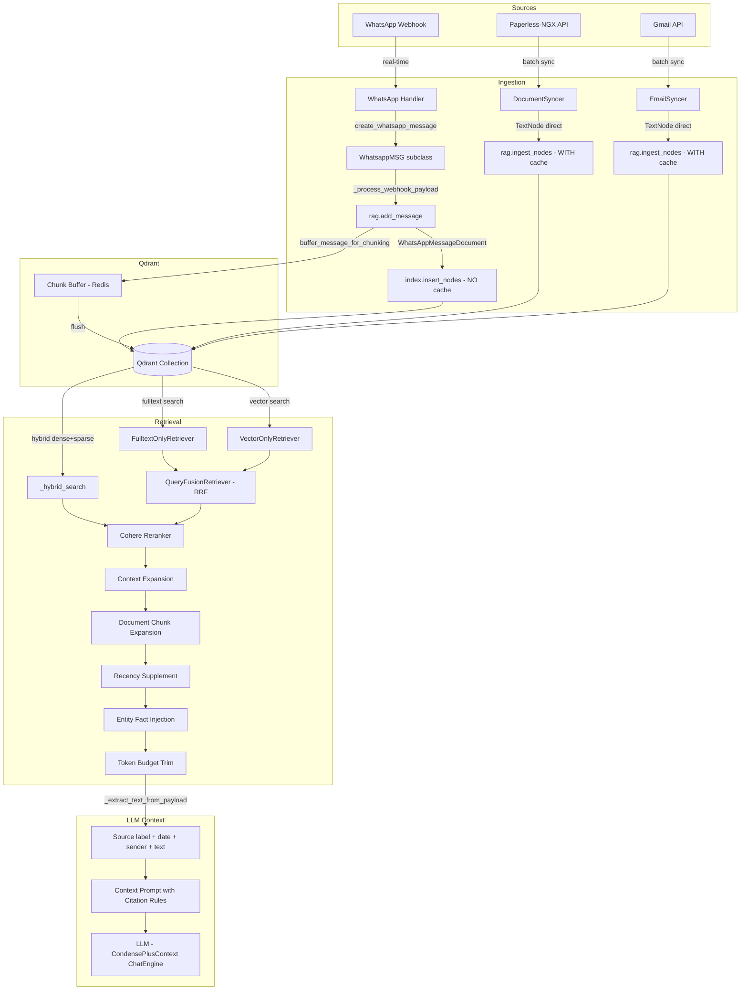
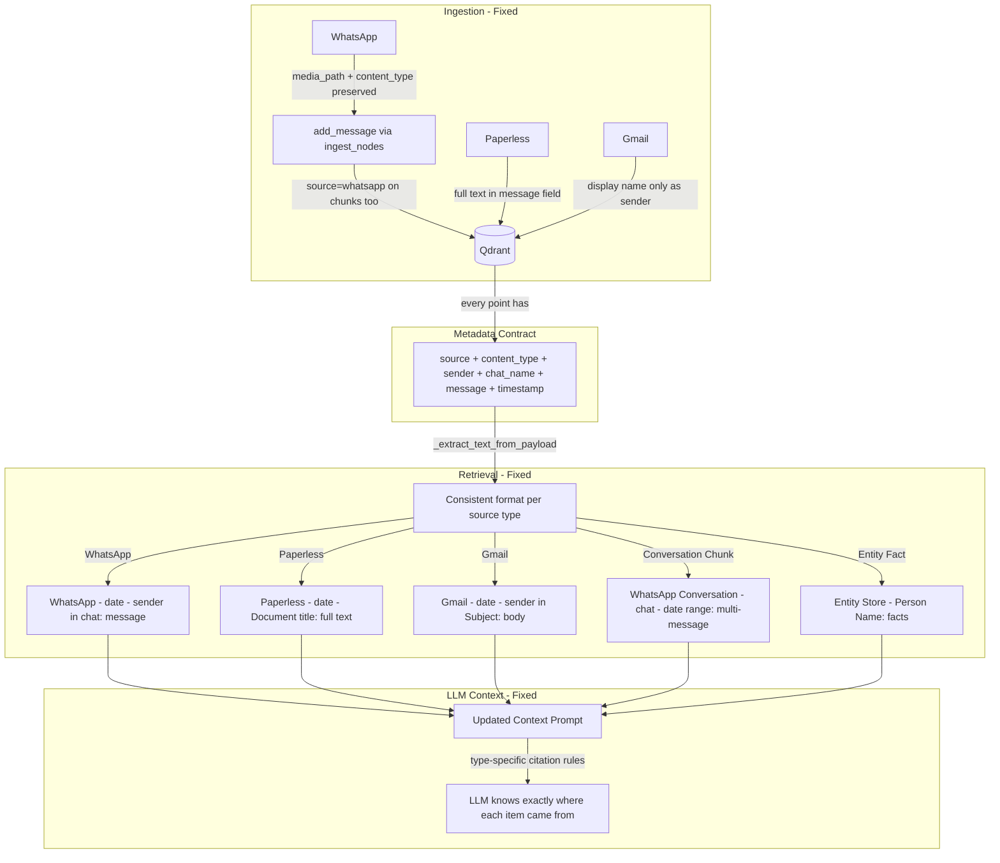

# Data Flow Audit: Qdrant Ingestion & Retrieval

## Executive Summary

Deep analysis of all data paths into and out of Qdrant, identifying **8 data loss risks** and **6 source attribution gaps** that affect the LLM's ability to correctly cite where information came from.

---

## 1. Current Data Flow Architecture



---

## 2. Data Loss Risks — Ingestion Path

### BUG 1: media_path Lost During WhatsApp Ingestion ⚠️ HIGH

**Location:** [`WhatsAppPlugin._process_webhook_payload()`](src/plugins/whatsapp/plugin.py:313)

**Problem:** When a WhatsApp image/voice/document message arrives, the handler downloads media and saves it to disk at `msg.saved_path` (e.g., `data/images/media_xxx.jpg`). However, `_process_webhook_payload()` calls `rag.add_message()` which does NOT accept a `media_path` parameter. The saved path is never stored in Qdrant metadata.

Meanwhile, the handler class `MediaMessageBase` has a [`to_rag_document()`](src/plugins/whatsapp/handler.py:511) method that correctly passes `media_path=self.saved_path`, but this method is **never called** by the plugin.

**Impact:** Image files exist on disk but the LLM and UI can never reference them because the `media_path` metadata in Qdrant is always empty string.

**Fix:** Add `media_path` parameter to [`rag.add_message()`](src/llamaindex_rag.py:1314) and pass it through to `WhatsAppMessageDocument.from_webhook_payload()`. Also update `_process_webhook_payload()` to pass `media_path=getattr(msg, 'saved_path', None)`.

---

### BUG 2: Conversation Chunks Missing `source` Metadata ⚠️ MEDIUM

**Location:** [`_flush_chunk_buffer()`](src/llamaindex_rag.py:1224)

**Problem:** When conversation chunks are created from buffered messages, the metadata includes `source_type: "conversation_chunk"` but does NOT include a `source` field. The `source` field is what all filter logic uses (source keyword index, `filter_sources`, `delete_by_source`, `get_stats`).

```python
# Current metadata in _flush_chunk_buffer:
metadata={
    "source_type": "conversation_chunk",  # ← set
    "chat_id": chat_id,
    # ... but NO "source" field!
}
```

**Impact:**
- Conversation chunks are invisible to `filter_sources=["whatsapp"]` queries
- `delete_by_source("whatsapp")` won't delete conversation chunks → orphaned data
- `get_stats()` doesn't count them → misleading totals
- `_extract_text_from_payload()` shows source label as "Unknown"

**Fix:** Add `"source": "whatsapp"` and `"content_type": "conversation_chunk"` to the chunk metadata.

---

### BUG 3: content_type Misclassification After Failed Media Download ⚠️ LOW

**Location:** [`WhatsAppPlugin._process_webhook_payload()`](src/plugins/whatsapp/plugin.py:341)

**Problem:** When media download fails (network error, WAHA timeout), `has_media` gets set to `False` in the handler. But the `msg.message` still contains the Whisper transcription or GPT-4V description (these were computed before the flag was changed). When `add_message()` auto-detects `content_type` from `has_media=False`, it classifies the message as `TEXT` instead of `VOICE` or `IMAGE`.

**Impact:** A voice transcription gets stored with `content_type: "text"` instead of `content_type: "voice"`. Source-based filtering by content type would miss it. Minor issue since the text content is preserved.

**Fix:** Pass the original `msg.content_type` value to `add_message()` as an explicit `message_content_type` override, regardless of `has_media` state.

---

### BUG 4: WhatsApp Messages Skip Embedding Cache ⚠️ LOW

**Location:** [`add_message()`](src/llamaindex_rag.py:1384)

**Problem:** WhatsApp messages use `self.index.insert_nodes([node])` which bypasses the `IngestionPipeline` and its Redis embedding cache. Paperless and Gmail use `rag.ingest_nodes()` which uses the pipeline with cache.

**Impact:** If the same WhatsApp message is somehow re-ingested (unlikely due to dedup check), it would call the embedding API again instead of using the cache. Minimal practical impact since dedup catches most cases, but architecturally inconsistent.

**Fix:** Change `add_message()` to use `self.ingest_nodes([node])` instead of `self.index.insert_nodes([node])` for consistency. The dedup check already prevents duplicates.

---

### BUG 5: Gmail Sender Stores Full Email Address ⚠️ LOW

**Location:** [`EmailSyncer.sync_emails()`](src/plugins/gmail/sync.py:604)

**Problem:** Gmail stores `sender: parsed.from_address` which is the full RFC 5322 format like `"David Pickel <david@example.com>"`. This flows through to `_extract_text_from_payload()` which shows it verbatim in the LLM context.

**Impact:** The LLM sees `Gmail | 15/01/2024 | David Pickel <david@example.com> in Subject: ...` instead of just the display name. This leaks email addresses into LLM responses and wastes context tokens.

**Fix:** Parse the display name from the `From` header using `email.utils.parseaddr()` and store only the name portion. Fall back to the full address if no name is present.

---

### RISK 6: FileDocument and CallRecordingDocument Missing Standard Metadata Fields ⚠️ MEDIUM

**Location:** [`FileDocument.to_llama_index_node()`](src/models/document.py:257), [`CallRecordingDocument.to_llama_index_node()`](src/models/call_recording.py:234)

**Problem:** These models don't set the standard `sender`, `chat_name`, or `message` metadata fields that the retrieval path depends on for:
- Full-text search (`_fulltext_search_by_field` on sender, chat_name, message)
- Context expansion (uses `chat_name` to group results)
- Display formatting in `_extract_text_from_payload()`

`FileDocument` sets `author` and `title` but not `sender`/`chat_name`. `CallRecordingDocument` sets `author` and `participants` but not `sender`/`chat_name`/`message`.

**Impact:** These documents are only findable via vector search or `_node_content` fallback. Fulltext search on sender/chat_name fields won't find them. The `_extract_text_from_payload()` function will show "Unknown" for sender.

**Fix:** Map `author` → `sender`, `title` → `chat_name`, and a truncated `content` → `message` in both models' `to_llama_index_node()` methods.

---

## 3. Source Attribution Gaps — Retrieval Path

### GAP A: _extract_text_from_payload Incomplete Source Labels ⚠️ HIGH

**Location:** [`_extract_text_from_payload()`](src/llamaindex_rag.py:1556)

**Problem:** The `_SOURCE_LABELS` dict handles most sources but the function doesn't properly handle:
1. **Conversation chunks** — `source` is missing (BUG 2), so label is "Unknown"
2. **Entity facts** — `source: "entity_store"` is not in `_SOURCE_LABELS`
3. **System placeholders** — `source: "system"` is not in `_SOURCE_LABELS`

**Impact:** The LLM receives context items labeled "Unknown" which makes citation impossible. The context prompt says "Each retrieved item above starts with its source" but some items don't follow this contract.

**Fix:**
1. Add missing entries to `_SOURCE_LABELS`: `"entity_store": "Entity Store"`, `"system": "System"`
2. Fix BUG 2 so conversation chunks have `source: "whatsapp"`
3. Add a clear fallback label like "Archive" instead of `.capitalize()` for unknown sources

---

### GAP B: Conversation Chunks Formatted Differently Than Individual Messages ⚠️ MEDIUM

**Location:** [`_flush_chunk_buffer()`](src/llamaindex_rag.py:1284) vs [`_extract_text_from_payload()`](src/llamaindex_rag.py:1556)

**Problem:** Conversation chunks store their text as pre-formatted multi-message blocks:
```
[31/12/2024 10:30] Alice: Hello
[31/12/2024 10:31] Bob: Hi there
```

But `_extract_text_from_payload()` wraps them again with `Source | date | sender in chat:` format, creating a confusing double-wrapped output:
```
Unknown | 31/12/2024 10:31 | Unknown in Family Group:
[31/12/2024 10:30] Alice: Hello
[31/12/2024 10:31] Bob: Hi there
```

**Impact:** The LLM gets confusing formatting with "Unknown" labels and redundant timestamps. It can't properly cite which person said what within a conversation chunk.

**Fix:** Detect `source_type == "conversation_chunk"` in `_extract_text_from_payload()` and format them specially: `WhatsApp Conversation | chat_name | date_range:\n{chunk_text}`

---

### GAP C: Paperless _node_content Fallback Is Fragile ⚠️ MEDIUM

**Location:** [`_extract_text_from_payload()`](src/llamaindex_rag.py:1592)

**Problem:** For Paperless documents, the function prefers `_node_content` JSON blob (a LlamaIndex internal field) over the `message` metadata field because `message` was historically truncated to 2000 chars. This `_node_content` dependency is fragile:
1. It's a LlamaIndex internal implementation detail that could change
2. The JSON parsing adds overhead and error surface
3. If LlamaIndex changes the blob format, all Paperless document retrieval breaks

**Impact:** A LlamaIndex upgrade could silently break Paperless document display to the LLM.

**Fix:** During Paperless sync, store the full chunk text in the `message` metadata field (not truncated). Add a `text_preview` field with a truncated version for UI display. Remove the `_node_content` dependency for text extraction.

---

### GAP D: Entity Facts and System Nodes Don't Follow Citation Format ⚠️ LOW

**Location:** [`_inject_entity_facts()`](src/llamaindex_rag.py:168)

**Problem:** Entity fact nodes use freeform text like "Known facts about David:\n- Birth date: 1990-01-15 (age: 36)" which doesn't follow the `Source | date | sender in chat:` format that the context prompt tells the LLM to expect.

**Impact:** The LLM might cite entity facts inconsistently or confusingly, since they don't match the pattern described in the citation rules.

**Fix:** Format entity fact nodes with a consistent header: `Entity Store | Person: David Pickel:\n- Birth date: ...` and add citation guidance for entity facts in the context prompt.

---

### GAP E: Gmail Attachments Source Attribution Disconnected ⚠️ LOW

**Location:** [`EmailSyncer.sync_emails()`](src/plugins/gmail/sync.py:708)

**Problem:** Gmail attachments are stored with `chat_name: "{subject} — {filename}"` which is good, but the `source_id: "gmail:{msg_id}:att:{filename}"` doesn't match the parent email's `source_id: "gmail:{msg_id}"`. Document chunk expansion only works on exact `source_id` matches, so attachment chunks won't be expanded alongside the email body.

**Impact:** If the LLM finds an email attachment chunk, it won't get the email body as context (and vice versa). The user gets incomplete information.

**Fix:** Add a `parent_source_id: "gmail:{msg_id}"` field to attachment metadata and update `expand_document_chunks()` to also check `parent_source_id` relationships.

---

### GAP F: Context Prompt Citation Rules Don't Cover All Source Types ⚠️ MEDIUM

**Location:** [`create_chat_engine()`](src/llamaindex_rag.py:3203)

**Problem:** The context prompt says:
> "Each retrieved item above starts with its source (WhatsApp, Gmail, Paperless, etc.), date, and sender."

But this isn't true for:
- Entity fact nodes (no date, no sender)
- Conversation chunks (multiple senders)
- System placeholder nodes
- Voice transcriptions (should note they are transcribed audio)

**Impact:** The LLM might hallucinate citations or misattribute information because the citation rules don't match the actual data format.

**Fix:** Update the context prompt to describe all item types the LLM might see and how to cite each one.

---

## 4. Implementation Plan

### Phase 1: Critical Data Loss Fixes

| # | Task | Files to Change |
|---|------|----------------|
| 1 | Add `media_path` to `add_message()` and pass from plugin | `llamaindex_rag.py`, `plugins/whatsapp/plugin.py` |
| 2 | Add `source` and `content_type` to conversation chunk metadata | `llamaindex_rag.py` |
| 3 | Map `author`→`sender`, `title`→`chat_name` in FileDocument and CallRecordingDocument | `models/document.py`, `models/call_recording.py` |
| 4 | Pass explicit `content_type` from handler to `add_message()` | `llamaindex_rag.py`, `plugins/whatsapp/plugin.py` |

### Phase 2: Source Attribution Fixes

| # | Task | Files to Change |
|---|------|----------------|
| 5 | Add missing entries to `_SOURCE_LABELS` | `llamaindex_rag.py` |
| 6 | Special-case conversation chunks in `_extract_text_from_payload()` | `llamaindex_rag.py` |
| 7 | Store full chunk text in Paperless `message` field, remove `_node_content` dependency | `plugins/paperless/sync.py`, `llamaindex_rag.py` |
| 8 | Parse Gmail sender display name from full address | `plugins/gmail/sync.py` |
| 9 | Format entity fact nodes with consistent source header | `llamaindex_rag.py` |

### Phase 3: LLM Context & Citation Improvements

| # | Task | Files to Change |
|---|------|----------------|
| 10 | Update context prompt to describe all source types and citation patterns | `llamaindex_rag.py` |
| 11 | Add `parent_source_id` for Gmail attachments | `plugins/gmail/sync.py`, `llamaindex_rag.py` |
| 12 | Switch WhatsApp `add_message()` to use `ingest_nodes()` for embedding cache | `llamaindex_rag.py` |

---

## 5. Data Flow After Fixes


