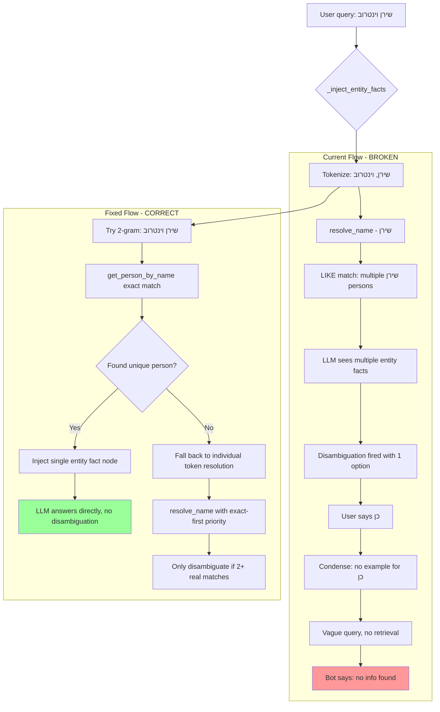

# Fix: Entity Disambiguation Failure for Full-Name Queries

**Bug Report Conversation:** User asks "מה אתה יכול לספר לי על שירן וינטרוב" (full name), bot unnecessarily disambiguates with a single option, user confirms "כן", bot loses all context and says "no additional information found."

**Note:** There are actual WhatsApp messages between the user and שירן וינטרוב from today. The system should have found both entity facts AND WhatsApp messages, but the unnecessary disambiguation broke the entire flow — the person-scoped search in `_person_scoped_search()` never runs because the disambiguated follow-up query ("כן") fails to resolve any person IDs.

---

## Root Cause Analysis

Three cascading failures combine to produce this bug:

### Layer 1: Unnecessary Disambiguation (Single-Match Case)

**Where:** [`_inject_entity_facts()`](src/llamaindex_rag.py:168) → [`_tokenize_query()`](src/llamaindex_rag.py:2113) → [`entity_db.resolve_name()`](src/entity_db.py:850)

**Problem:** The query "מה אתה יכול לספר לי על שירן וינטרוב" is tokenized into individual words. The token "שירן" is passed to `resolve_name()`, which uses `LIKE '%שירן%'` on `canonical_name` — this could match multiple persons. Even though the **full name** "שירן וינטרוב" uniquely identifies one person, the system never tries the full multi-word name first. The entity fact nodes for potentially multiple "שירן" matches are injected, and the LLM's disambiguation rule fires even when there's only **one** match.

**Also:** The [`resolve_name()`](src/entity_db.py:850) function uses `LIKE '%name%'` for canonical names but exact match for aliases. This asymmetry means a partial first-name match on canonical_name can surface unrelated persons.

### Layer 2: Condense Step Fails on Affirmative Confirmation

**Where:** [`condense_prompt`](src/llamaindex_rag.py:3877) in `create_chat_engine()`

**Problem:** When the user replies "כן" (yes) to confirm the single disambiguation option, the condense step should rewrite it to something like "מה אתה יכול לספר לי על שירן וינטרוב?" by looking at chat history. The condense prompt has examples for:
- Numbered responses ("1", "2") → maps to the corresponding option
- Name responses ("Doron Yazkirovich") → combines with original question

But it has **no examples** for affirmative confirmations ("כן", "yes", "correct", "כן, אליה") when only one option exists. The condensed query is likely too vague for effective retrieval.

### Layer 3: System Prompt Allows Single-Option Disambiguation

**Where:** [`_build_system_prompt()`](src/llamaindex_rag.py:3548), specifically the "CRITICAL DISAMBIGUATION RULE"

**Problem:** The disambiguation rule says "if multiple contacts share the same first name, ask to clarify." But it doesn't explicitly say **never disambiguate when there's only one match**. The LLM sees one entity fact source for "שירן וינטרוב" and still asks "לאיזה שירן התכוונת?" with a single option — which is absurd UX.

---

## Fix Plan

### Fix 1: Multi-Word Name Resolution in `_inject_entity_facts()`

**File:** [`src/llamaindex_rag.py`](src/llamaindex_rag.py:168) — method `_inject_entity_facts()`

**Change:** Before falling back to individual token resolution, try multi-word combinations from the query as potential full names. If a multi-word combination uniquely resolves to a person, use that and skip individual token resolution for those tokens.

**Algorithm:**
```
1. Tokenize query into words
2. Generate sliding-window n-grams (2-word, 3-word combinations)
3. For each n-gram, try entity_db.get_person_by_name(ngram) — exact match
4. If exact match found, add to seen_person_ids and skip component tokens
5. Fall back to individual token resolve_name() for unmatched tokens
```

**Why this helps:** "שירן וינטרוב" as a 2-gram matches the person exactly via `get_person_by_name()`, so only one entity fact node is injected. No ambiguity, no disambiguation.

### Fix 2: Affirmative Confirmation in Condense Prompt

**File:** [`src/llamaindex_rag.py`](src/llamaindex_rag.py:3877) — the `condense_prompt` string

**Change:** Add examples for affirmative confirmations to single-option disambiguation:

```
- Chat: 'ספר לי על שירן' → 'מצאתי: 1) שירן וינטרוב. לאיזה שירן?'
  Follow-up: 'כן' → 'ספר לי על שירן וינטרוב'
- Chat: 'What about Shiran?' → 'Found: 1) Shiran Waintrob. Which one?'
  Follow-up: 'yes' → 'Tell me about Shiran Waintrob'
```

Also add a rule:
```
- AFFIRMATIVE CONFIRMATION: When the user responds with an affirmative word
  (כן, yes, correct, נכון, that one, כן אליה/אליו) to a disambiguation
  question that listed only ONE option, map it to that single option and
  combine with the original question.
```

### Fix 3: System Prompt — Never Disambiguate Single Matches

**File:** [`src/llamaindex_rag.py`](src/llamaindex_rag.py:3548) — method `_build_system_prompt()`

**Change:** Add an explicit rule to the CRITICAL DISAMBIGUATION RULE section:

```
- If you find ONLY ONE matching contact, DO NOT ask for disambiguation —
  answer directly about that person. Disambiguation is ONLY needed when
  there are TWO OR MORE matches.
- If the user provided a FULL NAME (first + last) that uniquely matches
  one contact, answer directly — do not ask which one they mean.
```

### Fix 4: Improve `resolve_name()` Full-Name Priority

**File:** [`src/entity_db.py`](src/entity_db.py:850) — function `resolve_name()`

**Change:** The current implementation uses `LIKE '%name%'` on canonical_name which is overly broad. When the input contains spaces (indicating a full name), prioritize exact matching before falling back to LIKE:

```python
def resolve_name(name: str) -> List[Dict[str, Any]]:
    # 1. Exact canonical_name match (case-insensitive)
    rows = conn.execute(
        "SELECT id FROM persons WHERE canonical_name = ? COLLATE NOCASE",
        (name,)
    ).fetchall()
    
    # 2. Exact alias match
    alias_rows = conn.execute(
        "SELECT person_id FROM person_aliases WHERE alias = ? COLLATE NOCASE",
        (name,)
    ).fetchall()
    
    # 3. If exact matches found, return them (no LIKE needed)
    if person_ids:
        return results
    
    # 4. Only if no exact match, fall back to LIKE prefix matching
    rows = conn.execute(
        "SELECT id FROM persons WHERE canonical_name LIKE ? COLLATE NOCASE",
        (f"%{name}%",)
    ).fetchall()
```

This ensures "שירן וינטרוב" first tries exact match (which succeeds) before the LIKE fallback that might match unrelated persons.

---

## Flow Diagram



---

## Files to Modify

| File | Function/Section | Change |
|------|-----------------|--------|
| [`src/llamaindex_rag.py`](src/llamaindex_rag.py:168) | `_inject_entity_facts()` | Multi-word n-gram name resolution before individual tokens |
| [`src/llamaindex_rag.py`](src/llamaindex_rag.py:3877) | `condense_prompt` | Add affirmative confirmation examples |
| [`src/llamaindex_rag.py`](src/llamaindex_rag.py:3670) | `_build_system_prompt()` | Add single-match skip rule to disambiguation section |
| [`src/entity_db.py`](src/entity_db.py:850) | `resolve_name()` | Exact match first, LIKE fallback only when needed |

## Testing Scenarios

1. **Full name query:** "מה אתה יכול לספר לי על שירן וינטרוב" → should answer directly, no disambiguation
2. **Ambiguous first name:** "מה שירן אמרה?" with 2+ שירן contacts → should disambiguate
3. **Single-match first name:** "מה שירן אמרה?" with only 1 שירן contact → should answer directly
4. **Affirmative follow-up:** Disambiguation with 1 option → user says "כן" → should resolve correctly
5. **Numbered follow-up:** Disambiguation with 2 options → user says "1" → should resolve correctly (existing behavior, verify no regression)
