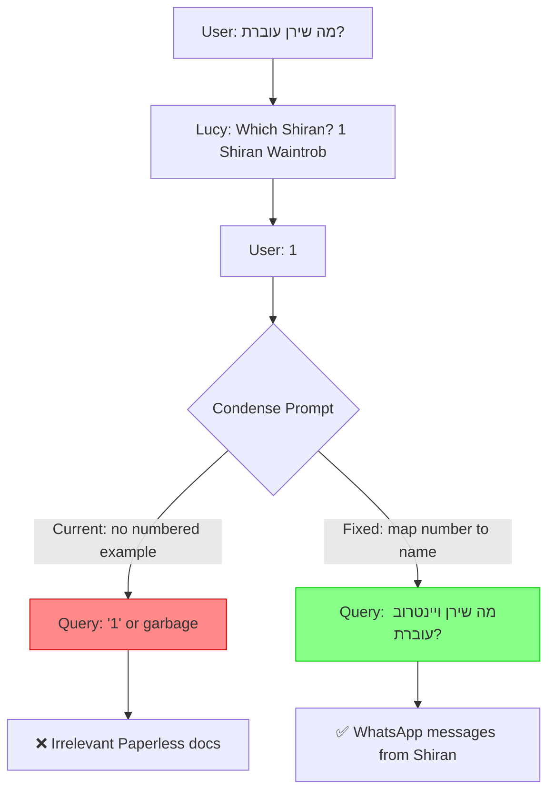
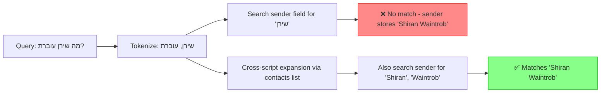

# Fix: Numbered Disambiguation Follow-Up & Cross-Script Name Search

## Problem Statement

In a conversation with Lucy, the user asked "מה שירן עוברת?" (What is Shiran going through?). Lucy correctly disambiguated and asked which Shiran. When the user responded **"1"** (selecting "Shiran Waintrob"), Lucy failed with "no relevant messages found" — even though WhatsApp messages from Shiran exist in Qdrant.

The user had to explicitly say "יש הודעות וואטסאפ" (there are WhatsApp messages) before Lucy found the relevant messages.

### Full Conversation Flow

```
User: "מה שירן עוברת?"
Lucy: "מצאתי כמה אנשים בשם שירן: 1) Shiran Waintrob. לאיזה שירן התכוונת?"
User: "1"
Lucy: ❌ "לא נמצאו הודעות או מסמכים רלוונטיים" — WRONG
User: "יש הודעות וואטסאפ"
Lucy: ✅ Finds messages about Shiran being stressed (surgery anxiety)
User: "מה אתה מציע לה לעשות?"
Lucy: ❌ Generic stress advice instead of surgery-specific advice
User: "בת כמה שירן?"
Lucy: ❌ Can't find age
```

---

## Root Cause Analysis

### Issue 1: Numbered Disambiguation Response Fails Query Rewrite (CRITICAL)

The `condense_prompt` in [`_build_system_prompt()`](src/llamaindex_rag.py:2441) has examples for **name-based** disambiguation follow-ups but NOT for **numbered** responses:

**Current examples** (lines 2476-2479):
```
- Follow-up: 'Doron Yazkirovich' → 'What did Doron Yazkirovich ask me?'
- Follow-up: 'דורון עלאני' → 'מה דורון עלאני שאל אותי?'
```

**Missing**: When user responds with "1" or "2", the condense LLM has no example showing how to map a number to the corresponding name from the chat history disambiguation options.

**What happens**:
- Chat history: `User: "מה שירן עוברת?" → Lucy: "1) Shiran Waintrob"`
- Follow-up: `"1"`
- Condense output: likely something like `"1"` or `"מה 1 עוברת?"` — a garbage query
- Retriever searches for this meaningless query → returns irrelevant Paperless documents



### Issue 2: Hebrew-English Name Mismatch in Fulltext Search (HIGH)

Even when the condense prompt correctly rewrites the query to include "שירן" (Hebrew), the fulltext search on the `sender` and `chat_name` fields fails because those fields store **English** names like "Shiran Waintrob".

The [`_fulltext_search()`](src/llamaindex_rag.py:1410) method tokenizes the query and searches each metadata field. But:
- Query token: `"שירן"` (Hebrew)
- Stored sender value: `"Shiran Waintrob"` (English)
- Qdrant MatchText: **no match** — different scripts entirely

This means the fulltext search contributes **zero** sender-field results for Hebrew queries about English-named contacts, and vice versa.

The contacts list is already cached in Redis (via [`get_sender_list()`](src/llamaindex_rag.py:2745)), so we can build a cross-script name expansion at query time.



### Issue 3: Generic Follow-Up Advice (MEDIUM)

When asked "מה אתה מציע לה לעשות?" (What do you suggest she do?), Lucy gave generic stress advice (breathing exercises, meditation, etc.) instead of advice specific to the situation — Shiran's messages indicate **surgery/medical procedure anxiety** with mentions of sedation and needing to stay awake.

The context prompt doesn't instruct the LLM to give **context-specific** advice based on the retrieved messages.

### Issue 4: Follow-Up Questions Lose Person Context (MEDIUM)

When the user asks "בת כמה שירן?" (How old is Shiran?) after establishing the conversation is about Shiran Waintrob, the condense prompt should produce "What is the age or birth date of Shiran Waintrob?" But it may produce a query that lacks the full name, reducing search effectiveness.

---

## Proposed Fixes

### Fix 1: Add Numbered Disambiguation Examples to Condense Prompt

**File:** [`src/llamaindex_rag.py`](src/llamaindex_rag.py:2441) — `condense_prompt` variable in `create_chat_engine()`

Add two new examples showing numbered disambiguation follow-ups:

```python
# Add after existing disambiguation examples (line ~2479):

"- Chat: 'מה שירן עוברת?' → 'מצאתי: 1) Shiran Waintrob. לאיזה שירן?'\n"
"  Follow-up: '1' → 'מה Shiran Waintrob עוברת?'\n"
"- Chat: 'What did Doron ask me?' → 'I found: 1) Doron Yazkirovich 2) דורון עלאני'\n"
"  Follow-up: '2' → 'What did דורון עלאני ask me?'\n"
```

Also add an explicit rule in the IMPORTANT RULES section:

```python
"- When the user responds with JUST A NUMBER (1, 2, 3...) to a disambiguation "
"question in the chat history, map that number to the corresponding person name "
"from the numbered options list, then combine it with the ORIGINAL question to "
"form a complete standalone query. Use the name EXACTLY as it appeared in the "
"options (same script — Hebrew/English).\n"
```

### Fix 2: Cross-Script Contact Name Expansion in Fulltext Search

**File:** [`src/llamaindex_rag.py`](src/llamaindex_rag.py:1410) — `_fulltext_search()` method

Add a new method `_expand_tokens_with_contact_names()` that:

1. Loads the known contacts list from Redis cache (already fast — uses `get_sender_list()`)
2. Builds a simple first-name → full-name-tokens mapping
3. For each query token, checks if it matches any known first name (case-insensitive, any script)
4. If so, adds the contact's full name tokens as additional search tokens for the sender/chat_name fields

**Implementation:**

```python
def _expand_tokens_with_contact_names(self, tokens: List[str]) -> List[str]:
    """Expand query tokens with cross-script contact name matches.
    
    When a query contains a Hebrew name like 'שירן' that matches a contact
    stored as 'Shiran Waintrob' in English, this method adds the English 
    tokens so fulltext search on sender/chat_name fields can find the match.
    
    Uses the Hebrew↔English name equivalence knowledge built into the LLM
    by maintaining a simple first-name mapping derived from the contacts list.
    """
    try:
        contacts = self.get_sender_list()
        if not contacts:
            return tokens
        
        # Build first_name → set of full name tokens mapping
        # e.g., {"shiran": {"Shiran", "Waintrob"}, "שירן": {"Shiran", "Waintrob"}}
        name_map: Dict[str, set] = {}
        for contact in contacts:
            parts = contact.split()
            if parts:
                first = parts[0].lower()
                all_parts = set(parts)
                name_map.setdefault(first, set()).update(all_parts)
        
        # Check each token against the name map
        expanded = list(tokens)
        seen = {t.lower() for t in tokens}
        
        for token in tokens:
            low = token.lower()
            if low in name_map:
                for name_part in name_map[low]:
                    if name_part.lower() not in seen:
                        seen.add(name_part.lower())
                        expanded.append(name_part)
        
        return expanded
    except Exception:
        return tokens
```

Call this method in `_fulltext_search()` before the field-by-field search, but only for the `sender` and `chat_name` field searches (not for the `message` field, to avoid noise):

```python
# In _fulltext_search(), before field_searches loop:
contact_expanded_tokens = self._expand_tokens_with_contact_names(tokens)

# Use contact_expanded_tokens for sender and chat_name fields,
# original tokens for message field
```

**Note:** This also handles the reverse case — if contacts are stored in Hebrew but the query is in English.

### Fix 3: Improve Context Prompt for Situational Advice

**File:** [`src/llamaindex_rag.py`](src/llamaindex_rag.py:2416) — `context_prompt` in `create_chat_engine()`

Add instruction to give context-specific rather than generic advice:

```python
"When the user asks for suggestions or advice about a person, base your "
"recommendations on the SPECIFIC situation described in the retrieved messages "
"and conversation history. Do not give generic advice — tailor it to what the "
"person is actually going through as evidenced by the messages.\n"
```

### Fix 4: Enhance Condense Prompt for Person-Context Follow-Ups

**File:** [`src/llamaindex_rag.py`](src/llamaindex_rag.py:2441) — `condense_prompt`

Add an explicit rule and example for follow-up questions that reference a previously disambiguated person:

```python
"- When a follow-up question references someone discussed in previous turns "
"(e.g., 'How old is she?', 'בת כמה שירן?'), ALWAYS include the person's "
"FULL NAME (as established in the conversation) in the rewritten query.\n"

# Example:
"- Chat: discussed Shiran Waintrob's stress about surgery\n"
"  Follow-up: 'בת כמה שירן?' → 'מה הגיל או תאריך הלידה של Shiran Waintrob?'\n"
```

---

## Files to Modify

| File | Method/Section | Fix | Impact |
|------|----------------|-----|--------|
| [`src/llamaindex_rag.py`](src/llamaindex_rag.py:2441) | `condense_prompt` in `create_chat_engine()` | Fixes 1 + 4: Add numbered disambiguation examples + person context rule | **Critical** |
| [`src/llamaindex_rag.py`](src/llamaindex_rag.py:1410) | `_fulltext_search()` + new method | Fix 2: Cross-script contact name expansion | **High** |
| [`src/llamaindex_rag.py`](src/llamaindex_rag.py:2416) | `context_prompt` in `create_chat_engine()` | Fix 3: Situational advice instruction | **Medium** |

---

## Risk Assessment

- **Fix 1 (condense prompt)**: Very low risk — only adds examples to a prompt template. Existing queries unaffected.
- **Fix 2 (cross-script expansion)**: Low risk — only adds MORE search tokens, never removes. May slightly increase fulltext search time due to more OR conditions, but the contacts list is small (hundreds, not thousands). Uses existing Redis-cached contacts list.
- **Fix 3 (context prompt)**: Very low risk — adds instruction text only.
- **Fix 4 (condense prompt)**: Very low risk — adds examples to prompt template.
- **No re-indexing needed**: All fixes are query-time changes.
- **No new dependencies**: Uses existing contacts list from Redis cache.

## Testing Scenarios

After implementing these fixes, verify:

1. **Numbered disambiguation**: Ask "מה שירן עוברת?" → select "1" → should find WhatsApp messages
2. **Hebrew name → English sender**: Search for "שירן" should find messages from "Shiran Waintrob"
3. **English name → Hebrew sender**: Search for "Doron" should find messages from "דורון עלאני"
4. **Context-specific advice**: After finding stress messages, asking for advice should reference the specific situation
5. **Age follow-up**: "בת כמה שירן?" after disambiguation should search for Shiran Waintrob's age/birth date
6. **Existing queries still work**: Queries that previously worked should not regress
