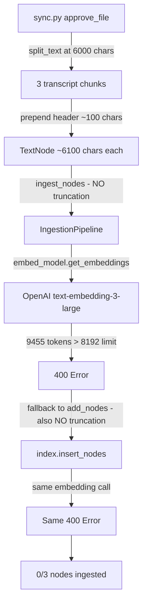

# Fix: Embedding Token Overflow for Hebrew Call Recordings

## Problem

When approving call recording `Mayrav Back-arazi_251207_194900.m4a`, all 3 transcript
nodes fail to embed with:

```
This model's maximum context length is 8192 tokens, however you requested 9455 tokens
```

Both `ingest_nodes()` (IngestionPipeline) and `add_nodes()` (fallback) fail identically,
resulting in **0/3 nodes ingested**.

## Root Cause

Two interacting issues:

### 1. `ingest_nodes()` lacks the truncation safety net

[`add_node()`](src/llamaindex_rag.py:1679) (singular) applies `EMBEDDING_MAX_CHARS` truncation
before embedding:

```python
if len(node.text) > self.EMBEDDING_MAX_CHARS:
    node.text = node.text[:self.EMBEDDING_MAX_CHARS]
```

But [`ingest_nodes()`](src/llamaindex_rag.py:940) — which is the **primary ingestion path**
used by call recordings, Paperless, Gmail, and conversation chunks — sends nodes directly
to the IngestionPipeline with **no text length or token count check**. The fallback
[`add_nodes()`](src/llamaindex_rag.py:1712) also has no check.

### 2. Character limits are calibrated for English, not Hebrew

| Constant | Value | Location | Purpose |
|---|---|---|---|
| `MAX_CHUNK_CHARS` | 6000 | [`text_processing.py:26`](src/utils/text_processing.py:26) | Chunk splitting limit |
| `EMBEDDING_MAX_CHARS` | 7000 | [`llamaindex_rag.py:1677`](src/llamaindex_rag.py:1677) | Pre-embed truncation |

The comment says: *"8191 token limit → 7000 char safety — covers worst-case tokenisation
(base64/HTML ≈ 1 char/token)"*.

But Hebrew tokenizes at **~1.5 tokens/char** — far worse than the assumed 1:1 ratio.
A 6000-char Hebrew chunk produces ~9000 tokens, well over the 8191 limit. The error
confirms: 9455 tokens from ~6100 chars = 1.55 tokens/char.

### Flow that triggers the bug



## Fix Plan

### Fix 1: Add token-aware truncation in `ingest_nodes()`

**File:** [`src/llamaindex_rag.py`](src/llamaindex_rag.py)

In the `ingest_nodes()` method, before calling `self.ingestion_pipeline.run()`,
iterate over all nodes and truncate any that exceed the embedding token limit.

Use the existing `_count_tokens_tiktoken()` helper for accurate counting. Binary-search
truncation: if token count exceeds 8000 (safe margin below 8191), progressively
shorten the text.

Also apply the same check in `add_nodes()` — the last-resort fallback.

```python
def _truncate_node_for_embedding(self, node: TextNode, max_tokens: int = 8000) -> None:
    """Truncate node text to fit within the embedding model token limit.
    
    Uses tiktoken for accurate token counting. Applies progressive
    character truncation when the text exceeds max_tokens.
    Hebrew text tokenizes at ~1.5 tokens/char, so character-based
    limits alone are insufficient.
    """
    text = node.text or ""
    if not text:
        return
    
    token_count = _count_tokens_tiktoken(text)
    if token_count <= max_tokens:
        return
    
    # Estimate chars to keep: max_tokens / (tokens/chars ratio)
    ratio = token_count / len(text)
    target_chars = int(max_tokens / ratio * 0.95)  # 5% safety margin
    node.text = text[:target_chars]
    logger.info(
        f"Truncated node for embedding: {token_count} tokens "
        f"({len(text)} chars) → ~{max_tokens} tokens ({target_chars} chars)"
    )
```

Call this in `ingest_nodes()` before `self.ingestion_pipeline.run(nodes=nodes)`:
```python
for node in nodes:
    self._truncate_node_for_embedding(node)
```

And in `add_nodes()` before `self.index.insert_nodes(nodes)`.

### Fix 2: Lower `EMBEDDING_MAX_CHARS` for fast-path character check

**File:** [`src/llamaindex_rag.py`](src/llamaindex_rag.py)

Change `EMBEDDING_MAX_CHARS` from 7000 to **5000**. This is the char-based fast-path
that avoids tiktoken overhead for clearly-safe nodes:

- At worst-case Hebrew ratio of 1.55 tok/char: 5000 × 1.55 = 7750 tokens — safely under 8191
- English content at 0.25 tok/char: 5000 × 0.25 = 1250 tokens — well within limits

This also protects the `add_node()` singular path which other code may use directly.

### Fix 3: Lower `MAX_CHUNK_CHARS` for better Hebrew chunk sizing

**File:** [`src/utils/text_processing.py`](src/utils/text_processing.py)

Change `MAX_CHUNK_CHARS` from 6000 to **4500**. This produces chunks that are safe for
Hebrew without the truncation safety net:

- 4500 chars × 1.55 tok/char ≈ 6975 tokens
- Plus ~100 char header from sync.py: 4600 × 1.55 ≈ 7130 tokens — safe margin

This affects all plugins (Paperless, Gmail, call recordings) uniformly. The quality
trade-off is minimal — shorter chunks are actually better for retrieval precision.

Update the comment to explain the Hebrew tokenization rationale.

## Files Changed

| File | Change |
|---|---|
| [`src/llamaindex_rag.py`](src/llamaindex_rag.py) | Add `_truncate_node_for_embedding()` method; call it in `ingest_nodes()` and `add_nodes()`; lower `EMBEDDING_MAX_CHARS` from 7000 to 5000 |
| [`src/utils/text_processing.py`](src/utils/text_processing.py) | Lower `MAX_CHUNK_CHARS` from 6000 to 4500; update comment |

## Impact

- **Call recordings**: All transcript chunks will now embed successfully regardless of language
- **Paperless / Gmail / WhatsApp chunks**: Also benefit from the safety net; no functional change for English content that was already under limits
- **Existing indexed data**: Unaffected — this only changes future ingestion
- **Re-indexing**: Previously failed recordings like `Mayrav Back-arazi_251207_194900.m4a` can now be re-approved successfully
