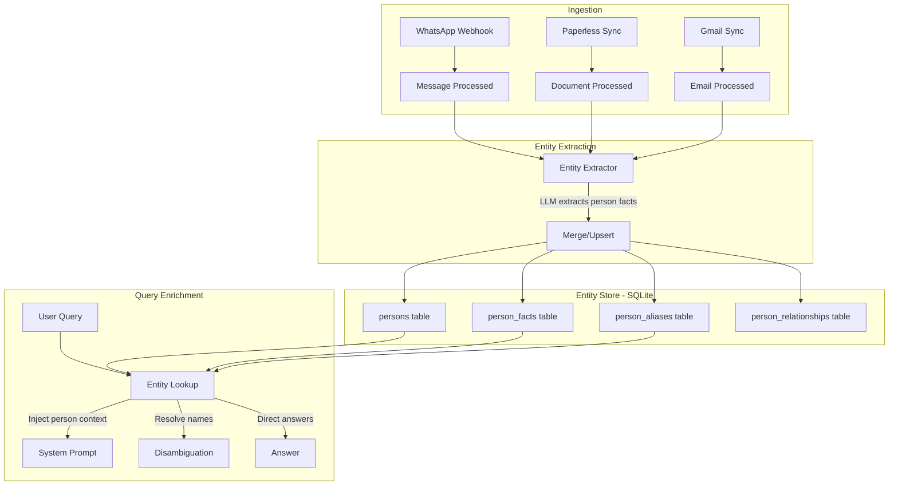
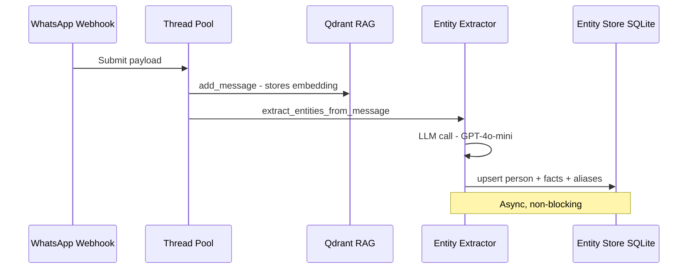

# Entity Store: Person Knowledge Base

## Overview

A SQLite-based entity management system that accumulates structured knowledge about people over time from WhatsApp messages, Paperless documents, and other sources. Replaces the flat contact name list with a rich, queryable person database that powers disambiguation, direct fact lookup, and cross-script name resolution.

## Problem Statement

The current system has no persistent memory of **facts about people** — only their names (from the sender list). When asked "בת כמה שירן?" (How old is Shiran?), the system:
1. Searches all messages hoping to find age-related content
2. If no message explicitly mentions age → "no information found"

With an Entity Store, the system could:
1. Look up `Person("Shiran Waintrob").birth_date` → instant answer
2. Know her aliases: `["שירן", "Shiran", "Shiran Waintrob"]` → perfect disambiguation
3. Know her relationship to the user → better context

## Architecture



## Database Schema

All tables live in the existing `data/settings.db` (shared with `settings_db` and `conversations_db`).

### `persons` — Core person records

```sql
CREATE TABLE IF NOT EXISTS persons (
    id INTEGER PRIMARY KEY AUTOINCREMENT,
    canonical_name TEXT NOT NULL,        -- Primary display name: "Shiran Waintrob"
    whatsapp_id TEXT,                     -- WhatsApp ID: "972501234567@c.us"
    phone TEXT,                           -- Phone number: "+972501234567"
    is_group BOOLEAN DEFAULT FALSE,       -- Groups are also "entities" for chat context
    confidence REAL DEFAULT 0.5,          -- Confidence in entity accuracy (0-1)
    first_seen TIMESTAMP DEFAULT CURRENT_TIMESTAMP,
    last_seen TIMESTAMP DEFAULT CURRENT_TIMESTAMP,
    last_updated TIMESTAMP DEFAULT CURRENT_TIMESTAMP,
    UNIQUE(canonical_name)
);

CREATE INDEX IF NOT EXISTS idx_persons_whatsapp ON persons(whatsapp_id);
CREATE INDEX IF NOT EXISTS idx_persons_name ON persons(canonical_name);
```

### `person_aliases` — Multi-script name variants

Enables cross-script disambiguation (שירן ↔ Shiran).

```sql
CREATE TABLE IF NOT EXISTS person_aliases (
    id INTEGER PRIMARY KEY AUTOINCREMENT,
    person_id INTEGER NOT NULL,
    alias TEXT NOT NULL,                  -- "שירן", "Shiran", "שירן ויינטרוב", etc.
    script TEXT DEFAULT 'unknown',        -- "hebrew", "latin", "mixed"
    source TEXT DEFAULT 'auto',           -- "whatsapp_contact", "extracted", "manual"
    created_at TIMESTAMP DEFAULT CURRENT_TIMESTAMP,
    FOREIGN KEY (person_id) REFERENCES persons(id) ON DELETE CASCADE,
    UNIQUE(person_id, alias)
);

CREATE INDEX IF NOT EXISTS idx_aliases_alias ON person_aliases(alias COLLATE NOCASE);
CREATE INDEX IF NOT EXISTS idx_aliases_person ON person_aliases(person_id);
```

### `person_facts` — Key-value facts accumulated over time

```sql
CREATE TABLE IF NOT EXISTS person_facts (
    id INTEGER PRIMARY KEY AUTOINCREMENT,
    person_id INTEGER NOT NULL,
    fact_key TEXT NOT NULL,               -- "birth_date", "age", "city", "job", "status"
    fact_value TEXT NOT NULL,             -- "1994-03-15", "32", "Tel Aviv", "teacher"
    confidence REAL DEFAULT 0.5,          -- How confident we are (LLM self-assessed)
    source_type TEXT DEFAULT 'extracted', -- "whatsapp", "paperless", "manual", "inferred"
    source_ref TEXT,                      -- e.g., "chat:972501234567@c.us:1708012345"
    extracted_at TIMESTAMP DEFAULT CURRENT_TIMESTAMP,
    FOREIGN KEY (person_id) REFERENCES persons(id) ON DELETE CASCADE,
    UNIQUE(person_id, fact_key)           -- Latest value wins (UPSERT)
);

CREATE INDEX IF NOT EXISTS idx_facts_person ON person_facts(person_id);
CREATE INDEX IF NOT EXISTS idx_facts_key ON person_facts(fact_key);
```

### `person_relationships` — Links between people

```sql
CREATE TABLE IF NOT EXISTS person_relationships (
    id INTEGER PRIMARY KEY AUTOINCREMENT,
    person_id INTEGER NOT NULL,
    related_person_id INTEGER NOT NULL,
    relationship_type TEXT NOT NULL,      -- "friend", "spouse", "parent", "child", "colleague"
    confidence REAL DEFAULT 0.5,
    source_ref TEXT,
    created_at TIMESTAMP DEFAULT CURRENT_TIMESTAMP,
    FOREIGN KEY (person_id) REFERENCES persons(id) ON DELETE CASCADE,
    FOREIGN KEY (related_person_id) REFERENCES persons(id) ON DELETE CASCADE,
    UNIQUE(person_id, related_person_id, relationship_type)
);
```

### Standard Fact Keys

| `fact_key` | Example `fact_value` | Sources |
|---|---|---|
| `birth_date` | `1994-03-15` | Documents, messages |
| `age` | `32` | Inferred from birth_date |
| `gender` | `female` | Messages, contact info |
| `city` | `Hod HaSharon` | Messages, documents |
| `email` | `shiran@example.com` | Gmail, messages |
| `job_title` | `Product Manager` | Messages |
| `employer` | `Wix` | Messages |
| `id_number` | `038041612` | Documents |
| `marital_status` | `single` | Messages, documents |
| `recent_topic` | `surgery anxiety` | Messages (last 7 days) |
| `recent_mood` | `stressed` | Messages (last 7 days) |
| `hebrew_name` | `שירן ויינטרוב` | Contact, extraction |
| `english_name` | `Shiran Waintrob` | Contact, extraction |

## New File: `src/entity_db.py`

Follows the exact same patterns as `conversations_db.py` — module-level functions, connection-per-request, shared DB_PATH.

### Core API

```python
# ---- Initialization ----
def init_entity_db() -> None
    """Create tables if they don't exist."""

# ---- Person CRUD ----
def get_or_create_person(canonical_name: str, whatsapp_id: str = None, phone: str = None) -> int
    """Get person ID by name or create new. Returns person_id."""

def get_person_by_name(name: str) -> Optional[Dict]
    """Lookup by canonical_name or any alias. Returns person + facts + aliases."""

def get_person_by_whatsapp_id(whatsapp_id: str) -> Optional[Dict]
    """Lookup by WhatsApp ID."""

def search_persons(query: str) -> List[Dict]
    """Search across canonical_name and aliases (fuzzy/prefix)."""

# ---- Aliases ----
def add_alias(person_id: int, alias: str, script: str = "auto", source: str = "auto") -> None
    """Add a name alias. Auto-detects script (Hebrew/Latin)."""

def resolve_name(name: str) -> List[Dict]
    """Find all persons matching a name (for disambiguation)."""

# ---- Facts ----
def set_fact(person_id: int, key: str, value: str, confidence: float = 0.5, 
             source_type: str = "extracted", source_ref: str = None) -> None
    """Upsert a fact. Higher confidence overwrites lower."""

def get_fact(person_id: int, key: str) -> Optional[str]
    """Get a single fact value."""

def get_all_facts(person_id: int) -> Dict[str, str]
    """Get all facts as key→value dict."""

# ---- Relationships ----
def add_relationship(person_id: int, related_id: int, rel_type: str, confidence: float = 0.5) -> None

def get_relationships(person_id: int) -> List[Dict]

# ---- Bulk/Query ----
def get_all_persons_summary() -> List[Dict]
    """Get all persons with alias count and fact count (for system prompt injection)."""

def get_person_context(name: str) -> Optional[str]
    """Build a concise context string for system prompt injection.
    E.g., 'Shiran Waintrob (שירן): female, ~32, friend, recently stressed about surgery'"""
```

## Entity Extraction Pipeline

### When: During message ingestion (async, non-blocking)

Entity extraction runs **after** the message is stored in RAG (in the background thread pool), so it doesn't slow down message processing.



### How: LLM-based extraction with structured output

A new module `src/entity_extractor.py` that uses a small, cheap LLM (GPT-4o-mini) with structured output to extract person facts from messages.

```python
EXTRACTION_PROMPT = """
You are an entity extraction system. Given a WhatsApp message,
extract any factual information about PEOPLE mentioned in or
implied by the message.

Message context:
- Chat: {chat_name}
- Sender: {sender}  
- Message: {message}
- Timestamp: {timestamp}

Extract ONLY concrete, factual information. Do NOT infer personality
traits or emotions from a single message. Focus on:
- Birth dates, ages
- Locations (city, country)
- Jobs, employers
- Family relationships (spouse, children, parents)
- Phone numbers, email addresses
- ID numbers
- Significant life events (surgery, wedding, move, etc.)

If the message contains NO extractable person facts, return empty.

Return JSON:
{
  "entities": [
    {
      "name": "Person Name",
      "facts": {"key": "value", ...},
      "relationships": [{"related_to": "Name", "type": "friend"}]
    }
  ]
}
"""
```

### Extraction Cost Control

Not every message warrants entity extraction. Smart filtering reduces LLM calls:

| Filter | Skip Extraction | Rationale |
|--------|----------------|-----------|
| Message < 10 chars | ✅ | "ok", "👍", "lol" have no facts |
| Pure emoji/sticker | ✅ | No text content |
| Group chat noise | ✅ | Low signal-to-noise |
| Already-known sender with no new info patterns | ✅ | "Going to sleep" doesn't add new facts |
| Message contains date/number/name patterns | ❌ Extract | High-value signal |
| Paperless document | ❌ Always extract | Documents are fact-dense |
| First message from new contact | ❌ Always extract | Seed the entity |

**Estimated cost**: ~1 in 5 messages triggers extraction → GPT-4o-mini at ~$0.15/1M tokens → negligible cost (< $0.001/day for typical usage).

## Integration Points

### 1. WhatsApp Plugin — Message Ingestion

**File**: `src/plugins/whatsapp/plugin.py` → `_process_webhook_payload()`

After `self._rag.add_message(...)`, add:

```python
# Entity extraction (async, non-blocking)
try:
    from entity_extractor import maybe_extract_entities
    maybe_extract_entities(
        sender=sender,
        chat_name=chat_name,
        chat_id=chat_id,
        message=msg.message,
        timestamp=str(msg.timestamp),
        whatsapp_id=msg.contact.id,
    )
except Exception as e:
    logger.debug(f"Entity extraction failed (non-critical): {e}")
```

### 2. Paperless Plugin — Document Sync

**File**: `src/plugins/paperless/sync.py`

After syncing a document, extract entities from the full text:

```python
from entity_extractor import extract_entities_from_document
extract_entities_from_document(
    doc_title=title,
    doc_text=full_text,
    source_ref=f"paperless:{doc_id}",
)
```

### 3. System Prompt — Person Context Injection

**File**: `src/llamaindex_rag.py` → `_build_system_prompt()`

Replace the flat sender list with rich person summaries:

```python
# Current: sender_list = self.get_sender_list()
# New: 
import entity_db
persons = entity_db.get_all_persons_summary()
# Format: "Shiran Waintrob (שירן, female, ~32, friend) | David Pickel (דוד, male, owner) | ..."
```

### 4. Disambiguation — Alias-Based Resolution

**File**: `src/llamaindex_rag.py` → `_expand_tokens_with_contact_names()`

Replace the simple first-name → full-name mapping with alias-based lookup:

```python
# Current: contacts = self.get_sender_list()
# New:
import entity_db
# resolve_name returns all persons matching a name token
matches = entity_db.resolve_name(token)
# Returns [{"canonical_name": "Shiran Waintrob", "aliases": ["שירן", "Shiran", ...]}]
```

### 5. Direct Fact Lookup — Query Pre-Processing

**File**: `src/llamaindex_rag.py` → `ArchiveRetriever._retrieve()`

Before running search, check if the query is a direct fact lookup:

```python
# If query matches "how old is X?" / "בת כמה X?" pattern:
import entity_db
person = entity_db.get_person_by_name("Shiran Waintrob")
if person and person["facts"].get("birth_date"):
    # Inject fact directly into context
    fact_node = TextNode(text=f"Known fact: {person['canonical_name']} birth date is {person['facts']['birth_date']}")
    results.insert(0, NodeWithScore(node=fact_node, score=1.0))
```

### 6. WhatsApp Contact Seeding

**File**: `src/plugins/whatsapp/contact.py` → `ContactManager.get_contact()`

When a new contact is resolved from WAHA, seed the entity store:

```python
import entity_db
person_id = entity_db.get_or_create_person(
    canonical_name=contact.name,
    whatsapp_id=contact.id,
    phone=contact.number,
)
# Add aliases from contact data
if contact.pushname and contact.pushname != contact.name:
    entity_db.add_alias(person_id, contact.pushname, source="whatsapp_pushname")
```

## New Files

| File | Purpose |
|------|---------|
| `src/entity_db.py` | SQLite CRUD for person entities, facts, aliases, relationships |
| `src/entity_extractor.py` | LLM-based entity extraction from messages and documents |

## Settings

New settings in `settings_db.py`:

| Key | Default | Category | Description |
|-----|---------|----------|-------------|
| `entity_extraction_enabled` | `true` | `entities` | Enable/disable entity extraction |
| `entity_extraction_model` | `gpt-4o-mini` | `entities` | LLM model for extraction |
| `entity_extraction_min_message_length` | `15` | `entities` | Min message chars to trigger extraction |
| `entity_extraction_skip_groups` | `true` | `entities` | Skip extraction in group chats |

## API Endpoints

New endpoints in `src/app.py`:

| Endpoint | Method | Description |
|----------|--------|-------------|
| `/entities` | GET | List all persons with summary |
| `/entities/<id>` | GET | Get person with all facts and aliases |
| `/entities/<id>` | PUT | Update person (manual corrections) |
| `/entities/<id>` | DELETE | Delete person entity |
| `/entities/<id>/facts` | GET | Get all facts for a person |
| `/entities/<id>/facts` | POST | Add/update a fact manually |
| `/entities/search?q=` | GET | Search by name/alias |
| `/entities/seed` | POST | Seed entities from WhatsApp contacts |

## Implementation Phases

### Phase 1: Foundation
- Create `src/entity_db.py` with schema and CRUD functions
- Add `init_entity_db()` call to app startup
- Seed from existing WhatsApp contacts (one-time migration)
- Wire aliases into `_expand_tokens_with_contact_names()` for cross-script search

### Phase 2: Extraction Pipeline  
- Create `src/entity_extractor.py` with GPT-4o-mini extraction
- Integrate into WhatsApp webhook pipeline (after RAG storage)
- Integrate into Paperless sync pipeline
- Add cost tracking for extraction calls

### Phase 3: Query Enrichment
- Inject person summaries into system prompt (replace flat sender list)
- Add direct fact lookup for "how old is X?" patterns
- Enhance disambiguation with alias-based resolution

### Phase 4: UI & Management
- Add API endpoints for entity CRUD
- Add entity management page in Reflex UI
- Allow manual corrections (merge duplicates, fix facts)

## Risk Assessment

- **Phase 1**: Very low risk — additive only, no existing behavior changes
- **Phase 2**: Low risk — extraction is async and non-blocking, failures are logged and ignored
- **Phase 3**: Medium risk — changes system prompt format and search behavior. Requires careful testing.
- **Phase 4**: Low risk — new UI pages, no existing functionality affected

## Testing

1. **Entity seeding**: Run `POST /entities/seed` → verify WhatsApp contacts create person records with aliases
2. **Entity extraction**: Send test messages with facts → verify facts appear in entity store
3. **Cross-script search**: Query "שירן" → verify it finds "Shiran Waintrob" via aliases
4. **Direct lookup**: Ask "בת כמה שירן?" → verify birth_date fact is used in response
5. **Disambiguation**: Ask "מה דורון אמר?" with 2 Dorons → verify alias-based options
