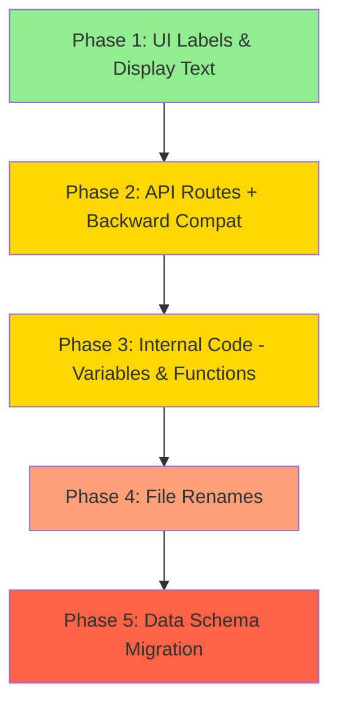

# Entity → Identity Rename Plan

## Overview

Rename all "entity/entities" terminology to "identity/identities" across the codebase for better clarity. The term "entity" currently refers to people/persons in the knowledge graph and should become "identity" to better reflect its purpose.

**Scope**: 280+ references across 15+ files (backend, frontend, API routes, database, Qdrant metadata).

## Exclusions

> **CRITICAL — DO NOT RENAME** references in [`src/pii_redactor.py`](src/pii_redactor.py) where `"entities"` refers to **Presidio NER entity types** (e.g., `PHONE_NUMBER`, `CREDIT_CARD`). These are a different concept entirely and use the Presidio library's terminology.

Specifically exclude:
- [`pii_redactor.py`](src/pii_redactor.py) — all `entities` keys in `_policies` dicts and `detect()`/`redact()` parameters
- [`presidio_anonymizer.entities`](src/pii_redactor.py:258) import
- [`llamaindex_rag.py:4084`](src/llamaindex_rag.py:4084) — `"person/entity"` in LLM prompt text (natural language, not code terminology)

---

## Dependency Graph



---

## Phase 1: UI Labels & Display Text

**Risk**: Low | **Rollback**: Git revert single commit | **Parallelizable**: Yes, all files independent

Cosmetic-only changes to user-visible text. No API contracts, no variable names, no logic changes.

### 1.1 Sidebar Navigation Labels

**File**: [`ui-reflex/ui_reflex/components/sidebar.py`](ui-reflex/ui_reflex/components/sidebar.py)

| Line | Current | New |
|------|---------|-----|
| 411 | `rx.text("Entities", ...)` | `rx.text("Identities", ...)` |
| 515 | `content="Entities"` | `content="Identities"` |

### 1.2 Page Title & Heading

**File**: [`ui-reflex/ui_reflex/ui_reflex.py`](ui-reflex/ui_reflex/ui_reflex.py)

| Line | Current | New |
|------|---------|-----|
| 80 | `title="Entities — RAG Assistant"` | `title="Identities — RAG Assistant"` |

**File**: [`ui-reflex/ui_reflex/components/entities_page.py`](ui-reflex/ui_reflex/components/entities_page.py)

| Line | Current | New |
|------|---------|-----|
| 90 | `rx.heading("Entity Store", ...)` | `rx.heading("Identity Store", ...)` |
| 1 | `"""Entity Store page — ...` | `"""Identity Store page — ...` |

### 1.3 Legacy HTML Template

**File**: [`src/templates/entities.html`](src/templates/entities.html)

| Line | Current | New |
|------|---------|-----|
| 6 | `<title>Entity Store — Person Management</title>` | `<title>Identity Store — Person Management</title>` |
| 76 | `<h1>👤 Entity Store</h1>` | `<h1>👤 Identity Store</h1>` |
| 393 | `function seedEntities()` confirm text: `'Seed entity store...'` | `'Seed identity store...'` |

### 1.4 Settings Key Label

**File**: [`ui-reflex/ui_reflex/state.py`](ui-reflex/ui_reflex/state.py)

| Line | Current | New |
|------|---------|-----|
| 41 | Comment: `# Human-readable labels for entity fact keys` | `# Human-readable labels for identity fact keys` |
| 63 | Comment: `# Fact keys grouped by semantic category for the entity detail panel.` | `# Fact keys grouped by semantic category for the identity detail panel.` |

### 1.5 Docstring & Comment Updates (UI layer)

Update docstrings/comments containing "entity" in:
- [`ui-reflex/ui_reflex/components/entities_page.py`](ui-reflex/ui_reflex/components/entities_page.py:1) — module docstring
- [`ui-reflex/ui_reflex/state.py`](ui-reflex/ui_reflex/state.py:336) — section comment `# --- Entity store ---`
- [`ui-reflex/ui_reflex/state.py`](ui-reflex/ui_reflex/state.py:359) — section comment `# --- Entity merge ---`
- [`ui-reflex/ui_reflex/state.py`](ui-reflex/ui_reflex/state.py:365) — section comment `# --- Entity graph ---`
- [`ui-reflex/ui_reflex/state.py`](ui-reflex/ui_reflex/state.py:320) — inline comment `# Entity names for dropdown`
- [`ui-reflex/ui_reflex/state.py`](ui-reflex/ui_reflex/state.py:540) — section comment `# --- Entity setters ---`

---

## Phase 2: API Routes with Backward Compatibility

**Risk**: Medium | **Rollback**: Remove new routes, revert aliases | **Parallelizable**: No — depends on Phase 1 for UI route

### Strategy

1. Add **new** `/identities/*` routes alongside existing `/entities/*` routes
2. Refactor actual logic into shared handler functions
3. Mark `/entities/*` routes as **deprecated** (log warning on use)
4. UI client switches to `/identities/*` endpoints
5. Old `/entities/*` routes remain indefinitely for external consumers

### 2.1 Backend API Route Aliases

**File**: [`src/app.py`](src/app.py)

Create new routes that delegate to the same handler functions. Each existing `/entities/...` route gets an `/identities/...` twin:

| # | Old Route | New Route | Handler Function |
|---|-----------|-----------|------------------|
| 1 | `GET /entities` | `GET /identities` | `list_entities()` → rename to `list_identities()` |
| 2 | `GET /entities/stats` | `GET /identities/stats` | `entity_stats()` → `identity_stats()` |
| 3 | `GET /entities/<id>` | `GET /identities/<id>` | `get_entity()` → `get_identity()` |
| 4 | `PUT /entities/<id>` | `PUT /identities/<id>` | `update_entity()` → `update_identity()` |
| 5 | `DELETE /entities/<id>` | `DELETE /identities/<id>` | `delete_entity()` → `delete_identity()` |
| 6 | `GET /entities/<id>/facts` | `GET /identities/<id>/facts` | `get_entity_facts()` → `get_identity_facts()` |
| 7 | `POST /entities/<id>/facts` | `POST /identities/<id>/facts` | `set_entity_fact()` → `set_identity_fact()` |
| 8 | `DELETE /entities/<id>/facts/<key>` | `DELETE /identities/<id>/facts/<key>` | `delete_entity_fact()` → `delete_identity_fact()` |
| 9 | `POST /entities/<id>/aliases` | `POST /identities/<id>/aliases` | `add_entity_alias()` → `add_identity_alias()` |
| 10 | `DELETE /entities/<id>/aliases/<aid>` | `DELETE /identities/<id>/aliases/<aid>` | `delete_entity_alias_by_id()` → `delete_identity_alias_by_id()` |
| 11 | `GET /entities/resolve/<name>` | `GET /identities/resolve/<name>` | `resolve_entity_name()` → `resolve_identity_name()` |
| 12 | `GET /entities/facts/all` | `GET /identities/facts/all` | `list_all_facts()` |
| 13 | `POST /entities/seed` | `POST /identities/seed` | `seed_entities()` → `seed_identities()` |
| 14 | `POST /entities/cleanup` | `POST /identities/cleanup` | `cleanup_entities()` → `cleanup_identities()` |
| 15 | `POST /entities/merge` | `POST /identities/merge` | `merge_entities()` → `merge_identities()` |
| 16 | `GET /entities/merge-candidates` | `GET /identities/merge-candidates` | `merge_candidates()` |
| 17 | `GET /entities/graph` | `GET /identities/graph` | `entity_graph()` → `identity_graph()` |
| 18 | `GET /entities/graph/full` | `GET /identities/graph/full` | `entity_graph_full()` → `identity_graph_full()` |
| 19 | `POST /entities/<id>/display-name` | `POST /identities/<id>/display-name` | `update_entity_display_name()` → `update_identity_display_name()` |
| 20 | `GET /entities/ui` | `GET /identities/ui` | `entities_ui()` → `identities_ui()` |

**Implementation approach**:

```python
# In app.py — define handler once, register on both routes
@app.route("/identities", methods=["GET"])
@app.route("/entities", methods=["GET"])  # deprecated alias
def list_identities():
    ...
```

Each deprecated route should log:
```python
if request.path.startswith("/entities"):
    logger.warning(f"Deprecated route {request.path} — use /identities instead")
```

### 2.2 UI API Client Updates

**File**: [`ui-reflex/ui_reflex/api_client.py`](ui-reflex/ui_reflex/api_client.py)

Switch all endpoint strings from `/entities/...` to `/identities/...`. Also rename function names:

| Current Function | New Function | Endpoint Change |
|-----------------|-------------|-----------------|
| `fetch_entities()` | `fetch_identities()` | `/entities` → `/identities` |
| `fetch_entity_stats()` | `fetch_identity_stats()` | `/entities/stats` → `/identities/stats` |
| `fetch_entity()` | `fetch_identity()` | `/entities/<id>` → `/identities/<id>` |
| `delete_entity()` | `delete_identity()` | `/entities/<id>` → `/identities/<id>` |
| `rename_entity()` | `rename_identity()` | `/entities/<id>` → `/identities/<id>` |
| `add_entity_fact()` | `add_identity_fact()` | `/entities/<id>/facts` → `/identities/<id>/facts` |
| `delete_entity_fact()` | `delete_identity_fact()` | `/entities/<id>/facts/<key>` → `/identities/<id>/facts/<key>` |
| `add_entity_alias()` | `add_identity_alias()` | `/entities/<id>/aliases` → `/identities/<id>/aliases` |
| `delete_entity_alias()` | `delete_identity_alias()` | `/entities/<id>/aliases/<aid>` → `/identities/<id>/aliases/<aid>` |
| `seed_entities()` | `seed_identities()` | `/entities/seed` → `/identities/seed` |
| `cleanup_entities()` | `cleanup_identities()` | `/entities/cleanup` → `/identities/cleanup` |
| `merge_entities()` | `merge_identities()` | `/entities/merge` → `/identities/merge` |
| `fetch_merge_candidates()` | unchanged | `/entities/merge-candidates` → `/identities/merge-candidates` |
| `update_entity_display_name()` | `update_identity_display_name()` | `/entities/<id>/display-name` → `/identities/<id>/display-name` |
| `fetch_all_entity_facts()` | `fetch_all_identity_facts()` | `/entities/facts/all` → `/identities/facts/all` |
| `fetch_entity_graph()` | `fetch_identity_graph()` | `/entities/graph` → `/identities/graph` |
| `fetch_full_entity_graph()` | `fetch_full_identity_graph()` | `/entities/graph/full` → `/identities/graph/full` |

### 2.3 UI Route Change

**File**: [`ui-reflex/ui_reflex/ui_reflex.py`](ui-reflex/ui_reflex/ui_reflex.py)

| Line | Current | New |
|------|---------|-----|
| 35 | `def entities()` | `def identities()` |
| 36 | docstring: `"""Entities page...` | `"""Identities page...` |
| 78 | `entities,` | `identities,` |
| 79 | `route="/entities"` | `route="/identities"` |

**File**: [`ui-reflex/ui_reflex/components/sidebar.py`](ui-reflex/ui_reflex/components/sidebar.py)

| Line | Current | New |
|------|---------|-----|
| 418 | `href="/entities"` | `href="/identities"` |
| 512 | `href="/entities"` | `href="/identities"` |

### 2.4 Legacy HTML Template API URLs

**File**: [`src/templates/entities.html`](src/templates/entities.html)

Update all `fetch()` calls from `/entities/...` to `/identities/...`:
- Line 181: `/entities/stats` → `/identities/stats`
- Line 198: `/entities?q=...` and `/entities` → `/identities?q=...` and `/identities`
- Line 257: `/entities/${id}` → `/identities/${id}`
- Line 330: `/entities/${id}/aliases` → `/identities/${id}/aliases`
- Line 356: `/entities/${id}/facts` → `/identities/${id}/facts`
- Line 379: `/entities/${id}` → `/identities/${id}`
- Line 398: `/entities/seed` → `/identities/seed`
- Line 455-456: `/entities/facts/all` → `/identities/facts/all`

---

## Phase 3: Internal Code — Variables, Functions, Classes

**Risk**: Medium | **Rollback**: Git revert | **Parallelizable**: 3.1–3.5 are independent; 3.6 depends on all

### 3.1 State Variables

**File**: [`ui-reflex/ui_reflex/state.py`](ui-reflex/ui_reflex/state.py)

Rename all `entity_*` state variables and their setters/computed vars. This is the largest single-file change (~100 occurrences).

**State fields** (lines 336-370):
| Current | New |
|---------|-----|
| `recordings_entity_names` | `recordings_identity_names` |
| `entity_persons` | `identity_persons` |
| `entity_stats` | `identity_stats` |
| `entity_search` | `identity_search` |
| `entity_selected_id` | `identity_selected_id` |
| `entity_detail` | `identity_detail` |
| `entity_tab` | `identity_tab` |
| `entity_loading` | `identity_loading` |
| `entity_detail_loading` | `identity_detail_loading` |
| `entity_save_message` | `identity_save_message` |
| `entity_new_fact_key` | `identity_new_fact_key` |
| `entity_new_fact_value` | `identity_new_fact_value` |
| `entity_new_alias` | `identity_new_alias` |
| `entity_editing_fact_key` | `identity_editing_fact_key` |
| `entity_editing_fact_value` | `identity_editing_fact_value` |
| `entity_editing_name` | `identity_editing_name` |
| `entity_editing_name_value` | `identity_editing_name_value` |
| `entity_all_facts` | `identity_all_facts` |
| `entity_fact_keys` | `identity_fact_keys` |
| `entity_fact_key_filter` | `identity_fact_key_filter` |
| `entity_seed_status` | `identity_seed_status` |
| `entity_seed_message` | `identity_seed_message` |
| `entity_merge_mode` | `identity_merge_mode` |
| `entity_merge_selection` | `identity_merge_selection` |
| `entity_merge_candidates` | `identity_merge_candidates` |
| `entity_candidates_loading` | `identity_candidates_loading` |
| `entity_graph_nodes` | `identity_graph_nodes` |
| `entity_graph_edges` | `identity_graph_edges` |
| `entity_graph_loading` | `identity_graph_loading` |
| `entity_graph_html` | `identity_graph_html` |

**Setter methods** (lines 540-578):
| Current | New |
|---------|-----|
| `set_entity_search()` | `set_identity_search()` |
| `set_entity_tab()` | `set_identity_tab()` |
| `set_entity_new_fact_key()` | `set_identity_new_fact_key()` |
| `set_entity_new_fact_value()` | `set_identity_new_fact_value()` |
| `set_entity_new_alias()` | `set_identity_new_alias()` |
| `set_entity_editing_fact_value()` | `set_identity_editing_fact_value()` |
| `set_entity_fact_key_filter()` | `set_identity_fact_key_filter()` |

**Computed vars** (lines 1230-1310):
| Current | New |
|---------|-----|
| `entity_stats_persons` | `identity_stats_persons` |
| `entity_stats_aliases` | `identity_stats_aliases` |
| `entity_stats_facts` | `identity_stats_facts` |
| `entity_stats_relationships` | `identity_stats_relationships` |
| `entity_merge_count` | `identity_merge_count` |
| `entity_can_merge` | `identity_can_merge` |
| `entity_has_detail` | `identity_has_detail` |
| `entity_detail_name` | `identity_detail_name` |
| `entity_detail_phone` | `identity_detail_phone` |
| `entity_detail_whatsapp` | `identity_detail_whatsapp` |
| `entity_aliases_list` | `identity_aliases_list` |
| `entity_relationships_list` | `identity_relationships_list` |
| `entity_facts_grouped` | `identity_facts_grouped` |

**Event handler methods** (lines 1442-3775):
| Current | New |
|---------|-----|
| `on_entities_load()` | `on_identities_load()` |
| `_load_entity_list()` | `_load_identity_list()` |
| `search_entities()` | `search_identities()` |
| `select_entity()` | `select_identity()` |
| `close_entity_detail()` | `close_identity_detail()` |
| `start_entity_name_edit()` | `start_identity_name_edit()` |
| `cancel_entity_name_edit()` | `cancel_identity_name_edit()` |
| `save_entity_name()` | `save_identity_name()` |
| `delete_all_facts_row()` | unchanged (no entity prefix) |
| `navigate_to_person_fact()` | unchanged |
| `delete_entity()` | `delete_identity()` |
| `add_entity_fact()` | `add_identity_fact()` |
| `save_entity_fact_edit()` | `save_identity_fact_edit()` |
| `start_entity_fact_edit()` | `start_identity_fact_edit()` |
| `cancel_entity_fact_edit()` | `cancel_identity_fact_edit()` |
| `delete_entity_fact()` | `delete_identity_fact()` |
| `add_entity_alias()` | `add_identity_alias()` |
| `delete_entity_alias()` | `delete_identity_alias()` |
| `seed_entities()` | `seed_identities()` |
| `load_all_entity_facts()` | `load_all_identity_facts()` |
| `refresh_entities()` | `refresh_identities()` |
| `cleanup_entities()` | `cleanup_identities()` |
| `execute_merge()` | unchanged |
| `update_entity_display_name()` | `update_identity_display_name()` |
| `load_entity_graph()` | `load_identity_graph()` |
| `load_full_entity_graph()` | `load_full_identity_graph()` |

> **NOTE**: All `AppState.entity_*` references in [`entities_page.py`](ui-reflex/ui_reflex/components/entities_page.py) must also be updated in lockstep with state variable renames.

### 3.2 Entities Page Component

**File**: [`ui-reflex/ui_reflex/components/entities_page.py`](ui-reflex/ui_reflex/components/entities_page.py)

- Rename function `entities_page()` → `identities_page()`
- Update all `AppState.entity_*` references to `AppState.identity_*`
- Update all `AppState.search_entities` → `AppState.search_identities` etc.
- This file has ~100+ `AppState.entity_*` references — use find/replace carefully

### 3.3 Backend Function Names

**File**: [`src/app.py`](src/app.py)

Rename all Flask route handler functions (already listed in Phase 2.1 table). Also update:
- Line 37-39: `import entity_db` — keep module import as-is until Phase 4
- Line 39: `print("✅ Entity DB imported")` → `print("✅ Identity DB imported")`
- Line 408: `logger.debug(f"Chat entity extraction failed...")` → `"Chat identity extraction failed..."`

**File**: [`src/entity_extractor.py`](src/entity_extractor.py)

Rename exported functions:
| Current | New |
|---------|-----|
| `maybe_extract_entities()` | `maybe_extract_identities()` |
| `extract_entities_from_document()` | `extract_identities_from_document()` |
| `extract_from_chat_message()` | `extract_from_chat_message()` (no entity prefix) |

Rename internal functions:
| Current | New |
|---------|-----|
| `_store_extracted_entities()` | `_store_extracted_identities()` |
| `_call_extraction_llm()` | unchanged (generic) |
| `_should_extract()` | unchanged (generic) |
| `_build_extraction_prompt()` | unchanged (generic) |

Update docstrings and log messages containing "entity".

> **Note**: The LLM prompt `_EXTRACTION_SYSTEM_PROMPT` uses "entity" in its instructions to GPT. This is fine to update since it's our prompt text, not Presidio terminology.

**File**: [`src/entity_db.py`](src/entity_db.py)

Rename exported functions:
| Current | New |
|---------|-----|
| `init_entity_db()` | `init_identity_db()` |
| `get_stats()` | unchanged |
| `seed_from_whatsapp_contacts()` | unchanged |
| `cleanup_garbage_persons()` | unchanged |
| All other functions | unchanged (they use `person_*` naming, not `entity_*`) |

Update module docstring and internal comments mentioning "entity store".

**File**: [`src/llamaindex_rag.py`](src/llamaindex_rag.py)

| Current | New |
|---------|-----|
| `_inject_entity_facts()` | `_inject_identity_facts()` |
| `EntityExtractionTransform` | `IdentityExtractionTransform` |
| `_person_scoped_search()` | unchanged |
| `update_person_ids_after_merge()` | unchanged |

Update comments/docstrings:
- Line 314: `"Entity Store | Person: {person.name}:\n"` → `"Identity Store | Person: {person.name}:\n"`
- Line 506: `f"Injected {len(entity_nodes)} entity fact node(s)"` → `"...identity fact node(s)"`
- Line 1872: `"entity_store": "Entity Store"` — display label only, update to `"Identity Store"`

### 3.4 Qdrant Metadata Content Type

**File**: [`src/llamaindex_rag.py`](src/llamaindex_rag.py:321)

| Line | Current | New |
|------|---------|-----|
| 321 | `"content_type": "entity_facts"` | `"content_type": "identity_facts"` |

> **Risk**: Existing Qdrant nodes have `content_type: "entity_facts"`. The retriever code that reads this value must handle both old and new values. Add fallback:
> ```python
> if content_type in ("entity_facts", "identity_facts"):
>     ...
> ```

### 3.5 Settings Key

**File**: [`src/settings_db.py`](src/settings_db.py)

| Line | Current | New |
|------|---------|-----|
| 190 | `"rag_entity_extraction_in_pipeline"` | `"rag_identity_extraction_in_pipeline"` |
| 199 | `"chat_entity_extraction_enabled"` | `"chat_identity_extraction_enabled"` |

**Migration strategy**: Add a one-time migration in settings initialization that copies old key → new key if old exists and new does not. This preserves user overrides.

**File**: [`ui-reflex/ui_reflex/state.py`](ui-reflex/ui_reflex/state.py:158)

| Line | Current | New |
|------|---------|-----|
| 158 | `"chat_entity_extraction_enabled": "Learn Facts from Chat"` | `"chat_identity_extraction_enabled": "Learn Facts from Chat"` |

Update the settings key reference in [`state.py`](ui-reflex/ui_reflex/state.py:1192):
| Line | Current | New |
|------|---------|-----|
| 1192 | `("rag", "chat_entity_extraction_enabled")` | `("rag", "chat_identity_extraction_enabled")` |

### 3.6 Import Site Updates

After renaming functions in 3.3, update all call sites:

**File**: [`src/tasks/whatsapp.py`](src/tasks/whatsapp.py:101)
```python
# Before
from entity_extractor import maybe_extract_entities
# After  
from entity_extractor import maybe_extract_identities
```

**File**: [`src/plugins/gmail/sync.py`](src/plugins/gmail/sync.py:716)
```python
# Before
from entity_extractor import extract_entities_from_document
# After
from entity_extractor import extract_identities_from_document
```

**File**: [`src/plugins/paperless/sync.py`](src/plugins/paperless/sync.py:566)
```python
# Before
from entity_extractor import extract_entities_from_document
# After
from entity_extractor import extract_identities_from_document
```

**File**: [`src/plugins/call_recordings/sync.py`](src/plugins/call_recordings/sync.py:696)
```python
# Before
from entity_extractor import extract_entities_from_document
# After
from entity_extractor import extract_identities_from_document
```

**File**: [`src/llamaindex_rag.py`](src/llamaindex_rag.py:4949)
```python
# Before
from entity_extractor import extract_entities_from_document
# After
from entity_extractor import extract_identities_from_document
```

---

## Phase 4: File Renames

**Risk**: High — breaks all imports | **Rollback**: `git mv` in reverse | **Must be atomic with import updates**

### 4.1 Python Module Renames

| Current Path | New Path | Importers |
|-------------|----------|-----------|
| [`src/entity_db.py`](src/entity_db.py) | `src/identity_db.py` | [`app.py`](src/app.py), [`identity.py`](src/identity.py), [`person_resolver.py`](src/person_resolver.py), [`entity_extractor.py`](src/entity_extractor.py), [`llamaindex_rag.py`](src/llamaindex_rag.py), [`asset_linker.py`](src/asset_linker.py), [`backfill_person_ids.py`](src/backfill_person_ids.py), [`backfill_asset_edges.py`](src/backfill_asset_edges.py) |
| [`src/entity_extractor.py`](src/entity_extractor.py) | `src/identity_extractor.py` | [`app.py`](src/app.py), [`tasks/whatsapp.py`](src/tasks/whatsapp.py), [`plugins/gmail/sync.py`](src/plugins/gmail/sync.py), [`plugins/paperless/sync.py`](src/plugins/paperless/sync.py), [`plugins/call_recordings/sync.py`](src/plugins/call_recordings/sync.py), [`llamaindex_rag.py`](src/llamaindex_rag.py) |

### 4.2 UI Component File Rename

| Current Path | New Path | Importers |
|-------------|----------|-----------|
| [`ui-reflex/ui_reflex/components/entities_page.py`](ui-reflex/ui_reflex/components/entities_page.py) | `ui-reflex/ui_reflex/components/identities_page.py` | [`ui-reflex/ui_reflex/ui_reflex.py`](ui-reflex/ui_reflex/ui_reflex.py:16), [`ui-reflex/ui_reflex/components/__init__.py`](ui-reflex/ui_reflex/components/__init__.py) |

### 4.3 HTML Template Rename

| Current Path | New Path |
|-------------|----------|
| [`src/templates/entities.html`](src/templates/entities.html) | `src/templates/identities.html` |

Update reference in [`src/app.py`](src/app.py:1531):
```python
return send_from_directory(str(templates_dir), "identities.html")
```

### 4.4 Import Update Checklist

After file renames, update **every** `import entity_db` → `import identity_db` and `from entity_extractor import` → `from identity_extractor import` across all files listed in 4.1 table.

**Total import sites for `entity_db`**: 14 files (via lazy `import entity_db` inside functions)
**Total import sites for `entity_extractor`**: 6 files

---

## Phase 5: Data Schema Migration

**Risk**: High — data loss possible | **Rollback**: Backup + restore | **Requires downtime window**

### 5.1 Qdrant Metadata: source type

**Current**: Nodes injected with `"source": "entity_store"` in Qdrant payloads

**Files affected**:
- [`src/llamaindex_rag.py`](src/llamaindex_rag.py:320) — writes `"source": "entity_store"`
- [`src/rich_response.py`](src/rich_response.py:122) — reads `source_type == "entity_store"`
- [`src/backfill_asset_edges.py`](src/backfill_asset_edges.py:239) — skips `"entity_store"` nodes
- [`src/backfill_person_ids.py`](src/backfill_person_ids.py:73) — skips `"entity_store"` nodes
- [`src/llamaindex_rag.py`](src/llamaindex_rag.py:1872) — display label mapping

**Migration strategy**: Entity fact nodes are **ephemeral** — they are injected at query time, not persisted to Qdrant. Therefore no Qdrant data migration is needed for the `"source": "entity_store"` value. Simply update the code to write `"identity_store"` and update all read-side checks to accept both values during a transition period.

```python
# Transition period: accept both old and new
if source in ("entity_store", "identity_store"):
    ...
```

After transition period, remove `"entity_store"` checks.

### 5.2 Qdrant Metadata: content_type

Same approach as 5.1 — `"content_type": "entity_facts"` is only on ephemeral injected nodes.

Update write side: `"content_type": "identity_facts"`
Update read side: accept both `"entity_facts"` and `"identity_facts"` temporarily.

### 5.3 SQLite Database Tables

The database tables use `person_*` naming (not `entity_*`), so **no table renames are needed**:
- `persons` ✅
- `person_aliases` ✅
- `person_facts` ✅
- `person_relationships` ✅
- `person_assets` ✅
- `asset_asset_edges` ✅

### 5.4 Settings Keys Migration

**File**: [`src/settings_db.py`](src/settings_db.py)

Add a migration in [`init_settings_db()`](src/settings_db.py) or the defaults initialization:

```python
# Migrate old entity-named settings keys to identity-named keys
_SETTINGS_KEY_MIGRATIONS = {
    "rag_entity_extraction_in_pipeline": "rag_identity_extraction_in_pipeline",
    "chat_entity_extraction_enabled": "chat_identity_extraction_enabled",
}

def _migrate_settings_keys():
    for old_key, new_key in _SETTINGS_KEY_MIGRATIONS.items():
        old_val = get(old_key)
        if old_val is not None and get(new_key) is None:
            set(new_key, old_val)
            # Optionally delete old key
```

### 5.5 Docker Compose Comment

**File**: [`docker-compose.yml`](docker-compose.yml:100)

| Line | Current | New |
|------|---------|-----|
| 100 | `# Default queue: WhatsApp message processing, entity extraction` | `# Default queue: WhatsApp message processing, identity extraction` |

---

## Testing Checklist

### API Endpoints

- [ ] `GET /identities` — returns list of persons
- [ ] `GET /identities/stats` — returns counts
- [ ] `GET /identities/<id>` — returns person detail
- [ ] `PUT /identities/<id>` — rename works
- [ ] `DELETE /identities/<id>` — delete works
- [ ] `POST /identities/<id>/facts` — add fact
- [ ] `DELETE /identities/<id>/facts/<key>` — delete fact
- [ ] `POST /identities/<id>/aliases` — add alias
- [ ] `DELETE /identities/<id>/aliases/<aid>` — delete alias
- [ ] `GET /identities/resolve/<name>` — name resolution
- [ ] `GET /identities/facts/all` — all facts table
- [ ] `POST /identities/seed` — seed from WhatsApp
- [ ] `POST /identities/cleanup` — cleanup garbage
- [ ] `POST /identities/merge` — merge persons
- [ ] `GET /identities/merge-candidates` — suggestions
- [ ] `GET /identities/graph` — relationship graph
- [ ] `GET /identities/graph/full` — full graph
- [ ] `POST /identities/<id>/display-name` — bilingual name

### Backward Compatibility

- [ ] `GET /entities` — still works, returns deprecation warning in logs
- [ ] `GET /entities/stats` — still works
- [ ] All other `/entities/*` routes — still functional
- [ ] Old settings keys still read correctly after migration

### UI Components

- [ ] Sidebar shows "Identities" label
- [ ] Navigation to `/identities` route works
- [ ] Page title shows "Identities — RAG Assistant"
- [ ] Page heading shows "Identity Store"
- [ ] Person list loads correctly
- [ ] Person detail panel opens/closes
- [ ] Facts CRUD (create, read, update, delete)
- [ ] Aliases CRUD
- [ ] Search works
- [ ] Merge mode works
- [ ] Merge candidates tab loads
- [ ] Graph tab renders
- [ ] Seed from WhatsApp contacts
- [ ] Cleanup garbage entries
- [ ] Rename person
- [ ] Display name recalculation

### Data Integrity

- [ ] Existing persons still load after code changes
- [ ] Entity facts injected at query time use new metadata
- [ ] Source display shows "Identity Store" instead of "Entity Store"
- [ ] Settings migration preserves user overrides
- [ ] `rich_response.py` correctly identifies identity store sources

### Integration

- [ ] WhatsApp message processing still triggers identity extraction
- [ ] Gmail sync still triggers identity extraction
- [ ] Paperless sync still triggers identity extraction
- [ ] Call recording sync resolves contacts from identity store
- [ ] RAG pipeline injects identity facts at query time
- [ ] Person resolver still resolves names/phones/emails

---

## Execution Order Summary

| # | Task | Phase | Depends On | Can Parallelize With |
|---|------|-------|------------|---------------------|
| 1 | UI labels in sidebar, page heading, HTML template | P1 | — | 2 |
| 2 | UI comments/docstrings | P1 | — | 1 |
| 3 | Add `/identities/*` route aliases in app.py | P2 | — | 4 |
| 4 | Add deprecation logging to `/entities/*` routes | P2 | 3 | 3 |
| 5 | Switch UI api_client.py to `/identities/*` endpoints | P2 | 3 | 6 |
| 6 | Update UI route from `/entities` to `/identities` | P2 | 5 | 5 |
| 7 | Update HTML template API URLs | P2 | 3 | 5, 6 |
| 8 | Rename state variables in state.py | P3 | 5, 6 | — |
| 9 | Update entities_page.py AppState references | P3 | 8 | — |
| 10 | Rename api_client.py function names | P3 | 8, 9 | — |
| 11 | Rename backend function names in app.py | P3 | 3 | 8, 9, 10 |
| 12 | Rename functions in entity_extractor.py | P3 | — | 11, 13 |
| 13 | Rename functions in entity_db.py and llamaindex_rag.py | P3 | — | 11, 12 |
| 14 | Update all import call sites for renamed functions | P3 | 12, 13 | — |
| 15 | Rename settings keys + migration | P3 | — | 8-14 |
| 16 | File rename: entity_db.py → identity_db.py | P4 | 13, 14 | 17 |
| 17 | File rename: entity_extractor.py → identity_extractor.py | P4 | 12, 14 | 16 |
| 18 | File rename: entities_page.py → identities_page.py | P4 | 9, 10 | 16, 17 |
| 19 | File rename: entities.html → identities.html | P4 | 7 | 16, 17, 18 |
| 20 | Update all imports after file renames | P4 | 16, 17, 18, 19 | — |
| 21 | Qdrant metadata source/content_type updates | P5 | 13 | 22 |
| 22 | Settings key migration code | P5 | 15 | 21 |
| 23 | Remove deprecated `/entities/*` route aliases | P5 | 21, 22 | — |

---

## Risk Mitigation

| Risk | Impact | Mitigation |
|------|--------|------------|
| Breaking PII redactor by renaming Presidio entities | High — PII detection stops working | Explicit exclusion list above; grep verification after each phase |
| State variable rename breaks Reflex reactivity | High — UI breaks | Do state.py + entities_page.py in same commit; test immediately |
| File rename breaks imports across 14+ files | High — app won't start | Atomic commit: rename file + update ALL imports together |
| Old API consumers break | Medium — external tools fail | Backward compat aliases remain indefinitely |
| Settings key rename loses user overrides | Medium — settings reset | One-time migration copies old → new key |
| Qdrant metadata mismatch | Low — entity facts are ephemeral | Dual-value acceptance during transition |

## Pre-flight Checklist

Before starting implementation:
- [ ] Take full backup of `data/settings.db`
- [ ] Commit current state with clean working tree
- [ ] Create `feature/entity-to-identity-rename` branch
- [ ] Verify all tests pass on current codebase
- [ ] Plan for one commit per phase for easy rollback
