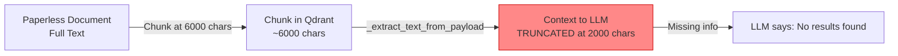
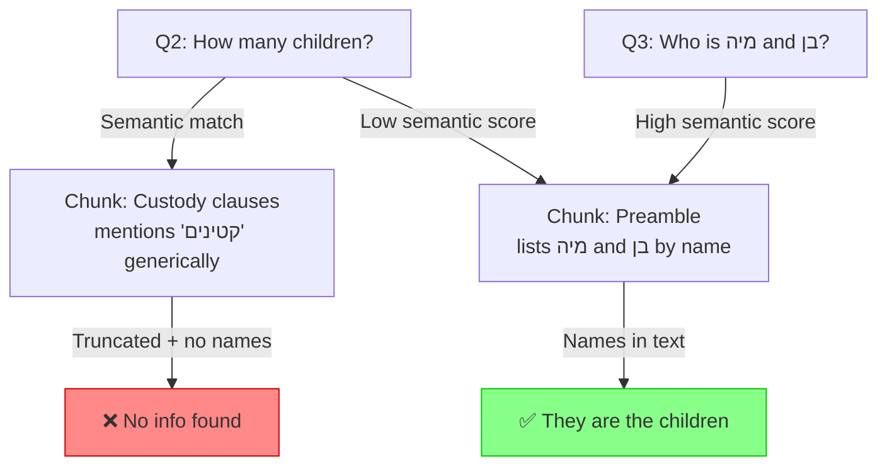
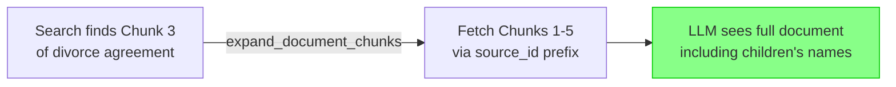

# Fix: Follow-Up Question Failure for Paperless Documents

## Problem Statement

In a WhatsApp conversation, Lucy failed to answer "כמה ילדים יש לו?" (How many children does he have?) about דוד פיקל (David Pickel), despite having the divorce agreement — which lists children מיה (Mia) and בן (Ben) — indexed in Qdrant. Paradoxically, when asked directly "מי זאת מיה פיקל ומי זה בן פיקל?" (Who is Mia/Ben Pickel?), Lucy answered correctly.

## Root Cause Analysis

Three independent issues compound to produce this failure:

### Issue 1: Context Text Truncation (Primary Cause)

In [`_extract_text_from_payload()`](src/llamaindex_rag.py:942), Paperless document text is truncated to **2000 characters** before being passed as LLM context:

```python
display_text = text[:2000] if len(text) > 2000 else text
```

However, Paperless documents are chunked at up to **6000 characters** ([`MAX_CHUNK_CHARS`](src/plugins/paperless/sync.py:30)). This means the LLM only sees the **first third** of each chunk. If the children's names appear after the 2000-char mark within a divorce agreement chunk, they are silently dropped from the LLM's context.



### Issue 2: Chunk Boundary Misalignment (Contributing Cause)

The divorce agreement is a long document split into chunks. The query "how many children does he have?" semantically matches chunks mentioning "קטינים" (minors) — but those are **generic references** in custody clauses. The **specific section listing children's names and birthdates** lives in a different chunk that doesn't score high enough for "how many children."

When Q3 explicitly names "מיה פיקל" and "בן פיקל", semantic search directly finds the chunk containing those names — bypassing the chunk boundary problem entirely.



### Issue 3: No Same-Document Sibling Chunk Retrieval

The [`expand_context()`](src/llamaindex_rag.py:1476) method fetches surrounding messages by **timestamp proximity** within the same `chat_name`. For WhatsApp messages this works well — but for Paperless documents, it is unreliable because:

- All chunks of the same document share the same `chat_name` (document title) ✅
- All chunks are synced at roughly the same time ✅  
- BUT the expansion budget `per_chat_limit = max(3, budget // len(chat_windows))` gets split across **all matched documents**. If 5 different documents match, each gets only ~3 chunks — not enough to pull all 4-5 chunks of a long divorce agreement.

### Issue 4: LLM Ignores Partial Evidence (Minor)

Even without specific names, the retrieved chunks DO mention "קטינים" (minors). The LLM should have said "Based on the divorce agreement, David Pickel has children" rather than "No relevant messages found." The `context_prompt` doesn't explicitly instruct the LLM to extract implicit/partial information.

## Proposed Fixes

### Fix 1: Remove/Increase Context Display Truncation

**File:** [`src/llamaindex_rag.py`](src/llamaindex_rag.py:942)

Change the 2000-char truncation to match the actual chunk size. Since chunks are already limited to 6000 chars and `rag_max_context_tokens` controls the total context budget, there is no need for an additional per-document truncation:

```python
# Before:
display_text = text[:2000] if len(text) > 2000 else text

# After: Use the full chunk text (already bounded by MAX_CHUNK_CHARS=6000)
display_text = text
```

**Impact:** The LLM will see the full content of each retrieved chunk, not just the first third. This directly fixes the case where children's names appear after the 2000-char mark.

### Fix 2: Same-Document Sibling Chunk Retrieval

**File:** [`src/llamaindex_rag.py`](src/llamaindex_rag.py:1476)

Add a new method `_expand_document_chunks()` that, when a Paperless document chunk is retrieved, fetches ALL other chunks from the same document using `source_id` prefix matching (e.g., `paperless:123`).

This ensures that when any chunk of a document is relevant, the LLM sees the complete document rather than an arbitrary fragment.



Implementation approach:
- After the existing `expand_context()` call in [`ArchiveRetriever._retrieve()`](src/llamaindex_rag.py:122), add a document-specific expansion step
- For each result with `source=paperless`, extract the document ID from `source_id` (format: `paperless:{doc_id}`)
- Scroll Qdrant for all points matching that `source_id` prefix
- Merge sibling chunks into the results, deduplicating by node ID

### Fix 3: Improve Context Prompt for Partial Evidence

**File:** [`src/llamaindex_rag.py`](src/llamaindex_rag.py:1871)

Add explicit instructions to the `context_prompt` to extract implicit information:

```python
context_prompt = (
    "Here are the relevant messages from the archive:\n"
    "-----\n"
    "{context_str}\n"
    "-----\n"
    "IMPORTANT: Use BOTH the retrieved messages above AND the chat history "
    "to answer the user's question. If the retrieved messages don't contain "
    "new relevant information but you already discussed the topic in previous "
    "turns, use that prior context to answer — do NOT say 'no results found' "
    "when you already have the information from earlier in the conversation.\n"
    "When documents mention related concepts (e.g., 'minors' implies children, "
    "'divorce agreement' implies parties were married), EXTRACT and REPORT that "
    "implicit information rather than saying no results were found.\n"
    "Only say no relevant messages were found if BOTH the retrieved context "
    "AND the chat history lack the information needed to answer."
)
```

### Fix 4: Store Chunk Message Content at Full Length

**File:** [`src/plugins/paperless/sync.py`](src/plugins/paperless/sync.py:625)

The `message` metadata field (used for fulltext search) is also truncated:

```python
chunk_meta["message"] = chunk[:2000]  # Only first 2000 chars searchable
```

Increase this to match the full chunk size, or remove the limit entirely since Qdrant's fulltext index handles large values:

```python
chunk_meta["message"] = chunk  # Full chunk text for better fulltext search
```

**Impact:** Fulltext search will match keywords anywhere in the chunk, not just the first 2000 characters.

## Summary of Changes

| Fix | File | Impact | Severity |
|-----|------|--------|----------|
| 1. Remove context display truncation | `llamaindex_rag.py:942` | LLM sees full chunk text | **High** |
| 2. Same-document sibling chunk retrieval | `llamaindex_rag.py` (new method + ArchiveRetriever) | Complete documents retrieved | **High** |
| 3. Improve context prompt for partial evidence | `llamaindex_rag.py:1871` | LLM extracts implicit info | **Medium** |
| 4. Increase message metadata limit | `paperless/sync.py:625` | Better fulltext search coverage | **Medium** |

## Notes

- Fix 4 (message metadata) requires a **Paperless re-sync** (`force=True`) to re-index existing documents with the updated metadata. Fixes 1-3 take effect immediately.
- The existing `expand_context()` mechanism (timestamp proximity) remains valuable for WhatsApp messages. Fix 2 adds a complementary expansion strategy specifically for multi-chunk documents.
- The `rag_max_context_tokens=3000` setting still provides overall context budget control, so removing the per-chunk 2000-char truncation won't cause unbounded context growth.
