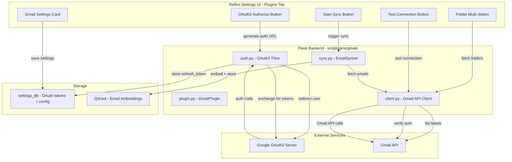
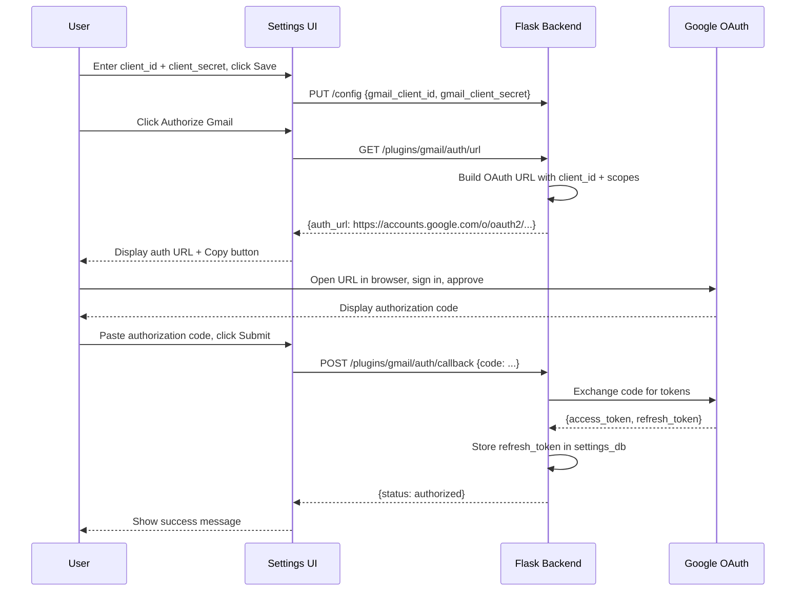
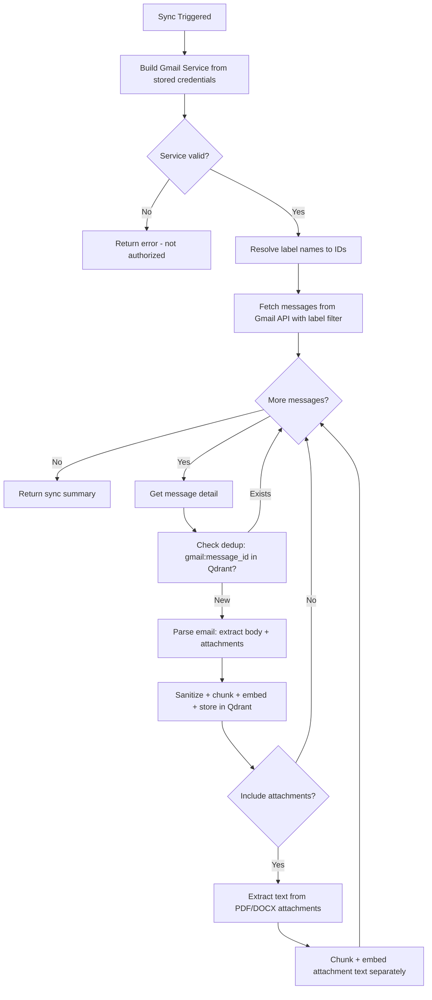

# Gmail Plugin Architecture Plan

## Overview

Add a new **Gmail** plugin following the existing plugin architecture pattern (identical to the Paperless-NGX plugin). The plugin will:

1. Authenticate via **Google OAuth2** (client_id + client_secret + refresh_token)
2. Let the user **choose folders/labels** to sync (Inbox, Sent, Archive, etc.) — multi-select UI like Paperless tags
3. Fetch emails from selected folders and **index them into RAG** (email body + text-based attachments)
4. Track processed emails to avoid re-indexing

---

## Architecture Diagram



---

## File Structure

```
src/plugins/gmail/
├── __init__.py          # Package docstring
├── auth.py              # OAuth2 authorization flow helpers
├── client.py            # Gmail API client wrapper
├── plugin.py            # GmailPlugin(ChannelPlugin) main class
└── sync.py              # Email sync logic: fetch → parse → chunk → index
```

---

## 1. Backend: `src/plugins/gmail/auth.py`

### Responsibilities
- Generate OAuth2 authorization URL for the user to visit
- Exchange authorization code for access_token + refresh_token
- Refresh expired access tokens using stored refresh_token
- Build authenticated Gmail API service object

### Key Functions

| Function | Description |
|----------|-------------|
| `get_auth_url(client_id, client_secret, redirect_uri)` | Build Google OAuth2 consent URL with `gmail.readonly` scope |
| `exchange_code(client_id, client_secret, code, redirect_uri)` | Exchange auth code for tokens, return refresh_token |
| `build_gmail_service(client_id, client_secret, refresh_token)` | Create authenticated `googleapiclient.discovery` service |
| `test_authentication(service)` | Verify the service can access the user's Gmail profile |

### OAuth2 Scopes
- `https://www.googleapis.com/auth/gmail.readonly` — read-only access to emails
- `https://www.googleapis.com/auth/gmail.labels` — read label/folder list

### Flow
1. User enters `client_id` and `client_secret` in settings
2. User clicks **Authorize** → backend generates auth URL → user opens in browser
3. Google shows consent screen → user approves → Google redirects with `?code=...`
4. Since this is a server app, we use `redirect_uri=urn:ietf:wg:oauth:2.0:oob` (copy-paste flow) — user copies the code and pastes it back in the UI
5. Backend exchanges code for tokens → stores `refresh_token` in settings_db
6. For subsequent API calls, `build_gmail_service()` uses the refresh_token to get fresh access_tokens automatically

---

## 2. Backend: `src/plugins/gmail/client.py`

### Responsibilities
- Wrap Gmail API calls with error handling and pagination
- List available labels/folders
- Fetch email messages with full content
- Extract email body (plain text and HTML) and attachments

### Key Classes/Methods

```
class GmailClient:
    __init__(client_id, client_secret, refresh_token)
    test_connection() -> bool
    get_labels() -> List[Dict]               # {id, name, type}
    get_messages(label_ids, max_results, page_token) -> Dict
    get_message_detail(message_id) -> Dict    # Full message with body + attachments
    get_attachment(message_id, attachment_id) -> bytes
```

### Label Mapping (Gmail folder names)

| Gmail Label ID | Display Name |
|----------------|-------------|
| `INBOX` | Inbox |
| `SENT` | Sent Items |
| `DRAFT` | Drafts |
| `TRASH` | Deleted |
| `SPAM` | Spam |
| `STARRED` | Starred |
| `IMPORTANT` | Important |
| `CATEGORY_*` | Categories |
| `[Gmail]/All Mail` | All Mail |
| User labels | Custom labels |

---

## 3. Backend: `src/plugins/gmail/sync.py`

### Responsibilities
- Orchestrate the sync process: fetch → parse → sanitize → chunk → embed → store
- Extract email body text (prefer plain text, fall back to HTML stripping)
- Extract text from PDF/DOCX attachments
- Apply content sanitization (reuse patterns from Paperless sync)
- Track processed emails via a Gmail label (like Paperless uses tags)
- Deduplication via `source_id = gmail:{message_id}`

### Key Classes/Methods

```
class EmailSyncer:
    __init__(client: GmailClient, rag)
    sync_emails(max_emails, label_ids, processed_label, force) -> dict
    _parse_email(message_detail) -> ParsedEmail   # body, subject, from, to, date, attachments
    _extract_attachment_text(attachment_bytes, filename) -> str
    _sanitize_email_content(raw_text) -> str
```

### ParsedEmail dataclass

| Field | Type | Description |
|-------|------|-------------|
| `message_id` | `str` | Gmail message ID |
| `thread_id` | `str` | Gmail thread ID |
| `subject` | `str` | Email subject line |
| `from_address` | `str` | Sender email/name |
| `to_addresses` | `List[str]` | Recipients |
| `date` | `datetime` | Email date |
| `body_text` | `str` | Plain text body |
| `body_html` | `str` | HTML body (for fallback) |
| `labels` | `List[str]` | Gmail labels |
| `attachments` | `List[Attachment]` | Attachment metadata + content |
| `snippet` | `str` | Gmail snippet preview |

### Attachment Text Extraction
- **PDF**: Use `pypdf` (PdfReader) to extract text from each page
- **DOCX**: Use `python-docx` to extract paragraph text
- **TXT/CSV**: Read as UTF-8 text directly
- Other formats: Skip with a log warning

### RAG Node Metadata

| Field | Value |
|-------|-------|
| `source` | `"gmail"` |
| `source_id` | `"gmail:{message_id}"` |
| `content_type` | `"text"` or `"document"` for attachments |
| `chat_name` | Email subject |
| `sender` | From address/name |
| `timestamp` | Email date as Unix timestamp |
| `message` | First 2000 chars of body (for fulltext search) |
| `folder` | Comma-separated label names |
| `thread_id` | Gmail thread ID (for context expansion) |
| `has_attachments` | `true`/`false` |
| `attachment_names` | Comma-separated filenames |

### Chunking Strategy
- Reuse `_split_text()` from Paperless sync (MAX_CHUNK_CHARS=6000, overlap=200)
- Email body is one document; each attachment is a separate document
- Quality filter: skip chunks that are mostly base64/noise

---

## 4. Backend: `src/plugins/gmail/plugin.py`

### GmailPlugin Class

Extends [`ChannelPlugin`](src/plugins/base.py:21) following the exact pattern of [`PaperlessPlugin`](src/plugins/paperless/plugin.py:17).

#### Identity

| Property | Value |
|----------|-------|
| `name` | `"gmail"` |
| `display_name` | `"Gmail"` |
| `icon` | `"📧"` |
| `version` | `"1.0.0"` |
| `description` | `"Gmail email integration for RAG indexing"` |

#### Settings

| Key | Default | Type | Description |
|-----|---------|------|-------------|
| `gmail_client_id` | `""` | `secret` | Google OAuth2 Client ID |
| `gmail_client_secret` | `""` | `secret` | Google OAuth2 Client Secret |
| `gmail_refresh_token` | `""` | `secret` | OAuth2 refresh token (obtained after authorization) |
| `gmail_sync_folders` | `""` | `text` | Comma-separated label names to sync (empty = INBOX only) |
| `gmail_sync_interval` | `3600` | `int` | Sync interval in seconds (0 = manual only) |
| `gmail_max_emails` | `500` | `int` | Maximum emails to sync per run |
| `gmail_processed_label` | `rag-indexed` | `text` | Label applied to emails after RAG indexing |
| `gmail_include_attachments` | `true` | `bool` | Extract and index text from PDF/DOCX attachments |

#### Environment Variable Map

| Setting Key | Env Var |
|-------------|---------|
| `gmail_client_id` | `GMAIL_CLIENT_ID` |
| `gmail_client_secret` | `GMAIL_CLIENT_SECRET` |
| `gmail_refresh_token` | `GMAIL_REFRESH_TOKEN` |
| `gmail_sync_folders` | `GMAIL_SYNC_FOLDERS` |
| `gmail_sync_interval` | `GMAIL_SYNC_INTERVAL` |
| `gmail_max_emails` | `GMAIL_MAX_EMAILS` |

#### Blueprint Routes

| Route | Method | Description |
|-------|--------|-------------|
| `/plugins/gmail/auth/url` | `GET` | Generate OAuth2 authorization URL |
| `/plugins/gmail/auth/callback` | `POST` | Exchange authorization code for tokens |
| `/plugins/gmail/test` | `GET` | Test Gmail connection with current credentials |
| `/plugins/gmail/folders` | `GET` | List available Gmail labels/folders |
| `/plugins/gmail/sync` | `POST` | Trigger manual email sync |
| `/plugins/gmail/sync/status` | `GET` | Get current sync status |

---

## 5. Frontend: Settings UI Changes

### `ui-reflex/ui_reflex/components/settings_page.py`

Add Gmail-specific UI section in the plugins tab, following the same pattern as [`_paperless_actions()`](ui-reflex/ui_reflex/components/settings_page.py:447):

#### `_gmail_actions()` Component
- **Authorize Gmail** button → triggers OAuth2 flow, shows auth URL for user to copy
- **Auth Code Input** → text field for user to paste the authorization code + Submit button
- **Test Connection** button → tests Gmail API connectivity
- **Start Sync** button → triggers email sync to RAG
- Status messages for each action

#### `_gmail_folders_input()` Component
Multi-select folder/label picker (same pattern as [`_paperless_tags_input()`](ui-reflex/ui_reflex/components/settings_page.py:804)):
- Selected folders shown as colored bubbles with × remove button
- Dropdown chevron fetches and shows all available Gmail labels
- Default suggestion: INBOX, SENT
- Saves as comma-separated string to `gmail_sync_folders` setting

#### Wiring in `_plugins_tab()`
Add condition: when `active_plugin_tab_value == "gmail"`, render `_gmail_actions()`

#### Special-case in `_render_setting()`
Add condition for `gmail_sync_folders` key to render `_gmail_folders_input()` instead of text input

### `ui-reflex/ui_reflex/state.py`

#### New State Variables

| Variable | Type | Description |
|----------|------|-------------|
| `gmail_auth_url` | `str` | OAuth authorization URL to display |
| `gmail_auth_status` | `str` | `""`, `"pending"`, `"success"`, `"error"` |
| `gmail_auth_message` | `str` | Status message for auth flow |
| `gmail_test_status` | `str` | `""`, `"testing"`, `"success"`, `"error"` |
| `gmail_test_message` | `str` | Test connection result |
| `gmail_sync_status` | `str` | `""`, `"syncing"`, `"complete"`, `"error"` |
| `gmail_sync_message` | `str` | Sync result message |
| `gmail_available_folders` | `list[dict]` | Available Gmail labels |
| `gmail_selected_folders` | `list[str]` | Currently selected folder names |
| `gmail_folders_loading` | `bool` | Loading state for folder dropdown |
| `gmail_folder_dropdown_open` | `bool` | Dropdown visibility |

#### New Event Handlers

| Handler | Description |
|---------|-------------|
| `gmail_start_auth()` | Call backend to get OAuth URL, display to user |
| `gmail_submit_auth_code(code)` | Submit auth code to backend for token exchange |
| `gmail_test_connection()` | Test Gmail connectivity |
| `start_gmail_sync()` | Trigger email sync |
| `load_gmail_folders()` | Fetch available labels from Gmail |
| `add_gmail_folder(name)` | Add folder to selected list + save |
| `remove_gmail_folder(name)` | Remove folder from selected list + save |
| `clear_all_gmail_folders()` | Clear all selected folders |

#### SETTING_LABELS additions

```python
"gmail_client_id": "OAuth2 Client ID",
"gmail_client_secret": "OAuth2 Client Secret",
"gmail_refresh_token": "OAuth2 Refresh Token",
"gmail_sync_folders": "Sync Folders",
"gmail_sync_interval": "Sync Interval (seconds)",
"gmail_max_emails": "Max Emails per Sync",
"gmail_processed_label": "Processed Label",
"gmail_include_attachments": "Include Attachments",
```

### `ui-reflex/ui_reflex/api_client.py`

#### New API Functions

| Function | Endpoint | Description |
|----------|----------|-------------|
| `gmail_get_auth_url()` | `GET /plugins/gmail/auth/url` | Get OAuth authorization URL |
| `gmail_submit_auth_code(code)` | `POST /plugins/gmail/auth/callback` | Exchange auth code for tokens |
| `gmail_test_connection()` | `GET /plugins/gmail/test` | Test Gmail connection |
| `fetch_gmail_folders()` | `GET /plugins/gmail/folders` | Fetch available labels |
| `start_gmail_sync(force)` | `POST /plugins/gmail/sync` | Trigger email sync |

---

## 6. Dependencies

Add to [`requirements.txt`](requirements.txt:1):

```
# Gmail OAuth2 + API
google-api-python-client>=2.0
google-auth>=2.0
google-auth-oauthlib>=1.0

# Attachment text extraction
pypdf>=3.0
python-docx>=0.8
```

---

## 7. RAG Integration Updates

### `src/llamaindex_rag.py`

Update [`get_stats()`](src/llamaindex_rag.py:1927) to count Gmail source:

```python
for source_value in ("whatsapp", "paperless", "gmail"):
```

Add `"gmail"` to [`_SOURCE_LABELS`](src/llamaindex_rag.py:884):

```python
"gmail": "Gmail",
```

---

## 8. OAuth2 User Flow



---

## 9. Email Sync Flow



---

## 10. Implementation Order

1. **Dependencies** — add Google API + PDF/DOCX libs to requirements.txt
2. **auth.py** — OAuth2 flow (generate URL, exchange code, build service)
3. **client.py** — Gmail API wrapper (test, labels, messages, attachments)
4. **sync.py** — Email syncer (parse, sanitize, chunk, embed)
5. **plugin.py** — GmailPlugin class with settings + blueprint routes
6. **__init__.py** — Package docstring
7. **api_client.py** — Frontend API client functions
8. **state.py** — Gmail state variables + event handlers + SETTING_LABELS
9. **settings_page.py** — Gmail UI components (actions, folder selector)
10. **llamaindex_rag.py** — Add gmail to stats + source labels
