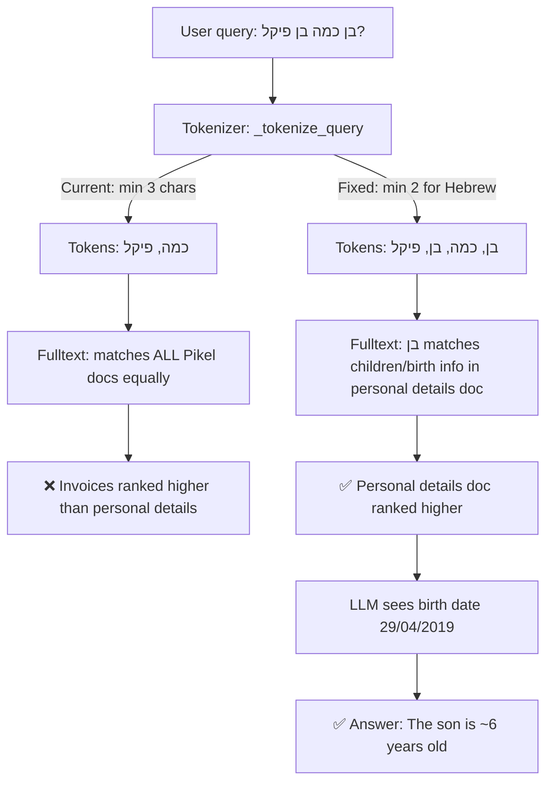

# Fix: Hebrew 2-Character Tokens Dropped by RAG Tokenizer

**Bug report:** "בן כמה בן פיקל?" (How old is Pikel's son?) returned no useful results, even though the "פרטים אישיים" document contains the son's birth date (29/04/2019).

---

## Root Cause Analysis

### The Problem

The query `בן כמה בן פיקל?` fails to retrieve the personal details document. When the user rephrases as `כמה ילדים יש לדוד פיקל?` (How many children does David Pikel have?), it works perfectly.

### Why It Fails

The [`_tokenize_query()`](src/llamaindex_rag.py:1172) method uses a regex that requires **≥3 characters** per token:

```python
# Line 1199
tokens = _re.findall(r"[\w]{3,}", clean_query, _re.UNICODE)
```

For the query `בן כמה בן פיקל?`, the tokens extracted are:

| Word | Length | Kept? | Meaning |
|------|--------|-------|---------|
| בן   | 2      | ❌ DROPPED | son / how old |
| כמה  | 3      | ✅ | how many |
| בן   | 2      | ❌ DROPPED | son |
| פיקל | 4      | ✅ | Pikel (surname) |

**The critical word "בן" (son) is dropped** because it is only 2 characters. The remaining tokens `["כמה", "פיקל"]` are too generic — they match ALL documents belonging to David Pikel (invoices, tax documents, etc.) equally, so the personal details document doesn't rank high enough.

### Why the Second Query Succeeds

`כמה ילדים יש לדוד פיקל?` produces tokens `["כמה", "ילדים", "לדוד", "פיקל"]`. The word **"ילדים"** (children, 5 chars) is semantically highly relevant and likely appears in or near the personal details document content, boosting it in both vector and full-text search.

### The Irony

Qdrant's own text indexes are configured with `min_token_len=2` (lines 494, 512, 529), meaning Qdrant **can** match 2-character Hebrew tokens. But the application-level tokenizer filters them out before they ever reach Qdrant.

### Impact on Hebrew

Hebrew has many critical 2-character words that carry essential semantic meaning:

| Word | Meaning | Example Query |
|------|---------|---------------|
| בן   | son     | "בן כמה בן פיקל?" |
| בת   | daughter | "בת כמה מיה?" |
| אב   | father  | "מי אב המשפחה?" |
| אם   | mother  | "שם האם?" |
| גן   | kindergarten | "איזה גן?" |
| שם   | name    | "מה שם?" |

---

## Proposed Fix

### 1. Lower minimum token length for Hebrew tokens (PRIMARY FIX)

**File:** [`src/llamaindex_rag.py`](src/llamaindex_rag.py:1172) — `_tokenize_query()` method

Change the tokenization to use **≥2 characters for Hebrew tokens** while keeping ≥3 for Latin/other scripts. This aligns with Qdrant's own `min_token_len=2`.

```python
# Current (line 1199):
tokens = _re.findall(r"[\w]{3,}", clean_query, _re.UNICODE)

# Proposed: capture ≥2 char tokens, then filter non-Hebrew tokens < 3 chars
tokens = _re.findall(r"[\w]{2,}", clean_query, _re.UNICODE)
# Keep 2-char tokens only if they contain Hebrew characters
tokens = [t for t in tokens if len(t) >= 3 or _re.search(r'[\u0590-\u05FF]', t)]
```

This is a minimal, surgical change that:
- Allows Hebrew 2-char words like בן, בת, אב, אם, שם to be used as search tokens
- Keeps filtering out English/Latin 2-char noise tokens like "is", "to", "in"
- Aligns application-level tokenization with Qdrant's own index configuration

### 2. Add age calculation hint to system prompt (SECONDARY)

**File:** [`src/llamaindex_rag.py`](src/llamaindex_rag.py:2087) — `_build_system_prompt()` method

Add an instruction to the system prompt or context prompt telling the LLM to calculate age from birth dates when asked "how old is X?":

> When asked about someone's age, look for birth dates in the retrieved documents and calculate the age based on the current date.

This ensures that even when the right document IS retrieved, the LLM knows to compute `current_date - birth_date` rather than looking for an explicit "age" field.

---

## Flow Diagram



---

## Files to Modify

1. **[`src/llamaindex_rag.py`](src/llamaindex_rag.py)** — `_tokenize_query()` method (line ~1199): Lower min token length for Hebrew
2. **[`src/llamaindex_rag.py`](src/llamaindex_rag.py)** — `_build_system_prompt()` or context prompt (line ~2219): Add age calculation instruction

---

## Risk Assessment

- **Low risk**: The token length change only affects fulltext search, not vector search. Hebrew 2-char words are meaningful (unlike English "is", "to"). The change aligns with Qdrant's own `min_token_len=2` configuration.
- **No re-indexing needed**: This only changes query-time tokenization, not stored data.
- **Backward compatible**: Existing queries that work will continue to work (they already have ≥3 char tokens).
