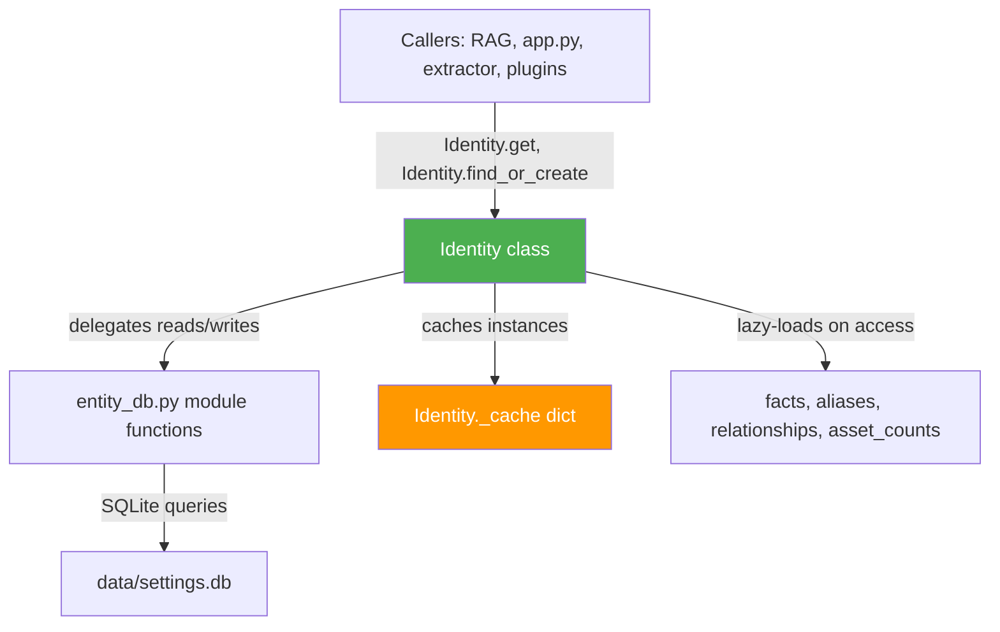

# Identity Class — Architecture Plan

## Overview

Create a new `src/identity.py` module containing an `Identity` class that wraps all person-centric operations from `entity_db.py`. The class uses an **identity map cache** so that `Identity.get(person_id)` returns a cached instance — avoiding repeated DB reads and providing a clean, object-oriented API for working with person entities.

## Design Principles

1. **Wrapper, not replacement** — delegates to `entity_db.py` functions; no DB queries in the class itself
2. **Identity map pattern** — `Identity._cache[person_id]` stores live instances; same person_id always returns the same object
3. **Lazy + eager hybrid** — core fields loaded on construction; facts/aliases/relationships loaded lazily on first access, then cached
4. **Cache invalidation** — write operations (set_fact, add_alias, etc.) invalidate the local cache so the next read is fresh
5. **Thread-safe enough** — entity_db already uses connection-per-request; the identity map is process-local (fine for single-process Flask)

## Architecture Diagram



## Class API Design

### File: `src/identity.py`

```python
class Identity:
    # ── Class-level identity map cache ──
    _cache: Dict[int, Identity]           # person_id → instance
    _cache_timestamps: Dict[int, float]   # person_id → load time
    CACHE_TTL: float = 300.0              # seconds before stale

    # ── Factory methods (class methods) ──
    @classmethod
    def get(cls, person_id: int) -> Optional[Identity]
    
    @classmethod
    def get_by_name(cls, name: str) -> Optional[Identity]
    
    @classmethod
    def get_by_whatsapp_id(cls, whatsapp_id: str) -> Optional[Identity]
    
    @classmethod
    def get_by_phone(cls, phone: str) -> Optional[Identity]
    
    @classmethod
    def get_by_email(cls, email: str) -> Optional[Identity]
    
    @classmethod
    def find_or_create(cls, name: str, **kwargs) -> Identity
    
    @classmethod
    def search(cls, query: str, limit: int = 20) -> List[Identity]
    
    @classmethod
    def resolve(cls, name=None, whatsapp_id=None, phone=None, email=None) -> Optional[Identity]
    
    @classmethod
    def all_summary(cls) -> List[Identity]

    # ── Cache management (class methods) ──
    @classmethod
    def clear_cache(cls) -> None
    
    @classmethod
    def invalidate(cls, person_id: int) -> None
    
    @classmethod
    def preload(cls, person_ids: List[int]) -> List[Identity]

    # ── Instance constructor (private — use factory methods) ──
    def __init__(self, person_data: Dict[str, Any])

    # ── Core properties (eagerly loaded) ──
    @property
    def id(self) -> int
    
    @property
    def name(self) -> str                    # canonical_name
    
    @property
    def display_name(self) -> str            # bilingual display name
    
    @property
    def whatsapp_id(self) -> Optional[str]
    
    @property
    def phone(self) -> Optional[str]
    
    @property
    def email(self) -> Optional[str]
    
    @property
    def is_group(self) -> bool

    # ── Lazy-loaded collections (cached after first access) ──
    @property
    def facts(self) -> Dict[str, str]        # fact_key → fact_value
    
    @property
    def facts_detail(self) -> List[Dict]     # full fact records with metadata
    
    @property
    def aliases(self) -> List[Dict]          # alias records with script, source
    
    @property
    def relationships(self) -> List[Dict]    # relationship records with related_name
    
    @property
    def asset_counts(self) -> Dict[str, int] # asset_type → count

    # ── Fact operations ──
    def get_fact(self, key: str) -> Optional[str]
    
    def set_fact(self, key: str, value: str, confidence: float = 0.5,
                 source_type: str = "extracted", source_ref: str = None,
                 source_quote: str = None) -> None
    
    def delete_fact(self, key: str) -> bool

    # ── Alias operations ──
    def add_alias(self, alias: str, script: str = None, source: str = "auto") -> bool
    
    def delete_alias(self, alias_id: int) -> bool

    # ── Relationship operations ──
    def add_relationship(self, related: Identity | int, rel_type: str,
                         confidence: float = 0.5, source_ref: str = None) -> bool
    
    def get_relationships(self) -> List[Dict]
    
    def expand_related(self, max_depth: int = 1) -> List[Identity]

    # ── Mutations ──
    def rename(self, new_name: str) -> Optional[str]
    
    def merge_from(self, sources: List[Identity | int]) -> Dict[str, Any]
    
    def delete(self) -> bool
    
    def refresh(self) -> None                # Force re-read from DB

    # ── Context building ──
    def context_string(self) -> str          # For system prompt injection
    
    def to_dict(self) -> Dict[str, Any]      # Full serializable representation

    # ── Dunder methods ──
    def __repr__(self) -> str
    def __str__(self) -> str
    def __eq__(self, other) -> bool
    def __hash__(self) -> int
```

## Caching Strategy

### Identity Map Pattern

```
Identity.get(42)  →  check _cache[42]
                      ├─ HIT + fresh  → return cached instance
                      ├─ HIT + stale  → reload from entity_db, update cache
                      └─ MISS         → load from entity_db, store in cache
```

### Lazy Property Loading

Each collection property (facts, aliases, relationships, asset_counts) uses a private `_facts`, `_aliases`, etc. attribute initialized to `None`. On first access, it loads from `entity_db` and caches locally. Write operations (set_fact, add_alias, etc.) set the corresponding private attribute back to `None` to force re-load on next access.

### Invalidation Rules

| Operation | Cache Effect |
|---|---|
| `set_fact()` | Clears `_facts`, `_facts_detail` |
| `delete_fact()` | Clears `_facts`, `_facts_detail` |
| `add_alias()` | Clears `_aliases`, `_display_name` |
| `delete_alias()` | Clears `_aliases`, `_display_name` |
| `add_relationship()` | Clears `_relationships` |
| `rename()` | Clears `_name`, `_display_name` |
| `merge_from()` | Removes merged source IDs from `_cache`; clears all lazy attrs on target |
| `delete()` | Removes from `_cache` |
| `refresh()` | Clears all lazy attrs; reloads core data |
| `clear_cache()` | Empties entire `_cache` dict |

## Method → entity_db Delegation Map

| Identity method | entity_db function |
|---|---|
| `get()` | `get_person()` |
| `get_by_name()` | `get_person_by_name()` |
| `get_by_whatsapp_id()` | `get_person_by_whatsapp_id()` |
| `get_by_phone()` | `find_person_by_phone()` → `get_person()` |
| `get_by_email()` | `find_person_by_email()` → `get_person()` |
| `find_or_create()` | `get_or_create_person()` → `get_person()` |
| `search()` | `search_persons()` |
| `all_summary()` | `get_all_persons_summary()` |
| `resolve()` | `person_resolver.resolve_person()` → `get_person()` |
| `set_fact()` | `set_fact()` |
| `get_fact()` | `get_fact()` or from cached `_facts` |
| `delete_fact()` | `delete_fact()` |
| `add_alias()` | `add_alias()` |
| `delete_alias()` | `delete_alias()` |
| `add_relationship()` | `add_relationship()` |
| `get_relationships()` | `get_relationships()` |
| `expand_related()` | `expand_person_ids_with_relationships()` → `get()` each |
| `rename()` | `rename_person()` |
| `merge_from()` | `merge_persons()` |
| `delete()` | `delete_person()` |
| `context_string()` | `get_person_context()` |

## Usage Examples

### Before (entity_db direct calls)

```python
import entity_db

pid = entity_db.get_or_create_person("Shiran Waintrob", phone="+972501234567")
entity_db.set_fact(pid, "city", "Tel Aviv", confidence=0.8)
entity_db.add_alias(pid, "שירן", source="whatsapp_pushname")
person = entity_db.get_person(pid)
facts = person["facts"]
city = facts.get("city")
```

### After (Identity class)

```python
from identity import Identity

shiran = Identity.find_or_create("Shiran Waintrob", phone="+972501234567")
shiran.set_fact("city", "Tel Aviv", confidence=0.8)
shiran.add_alias("שירן", source="whatsapp_pushname")
city = shiran.get_fact("city")     # from cache, no DB hit
all_facts = shiran.facts           # lazy-loaded dict
print(shiran.display_name)         # "Shiran Waintrob / שירן וינטרוב"
```

### Cache reuse across call sites

```python
# In entity_extractor.py
person = Identity.find_or_create(name)    # loads from DB, caches

# Later in llamaindex_rag.py (same process)
person = Identity.get(person_id)          # returns cached instance, no DB hit
context = person.context_string()         # uses cached facts/aliases
```

## File Structure

```
src/
├── identity.py          # NEW — Identity class
├── entity_db.py         # UNCHANGED — low-level DB functions
├── entity_extractor.py  # No changes needed (uses entity_db directly)
├── person_resolver.py   # No changes needed (keeps its own LRU caches)
└── ...
```

## Implementation Notes

1. **No changes to entity_db.py** — the Identity class is purely additive
2. **Gradual adoption** — existing call sites continue to work; new code or refactored code can use Identity
3. **The `_cache` is a plain dict** — no external dependencies (Redis etc.)
4. **TTL is optional** — set `CACHE_TTL = 0` to disable staleness checks (useful for short-lived scripts)
5. **Thread safety caveat** — the identity map is not thread-safe; this is acceptable since Flask runs single-threaded with Gunicorn workers (each worker gets its own cache)
