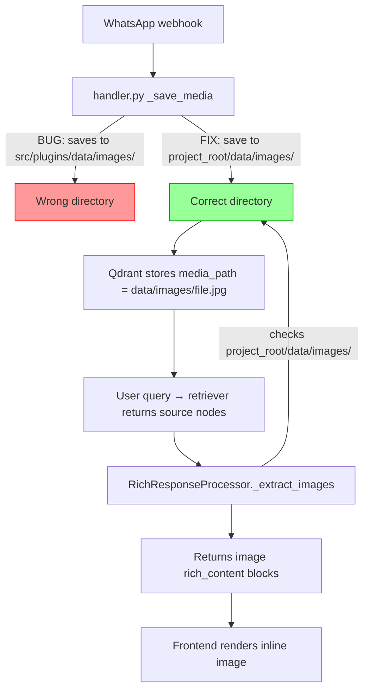

# Fix: Image Display in Chat Responses

## Problem Statement

When a user asks "show me the last received image" and then "show the image," the LLM responds with "I currently can't display images directly" — even though the system has full image display infrastructure already built. Debug log confirms the real blocker:

```
Media file not found on disk: /app/data/images/media_false_120363402406906411@g.us_...jpeg
```

## Root Cause Analysis

### Root Cause 1: MEDIA_IMAGES_DIR Path Mismatch (PRIMARY BLOCKER)

In `src/plugins/whatsapp/handler.py:54`:

```python
MEDIA_IMAGES_DIR = os.path.join(os.path.dirname(os.path.dirname(__file__)), "data", "images")
```

For `src/plugins/whatsapp/handler.py`:
- `dirname(__file__)` → `src/plugins/whatsapp/`
- `dirname(dirname(__file__))` → `src/plugins/`
- **Result: `src/plugins/data/images/`** ← WRONG!

But images are **served from** and **checked at** the project root `data/images/`:
- `app.py:67-68`: `Path(__file__).resolve().parent.parent / "data"` → `/app/data/` ✓
- `rich_response.py:115`: `dirname(dirname(__file__))` from `src/rich_response.py` → project root ✓

**Images are saved to `src/plugins/data/images/` but looked up at `data/images/`.**

### Root Cause 2: LLM Doesn't Know Images Auto-Display (Secondary)

The system prompt has no mention of image display capability. The LLM says "I can't display images" when it should simply describe the image content and let the `RichResponseProcessor` handle display. This is a nice-to-have fix — the auto-display works regardless of what the LLM says.

### Root Cause 3: Silent Failures in `_extract_images()` (Secondary)

Debug-only logging makes it hard to diagnose image extraction failures in production.

## Fix Plan

### Fix 1: Correct MEDIA_IMAGES_DIR Path (CRITICAL)

**File**: `src/plugins/whatsapp/handler.py:54`

The handler is 4 directory levels deep from the project root. Fix the path to go up 4 levels:

```python
# Before (WRONG — goes up only 2 levels, lands at src/plugins/)
MEDIA_IMAGES_DIR = os.path.join(os.path.dirname(os.path.dirname(__file__)), "data", "images")

# After (CORRECT — goes up 4 levels to project root)
from pathlib import Path
_PROJECT_ROOT = Path(__file__).resolve().parents[3]  # src/plugins/whatsapp/ → project root
MEDIA_IMAGES_DIR = str(_PROJECT_ROOT / "data" / "images")
```

Verify: `parents[0]=whatsapp/, parents[1]=plugins/, parents[2]=src/, parents[3]=project_root`

### Fix 2: Add System Prompt Image Instruction (Nice-to-have)

**File**: `src/llamaindex_rag.py` — `_build_system_prompt()` after line 3189

Tell the LLM that images are auto-displayed so it stops saying "I can't display images":

```python
prompt += (
    "\n\nIMAGE DISPLAY:\n"
    "When retrieved messages contain images, the system AUTOMATICALLY displays "
    "them inline in the chat UI below your response.\n"
    "NEVER say 'I cannot display images' — just describe the image content.\n"
)
```

### Fix 3: Improve Logging in `_extract_images()` (Helpful)

**File**: `src/rich_response.py`

- Log total source nodes scanned and how many had `has_media=True`
- Upgrade "file not found" from `debug` to `warning`
- Handle string-ified `has_media` values (e.g., `"true"` vs `True`)

### Fix 4: Also fix the legacy handler path (if still used)

**File**: `src/whatsapp/handler.py` — check if it has the same issue

## Files to Modify

| File | Change | Priority |
|------|--------|----------|
| `src/plugins/whatsapp/handler.py:54` | Fix MEDIA_IMAGES_DIR path calculation | **Critical** |
| `src/llamaindex_rag.py:~3189` | Add IMAGE DISPLAY section to system prompt | Nice-to-have |
| `src/rich_response.py:72-153` | Improve logging + handle stringified has_media | Helpful |

## Architecture Diagram


