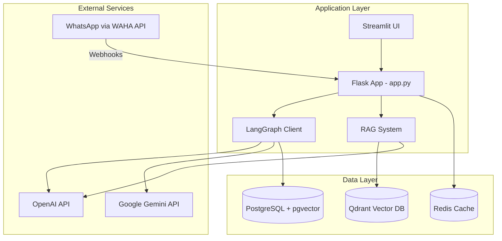

# WhatsApp-GPT: Improvements & New Features Plan

## Executive Summary

This document outlines recommended improvements and new features for the WhatsApp-GPT project. The analysis covers code quality, architecture, security, performance, and feature enhancements.

**Last Updated:** 2024-12-31

---

## Current Architecture Overview

---

## Part 1: Code Quality Improvements

### 1.1 Error Handling & Resilience

**Completed ✅:**
- [x] Implement custom exception classes — [`src/utils/exceptions.py`](src/utils/exceptions.py)
- [x] Add retry logic with exponential backoff for WAHA calls — [`src/utils/globals.py`](src/utils/globals.py)

**Remaining:**
- [ ] Add circuit breaker pattern for external services
- [ ] Improve error reporting with structured error responses
- [ ] Add retry logic for Qdrant and OpenAI calls

### 1.2 Type Hints & Documentation

**Completed ✅:**
- [x] Add complete type hints using Python 3.9+ syntax
- [x] Add comprehensive docstrings following Google style

**Remaining:**
- [ ] Generate API docs using Flask-RESTX or FastAPI migration

### 1.3 Testing

**Remaining:**
- [ ] Add pytest test suite with fixtures
- [ ] Create unit tests for RAG and message processing
- [ ] Add integration tests for webhook flow
- [ ] Set up CI/CD with GitHub Actions

### 1.4 Code Organization

**Completed ✅:**
- [x] Rename `src/utiles/` to `src/utils/`
- [x] Fix config loading — now SQLite-backed via `settings_db.py`

**Remaining:**
- [ ] Use dependency injection pattern for managers

---

## Part 2: Architecture Improvements

### 2.1 Async/Await Throughout

**Recommendations:**
- [ ] Migrate Flask to Quart or FastAPI for native async
- [ ] Use async Redis client (aioredis)

### 2.2 Message Queue Integration

**Completed (partial) ✅:**
- [x] Message deduplication — `_message_exists()` in `llamaindex_rag.py`

**Remaining:**
- [ ] Add Celery or Redis Queue for async message processing
- [ ] Implement message acknowledgment pattern
- [ ] Add dead letter queue for failed messages

### 2.3 Caching Strategy

**Completed (partial) ✅:**
- [x] Redis SET caching for chat/sender lists with incremental updates

**Remaining:**
- [ ] Add semantic caching for similar RAG queries
- [ ] Cache frequent LLM responses with TTL
- [ ] Implement cache warming for common queries

---

## Part 3: Security Improvements

### 3.1 Authentication & Authorization

**Current Issues:**
- No authentication on API endpoints
- Hardcoded credentials in docker-compose.yml
- API keys passed directly in code

**Recommendations:**
- [ ] Add API key authentication for endpoints
- [ ] Use Docker secrets for sensitive data
- [ ] Implement rate limiting per chat/user
- [ ] Add webhook signature verification

### 3.2 Input Validation

**Current Issues:**
- Limited input validation on webhook payloads
- No sanitization of message content before storage
- SQL injection potential in raw queries

**Recommendations:**
- [ ] Add Pydantic models for request validation
- [ ] Sanitize all user inputs before LLM processing
- [ ] Use parameterized queries everywhere

### 3.3 Secrets Management

**Current Issues:**
- Secrets in .env file
- No rotation mechanism
- Plain text storage

**Recommendations:**
- [ ] Integrate with HashiCorp Vault or AWS Secrets Manager
- [ ] Add secret rotation support
- [ ] Remove secrets from Docker Compose

---

## Part 4: Performance Improvements

### 4.1 RAG Optimization

**Completed ✅:**
- [x] Redis SET caching for chat/sender lists (no more full collection scans)
- [x] Payload indexes in Qdrant for metadata filtering
- [x] Hybrid search (keyword + semantic) with RRF fusion
- [x] Minimum similarity score threshold

**Remaining:**
- [ ] Batch embed messages before storing
- [ ] Implement RAG result reranking

### 4.2 LangGraph Optimization — ✅ N/A (REMOVED)

LangGraph client was removed. RAG now uses LlamaIndex `CondensePlusContextChatEngine` directly.

### 4.3 Media Handling

**Remaining:**
- [ ] Async media download with streaming
- [ ] Add image compression before storage
- [ ] Implement cleanup job for temporary files

---

## Part 5: New Features

### 5.1 AI Response to Messages (High Priority)

**Current State:** Messages are stored but the bot doesn't actively respond. `??` and `!!` prefixes are configured but not checked.

**Feature:**
- [ ] Add configurable trigger keywords/prefixes for AI responses
- [ ] Implement mention-based activation in groups (@bot)
- [ ] Add auto-reply mode for specific chats
- [ ] Support for reply-to-message context

### 5.2 Voice Message Support (High Priority)

**Current State:** Voice messages are now handled by `VoiceMessage` class but transcription is not implemented.

**Feature:**
- [ ] Integrate Whisper API for speech-to-text
- [ ] Store transcriptions in RAG
- [ ] Generate voice responses using TTS
- [ ] Support for voice notes (PTVs)

### 5.3 Multi-Modal AI (Medium Priority)

**Current State:** Images are downloaded by `ImageMessage` class but not analyzed by AI.

**Feature:**
- [ ] Use GPT-4 Vision for image understanding
- [ ] Store image descriptions in RAG
- [ ] Generate images with DALL-E from chat context
- [ ] Support for image-based queries

### 5.4 Scheduled Messages (Medium Priority)

**Feature:**
- [ ] Allow scheduling messages for later
- [ ] Recurring message support (reminders)
- [ ] Time-zone aware scheduling
- [ ] Natural language time parsing

### 5.5 Conversation Summarization (Medium Priority)

**Feature:**
- [ ] Daily/weekly chat summaries
- [ ] On-demand summary generation
- [ ] Key topics and action items extraction
- [ ] Summary delivery via WhatsApp

### 5.6 Multi-User/Multi-Session (Low Priority)

**Current State:** Single WhatsApp session support

**Feature:**
- [ ] Support multiple WhatsApp accounts
- [ ] User-specific configurations
- [ ] Shared knowledge base across accounts
- [ ] Per-user rate limiting

### 5.7 Admin Dashboard (Low Priority)

**Current State:** Basic Streamlit UI for RAG queries

**Feature:**
- [ ] Real-time message monitoring
- [ ] Analytics dashboard (messages/day, response times)
- [ ] Configuration management UI
- [ ] User/group management
- [ ] RAG collection management

### 5.8 Integrations (Low Priority)

**Feature:**
- [ ] Calendar integration (Google Calendar, Outlook)
- [ ] Task management (Todoist, Notion)
- [ ] Web search (Tavily is already configured but unused)
- [ ] Document upload and query (PDF, DOCX)

### 5.9 Local LLM Support (As mentioned in README)

**Feature:**
- [ ] Ollama integration for local models
- [ ] Model switching based on task complexity
- [ ] Fallback chain (local -> cloud)
- [ ] Cost optimization routing

---

## Part 6: DevOps Improvements

### 6.1 Observability

**Current Issues:**
- Basic logging only
- No metrics collection
- No distributed tracing

**Recommendations:**
- [ ] Add Prometheus metrics endpoint
- [ ] Integrate with Grafana for dashboards
- [ ] Add OpenTelemetry for tracing
- [ ] Structured logging with JSON format

### 6.2 Deployment

**Current Issues:**
- Docker app service commented out
- No health checks on all services
- No resource limits

**Recommendations:**
- [ ] Add proper health checks for all services
- [ ] Set resource limits in docker-compose
- [ ] Add Kubernetes manifests for production
- [ ] Implement blue-green deployment

### 6.3 Backup & Recovery

**Recommendations:**
- [ ] Add automated backup for PostgreSQL
- [ ] Qdrant snapshot scheduling
- [ ] Redis persistence configuration
- [ ] Disaster recovery documentation

---

## Implementation Priority Matrix

| Priority | Feature/Improvement | Impact | Effort | Status |
|----------|---------------------|--------|--------|--------|
| 🔴 High | Error Handling & Resilience | High | Medium | ✅ Done |
| 🔴 High | AI Response Activation | High | Low | ⏳ Pending |
| 🔴 High | Voice Message Support | High | Medium | ⏳ Pending |
| 🟡 Medium | Async Architecture | High | High | ⏳ Pending |
| 🟡 Medium | Multi-Modal AI | Medium | Medium | ⏳ Pending |
| 🟡 Medium | Conversation Summarization | Medium | Low | ⏳ Pending |
| 🟡 Medium | Testing Suite | Medium | Medium | ⏳ Pending |
| 🟢 Low | Admin Dashboard | Medium | High | ⏳ Pending |
| 🟢 Low | Multi-User Support | Low | High | ⏳ Pending |
| 🟢 Low | Local LLM Support | Medium | Medium | ⏳ Pending |

---

## Quick Wins - Status

| Task | Status |
|------|--------|
| Fix the `utiles` typo - Rename to `utils` | ✅ Done |
| Add custom exception classes | ✅ Done |
| Add retry logic for API calls | ✅ Done |
| Fix config loading with absolute paths | ✅ Done (SQLite-backed) |
| Fix RAG singleton usage | ✅ Done |
| Add type hints and docstrings | ✅ Done |
| Add Qdrant payload indexes | ✅ Done |
| Add basic health checks | ✅ Done |
| Add webhook signature verification | ⏳ Pending |
| Implement AI response trigger - Add `??` prefix handling | ⏳ Pending |

---

## Architecture Changes Since Original Plan (2024-12-31)

The following major architectural changes have been made since this plan was written:

1. **LangGraph removed** — Replaced by LlamaIndex `CondensePlusContextChatEngine`
2. **Custom session module removed** — `src/session/` deleted, replaced by `RedisChatStore`
3. **Config system replaced** — Custom `.env` parser → SQLite-backed `settings_db.py`
4. **RAG system rewritten** — `src/rag.py` → `src/llamaindex_rag.py` with Qdrant
5. **WhatsApp handler rewritten** — Single class → class hierarchy with factory function
6. **Document models added** — `src/models/` with Pydantic v2 classes
7. **Settings UI added** — `ui/pages/1_Settings.py`

Files referenced in this plan that no longer exist:
- `src/langgraph_client.py` → removed
- `src/rag.py` → replaced by `src/llamaindex_rag.py`
- `src/whatsapp.py` → replaced by `src/whatsapp/handler.py`
- `src/contact.py` → replaced by `src/whatsapp/contact.py`
- `src/groups.py` → replaced by `src/whatsapp/group.py`
- `src/providers/dalle.py` → removed
