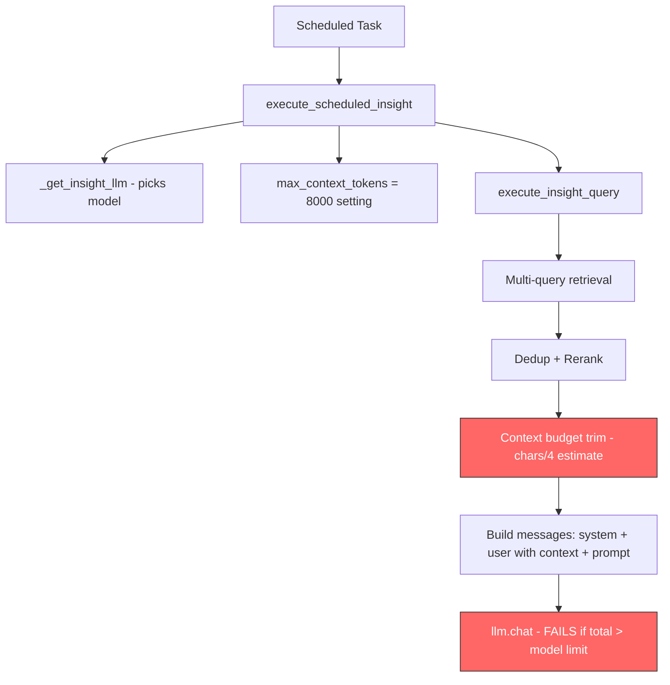

# Fix: Insight Execution Context Length Overflow

## Error
```
This model's maximum context length is 16385 tokens. However, your messages resulted in 20641 tokens.
```

## Root Cause Analysis

The insight pipeline in [`execute_insight_query()`](src/llamaindex_rag.py:4043) has a flawed token budgeting system that allows the total message to exceed the target model's context window.

### The Token Math Problem

The current logic at [line 4175](src/llamaindex_rag.py:4175):
```python
max_context_chars = max_context_tokens * 4  # ~4 chars per token
```

This is inaccurate for two reasons:

1. **Hebrew text tokenizes poorly**: Hebrew characters often require 2-3 tokens per character in OpenAI tokenizers, so 4 chars/token is a massive overestimate. The actual ratio for Hebrew is closer to 0.5-1.5 chars/token — meaning 8,000 "tokens" of budget actually produces 16,000-32,000 real tokens of context.

2. **Budget ignores non-context tokens**: The 8,000-token budget only accounts for retrieved context, but the full LLM message also includes:
   - **System prompt** (~400 tokens) — from [`_build_insight_system_prompt()`](src/tasks/scheduled.py:65)
   - **User message wrapper** (~250 tokens) — citation rules, format guide at [lines 4218-4234](src/llamaindex_rag.py:4218)
   - **User prompt text** (~200-600 tokens) — the template prompts like Daily Briefing are substantial
   - **Total overhead**: ~850-1,250 tokens before any context

3. **No model context window awareness**: The system uses `insight_max_context_tokens = 8000` regardless of whether the model is gpt-4o (128K context) or gpt-3.5-turbo (16K context). When `insight_llm_model` is set to gpt-3.5-turbo, or the main `openai_model` is gpt-3.5-turbo, the 8K context budget + overhead easily exceeds 16,385 tokens.

### Data Flow


## Fix Strategy

### Approach: Accurate Token Counting with Model-Aware Budgeting

Use `tiktoken` — already a dependency used in [`cost_callbacks.py`](src/cost_callbacks.py:69) — for accurate token counting, and make the context budget aware of the target model's context window.

### Changes Required

#### 1. Add model context window lookup — `src/llamaindex_rag.py`

Add a helper function that maps model names to their context window sizes:

```python
_MODEL_CONTEXT_WINDOWS = {
    "gpt-3.5-turbo": 16_385,
    "gpt-4": 8_192,
    "gpt-4-turbo": 128_000,
    "gpt-4o": 128_000,
    "gpt-4o-mini": 128_000,
    "gpt-4.1": 1_047_576,
    "gpt-4.1-mini": 1_047_576,
    "gpt-4.1-nano": 1_047_576,
    "o1": 200_000,
    "o1-mini": 128_000,
    "o3-mini": 200_000,
    "o4-mini": 200_000,
}

def _get_model_context_window(model_name: str) -> int:
    """Look up the context window for a model, with safe default."""
    # Try exact match first, then prefix match
    if model_name in _MODEL_CONTEXT_WINDOWS:
        return _MODEL_CONTEXT_WINDOWS[model_name]
    for prefix, limit in _MODEL_CONTEXT_WINDOWS.items():
        if model_name.startswith(prefix):
            return limit
    return 16_000  # Conservative default
```

#### 2. Add tiktoken-based token counter — `src/llamaindex_rag.py`

```python
def _count_tokens_tiktoken(text: str, model: str = "gpt-4o") -> int:
    """Count tokens accurately using tiktoken."""
    try:
        import tiktoken
        enc = tiktoken.encoding_for_model(model)
        return len(enc.encode(text))
    except Exception:
        # Fallback: conservative estimate especially for Hebrew
        return len(text)  # 1 token per char is safer than chars/4
```

#### 3. Rewrite context budget trimming in `execute_insight_query()` — lines 4174-4202

Replace the chars-based budget with accurate token counting:

1. **Before retrieval**: compute the token cost of system prompt + user message wrapper + user prompt
2. **Calculate remaining budget**: `model_context_window - overhead_tokens - safety_margin`
3. **Cap `max_context_tokens`** to the remaining budget if the setting exceeds it
4. **Trim context using tiktoken** instead of char counting
5. **Add safety margin** of ~500 tokens for tokenizer variance

The key change is in the **Step 4: Context budget trim** section:

```python
# Step 4: Context budget trim (model-aware, tiktoken-accurate)
model_name = getattr(llm, "model", "gpt-4o")
model_limit = _get_model_context_window(model_name)
safety_margin = 500

# Count overhead tokens accurately
overhead_text = system_prompt + user_message_template  # template without context
overhead_tokens = _count_tokens_tiktoken(overhead_text, model_name) + safety_margin

# Effective context budget = min(setting, what the model can handle)
effective_budget = min(max_context_tokens, model_limit - overhead_tokens)
effective_budget = max(effective_budget, 1000)  # floor to avoid empty context

# Trim using accurate token counting
total_tokens = 0
trimmed: List[NodeWithScore] = []
per_result_cap_tokens = int(effective_budget * 0.3)

for nws in merged:
    node_text = getattr(nws.node, "text", "") if nws.node else ""
    text_tokens = _count_tokens_tiktoken(node_text, model_name)
    
    if text_tokens > per_result_cap_tokens and nws.node:
        # Truncate long nodes
        ...  # similar truncation logic but token-aware
    
    if total_tokens + text_tokens > effective_budget and trimmed:
        break
    trimmed.append(nws)
    total_tokens += text_tokens
```

#### 4. Build user message template separately for overhead calculation

Split the user message construction so we can measure overhead *before* inserting context:

```python
# Compute overhead before building final message
user_message_prefix = (
    "Here are the relevant messages and documents...\n-----\n"
)
user_message_suffix = (
    "\n-----\n\nUNDERSTANDING THE RETRIEVED ITEMS:...\n\n"
    f"Now produce the insight:\n\n{prompt}"
)
overhead_tokens = _count_tokens_tiktoken(
    system_prompt + user_message_prefix + user_message_suffix, model_name
) + safety_margin
```

#### 5. Add context_length_exceeded retry as safety net — `src/tasks/scheduled.py`

In [`execute_scheduled_insight()`](src/tasks/scheduled.py:364), add `context_length_exceeded` to the transient error indicators so the task retries with a halved context budget:

```python
transient_indicators = [
    "ConnectionError", "Timeout", "rate_limit", "429", "503",
    "context_length_exceeded",  # Will succeed on retry with trimmed context
]
```

But more importantly, before the retry, store the reduced budget so the retry uses fewer tokens. Alternatively, catch the specific error in `execute_insight_query` itself and auto-trim.

### Files to Modify

| File | Change |
|------|--------|
| [`src/llamaindex_rag.py`](src/llamaindex_rag.py) | Add `_MODEL_CONTEXT_WINDOWS`, `_count_tokens_tiktoken()`, rewrite context budget trim in `execute_insight_query()` |
| [`src/tasks/scheduled.py`](src/tasks/scheduled.py) | Add `context_length_exceeded` to retry-able errors |

### No New Dependencies
- `tiktoken` is already used in [`cost_callbacks.py`](src/cost_callbacks.py:69)
- No schema/DB changes needed
- No settings changes needed — `insight_max_context_tokens` remains but is now capped by model limits

### Testing Considerations
- Test with a model set to gpt-3.5-turbo to verify the budget stays under 16K
- Test with Hebrew-heavy content to verify tiktoken accuracy
- Verify gpt-4o insights still get generous context since 128K allows it
