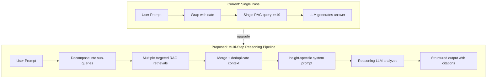
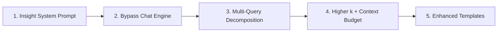

# Insights Quality Improvements — Architecture Plan

> **Goal**: Proactively improve the LLM output quality of Scheduled Insights before deployment  
> **Status**: Draft  
> **Date**: 2026-02-18

## 1. Current Architecture & Quality Gaps

After analyzing the full pipeline ([`execute_scheduled_insight()`](src/tasks/scheduled.py:121) → [`_build_insight_prompt()`](src/tasks/scheduled.py:26) → [`rag.create_chat_engine()`](src/llamaindex_rag.py:3244) → `chat_engine.chat()`), I identified **7 structural quality bottlenecks**:

### Gap 1: Shared System Prompt (High Impact)
The insight execution reuses the **same system prompt** as interactive chat ([`_build_system_prompt()`](src/llamaindex_rag.py:3040)). That prompt contains ~2000 tokens of irrelevant instructions:
- Contact disambiguation rules (asks clarifying questions — impossible in async insights)
- Calendar event creation markup
- Image display instructions  
- Follow-up conversation handling

These instructions **actively hurt** insight quality by wasting context tokens and confusing the LLM about its role.

### Gap 2: Single-Pass Retrieval (High Impact)
A "Daily Briefing" asks about meetings, commitments, deadlines, AND birthdays — but the RAG retrieves only **one set of k=10 documents** using a single semantic query. A query like "what should I know about today" is too vague to retrieve specific commitments or birthday mentions scattered across different conversations.

### Gap 3: Low Default k and Context Budget (Medium Impact)
- Default [`k=10`](src/tasks/scheduled.py:193) documents retrieved
- [`rag_max_context_tokens=3000`](src/settings_db.py:168) (~12K chars)

For analytical queries spanning 7-30 days of messages, 10 documents and 3000 tokens of context is far too little material for the LLM to produce meaningful analysis.

### Gap 4: No Reasoning / Chain-of-Thought (High Impact)
The LLM receives context + prompt and produces a direct answer in one shot. For complex analytical tasks like "find my commitments" or "who did I not talk to recently", structured reasoning would dramatically improve completeness and accuracy. Two approaches:
1. **Reasoning model**: Use o3-mini or similar with built-in chain-of-thought
2. **Prompt-based reasoning**: Add explicit thinking/analysis steps to the prompt

### Gap 5: Minimal Prompt Engineering (Medium Impact)
[`_build_insight_prompt()`](src/tasks/scheduled.py:26) only adds date context and a generic "be specific" instruction. There is:
- No structured output format guidance
- No step-by-step analysis framework
- No insight-type-specific instructions
- No quality checklist for the LLM to self-verify

### Gap 6: No Insight-Specific LLM Configuration (Medium Impact)
Insights use the same model and temperature as chat (gpt-4o at 0.3). For analytical tasks:
- A **reasoning model** (o3-mini) would produce deeper analysis
- **Lower temperature** (0.1) is better for factual extraction
- **Higher max tokens** may be needed for thorough analysis

### Gap 7: No Quality Feedback Loop (Low Impact - Phase 2)
No mechanism to rate result quality, track which insights produce actionable output, or auto-evaluate completeness.

---

## 2. Proposed Solutions

### Solution Architecture



---

### 2.1 Dedicated Insight System Prompt (Priority 1)

**What**: Create a separate system prompt optimized for analytical insight generation, used only by the insight executor.

**Where**: New function in [`src/tasks/scheduled.py`](src/tasks/scheduled.py) or a new `src/insight_prompts.py`

**Key differences from chat system prompt**:
- Role: "analytical intelligence assistant" not "conversational assistant"
- No disambiguation (can't ask follow-ups)
- No calendar/image instructions
- Strong emphasis on completeness, structure, and citations
- Output format guidance (sections, bullet points, priority levels)
- Self-verification checklist

```python
INSIGHT_SYSTEM_PROMPT = """You are an analytical intelligence assistant that produces 
comprehensive briefings from a personal knowledge base.

Current Date/Time: {current_datetime}
תאריך ושעה נוכחיים: {hebrew_date}

Your role:
1. ANALYZE all retrieved messages and documents thoroughly
2. EXTRACT every relevant piece of information — do not skip anything
3. ORGANIZE findings into clear, actionable sections
4. CITE specifics: exact dates, full names, direct quotes where helpful
5. PRIORITIZE: flag urgent/time-sensitive items first
6. Be EXHAUSTIVE rather than concise — list every relevant item found
7. Answer in the same language as the query

Quality checklist before responding:
- Did I address every aspect of the query?
- Did I cite specific people, dates, and messages?
- Did I miss any items in the retrieved context?
- Are my findings organized by priority/urgency?
- Would the user find this actionable?

If no relevant information is found, say so clearly and explain what 
types of messages were searched."""
```

### 2.2 Multi-Query Decomposition (Priority 1)

**What**: Automatically decompose complex insight prompts into multiple targeted sub-queries, execute each separately against the RAG, then merge the results.

**Where**: New logic in [`execute_scheduled_insight()`](src/tasks/scheduled.py:121)

**Why**: A "Daily Briefing" prompt asks about 4+ different things (meetings, commitments, deadlines, birthdays). A single semantic search for all of these retrieves a mediocre mix. Separate queries for each topic retrieve much better results.

**Two strategies** (configurable per-task):

#### Strategy A: LLM-Based Decomposition (recommended for custom prompts)
```python
def decompose_prompt(prompt: str) -> list[str]:
    """Use the LLM to decompose a complex prompt into targeted sub-queries."""
    decomposition_prompt = f"""Break down this insight query into 3-6 specific, 
    targeted search queries that a knowledge-base retriever can use.
    Each sub-query should focus on ONE specific aspect.
    
    Insight query: {prompt}
    
    Return as a JSON array of strings. Example:
    ["meetings or appointments scheduled for today",
     "promises or commitments I made to anyone recently",
     "upcoming deadlines mentioned in messages",
     "birthdays or special occasions this week"]"""
    
    # Use fast model (gpt-4o-mini) for decomposition
    sub_queries = llm.complete(decomposition_prompt)
    return json.loads(sub_queries)
```

#### Strategy B: Template-Based Decomposition (for built-in templates)
Each template defines its own sub-queries statically:
```python
INSIGHT_TEMPLATES = [
    {
        "name": "Daily Briefing",
        "sub_queries": [
            "meetings, appointments, or events scheduled for today or tomorrow",
            "promises or commitments I made to anyone in recent messages",
            "deadlines, tasks, or things I need to handle soon",
            "birthdays, anniversaries, or special occasions for people I know",
            "urgent or important unread conversations"
        ],
        ...
    }
]
```

**Execution flow**:
```python
# For each sub-query, retrieve k documents
all_contexts = []
for sub_query in sub_queries:
    results = rag.search(query=sub_query, k=k_per_query, **filters)
    all_contexts.extend(results)

# Deduplicate by node ID, keep highest score
merged = deduplicate_and_merge(all_contexts)

# Feed merged context to the LLM with the original prompt
```

### 2.3 Higher Retrieval Budget for Insights (Priority 1)

**What**: Use significantly larger k and context budgets for insights vs interactive chat.

**Where**: [`execute_scheduled_insight()`](src/tasks/scheduled.py:193) and new settings

**New settings**:
```python
# In settings_db DEFAULT_SETTINGS:
("insight_default_k", "20", "insights", "int", 
 "Number of documents per sub-query for insights (higher = more thorough)"),
("insight_max_context_tokens", "8000", "insights", "int",
 "Max context tokens for insight LLM calls (higher than chat default)"),
```

**Rationale**: Insights run async, so latency doesn't matter. We can afford to retrieve 20+ documents per sub-query (60-100 total after decomposition) and give the LLM 8000+ tokens of context. Cost increase is ~$0.005 per insight — negligible.

### 2.4 Reasoning Model Support (Priority 2)

**What**: Allow insights to use a reasoning model (o3-mini, o4-mini) instead of the chat model, with configurable model override per task or globally.

**Where**: New setting + changes in [`execute_scheduled_insight()`](src/tasks/scheduled.py:121)

**New settings**:
```python
("insight_llm_model", "", "insights", "text",
 "LLM model override for insights (empty = use main model). "
 "Recommended: o3-mini for analytical depth, gpt-4o-mini for cost savings"),
("insight_llm_temperature", "0.1", "insights", "float",
 "Temperature for insight LLM calls (lower = more factual)"),
```

**Implementation**: Create a separate LLM instance for insights if the model differs from the main model:

```python
def _get_insight_llm():
    """Get LLM configured for insight analysis."""
    insight_model = settings.get("insight_llm_model", "")
    if not insight_model:
        # Fall back to main model
        return Settings.llm
    
    temperature = float(settings.get("insight_llm_temperature", "0.1"))
    
    if insight_model.startswith("o3") or insight_model.startswith("o4"):
        # Reasoning models don't use temperature
        return LlamaIndexOpenAI(
            api_key=settings.openai_api_key,
            model=insight_model,
        )
    else:
        return LlamaIndexOpenAI(
            api_key=settings.openai_api_key,
            model=insight_model,
            temperature=temperature,
        )
```

**Why o3-mini**: OpenAI reasoning models perform internal chain-of-thought before answering. For tasks like "find all my commitments in the last 2 weeks", the model systematically scans each message and extracts matches — rather than producing a quick surface-level summary. Cost is comparable to gpt-4o for medium reasoning effort.

### 2.5 Enhanced Prompt Templates (Priority 2)

**What**: Upgrade the built-in templates with structured analysis frameworks, explicit sub-queries, and output format guidance.

**Where**: [`INSIGHT_TEMPLATES`](src/scheduled_tasks_db.py:850) in `scheduled_tasks_db.py`

**Example — Enhanced Daily Briefing**:
```python
{
    "name": "Daily Briefing",
    "icon": "☀️",
    "prompt": (
        "Produce a comprehensive daily briefing based on my messages and documents.\n\n"
        "ANALYZE each section thoroughly — list EVERY relevant item found:\n\n"
        "## 📅 Today's Schedule\n"
        "Meetings, appointments, events, calls — anything with a specific time.\n"
        "Include: what, when, with whom, any preparation needed.\n\n"
        "## ✅ Open Commitments\n"
        "Things I promised, agreed to, or said I would do.\n"
        "Include: what I committed to, who I told, when I said it, is it overdue?\n\n"
        "## ⏰ Upcoming Deadlines\n"
        "Tasks with deadlines, payment due dates, expiring documents.\n"
        "Include: what, when it's due, how urgent.\n\n"
        "## 🎂 People & Occasions\n"
        "Birthdays, anniversaries, special events for people I know.\n\n"
        "## 💬 Pending Conversations\n"
        "Messages I haven't responded to, conversations that need follow-up.\n\n"
        "For each item, cite: who mentioned it, when, in which chat.\n"
        "If a section has no relevant items, write 'Nothing found' — "
        "do NOT skip the section."
    ),
    "sub_queries": [
        "meetings appointments events calls scheduled for today or tomorrow",
        "promises commitments I said I would do agreed to follow up",
        "deadlines due dates tasks that need to be completed soon",
        "birthdays anniversaries celebrations special occasions upcoming",
        "unanswered messages conversations needing response or follow-up",
    ],
    "schedule_type": "daily",
    "schedule_value": "08:00",
    "filters": {"days": 30, "k": 20},
}
```

### 2.6 Bypass CondensePlusContextChatEngine for Insights (Priority 1)

**What**: Insights should NOT use [`CondensePlusContextChatEngine`](src/llamaindex_rag.py:3448) — they should use direct retrieval + LLM completion. The chat engine adds unnecessary overhead:
- **Condense step**: Rewrites the query assuming follow-up context — irrelevant for insights (no conversation history)
- **Chat memory**: Allocates Redis-backed memory — wasted for single-shot insight queries
- **System prompt bloat**: Injects the full chat system prompt with all its irrelevant instructions

**Proposed approach**: Create a new `execute_insight_query()` method on `LlamaIndexRAG` that does direct retrieval → LLM completion:

```python
def execute_insight_query(
    self,
    prompt: str,
    sub_queries: list[str] | None = None,
    system_prompt: str = "",
    filters: dict = {},
    k: int = 20,
    max_context_tokens: int = 8000,
) -> tuple[str, list]:
    """Execute an insight query with multi-query retrieval.
    
    Unlike create_chat_engine(), this does direct retrieval + completion
    without the overhead of conversation management.
    
    Returns:
        (answer_text, source_nodes)
    """
    # 1. Multi-query retrieval
    queries = sub_queries or [prompt]
    all_nodes = []
    for q in queries:
        nodes = self.search(query=q, k=k, **filters)
        all_nodes.extend(nodes)
    
    # 2. Rerank merged results
    # (Cohere rerank on the combined set)
    
    # 3. Deduplicate and budget-trim
    
    # 4. Format context
    context_str = "\n\n".join(node.text for node in merged_nodes)
    
    # 5. Direct LLM completion
    llm = _get_insight_llm()
    messages = [
        ChatMessage(role="system", content=system_prompt),
        ChatMessage(role="user", content=f"Context:\n{context_str}\n\n{prompt}"),
    ]
    response = llm.chat(messages)
    return str(response), merged_nodes
```

### 2.7 Result Quality Indicators (Priority 3 — Future)

**What**: Add lightweight quality signals to insight results:
- **Source coverage**: How many unique chats/sources contributed to the answer?
- **Retrieval confidence**: Average similarity score of retrieved context
- **Answer completeness**: Did the LLM address all sections in the prompt?
- **User feedback**: Thumbs up/down on results in the UI

**Where**: Store in `task_results.metadata` JSON field (new column) and display in the UI result viewer.

---

## 3. Implementation Plan

### Phase 1: Core Quality (Critical Path)



| # | Task | File Changes |
|---|------|-------------|
| 1 | Create dedicated insight system prompt | `src/tasks/scheduled.py` — new `_build_insight_system_prompt()` |
| 2 | Create direct insight execution method bypassing CondensePlusContextChatEngine | `src/llamaindex_rag.py` — new `execute_insight_query()` method |
| 3 | Implement multi-query decomposition with template-based sub-queries | `src/tasks/scheduled.py` — update `execute_scheduled_insight()` |
| 4 | Add insight-specific settings for k, context tokens | `src/settings_db.py` — new default settings |
| 5 | Upgrade built-in templates with structured prompts + sub-queries | `src/scheduled_tasks_db.py` — update `INSIGHT_TEMPLATES` |
| 6 | Wire up the new pipeline in the task executor | `src/tasks/scheduled.py` — refactor `execute_scheduled_insight()` |

### Phase 2: Model & Reasoning

| # | Task | File Changes |
|---|------|-------------|
| 7 | Add insight LLM model override setting | `src/settings_db.py`, `src/tasks/scheduled.py` |
| 8 | Implement reasoning model support with fallback | `src/tasks/scheduled.py` or `src/llamaindex_rag.py` |
| 9 | Add UI field for per-task model override | `ui-reflex/...insights_page.py`, `state.py`, `api_client.py` |

### Phase 3: Polish & Feedback

| # | Task | File Changes |
|---|------|-------------|
| 10 | Add source coverage metrics to results | `src/tasks/scheduled.py` |
| 11 | Display quality indicators in result viewer UI | `ui-reflex/...insights_page.py` |
| 12 | Add thumbs up/down feedback mechanism | `scheduled_tasks_db.py`, UI, API |

---

## 4. Cost Impact

| Component | Current | Proposed | Delta |
|---|---|---|---|
| Retrieval (per insight) | 1 query, k=10 | 5 sub-queries, k=20 each | +4 embedding calls (~$0.00002) |
| Reranking (per insight) | 1 rerank of 10 docs | 1 rerank of ~60 merged docs | +~$0.001 |
| LLM (per insight) | ~3K context tokens | ~8K context tokens | +~$0.003 |
| Decomposition (per insight) | N/A | 1 fast LLM call (gpt-4o-mini) | +~$0.0005 |
| **Total per insight** | **~$0.005** | **~$0.01** | **+$0.005** |
| **Monthly (3 daily tasks)** | **~$0.45** | **~$0.90** | **+$0.45** |

The quality improvement far outweighs the cost increase. Using o3-mini would add ~$0.005-0.01 per insight.

---

## 5. Key Design Decisions

### Why bypass CondensePlusContextChatEngine?
The chat engine is designed for multi-turn conversations with memory. Insights are single-shot analytical queries. The condense step wastes an LLM call rewriting a query that has no history, and the system prompt is polluted with irrelevant chat instructions.

### Why multi-query over single query?
Semantic search with a broad query like "what should I know about today" produces mediocre results because it tries to find documents similar to a vague concept. Targeted queries like "meetings scheduled for today" have much higher retrieval precision.

### Why template-based sub-queries over LLM decomposition?
For built-in templates, predefined sub-queries are faster (no extra LLM call), cheaper, and deterministic. LLM decomposition is reserved for custom user prompts where we can't predict the query structure.

### Why a separate insight LLM model setting?
Reasoning models (o3-mini) excel at analytical tasks but are overkill for simple chat Q&A. Letting the user configure a different model for insights means they can use gpt-4o for chat speed and o3-mini for insight depth — optimizing both cost and quality.
