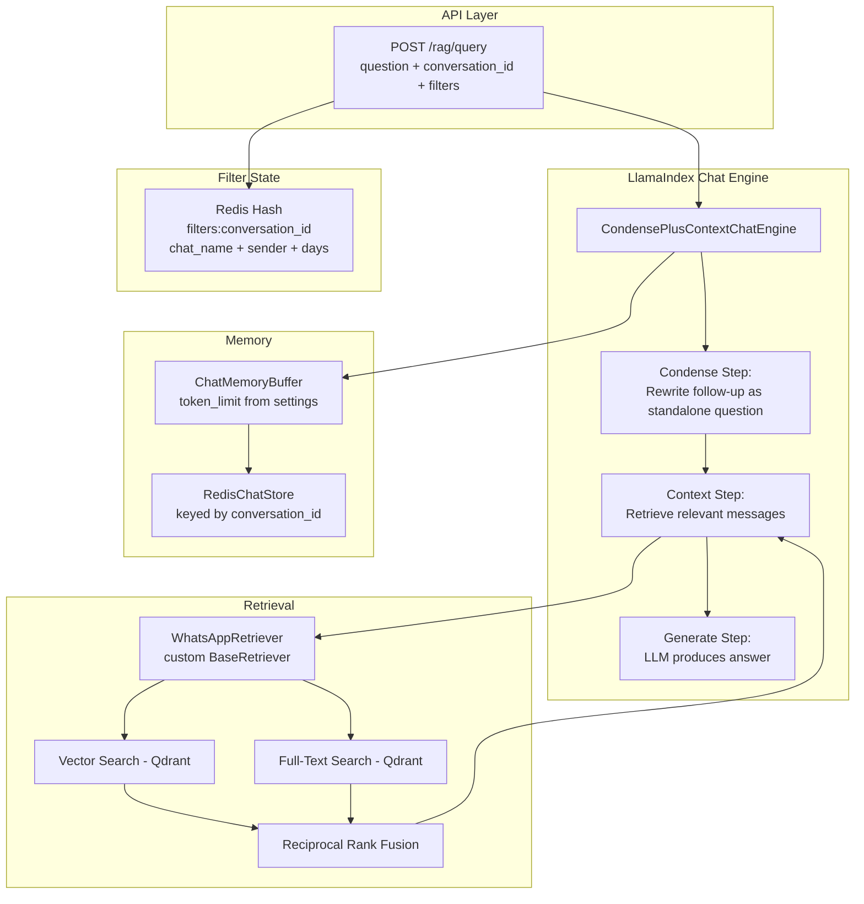

# Migration: Custom Sessions → LlamaIndex Chat Engine

## Summary

Replace the custom `src/session/` module and manual prompt construction in [`llamaindex_rag.py`](src/llamaindex_rag.py) with LlamaIndex's built-in **`CondensePlusContextChatEngine`** + **`ChatMemoryBuffer`** + **`RedisChatStore`**.

This eliminates ~800 lines of custom session code while gaining battle-tested conversation management, automatic query reformulation, and proper chat memory with token limits.

---

## What Gets Removed

| File | Lines | What It Does | Replaced By |
|------|-------|-------------|-------------|
| `src/session/models.py` | ~495 | ConversationSession, ConversationTurn, EntityInfo, Reference, Fact | `ChatMemoryBuffer` + `RedisChatStore` |
| `src/session/manager.py` | ~376 | SessionManager with Redis persistence, entity tracking, history management | `RedisChatStore` + simple Redis hash for filters |
| `src/session/__init__.py` | ~27 | Module exports | Removed |
| `src/app.py` session endpoints | ~200 | /session/create, /session/{id}, /session/{id}/context, /session/{id}/clear, /session/stats | Simplified - session is just a conversation_id |
| Manual prompt in `llamaindex_rag.py` `query()` | ~100 | Manual prompt construction with history stitching | `CondensePlusContextChatEngine` handles this |

**Total removed: ~1,200 lines of custom code**

---

## What Gets Added

### New Dependency

```
llama-index-storage-chat-store-redis>=0.2.0
```

### Architecture



---

## Detailed Component Design

### 1. RedisChatStore - Conversation Persistence

LlamaIndex's `RedisChatStore` stores chat messages in Redis, keyed by conversation ID.

```python
from llama_index.storage.chat_store.redis import RedisChatStore

chat_store = RedisChatStore(
    redis_url=f"redis://{settings.redis_host}:{settings.redis_port}",
    ttl=int(settings.session_ttl_minutes) * 60  # auto-expire
)
```

**What it handles automatically:**
- Serialization/deserialization of `ChatMessage` objects
- TTL-based expiration (replaces our custom `is_expired` logic)
- Multiple conversations keyed by ID

### 2. ChatMemoryBuffer - Token-Limited Memory

Wraps the chat store with a token limit to prevent context overflow.

```python
from llama_index.core.memory import ChatMemoryBuffer

memory = ChatMemoryBuffer.from_defaults(
    chat_store=chat_store,
    chat_store_key=conversation_id,
    token_limit=int(settings.session_max_history) * 200  # ~200 tokens per turn
)
```

**What it handles automatically:**
- Trimming old messages when token limit is exceeded
- Proper role-based message formatting (user/assistant)
- Message retrieval for chat engine

### 3. WhatsAppRetriever - Custom Retriever

A custom `BaseRetriever` that wraps the existing hybrid search logic. This preserves all the current search capabilities - vector search, full-text search, RRF fusion, metadata filtering.

```python
from llama_index.core.retrievers import BaseRetriever

class WhatsAppRetriever(BaseRetriever):
    """Custom retriever that wraps existing hybrid search with metadata filters."""
    
    def __init__(
        self,
        rag: LlamaIndexRAG,
        k: int = 10,
        filter_chat_name: Optional[str] = None,
        filter_sender: Optional[str] = None,
        filter_days: Optional[int] = None
    ):
        super().__init__()
        self._rag = rag
        self._k = k
        self._filter_chat_name = filter_chat_name
        self._filter_sender = filter_sender
        self._filter_days = filter_days
    
    def _retrieve(self, query_bundle) -> List[NodeWithScore]:
        """Delegates to existing search() which handles hybrid search + RRF."""
        return self._rag.search(
            query=query_bundle.query_str,
            k=self._k,
            filter_chat_name=self._filter_chat_name,
            filter_sender=self._filter_sender,
            filter_days=self._filter_days
        )
```

**Key point:** This reuses all existing search logic untouched - vector search, full-text search, RRF fusion, score thresholds, text index creation, etc.

### 4. CondensePlusContextChatEngine - The Core

This is the main change. Instead of manually constructing prompts, we let LlamaIndex handle the conversation flow.

```python
from llama_index.core.chat_engine import CondensePlusContextChatEngine

chat_engine = CondensePlusContextChatEngine.from_defaults(
    retriever=whatsapp_retriever,
    memory=memory,
    llm=Settings.llm,
    system_prompt=SYSTEM_PROMPT,
    verbose=True  # for debugging
)

# Single call replaces: reformulation + retrieval + prompt building + LLM call
response = chat_engine.chat(question)
```

**What `CondensePlusContextChatEngine` does on each `.chat()` call:**

1. **Condense**: Takes the new question + chat history → asks LLM to rewrite as a standalone question
   - "what about her?" + history mentioning Sarah → "What did Sarah say in Family Group?"
   - This replaces our custom entity tracking + reference resolution
2. **Retrieve**: Uses the standalone question with our `WhatsAppRetriever`
   - Full hybrid search with metadata filters
3. **Generate**: Passes retrieved context + full chat history to LLM
   - Uses our system prompt for formatting instructions
4. **Store**: Saves the turn (user message + assistant response) in `ChatMemoryBuffer`
   - Automatically persisted to Redis via `RedisChatStore`

### 5. Filter State - Simple Redis Hash

Metadata filters (chat_name, sender, days) are app-specific and not part of chat history. Store them as a simple Redis hash.

```python
# Key: "filters:{conversation_id}"
# Value: {"chat_name": "Family Group", "sender": "John", "days": "7"}
# TTL: same as session TTL

def get_filters(conversation_id: str) -> dict:
    key = f"filters:{conversation_id}"
    return redis_client.hgetall(key) or {}

def set_filters(conversation_id: str, filters: dict):
    key = f"filters:{conversation_id}"
    redis_client.hset(key, mapping=filters)
    redis_client.expire(key, int(settings.session_ttl_minutes) * 60)
```

---

## System Prompt

The system prompt moves from being inline in `query()` to a configurable constant:

```python
SYSTEM_PROMPT = """You are a helpful AI assistant for a WhatsApp message archive search system.
You have access to retrieved messages from the archive.

Current Date/Time: {current_datetime}

Instructions:
1. ANALYZE the retrieved messages to find information relevant to the question.
2. CITE specific messages when possible - mention who said what and when.
3. If multiple messages are relevant, SYNTHESIZE them into a coherent answer.
4. If the retrieved messages don't contain enough information, say so clearly - do NOT fabricate.
5. If the question is general, answer directly without referencing the archive.
6. Answer in the SAME LANGUAGE as the question.
7. Be concise but thorough. Prefer specific facts over vague summaries."""
```

The `{current_datetime}` is injected at chat engine creation time.

---

## Modified `/rag/query` Endpoint

The endpoint becomes much simpler:

```python
@app.route("/rag/query", methods=["POST"])
def rag_query():
    data = request.json or {}
    question = data.get("question")
    conversation_id = data.get("conversation_id")  # renamed from session_id
    
    if not question:
        return jsonify({"error": "Missing question"}), 400
    
    # Generate conversation_id if not provided
    if not conversation_id:
        conversation_id = str(uuid.uuid4())
    
    # Get/set filters
    filters = get_filters(conversation_id)
    if data.get("filter_chat_name"):
        filters["chat_name"] = data["filter_chat_name"]
    if data.get("filter_sender"):
        filters["sender"] = data["filter_sender"]
    if data.get("filter_days"):
        filters["days"] = str(data["filter_days"])
    set_filters(conversation_id, filters)
    
    # Create chat engine with current filters and memory
    chat_engine = rag.create_chat_engine(
        conversation_id=conversation_id,
        filter_chat_name=filters.get("chat_name"),
        filter_sender=filters.get("sender"),
        filter_days=int(filters["days"]) if filters.get("days") else None
    )
    
    # Single call handles: condense → retrieve → generate → store
    response = chat_engine.chat(question)
    
    return jsonify({
        "answer": str(response),
        "question": question,
        "conversation_id": conversation_id,
        "filters": filters,
        "stats": rag.get_stats()
    }), 200
```

### Removed Endpoints

| Endpoint | Why Removed |
|----------|-------------|
| `POST /session/create` | No longer needed - conversation_id is auto-generated on first query |
| `GET /session/{id}` | Chat history is in RedisChatStore, no custom state to inspect |
| `DELETE /session/{id}` | Can add a simple DELETE /rag/conversation/{id} if needed |
| `PUT /session/{id}/context` | Filters are set via /rag/query request params |
| `POST /session/{id}/clear` | Can add a simple reset endpoint if needed |
| `GET /session/stats` | Minimal value - can be added back simply |

### Kept/Simplified Endpoints

| Endpoint | Change |
|----------|--------|
| `POST /rag/query` | Simplified to use chat engine |
| `POST /rag/search` | Unchanged - still uses search() directly |
| `GET /rag/stats` | Unchanged |
| `GET /rag/chats` | Unchanged |
| `GET /rag/senders` | Unchanged |

---

## New Method in LlamaIndexRAG

```python
class LlamaIndexRAG:
    # ... existing code ...
    
    _chat_store = None  # Singleton RedisChatStore
    
    @property
    def chat_store(self) -> RedisChatStore:
        """Get or create the Redis-backed chat store."""
        if LlamaIndexRAG._chat_store is None:
            LlamaIndexRAG._chat_store = RedisChatStore(
                redis_url=f"redis://{settings.redis_host}:{settings.redis_port}",
                ttl=int(settings.session_ttl_minutes) * 60
            )
        return LlamaIndexRAG._chat_store
    
    def create_chat_engine(
        self,
        conversation_id: str,
        filter_chat_name: Optional[str] = None,
        filter_sender: Optional[str] = None,
        filter_days: Optional[int] = None,
        k: int = 10
    ) -> CondensePlusContextChatEngine:
        """Create a chat engine with memory and filters for a conversation."""
        self._ensure_llm_configured()
        
        # Memory backed by Redis
        memory = ChatMemoryBuffer.from_defaults(
            chat_store=self.chat_store,
            chat_store_key=conversation_id,
            token_limit=3000
        )
        
        # Custom retriever with filters
        retriever = WhatsAppRetriever(
            rag=self,
            k=k,
            filter_chat_name=filter_chat_name,
            filter_sender=filter_sender,
            filter_days=filter_days
        )
        
        # Build system prompt with current datetime
        system_prompt = self._build_system_prompt()
        
        return CondensePlusContextChatEngine.from_defaults(
            retriever=retriever,
            memory=memory,
            llm=Settings.llm,
            system_prompt=system_prompt
        )
```

---

## Migration Sequence

### Step 1: Add Dependency
Add `llama-index-storage-chat-store-redis` to `requirements.txt`.

### Step 2: Create WhatsAppRetriever
Add the custom retriever class to `src/llamaindex_rag.py` above the `LlamaIndexRAG` class. This wraps existing `search()` without changing it.

### Step 3: Add `create_chat_engine()` to LlamaIndexRAG
Add the `chat_store` property and `create_chat_engine()` method. Keep all existing methods (search, add_message, etc.) untouched.

### Step 4: Remove manual `query()` method
The `query()` method in `LlamaIndexRAG` is replaced by `create_chat_engine().chat()`. We can keep `query()` as a simple wrapper for backward compatibility if needed for the `/rag/query` endpoint.

### Step 5: Simplify `app.py`
- Remove session imports and session_manager initialization
- Remove all `/session/*` endpoints
- Simplify `/rag/query` to use chat engine
- Add simple filter state helpers using Redis hash

### Step 6: Delete `src/session/`
Remove the entire directory.

### Step 7: Update imports and references
- Remove session imports from `app.py`
- Update any references in plans/docs

---

## Before/After Comparison

### Before: Custom Session Query Flow
```
1. Get/create ConversationSession from Redis           (SessionManager)
2. Extract entities from question                       (SessionManager)
3. Get conversation history from session                (ConversationSession)
4. Call rag.query() which:                             (LlamaIndexRAG.query)
   a. search() for hybrid retrieval                     
   b. Token-count and truncate context manually         
   c. Build prompt string with history manually         
   d. Settings.llm.complete(prompt)                     
5. Add turn to session                                  (SessionManager)
6. Save session to Redis                                (SessionManager)
```

### After: LlamaIndex Chat Engine Flow
```
1. Get filters from Redis hash                          (simple Redis hgetall)
2. rag.create_chat_engine(conversation_id, filters)     (LlamaIndexRAG)
3. chat_engine.chat(question) which automatically:      (CondensePlusContextChatEngine)
   a. Loads chat history from RedisChatStore            
   b. Condenses follow-up question + history            
   c. Retrieves via WhatsAppRetriever.search()          
   d. Generates answer with context + history           
   e. Saves turn to RedisChatStore                      
```

**Reduction: 6 steps with custom code → 3 steps using LlamaIndex built-ins**

---

## Risk Mitigation

| Risk | Mitigation |
|------|-----------|
| RedisChatStore package not compatible with our Redis version | Test locally first; package uses standard Redis commands |
| CondensePlusContextChatEngine condense prompt not ideal for our use case | The condense prompt is customizable via `condense_prompt` parameter |
| System prompt format different from current | Customize `context_prompt` parameter to match current formatting |
| Loss of entity tracking feature | The condense step naturally handles entity resolution via LLM; if more is needed, add entity extraction as a post-processing step |
| Filter state not persisted | Simple Redis hash with TTL handles this |

---

## Files Changed Summary

| Action | File |
|--------|------|
| DELETE | `src/session/__init__.py` |
| DELETE | `src/session/models.py` |
| DELETE | `src/session/manager.py` |
| MODIFY | `src/llamaindex_rag.py` - add WhatsAppRetriever, create_chat_engine(), chat_store property |
| MODIFY | `src/app.py` - remove session endpoints, simplify /rag/query |
| MODIFY | `requirements.txt` - add llama-index-storage-chat-store-redis |
| MODIFY | `plans/context-and-reasoning-architecture.md` - update to reflect new approach |
