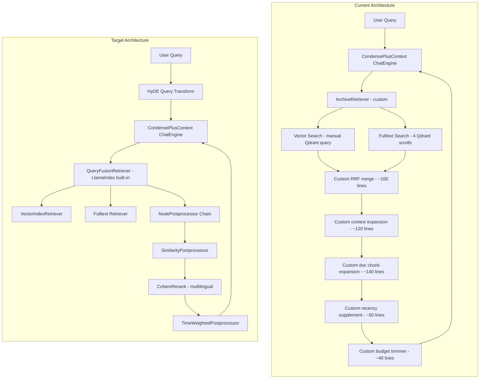

# LlamaIndex Features Upgrade Plan

## Overview

Upgrade Lucy's RAG pipeline to leverage modern LlamaIndex features, replacing ~800+ lines of custom code with battle-tested library components while adding significant new capabilities — especially for Hebrew multilingual retrieval quality.

## Architecture: Current vs Target



## Phase 1: Ingestion Pipeline + Embedding Cache

### What Changes

Replace the manual ingestion code across all sync files with a LlamaIndex `IngestionPipeline` that provides:
- **Embedding cache**: Skip re-embedding unchanged content during re-syncs
- **Deduplication**: Built-in node dedup replaces custom `_message_exists()` pattern
- **Composable transforms**: Sanitization → chunking → embedding as a declarative pipeline

### Files Modified

| File | Change |
|------|--------|
| [`src/llamaindex_rag.py`](src/llamaindex_rag.py) | Add `create_ingestion_pipeline()` method, Redis-backed embedding cache |
| [`src/plugins/paperless/sync.py`](src/plugins/paperless/sync.py) | Use pipeline instead of manual `add_node()`/`add_nodes()` loop |
| [`src/plugins/gmail/sync.py`](src/plugins/gmail/sync.py) | Use pipeline instead of manual chunk loop |
| [`requirements.txt`](requirements.txt) | Add `llama-index-storage-kvstore-redis` for cache backend |

### Implementation Details

1. Create a shared `IngestionPipeline` factory in [`LlamaIndexRAG`](src/llamaindex_rag.py:412):
   ```python
   def create_ingestion_pipeline(self) -> IngestionPipeline:
       from llama_index.core.ingestion import IngestionPipeline, IngestionCache
       from llama_index.storage.kvstore.redis import RedisKVStore
       
       redis_kvstore = RedisKVStore(redis_uri=f"redis://{settings.redis_host}:{settings.redis_port}")
       
       return IngestionPipeline(
           transformations=[
               Settings.embed_model,
           ],
           vector_store=self.vector_store,
           cache=IngestionCache(cache=redis_kvstore),
       )
   ```

2. Sync files call `pipeline.run(nodes=chunk_nodes)` instead of `rag.add_nodes(chunk_nodes)`

3. The pipeline caches embeddings by content hash — if a Paperless document hasn't changed, its chunks won't be re-embedded

### Settings Added

| Key | Default | Description |
|-----|---------|-------------|
| `rag_embedding_cache_enabled` | `true` | Enable Redis-backed embedding cache |

---

## Phase 2: CohereRerank for Multilingual Retrieval

### What Changes

Add a Cohere cross-encoder reranking step after retrieval. Cohere's `rerank-multilingual-v3.0` model explicitly supports Hebrew and dramatically improves retrieval precision by re-scoring results with a more powerful model than cosine similarity.

### Files Modified

| File | Change |
|------|--------|
| [`src/llamaindex_rag.py`](src/llamaindex_rag.py) | Add reranker to retrieval pipeline in [`ArchiveRetriever._retrieve()`](src/llamaindex_rag.py:243) |
| [`requirements.txt`](requirements.txt) | Add `llama-index-postprocessor-cohere-rerank` |
| [`src/settings_db.py`](src/settings_db.py) | Add `cohere_api_key` and `rag_rerank_enabled` settings |

### Implementation Details

1. After RRF merge in [`_retrieve()`](src/llamaindex_rag.py:243), apply Cohere rerank:
   ```python
   if settings.get("rag_rerank_enabled", "false").lower() == "true":
       from llama_index.postprocessor.cohere_rerank import CohereRerank
       reranker = CohereRerank(
           api_key=settings.cohere_api_key,
           top_n=self._k,
           model="rerank-multilingual-v3.0",
       )
       results = reranker.postprocess_nodes(results, query_bundle)
   ```

2. The reranker replaces much of the need for the custom fulltext search scoring heuristics — it natively understands Hebrew morphology and cross-lingual semantics.

### Settings Added

| Key | Default | Description |
|-----|---------|-------------|
| `cohere_api_key` | `""` | Cohere API key for reranking |
| `rag_rerank_enabled` | `false` | Enable Cohere multilingual reranking |
| `rag_rerank_top_n` | `10` | Number of results after reranking |
| `rag_rerank_model` | `rerank-multilingual-v3.0` | Cohere rerank model |

### Cost

~$0.001 per 1000 search units (very cheap). A typical query with 20 candidate results = $0.00002.

---

## Phase 3: HyDE Query Transform for Hebrew

### What Changes

Add Hypothetical Document Embedding (HyDE) as an optional query transformation. Instead of embedding the raw query "בת כמה מיה?", the LLM first generates a hypothetical answer ("מיה נולדה ב-2019 והיא בת 6"), and that answer's embedding is used for retrieval. This dramatically improves recall for short Hebrew queries.

### Files Modified

| File | Change |
|------|--------|
| [`src/llamaindex_rag.py`](src/llamaindex_rag.py) | Add HyDE transform option in [`search()`](src/llamaindex_rag.py:2288) |
| [`src/settings_db.py`](src/settings_db.py) | Add `rag_hyde_enabled` setting |

### Implementation Details

1. In [`search()`](src/llamaindex_rag.py:2288), before computing the query embedding:
   ```python
   if settings.get("rag_hyde_enabled", "false").lower() == "true":
       from llama_index.core.indices.query.query_transform import HyDEQueryTransform
       hyde = HyDEQueryTransform(llm=Settings.llm, include_original=True)
       query_bundle = hyde.run(query)
       query_embedding = query_bundle.embedding
   else:
       query_embedding = Settings.embed_model.get_query_embedding(query)
   ```

2. The condense step already rewrites follow-up queries. HyDE adds a second transformation for the first query or after condensing — it generates a hypothetical answer that embeds much better than a short question.

### Settings Added

| Key | Default | Description |
|-----|---------|-------------|
| `rag_hyde_enabled` | `false` | Enable HyDE query transformation |

### Cost

One additional LLM call per query (same cost as the condense step — ~$0.002-0.01 depending on model). Can be toggled off for cost-sensitive deployments.

---

## Phase 4: QueryFusionRetriever (Replace Custom RRF)

### What Changes

Replace the custom [`_reciprocal_rank_fusion()`](src/llamaindex_rag.py:1788), [`_fulltext_search()`](src/llamaindex_rag.py:1662), and [`search()`](src/llamaindex_rag.py:2288) merge logic (~500 lines) with LlamaIndex's `QueryFusionRetriever`. This also adds **automatic query generation** — the retriever generates multiple query variants from the user's question to improve recall.

### Files Modified

| File | Change |
|------|--------|
| [`src/llamaindex_rag.py`](src/llamaindex_rag.py) | Create `FulltextRetriever` wrapper, replace `search()` with `QueryFusionRetriever` |

### Implementation Details

1. Create a `FulltextRetriever(BaseRetriever)` that wraps the existing `_fulltext_search()` logic
2. Create a `VectorRetriever(BaseRetriever)` that wraps the existing vector search
3. Compose them with `QueryFusionRetriever`:
   ```python
   from llama_index.core.retrievers import QueryFusionRetriever
   
   fusion = QueryFusionRetriever(
       retrievers=[vector_retriever, fulltext_retriever],
       similarity_top_k=k,
       num_queries=3,  # Generate 3 query variants
       mode="reciprocal_rerank",
   )
   ```

4. The multi-query generation is especially valuable for Hebrew — it creates paraphrased queries that may match different morphological forms stored in the index.

### Lines Removed

- [`_reciprocal_rank_fusion()`](src/llamaindex_rag.py:1788): ~50 lines
- RRF merge logic in [`search()`](src/llamaindex_rag.py:2288): ~30 lines
- Score threshold filtering: ~15 lines
- Total: ~95 lines replaced by ~20 lines of configuration

---

## Phase 5: NodePostprocessor Chain (Replace Custom Expansion/Trimming)

### What Changes

Replace the imperative post-processing in [`_retrieve()`](src/llamaindex_rag.py:243) with a composable `NodePostprocessor` chain:
- `SimilarityPostprocessor` → replaces manual `MINIMUM_SIMILARITY_SCORE` filter
- `TimeWeightedPostprocessor` → replaces custom recency supplement
- Context budget management → replaces manual trimming loop

### Files Modified

| File | Change |
|------|--------|
| [`src/llamaindex_rag.py`](src/llamaindex_rag.py) | Refactor [`ArchiveRetriever._retrieve()`](src/llamaindex_rag.py:243) to use postprocessor chain |

### Implementation Details

```python
from llama_index.core.postprocessor import SimilarityPostprocessor

postprocessors = [
    SimilarityPostprocessor(similarity_cutoff=float(settings.rag_min_score)),
]

# Apply in sequence
for pp in postprocessors:
    results = pp.postprocess_nodes(results, query_bundle)
```

### Lines Removed

- Manual score threshold filtering: ~10 lines
- Manual context budget trimming: ~40 lines
- Total: ~50 lines replaced by ~15 lines of postprocessor setup

---

## Phase 6: IngestionPipeline Entity Extraction (Optional)

### What Changes

Integrate entity extraction into the LlamaIndex ingestion pipeline as a custom `TransformComponent`, replacing the standalone [`entity_extractor.py`](src/entity_extractor.py) module.

### Implementation Details

```python
from llama_index.core.ingestion import TransformComponent

class EntityExtractionTransform(TransformComponent):
    def __call__(self, nodes, **kwargs):
        for node in nodes:
            # Extract entities from node text
            # Store facts in entity_db
            pass
        return nodes  # Pass through unchanged

pipeline = IngestionPipeline(
    transformations=[
        splitter,
        EntityExtractionTransform(),
        embed_model,
    ],
)
```

This is **optional** because the current extraction works well — the main benefit is co-location of all ingestion logic in one pipeline.

---

## Implementation Order & Dependencies

```mermaid
gantt
    title Implementation Phases
    dateFormat X
    axisFormat %s
    section Phase 1
    IngestionPipeline + Cache    :p1, 0, 3
    section Phase 2
    CohereRerank                 :p2, after p1, 2
    section Phase 3
    HyDE Query Transform         :p3, after p1, 2
    section Phase 4
    QueryFusionRetriever         :p4, after p2, 3
    section Phase 5
    NodePostprocessor Chain      :p5, after p4, 2
    section Phase 6
    Pipeline Entity Extraction   :p6, after p5, 2
```



**Phases 2 and 3 are independent** — they can be implemented in either order. Phase 4 builds on Phase 2. Phase 5 builds on Phase 4.

---

## New Dependencies

```
# Add to requirements.txt
llama-index-postprocessor-cohere-rerank>=0.2.0
llama-index-storage-kvstore-redis>=0.2.0
```

---

## Risk Mitigation

| Risk | Mitigation |
|------|------------|
| Breaking existing retrieval quality | Each phase is behind a settings toggle (e.g., `rag_rerank_enabled`). Default OFF until validated. |
| Cohere API dependency | Reranking is optional. Falls back to current RRF pipeline when disabled. |
| LlamaIndex API changes | Pin specific versions in requirements.txt |
| Ingestion pipeline changes data format | Pipeline produces the same TextNode format — Qdrant schema unchanged |
| HyDE adds latency | Behind toggle, OFF by default. Only enable when quality > speed |

---

## Settings Summary

All new features are **opt-in** via settings toggles:

| Setting | Default | Phase | Description |
|---------|---------|-------|-------------|
| `rag_embedding_cache_enabled` | `true` | 1 | Redis-backed embedding cache |
| `cohere_api_key` | `""` | 2 | Cohere API key |
| `rag_rerank_enabled` | `false` | 2 | Enable Cohere reranking |
| `rag_rerank_top_n` | `10` | 2 | Rerank result count |
| `rag_rerank_model` | `rerank-multilingual-v3.0` | 2 | Rerank model |
| `rag_hyde_enabled` | `false` | 3 | Enable HyDE query transform |

---

## Estimated Impact

| Metric | Before | After |
|--------|--------|-------|
| Custom retrieval code | ~800 lines | ~300 lines |
| Hebrew query recall | Good (regex heuristics) | Excellent (HyDE + Cohere rerank) |
| Re-sync embedding cost | Full re-embed | Only changed docs (cache) |
| Retrieval latency | 4 Qdrant scrolls + 1 vector search | Same + optional rerank (~100ms) |
| Multi-query retrieval | Single query | 3 query variants (QueryFusion) |
