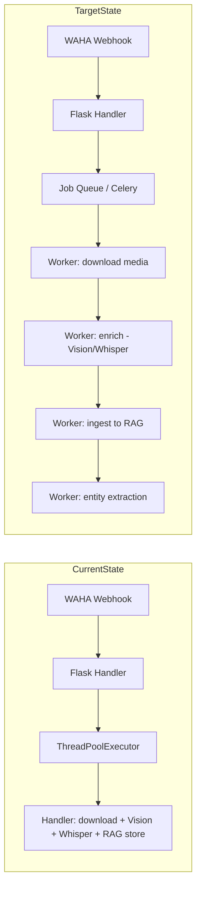
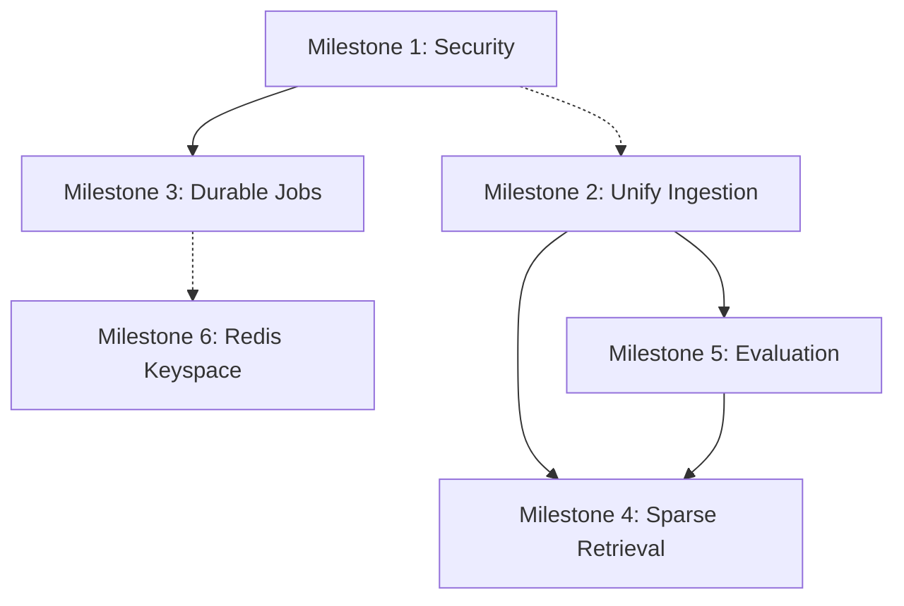

# Optimization & Modernization Implementation Plan

## Audit Summary

Based on the external report and code-level validation, here are the confirmed findings with **corrections and additions** from the codebase audit.

### Confirmed Claims

| Finding | Status | Evidence |
|---|---|---|
| Conversation chunk bypass | ✅ Confirmed | [`_flush_chunk_buffer()`](src/llamaindex_rag.py:1311) uses `self.index.insert_nodes()` — skips embedding cache + sparse vectors |
| `add_node()` bypass | ✅ Confirmed (report missed this) | [`add_node()`](src/llamaindex_rag.py:1455) uses `self.index.insert_nodes()` |
| `add_document()` bypass | ✅ Confirmed (report missed this) | [`add_document()`](src/llamaindex_rag.py:1517) uses `self.index.insert_nodes()` |
| Secret endpoints unprotected | ✅ Confirmed | [`/config/secret/<key>`](src/app.py:838) returns raw secrets, no auth |
| Config unmask unprotected | ✅ Confirmed | [`/config?unmask=true`](src/app.py:826) returns all secrets unmasked |
| Config mutation unprotected | ✅ Confirmed | [`PUT /config`](src/app.py:855), [`POST /config/reset`](src/app.py:910), [`POST /config/import`](src/app.py:944) |
| RAG destructive ops unprotected | ✅ Confirmed | [`POST /rag/reset`](src/app.py:539), [`POST /rag/delete-by-source`](src/app.py:566) |
| Config export leaks secrets | ✅ Confirmed | [`/config/export`](src/app.py:930) exports unmasked secrets |
| ThreadPoolExecutor in WhatsApp | ✅ Confirmed | [`WhatsAppPlugin.initialize()`](src/plugins/whatsapp/plugin.py:103) creates 4-worker pool |
| ThreadPoolExecutor in Call Recordings | ✅ Confirmed | [`CallRecordingSyncer`](src/plugins/call_recordings/sync.py:27) imports ThreadPoolExecutor |
| Custom BM25 sparse vectors | ✅ Confirmed | [`compute_sparse_vector()`](src/utils/sparse_vectors.py:91) uses CRC32 hashing |
| Evaluation harness exists but basic | ✅ Confirmed | [`evaluate_rag.py`](tests/eval/evaluate_rag.py:1) — no expected citations, no regression gates |
| `todo.txt` lists auth as TODO | ✅ Confirmed | [`todo.txt`](todo.txt:1) line 1: "authentication for the ui / backend" |

### Report Corrections

| Report Claim | Actual State |
|---|---|
| "WhatsApp individual messages bypass `ingest_nodes()`" | **INCORRECT** — [`add_message()`](src/llamaindex_rag.py:1405) correctly calls `self.ingest_nodes([node])` since refactor |
| Report mentions only WhatsApp + Paperless plugins | **OUTDATED** — Gmail plugin ([`src/plugins/gmail/`](src/plugins/gmail/plugin.py)) and Call Recordings plugin ([`src/plugins/call_recordings/`](src/plugins/call_recordings/plugin.py)) also exist |
| "Some nodes bypass the shared ingestion pipeline" | **PARTIALLY CORRECT** — Only 3 internal methods bypass: `_flush_chunk_buffer`, `add_node`, `add_document`. All external plugin syncers correctly use `ingest_nodes()` |

---

## Prioritized Implementation Milestones

### Milestone 1: Secure the Control Plane

**Priority: CRITICAL — blocks deployment beyond localhost**

The entire admin surface has zero authentication. Any network-reachable client can read API keys, reset the vector store, or import arbitrary config.

#### Tasks

1. **Add auth middleware to Flask app**
   - Create [`src/utils/auth.py`](src/utils/auth.py) with a token-based decorator
   - Read admin token from env var `ADMIN_API_TOKEN` (not from SQLite settings DB)
   - Apply `@require_auth` to all sensitive endpoint groups

2. **Protect sensitive endpoint groups**
   - Config endpoints: `GET /config?unmask=true`, `GET /config/secret/<key>`, `PUT /config`, `POST /config/reset`, `GET /config/export`, `POST /config/import`
   - RAG destructive endpoints: `POST /rag/reset`, `POST /rag/delete-by-source`
   - Plugin admin endpoints: cache clears, sync triggers, pair/test endpoints

3. **Remove or gate secret-unmask capability**
   - Option A: Remove `/config/secret/<key>` entirely, require re-entry for secret fields
   - Option B: Keep but require re-auth + emit audit log entry

4. **Harden webhook intake**
   - Validate WAHA webhook source via shared secret or IP allowlist
   - Add request body size limits to webhook endpoints

---

### Milestone 2: Unify Ingestion Pipeline Paths

**Priority: HIGH — affects embedding cache utilization + hybrid search consistency**

Three internal methods bypass [`ingest_nodes()`](src/llamaindex_rag.py:746), which means they skip the Redis embedding cache and sparse vector upsert.

#### Bypass Inventory

| Method | Line | Used By | Fix |
|---|---|---|---|
| [`_flush_chunk_buffer()`](src/llamaindex_rag.py:1311) | `self.index.insert_nodes([chunk_node])` | Conversation chunking | Change to `self.ingest_nodes([chunk_node])` |
| [`add_node()`](src/llamaindex_rag.py:1455) | `self.index.insert_nodes([node])` | Internal fallback | Route through `self.ingest_nodes([node])` |
| [`add_document()`](src/llamaindex_rag.py:1517) | `self.index.insert_nodes([node])` | Model-based document add | Route through `self.ingest_nodes([node])` |

#### Tasks

1. **Fix `_flush_chunk_buffer()`** — Replace `self.index.insert_nodes([chunk_node])` with `self.ingest_nodes([chunk_node])` at line 1311
2. **Fix `add_node()`** — Route through `self.ingest_nodes()` with truncation logic preserved
3. **Fix `add_document()`** — Route through `self.ingest_nodes()` instead of direct insert
4. **Deprecate `add_nodes()`** — It's only used as a fallback inside `ingest_nodes()` itself; mark as internal-only
5. **Add integration test** — Verify that conversation chunks, WhatsApp messages, Paperless docs, Gmail emails, and call recordings all produce both dense AND sparse vectors in Qdrant

---

### Milestone 3: Introduce Durable Job Execution

**Priority: HIGH — reduces webhook fragility and enables crash recovery**

Currently, webhook processing runs in [`ThreadPoolExecutor`](src/plugins/whatsapp/plugin.py:103) with 4 workers. Media enrichment (Vision/Whisper) + Qdrant upsert all happen in-thread. Failures are logged and lost.

#### Architecture

#### Tasks

1. **Evaluate job system** — Celery+Redis vs Temporal vs simple Redis-based queue (RQ)
   - Celery is the simplest given Redis already exists as infrastructure
   - Start with WhatsApp webhook processing as the first migration

2. **Define job payload schema** — Reuse existing `source_id` for idempotency
   - `message_id`, `chat_id`, `timestamp`, `media_metadata`, `plugin_name`

3. **Refactor WhatsApp webhook to enqueue-only**
   - [`_process_webhook_payload()`](src/plugins/whatsapp/plugin.py:313) becomes a Celery task
   - Webhook handler returns 200 immediately after enqueue

4. **Add retry + dead letter handling**
   - Configurable retry count (default 3) with exponential backoff
   - Dead letter queue for poison messages (corrupted media, API failures)

5. **Migrate Call Recordings transcription** — Already uses ThreadPoolExecutor in background

6. **Add job status visibility** — Expose `/jobs/status` endpoint for monitoring

---

### Milestone 4: Modernize Sparse Retrieval

**Priority: MEDIUM — improves lexical matching quality, reduces maintenance**

The current [`sparse_vectors.py`](src/utils/sparse_vectors.py:1) implements a homegrown BM25 scheme with CRC32 hashing. This works but has known limitations:
- Hash collisions degrade retrieval for rare tokens
- No learned term importance (unlike SPLADE)
- Dual lexical systems (Qdrant text indexes + sparse vectors) increase cognitive load

#### Tasks

1. **Evaluate SPLADE/fastembed sparse encoder**
   - Benchmark against current BM25-hashed approach on the existing query set
   - Measure recall@10 and latency for Hebrew + English + mixed queries

2. **Add parallel sparse vector field**
   - Create `sparse_splade` named vector alongside existing `sparse` field
   - Backfill existing points with new sparse vectors (scrolling worker job)

3. **Update hybrid query fusion**
   - Add the new sparse vector as a third prefetch stage
   - Evaluate RRF vs DBSF fusion methods using the evaluation harness

4. **Migration cutover**
   - Switch query path to use new sparse field exclusively
   - Delete old `sparse` field and [`sparse_vectors.py`](src/utils/sparse_vectors.py) module
   - Update all ingestion paths

---

### Milestone 5: Formalize Evaluation & Observability

**Priority: MEDIUM — enables confident changes to retrieval pipeline**

The existing [`evaluate_rag.py`](tests/eval/evaluate_rag.py:1) and [`query_set.yaml`](tests/eval/query_set.yaml:1) provide a foundation (20 queries, basic metrics). Missing: expected citations, regression thresholds, CI integration, and operational observability.

#### Tasks

1. **Expand query set with expected citations**
   - Add `expected_sources` field to each query in [`query_set.yaml`](tests/eval/query_set.yaml)
   - Compute recall@k and precision@k against expected citations
   - Target: 30-50 curated queries covering all source types

2. **Add regression thresholds**
   - Define minimum `has_results_rate`, `avg_score`, `max_latency_ms`
   - Fail evaluation if any metric drops below threshold

3. **Add OpenTelemetry tracing**
   - Instrument: webhook processing, ingestion pipeline, embedding calls, Qdrant queries, rerank stage
   - Export spans to a collector (Jaeger/Zipkin for local dev)

4. **Add Prometheus-style metrics**
   - Ingestion throughput (nodes/sec by source)
   - Embedding cache hit rate
   - Qdrant query latency (p50, p95, p99)
   - Job queue depth and retry rate
   - Cost per day/model (leverage existing [`cost_db`](src/cost_db.py))

5. **Add retrieval debug endpoint**
   - `/rag/debug-query` that returns all ranking stages: initial hybrid candidates, reranked list, expanded context, trimming decisions

---

### Milestone 6: Redis Keyspace Discipline

**Priority: LOW — quality-of-life improvement for maintainability**

Redis is used for 7+ distinct concerns across multiple modules with independent TTL logic.

#### Tasks

1. **Create keyspace contract module** [`src/utils/redis_keys.py`](src/utils/redis_keys.py)
   - Define all key prefixes: `filters:*`, `rag:chunk_buffer:*`, `rag:chat_names`, `rag:senders`, `contact:*`, `group:*`
   - Centralize TTL policy per prefix
   - Other modules import key builders instead of hardcoding strings

2. **Add cache health telemetry**
   - Active chunk buffers count
   - Cache hit rates for chat/sender sets
   - Contact/group cache hit rate

---

## Implementation Order & Dependencies

**Critical path:** M1 → M2 → M5 → M4

- **M1 (Security)** has no dependencies — start immediately
- **M2 (Ingestion)** can start in parallel with M1 — low risk, high impact
- **M5 (Evaluation)** should be in place before M4 — you need metrics to validate sparse migration
- **M3 (Durable Jobs)** depends on M1 (auth for job status endpoints) but can start design in parallel
- **M4 (Sparse Retrieval)** depends on M2 (unified pipeline) + M5 (evaluation harness)
- **M6 (Redis)** is independent, low priority

## Risk Register

| Risk | Likelihood | Impact | Mitigation |
|---|---|---|---|
| Sparse vector migration degrades retrieval quality | Medium | High | Dual-write during backfill; evaluate before switching; keep old field as rollback |
| Job system adds operational complexity without clear benefit | Low | Medium | Start with one workflow (WhatsApp); keep ThreadPoolExecutor as fallback |
| Auth middleware breaks existing UI integration | Medium | Medium | Add "local dev bypass" mode for localhost; test UI client with token header |
| Ingestion path changes alter embedding behavior | Low | High | Run evaluation harness before/after; compare Qdrant point counts and sparse coverage |
