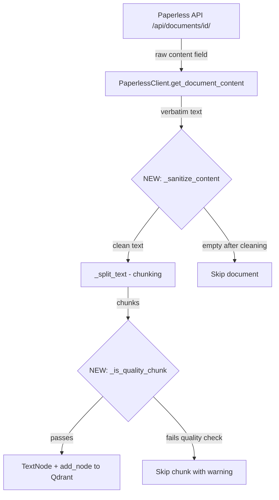

# Paperless Content Sanitization Plan

## Problem

Paperless-NGX returns raw MIME email content (including base64-encoded attachments, MIME headers, boundary markers) as the `content` field for email-type documents. The sync pipeline stores this verbatim in Qdrant, creating garbage embeddings that waste API calls and pollute search results.

## Architecture



## Implementation Steps

### 1. Add `_sanitize_content()` in `sync.py`

A new function that cleans raw document content before chunking:

**MIME structure parsing:**
- Detect MIME boundary markers (`--[boundary_string]`)
- Extract only `text/plain` and `text/html` parts from multipart MIME messages
- Discard `image/*`, `application/*`, and other binary MIME parts entirely

**Base64 stripping:**
- Detect and remove contiguous blocks of base64-encoded data (lines matching `^[A-Za-z0-9+/=\n]{50,}$`)
- Remove `Content-Transfer-Encoding: base64` header blocks and their subsequent encoded payloads

**MIME header removal:**
- Strip lines matching common MIME headers: `Content-Type:`, `Content-Disposition:`, `Content-Transfer-Encoding:`, `Content-ID:`, `X-Attachment-Id:`, `MIME-Version:`
- Strip boundary markers

**HTML cleanup (optional):**
- If the remaining text contains HTML tags, strip them to extract plain text
- Preserve meaningful whitespace/newlines

**Normalization:**
- Collapse excessive whitespace (3+ consecutive newlines → 2)
- Strip leading/trailing whitespace

### 2. Add `_is_quality_chunk()` in `sync.py`

A quality gate function applied to each chunk *after* splitting:

- Calculate the ratio of word-like tokens vs total characters
- Reject chunks where >60% of content is non-word characters (base64 residue, encoded data)
- Reject chunks shorter than 20 characters after stripping whitespace (too short to be useful)
- Log skipped chunks with a warning for observability

### 3. Integrate into `DocumentSyncer.sync_documents()`

Modify the sync flow in `sync.py`:

```python
# After fetching content:
content = self.client.get_document_content(doc_id)
content = _sanitize_content(content)  # NEW
if not content or len(content.strip()) < 50:
    skipped += 1
    continue

# After splitting into chunks:
chunks = _split_text(content, MAX_CHUNK_CHARS, CHUNK_OVERLAP_CHARS)
chunks = [c for c in chunks if _is_quality_chunk(c)]  # NEW
if not chunks:
    skipped += 1
    continue
```

### 4. Clean up existing corrupted Qdrant data

Two approaches (implement both):

**a) Add a delete-by-source endpoint** — Add a method to `LlamaIndexRAG` that deletes all points matching a `source_id` prefix (e.g., `paperless:2017`). This enables targeted cleanup.

**b) Update `reset_and_resync.py`** — After the fix is deployed, run the existing reset script which drops the entire Qdrant collection, removes `rag-indexed` tags from Paperless, and re-syncs everything through the now-sanitized pipeline.

### 5. Verify fix

After re-sync:
- Query Qdrant for `source_id = paperless:2017` 
- Verify chunks contain readable text, not base64 data
- Verify chunk count is reasonable (should drop from 74 to much fewer)
- Test RAG search for "El Al booking" returns meaningful results

## Files to Modify

| File | Change |
|------|--------|
| `src/plugins/paperless/sync.py` | Add `_sanitize_content()`, `_is_quality_chunk()`, integrate into sync flow |
| `src/llamaindex_rag.py` | Add `delete_by_source_id()` method for targeted cleanup |
| `scripts/reset_and_resync.py` | No changes needed (already handles full reset) |

## Risk Assessment

- **Low risk**: Sanitization only removes provably non-text content (base64 blocks, MIME headers)
- **Edge case**: Some documents might have legitimate base64 references in text — the regex should only match contiguous multi-line base64 blocks, not inline references
- **Fallback**: If sanitization removes too much, documents still get skipped gracefully rather than crashing
