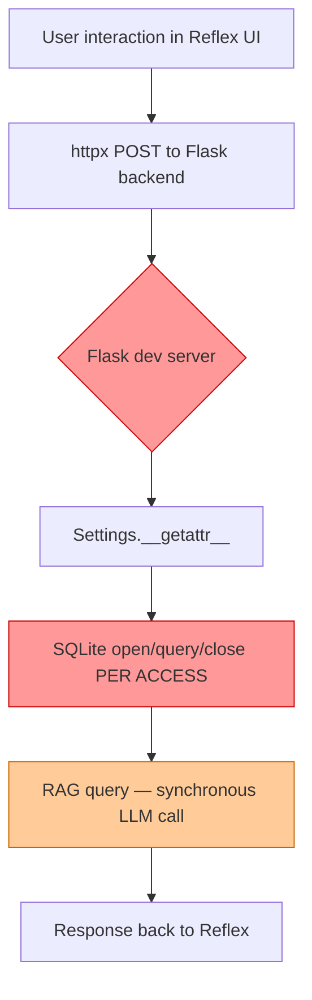
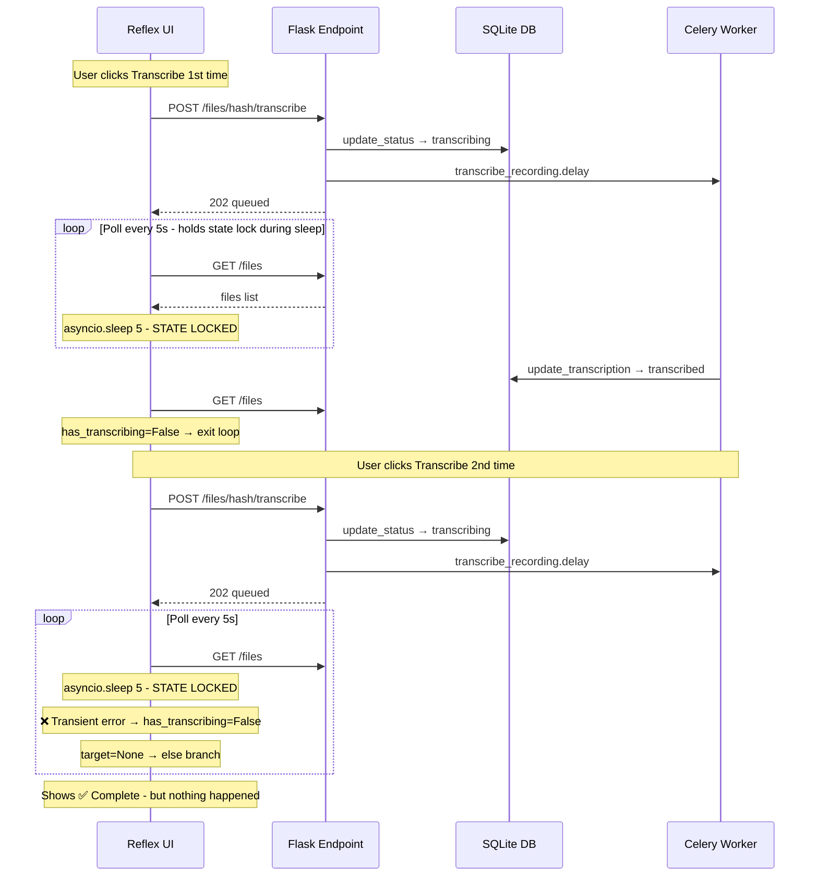

# Performance & Re-Transcription Fix Plan

## Executive Summary

Two interrelated problems were reported:
1. **UI ↔ Backend lag** — the interface feels sluggish
2. **Second transcription request fails** — requesting a call recording transcription from the UI a second time doesn't work

After a thorough code audit across the full stack (Flask backend, Reflex UI, Celery workers, SQLite DB, Docker infra), I identified **6 root causes** contributing to these issues.

---

## Root Cause Analysis

### Problem 1: Performance Lag



#### RC-1: Flask Development Server — No Production WSGI (CRITICAL)

**File:** [`Dockerfile`](Dockerfile:35) — `CMD ["python", "-u", "src/app.py"]`
**File:** [`app.py`](src/app.py:1462) — `app.run(host="0.0.0.0", port=8765, debug=is_debug)`

The backend runs Flask's built-in development server, which is:
- **Single-process** — cannot utilize multiple CPU cores
- **Limited threading** — handles requests with basic threading, no worker pool
- **Not designed for production** — Flask docs explicitly warn against this
- **No request queuing** — under load, requests pile up

A single long-running RAG query (5–30s) effectively blocks or degrades all other API calls (health checks, file listings, conversation loads).

**Fix:** Switch to **gunicorn** with multiple sync workers.

#### RC-2: Settings Lookups Hit SQLite on Every Access (HIGH)

**File:** [`config.py`](src/config.py:29) — `Settings.__getattr__`  
**File:** [`settings_db.py`](src/settings_db.py:371) — `get_setting_value()`

Every `settings.xxx` attribute access:
1. Opens a **new** SQLite connection
2. Executes a `SELECT` query
3. Closes the connection

During a single `/rag/query` request, settings are accessed 10–20+ times (Redis host, Qdrant host, model names, API keys, session TTL, etc.). That's 10–20 SQLite open/query/close cycles per request — pure overhead.

**Fix:** Add an in-process TTL cache (e.g., 60-second expiry) to `get_setting_value()`.

#### RC-3: SQLite Connection Churn (MEDIUM)

**File:** [`settings_db.py`](src/settings_db.py:371) — `_get_connection()` per call  
**File:** [`plugins/call_recordings/db.py`](src/plugins/call_recordings/db.py:31) — `_get_connection()` per call

Both modules create a fresh `sqlite3.connect()` for every single DB operation and close it immediately. WAL mode helps with concurrency, but the constant open/close cycle adds ~1–2ms per operation, compounding across dozens of calls per request.

**Fix:** Use a thread-local connection cache or a lightweight connection pool.

#### RC-4: Sequential API Calls in UI on_load (MEDIUM)

**File:** [`state.py`](ui-reflex/ui_reflex/state.py:1064) — `on_load()`  
**File:** [`state.py`](ui-reflex/ui_reflex/state.py:1072) — `on_settings_load()`

Page load triggers multiple sequential `await` calls:
```
on_load:           _refresh_conversations → _check_health → fetch_plugins
on_settings_load:  on_load → _load_settings → _load_cost_data
                   (where _load_settings itself makes 5 sequential API calls)
```

Each `await` blocks until the response returns. With a single-threaded Flask backend, these requests are serialized on both ends.

**Fix:** Use `asyncio.gather()` for independent API calls, run them in parallel.

---

### Problem 2: Second Transcription Request Doesn't Work



#### RC-5: Polling Loop Blocks State Events + Premature Exit (CRITICAL)

**File:** [`state.py`](ui-reflex/ui_reflex/state.py:1973) — `retry_transcription()`

The `retry_transcription()` method is an async generator that runs a polling loop for **up to 30 minutes** (360 iterations × 5s sleep):

```python
for _ in range(max_polls):        # 360 iterations
    has_transcribing = await self._load_recording_files()
    yield                           # releases lock briefly
    if not has_transcribing:
        # ...check target...
        return
    await asyncio.sleep(5)          # ⚠️ HOLDS STATE LOCK FOR 5 SECONDS
```

**Three sub-problems:**

1. **`asyncio.sleep(5)` holds the Reflex state lock** — During the 5-second sleep, the state is locked. Any new button clicks (including a second transcribe request) are queued and delayed. The UI feels unresponsive.

2. **Premature exit on transient API errors** — If `fetch_call_recording_files()` returns an error (network blip, Flask busy), `_load_recording_files()` sets `call_recordings_files = []` and returns `has_transcribing = False`. The polling loop exits. The target-file check finds `target = None`, falls into the `else` branch, and shows **"✅ Transcription complete"** — even though the transcription never actually completed.

3. **False positive completion message** — When `target` is `None` (file not found in the empty list), the logic at line 2012 falls through:
   ```python
   if target and target.get("status") == "transcribed":
       msg = "✅ Transcription complete"
   elif target and target.get("status") == "error":
       msg = "❌ ..."
   else:
       msg = "✅ Transcription complete"  # ← HERE: target is None!
   ```
   This silently claims success when it should report an error or retry.

#### RC-6: Flask Dev Server Bottleneck During Concurrent Requests (HIGH)

When the user triggers a second transcription while OTHER operations are happening (e.g., a RAG query in another tab, background health checks), the Flask dev server may be unable to serve the `/files/{hash}/transcribe` POST promptly, causing a timeout or delayed response from the UI's perspective.

---

## Remediation Plan

### Phase 1: Fix the Re-Transcription Bug (Critical)

#### 1.1 — Rewrite polling loop to not hold state lock during sleep

**File:** `ui-reflex/ui_reflex/state.py` — `retry_transcription()`

Replace `asyncio.sleep(5)` with a yield-based approach that releases the state lock:

```python
async def retry_transcription(self, content_hash: str):
    self.call_recordings_scan_message = "⏳ Transcription queued…"
    yield

    result = await api_client.transcribe_recording(content_hash)
    if "error" in result and result.get("status") != "queued":
        self.call_recordings_scan_message = f"❌ {result['error']}"
        await self._load_recording_files()
        return

    self.call_recordings_scan_message = "⏳ Transcribing…"

    # Poll with yield-based sleep (releases state lock between polls)
    import time
    max_polls = 360
    for i in range(max_polls):
        has_transcribing = await self._load_recording_files()
        yield  # send state update + release lock

        if not has_transcribing:
            # Verify the specific file (not just "no transcribing files")
            target = next(
                (f for f in self.call_recordings_files
                 if f.get("content_hash") == content_hash),
                None,
            )
            if target is None:
                # API error — files list is empty, DON'T claim success
                self.call_recordings_scan_message = (
                    "⚠️ Lost connection — check transcription status manually"
                )
                return
            if target.get("status") == "transcribed":
                self.call_recordings_scan_message = "✅ Transcription complete"
                return
            elif target.get("status") == "error":
                err = target.get("error_message", "Unknown error")
                self.call_recordings_scan_message = f"❌ {err}"
                return
            elif target.get("status") == "pending":
                # Celery hasn't picked it up yet — keep polling
                pass
            else:
                self.call_recordings_scan_message = "✅ Done"
                return

        # Use rx.call_script or a background task for non-blocking delay
        # instead of asyncio.sleep which holds the state lock
        await asyncio.sleep(5)

    self.call_recordings_scan_message = "⚠️ Still running — refresh manually"
```

#### 1.2 — Fix false-positive completion when target is None

**File:** `ui-reflex/ui_reflex/state.py` — lines 2000-2013

Add an explicit check for `target is None` to avoid claiming success when the files list is empty due to an API error.

#### 1.3 — Apply the same fixes to `restart_stuck_transcription()`

**File:** `ui-reflex/ui_reflex/state.py` — lines 2019-2061

Mirror the polling and null-check fixes from 1.1/1.2.

### Phase 2: Backend Performance (High Impact)

#### 2.1 — Switch from Flask dev server to gunicorn

**File:** `Dockerfile` — change CMD  
**File:** `requirements.txt` — add gunicorn  
**File:** `docker-compose.yml` — update app command

```dockerfile
# Dockerfile
CMD ["gunicorn", "--bind", "0.0.0.0:8765", "--workers", "4", "--threads", "2", "--timeout", "300", "src.app:app"]
```

This gives 4 worker processes × 2 threads = 8 concurrent request handlers, dramatically reducing request queuing under load.

#### 2.2 — Add TTL cache to settings lookups

**File:** `src/settings_db.py` — `get_setting_value()`

Add a simple in-process cache with 60-second TTL:

```python
import time
_CACHE: dict[str, tuple[str, float]] = {}
_CACHE_TTL = 60  # seconds

def get_setting_value(key: str) -> Optional[str]:
    now = time.monotonic()
    cached = _CACHE.get(key)
    if cached and (now - cached[1]) < _CACHE_TTL:
        return cached[0]
    # ... existing SQLite lookup ...
    if value is not None:
        _CACHE[key] = (value, now)
    return value

def invalidate_cache(key: str = None):
    if key:
        _CACHE.pop(key, None)
    else:
        _CACHE.clear()
```

Call `invalidate_cache()` from `set_settings()` so UI config changes take effect immediately.

#### 2.3 — Add SQLite connection pooling (thread-local)

**File:** `src/settings_db.py` — `_get_connection()`  
**File:** `src/plugins/call_recordings/db.py` — `_get_connection()`

Use thread-local storage to reuse connections within the same thread:

```python
import threading
_local = threading.local()

def _get_connection() -> sqlite3.Connection:
    conn = getattr(_local, 'conn', None)
    if conn is None:
        conn = sqlite3.connect(_resolve_db_path())
        conn.row_factory = sqlite3.Row
        conn.execute("PRAGMA journal_mode=WAL")
        _local.conn = conn
    return conn
```

### Phase 3: UI Performance (Medium Impact)

#### 3.1 — Parallelize independent API calls in on_load

**File:** `ui-reflex/ui_reflex/state.py` — `on_load()`, `on_settings_load()`, `_load_settings()`

```python
async def on_load(self):
    # Run independent calls in parallel
    conversations, health, plugins = await asyncio.gather(
        api_client.fetch_conversations(limit=50),
        api_client.check_health(),
        api_client.fetch_plugins(),
    )
    self.conversations = [...]  # process conversations
    self.api_status = health.get("status", "unreachable")
    self.health_deps = health.get("dependencies", {})
    if not self.plugins_data:
        self.plugins_data = plugins
```

#### 3.2 — Add request-specific timeouts to httpx client

**File:** `ui-reflex/ui_reflex/api_client.py` — various methods

The global 300s timeout is too long for most requests. Add per-request timeouts:

| Request Type | Recommended Timeout |
|---|---|
| Health check | 5s (already done) |
| Conversations list | 10s |
| RAG query | 120s |
| Transcription trigger | 30s |
| File listing | 15s |
| Settings CRUD | 10s |

---

## Implementation Order

| Step | Description | Files |
|---|---|---|
| 1.1 | Rewrite polling loop in retry_transcription | state.py |
| 1.2 | Fix false-positive when target is None | state.py |
| 1.3 | Apply same fixes to restart_stuck_transcription | state.py |
| 2.1 | Switch to gunicorn WSGI server | Dockerfile, requirements.txt, docker-compose.yml |
| 2.2 | Add TTL cache to settings lookups | settings_db.py |
| 2.3 | Add thread-local SQLite connection pooling | settings_db.py, call_recordings/db.py |
| 3.1 | Parallelize on_load API calls | state.py |
| 3.2 | Add per-request httpx timeouts | api_client.py |

---

## Testing Checklist

- [ ] Transcribe a recording from the UI — verify it completes
- [ ] Re-transcribe the same recording — verify it works correctly
- [ ] Transcribe while another transcription is in progress — verify no blocking
- [ ] Click transcribe, then navigate away and back — verify no stuck state
- [ ] Send a RAG query while transcription is polling — verify no blocking
- [ ] Load the settings page — verify it loads faster
- [ ] Load the chat page — verify conversations appear quickly
- [ ] Verify health check still works under load
- [ ] Simulate API error during polling — verify no false "complete" message
