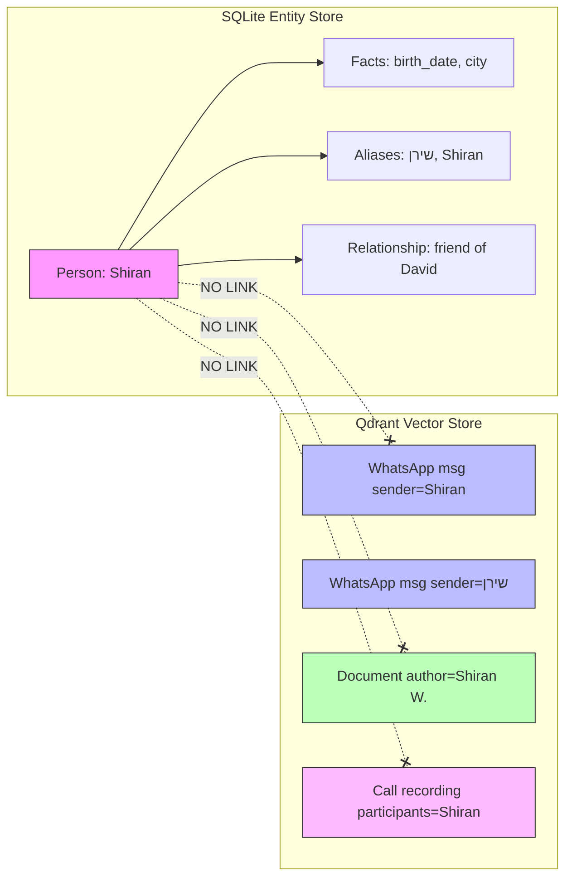
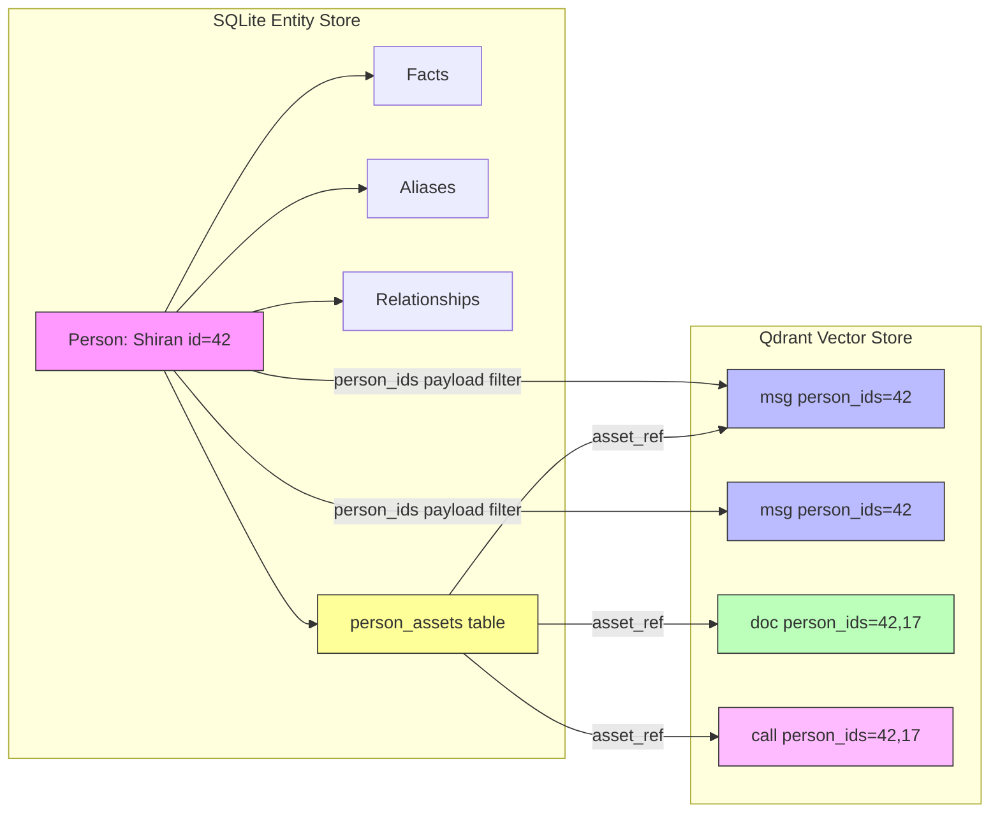

# Person-Asset Graph for RAG Quality Improvement

## Problem Statement

The system has **two disconnected knowledge stores**:

1. **Entity Store** (SQLite) — knows WHO people are: names, aliases, facts, relationships
2. **Vector Store** (Qdrant) — knows WHAT was said/written: messages, documents, call recordings

There is **no structural link** between them. Assets (messages, documents, recordings) reference people only as text strings (`sender: "Shiran"`, `chat_name: "Call with David"`), and the entity store knows about people but has no index of which assets belong to whom.

The only bridge is the **query-time token matching** in `_inject_entity_facts()` and `_expand_tokens_with_contact_names()` — fragile, name-spelling-dependent, and unable to aggregate a person's full asset footprint.

## Current Architecture (Before)



### What breaks today

| Scenario | What happens | Root cause |
|----------|-------------|------------|
| "What did Shiran tell me about the surgery?" | Fulltext matches "Shiran" in sender field; misses messages where she's referred to as שירן or "Shiran W." | No person_id filter — relies on text matching |
| "Show me all documents related to David" | Searches for "David" in message/sender/chat_name; misses docs where David is mentioned but not the sender | No person_id on assets; no mention-tracking |
| "What do I know about Shiran's family?" | Entity facts injected + vector search; but can't traverse to David's assets even though David is Shiran's spouse | No graph traversal at retrieval time |
| "Summarize everything about the Cohen family" | Must match each family member by name independently | No relationship-aware asset aggregation |

## Proposed Architecture (After)



## Design: Two-Sided Linkage

### Side 1: `person_ids` field in Qdrant payloads

Add a `person_ids` keyword-indexed array field to every Qdrant point. This is the **primary structural link**.

```
# Example Qdrant payload for a WhatsApp message
{
    "sender": "Shiran",
    "chat_name": "Shiran Waintrob",
    "message": "I'm turning 32 next week!",
    "person_ids": [42],           # ← NEW: sender's entity ID
    "mentioned_person_ids": [17], # ← NEW: people mentioned in content
    "source": "whatsapp",
    ...
}
```

**Why this helps RAG**: Qdrant can filter by `person_ids` with a keyword match, which is **exact and instant** — no fuzzy name matching needed. When the retriever identifies that the query is about person 42, it can add a `FieldCondition(key="person_ids", match=MatchValue(value=42))` filter to the search, dramatically improving precision.

### Side 2: `person_assets` table in SQLite

A lightweight junction table tracking which assets belong to which person and how:

```sql
CREATE TABLE person_assets (
    id INTEGER PRIMARY KEY AUTOINCREMENT,
    person_id INTEGER NOT NULL,
    asset_type TEXT NOT NULL,        -- 'whatsapp_msg', 'document', 'call_recording', 'gmail'
    asset_ref TEXT NOT NULL,         -- Qdrant point source_id (e.g. '972501234567@c.us:1708012345')
    role TEXT DEFAULT 'sender',      -- 'sender', 'recipient', 'mentioned', 'participant', 'owner'
    confidence REAL DEFAULT 1.0,
    created_at TIMESTAMP DEFAULT CURRENT_TIMESTAMP,
    FOREIGN KEY (person_id) REFERENCES persons(id) ON DELETE CASCADE,
    UNIQUE(person_id, asset_ref, role)
);

CREATE INDEX idx_person_assets_person ON person_assets(person_id);
CREATE INDEX idx_person_assets_ref ON person_assets(asset_ref);
```

**Why this helps RAG**: Enables queries like "get all assets for person 42" without scanning Qdrant, and supports role-based filtering ("documents where Shiran is the owner" vs "messages where Shiran is mentioned").

## How the Graph Improves RAG Quality

### 1. Person-Scoped Retrieval (Precision ↑)

**Before**: Query "what did Shiran say about the surgery?" → fulltext search for "Shiran" + "surgery" → may return results from other people named Shiran, or miss messages from שירן.

**After**: Resolve "Shiran" → person_id=42 via entity store → add Qdrant filter `person_ids contains 42` → only messages from/about THIS Shiran, regardless of script or spelling.

### 2. Relationship-Aware Context Expansion (Recall ↑)

**Before**: Query "tell me about Shiran's family" → only finds messages with the word "family" near "Shiran".

**After**: 
1. Resolve Shiran → person_id=42
2. Traverse relationships: spouse=David(17), child=Mia(23)
3. Expand retrieval to include assets for person_ids [42, 17, 23]
4. Inject relationship context: "Shiran's spouse is David, child is Mia"
5. Result: comprehensive family context without requiring exact keyword matches

### 3. Multi-Source Person Profile Assembly (Completeness ↑)

**Before**: Entity facts + whatever vector search returns. If the user asks "what do you know about David?", they get scattered results.

**After**: 
1. Resolve David → person_id=17
2. Query person_assets for all of David's assets, grouped by type
3. Assemble a structured profile:
   - Facts from entity store (birth_date, city, job)
   - Recent WhatsApp messages (sender=David)
   - Documents where David is owner/mentioned
   - Call recordings with David as participant
4. Present as a rich, comprehensive answer

### 4. Mentioned-Person Tracking (Hidden References ↑)

**Before**: A message "David told me Shiran got the job at Wix" is only linked to the sender. Shiran and David are invisible unless their names match fulltext tokens.

**After**: Entity extraction already runs on messages. Extend it to also resolve extracted names → person_ids and store them as `mentioned_person_ids`. Now searching for Shiran's career finds this message even though she didn't send it.

### 5. Graph-Weighted Scoring (Relevance ↑)

When the query is about person X, results can be scored higher if:
- The asset's `person_ids` contains X (direct match → score boost)
- The asset's `person_ids` contains someone related to X (relationship proximity boost)
- The asset's `mentioned_person_ids` contains X (mention boost, lower than direct)

This is a lightweight form of graph-enhanced retrieval without needing a full graph database.

## Implementation Plan

### Phase 1: Schema & Payload Enrichment

1. **Add `person_assets` table** to `entity_db.py` with CRUD operations
2. **Add `person_ids` and `mentioned_person_ids`** fields to all document models (`WhatsAppMessageDocument`, `FileDocument`, `CallRecordingDocument`)
3. **Create Qdrant keyword index** on `person_ids` field in `_ensure_payload_indexes()`
4. **Extend `DocumentMetadata`** with optional `person_ids` field

### Phase 2: Ingestion-Time Person Resolution

5. **Create `person_resolver.py`** — a module that resolves sender/author/participants to person_ids at ingestion time using the entity store's phone → email → name cascade
6. **Hook into `add_message()`** — after creating the WhatsApp document, resolve sender → person_id and inject into node metadata
7. **Hook into Paperless sync** — resolve document author/correspondents → person_ids
8. **Hook into call recording sync** — resolve participants + phone_number → person_ids
9. **Hook into Gmail sync** — resolve sender/recipients → person_ids
10. **Extend entity_extractor** — after extracting entities from content, resolve mentioned names → mentioned_person_ids and update the Qdrant point

### Phase 3: Retrieval-Time Graph Traversal

11. **Enhance `_inject_entity_facts()`** — when a person is identified in the query, also add a `person_ids` filter to the search for higher-precision results
12. **Add relationship expansion** — when querying about person X, optionally expand to related persons for family/team queries
13. **Add person-scoped search mode** — a new retrieval path that uses person_assets to fetch all assets for a person, useful for profile/summary queries
14. **Add graph-weighted scoring** — boost scores for assets that structurally link to the queried person

### Phase 4: Backfill Existing Data

15. **Backfill script** — scan existing Qdrant points, resolve sender/chat_name/participants → person_ids, and update payloads in batch
16. **Backfill person_assets** — from the Qdrant scan, populate the person_assets junction table

### Phase 5: UI & Observability

17. **Entity page enhancement** — show person's linked assets (messages, docs, calls) on the entities page
18. **Graph visualization** — optional: show person-person and person-asset connections

## Technical Considerations

### Why NOT a dedicated graph database (Neo4j, etc.)?

The current stack uses SQLite + Qdrant + Redis. Adding Neo4j would:
- Increase operational complexity significantly
- Require a new Docker service, driver, and query language (Cypher)
- Be overkill for the graph size (hundreds of persons, thousands of assets)

Instead, the proposed design uses:
- **SQLite** for the structural graph (person_assets, person_relationships) — fast for small graphs, zero operational cost
- **Qdrant payload filters** for retrieval-time graph-enhanced search — leverages existing infrastructure
- This is a **"graph-enhanced RAG"** pattern, not a "GraphRAG" pattern (which typically involves full knowledge graph + community summarization)

### Performance

- `person_ids` keyword index in Qdrant: O(1) lookup, no impact on existing queries
- `person_assets` table: indexed on both person_id and asset_ref, fast for both directions
- Person resolution at ingestion time: one extra entity_db lookup per message (cached per chat session)
- Backfill: one-time batch operation, can run during off-hours

### Backward Compatibility

- Existing Qdrant points without `person_ids` continue to work (field is optional)
- Existing retrieval pipeline unchanged — graph features are additive
- Entity store schema changes are additive (new table, no column changes)

## Summary

The person-asset graph creates a **structural bridge** between the entity store (WHO) and the vector store (WHAT). This enables:

| Capability | Before | After |
|-----------|--------|-------|
| Person-scoped search | Fuzzy name matching | Exact person_id filter |
| Cross-script retrieval | Token expansion heuristics | Structural link survives any spelling |
| Relationship traversal | Not possible | Follow edges to related persons' assets |
| Mention tracking | Not tracked | mentioned_person_ids payload |
| Person profile assembly | Ad-hoc search results | Structured asset aggregation |
| Multi-source correlation | Independent searches | Unified person → assets index |
