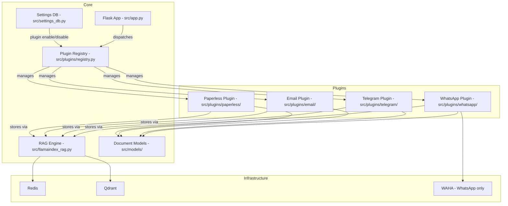
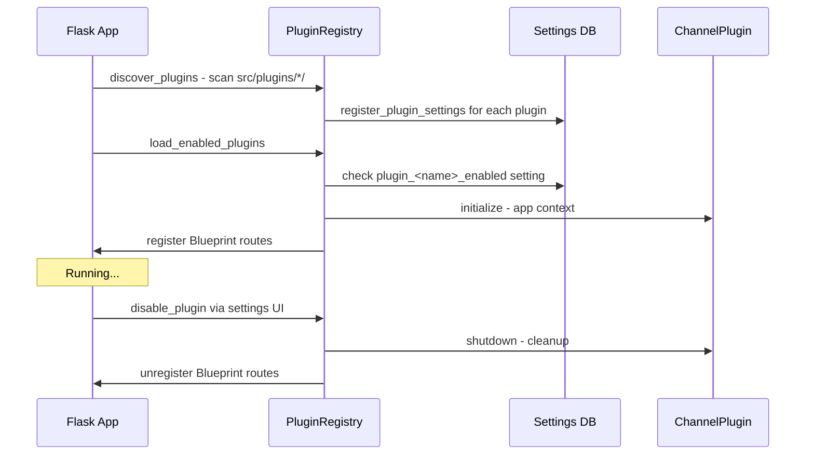

# Plugin Architecture Plan

## Overview

Refactor the application from a WhatsApp-specific system into a **multi-channel platform** with a plugin architecture. WhatsApp becomes the first plugin; future plugins (Telegram, Email, Paperless-NG, etc.) slot in with zero changes to the core.

Plugins are **enabled/disabled at runtime** via the Settings UI.

---

## Source vs Content Type Taxonomy

The current `SourceType` enum in `src/models/base.py` conflates two orthogonal dimensions:
- **Where** data came from (the platform/plugin)
- **What** the data is (text, image, document, voice, etc.)

### Current Problem

```python
# src/models/base.py — mixes sources and content types
class SourceType(str, Enum):
    WHATSAPP = "whatsapp"       # ← Source (platform)
    TELEGRAM = "telegram"       # ← Source (platform)
    DOCUMENT = "document"       # ← Content type!
    CALL_RECORDING = "call_recording"  # ← Content type!
    VOICE_NOTE = "voice_note"   # ← Content type!
```

A PDF can come from Paperless-NG, WhatsApp, Email, or manual upload. A voice note can come from WhatsApp or Telegram. These are independent axes.

### Solution: Two Enums

**`Source`** — The platform/plugin that originated the data:

```python
class Source(str, Enum):
    """Where the data came from — maps 1:1 to plugins."""
    WHATSAPP = "whatsapp"
    TELEGRAM = "telegram"
    EMAIL = "email"
    PAPERLESS = "paperless"
    SLACK = "slack"
    DISCORD = "discord"
    SMS = "sms"
    WEB_SCRAPE = "web_scrape"
    MANUAL = "manual"         # User-uploaded or manually entered
    API_IMPORT = "api_import" # Imported via API
```

**`ContentType`** — What the data actually is (source-agnostic):

```python
class ContentType(str, Enum):
    """What the data is — independent of where it came from."""
    # Messages
    TEXT = "text"
    IMAGE = "image"
    VOICE = "voice"
    VIDEO = "video"
    STICKER = "sticker"
    LOCATION = "location"
    CONTACT_CARD = "contact_card"

    # Documents
    DOCUMENT = "document"        # PDF, Word, etc.
    SPREADSHEET = "spreadsheet"  # Excel, CSV

    # Audio
    CALL_RECORDING = "call_recording"

    # Other
    UNKNOWN = "unknown"
```

### Metadata Changes

`DocumentMetadata` carries both:

```python
class DocumentMetadata(BaseModel):
    source: Source           # e.g. Source.WHATSAPP
    content_type: ContentType  # e.g. ContentType.IMAGE
    source_id: str
    created_at: datetime
    # ... rest unchanged
```

### Qdrant Payload Impact

Both fields are stored as filterable payload fields:

```json
{
  "source": "whatsapp",
  "content_type": "image",
  "sender": "John",
  "chat_name": "Family Group",
  "timestamp": 1707648000
}
```

This enables queries like:
- "Show all documents from Paperless" → `source=paperless AND content_type=document`
- "Show all images from WhatsApp" → `source=whatsapp AND content_type=image`
- "Show all voice messages from any source" → `content_type=voice`

### Migration from Current Schema

The rename `source_type` → `source` + addition of `content_type` requires:
1. Existing Qdrant points keep their `source_type` field (no reindex needed)
2. New points get both `source` and `content_type`
3. Search/filter code checks both `source` and legacy `source_type` during transition
4. A one-time migration script can backfill `content_type` on existing points (optional)

### WhatsApp Handler ContentType Mapping

The WhatsApp-specific `ContentType` in `handler.py` maps directly to the global `ContentType`:

| WhatsApp Handler | Global ContentType |
|------------------|-------------------|
| `TEXT` | `ContentType.TEXT` |
| `IMAGE` | `ContentType.IMAGE` |
| `VOICE` | `ContentType.VOICE` |
| `VIDEO` | `ContentType.VIDEO` |
| `DOCUMENT` | `ContentType.DOCUMENT` |
| `STICKER` | `ContentType.STICKER` |
| `LOCATION` | `ContentType.LOCATION` |
| `CONTACT` | `ContentType.CONTACT_CARD` |

The WhatsApp handler can either use the global enum directly or maintain its own mapping that converts to the global enum when creating RAG documents.

---

## Current State Analysis

### What's Already Source-Agnostic ✅

| Component | File | Why It's Good |
|-----------|------|---------------|
| RAG document models | `src/models/base.py` | `BaseRAGDocument` + `SourceType` enum already supports WhatsApp, Telegram, Email, etc. |
| WhatsApp document model | `src/models/whatsapp.py` | Clean subclass of `BaseRAGDocument` |
| File/Call document models | `src/models/document.py`, `call_recording.py` | Ready for non-messaging sources |
| RAG engine | `src/llamaindex_rag.py` | `add_document()` accepts any `BaseRAGDocument` subclass |
| Vector store / search | `src/llamaindex_rag.py` | Searches by metadata fields, not WhatsApp-specific logic |
| Settings infrastructure | `src/settings_db.py` | SQLite-backed, extensible categories |
| Config accessor | `src/config.py` | Generic `Settings` class, reads from SQLite |

### What's Tightly Coupled to WhatsApp ❌

| Coupling Point | File | Lines | Impact |
|----------------|------|-------|--------|
| Direct WhatsApp imports | `src/app.py` | 35-36 | Core app imports WhatsApp module |
| Webhook handler | `src/app.py` | 902-972 | `_process_webhook_payload()` calls `create_whatsapp_message()` |
| `pass_filter()` | `src/app.py` | 140-157 | WhatsApp-specific event filtering |
| WAHA session management | `src/app.py` | 979-1031 | `/`, `/qr_code`, `/pair` routes |
| Cache endpoints | `src/app.py` | 836-880 | `/cache/groups/...` routes |
| Health check | `src/app.py` | 164-208 | Hardcodes WAHA dependency check |
| WhatsApp settings | `src/settings_db.py` | 75-79, 125-128 | `whatsapp` category hardcoded |
| UI branding | `ui/app.py` | 38-42 | "WhatsApp RAG Assistant" everywhere |
| Docker services | `docker-compose.yml` | 24-35 | WAHA service always present |
| System prompt | `src/llamaindex_rag.py` | 1222-1235 | "WhatsApp message archive" |

---

## Target Architecture



---

## Plugin Interface Design

### Abstract Base Class: `ChannelPlugin`

Location: `src/plugins/base.py`

```python
from abc import ABC, abstractmethod
from typing import Any, Dict, List, Optional, Tuple
from flask import Flask, Blueprint


class ChannelPlugin(ABC):
    """Base class all channel plugins must implement."""

    # --- Identity ---

    @property
    @abstractmethod
    def name(self) -> str:
        """Unique plugin identifier, e.g. 'whatsapp', 'telegram'."""

    @property
    @abstractmethod
    def display_name(self) -> str:
        """Human-readable name, e.g. 'WhatsApp', 'Telegram'."""

    @property
    @abstractmethod
    def icon(self) -> str:
        """Emoji or icon string for UI display."""

    @property
    @abstractmethod
    def version(self) -> str:
        """Plugin version string."""

    # --- Settings ---

    @abstractmethod
    def get_default_settings(self) -> List[Tuple[str, str, str, str, str]]:
        """Return list of (key, default_value, category, type, description).
        
        Category should be the plugin name (e.g. 'whatsapp').
        These are registered in settings_db on plugin discovery.
        """

    @abstractmethod
    def get_select_options(self) -> Dict[str, List[str]]:
        """Return select-type option lists for settings, keyed by setting name."""

    # --- Lifecycle ---

    @abstractmethod
    def initialize(self, app: Flask) -> None:
        """Called when the plugin is enabled. Set up connections, caches, etc."""

    @abstractmethod
    def shutdown(self) -> None:
        """Called when the plugin is disabled. Clean up resources."""

    # --- Flask Integration ---

    @abstractmethod
    def get_blueprint(self) -> Blueprint:
        """Return a Flask Blueprint with all plugin-specific routes.
        
        Should include:
        - Webhook endpoint(s)
        - Setup/pairing endpoints (e.g. QR code for WhatsApp)
        - Cache management endpoints
        - Any plugin-specific API routes
        """

    # --- Health ---

    @abstractmethod
    def health_check(self) -> Dict[str, str]:
        """Check plugin-specific dependencies.
        
        Returns:
            Dict of dependency_name -> status_string
            e.g. {"waha": "connected"} or {"waha": "error: timeout"}
        """

    # --- Webhook Processing ---

    @abstractmethod
    def process_webhook(self, payload: Dict[str, Any]) -> Optional[Any]:
        """Process an incoming webhook payload.
        
        Should:
        1. Filter/validate the payload
        2. Parse into a domain object
        3. Convert to a BaseRAGDocument
        4. Return the document (caller stores in RAG)
        
        Returns:
            BaseRAGDocument instance, or None if payload should be ignored
        """
```

### Plugin Lifecycle Flow



---

## Plugin Registry Design

Location: `src/plugins/registry.py`

The `PluginRegistry` is responsible for:

1. **Discovery** — scanning `src/plugins/*/` for `plugin.py` files that export a `ChannelPlugin` subclass
2. **Settings registration** — calling `get_default_settings()` on each discovered plugin and inserting into `settings_db`
3. **Loading** — instantiating enabled plugins, calling `initialize()`, and registering Flask Blueprints
4. **Runtime toggle** — enabling/disabling plugins via settings, with proper `initialize()`/`shutdown()` lifecycle
5. **Iteration** — providing access to enabled plugins for health checks, webhook dispatch, etc.

### Key Design Decisions

- **Plugin enable setting key**: `plugin_<name>_enabled` (e.g. `plugin_whatsapp_enabled`)
- **Plugin settings category**: uses the plugin `name` as category (e.g. `whatsapp`)
- **Blueprint prefix**: `/plugins/<name>/` (e.g. `/plugins/whatsapp/webhook`)
- **Backward compatibility**: The WhatsApp plugin also registers legacy routes (`/webhook`, `/pair`, `/qr_code`) during a transition period

---

## Directory Structure (Target)

```
src/
├── app.py                    # Core Flask app (generic, plugin-dispatched)
├── config.py                 # Settings accessor (unchanged)
├── conversations_db.py       # Conversation persistence (unchanged)
├── llamaindex_rag.py         # RAG engine (minor: generalize system prompt)
├── settings_db.py            # Extended: dynamic plugin settings registration
├── models/
│   ├── __init__.py
│   ├── base.py               # BaseRAGDocument (unchanged)
│   ├── whatsapp.py           # WhatsAppMessageDocument (unchanged)
│   ├── document.py           # FileDocument (unchanged)
│   └── call_recording.py     # CallRecordingDocument (unchanged)
├── plugins/
│   ├── __init__.py
│   ├── base.py               # ChannelPlugin ABC
│   ├── registry.py           # PluginRegistry
│   └── whatsapp/
│       ├── __init__.py
│       ├── plugin.py          # WhatsAppPlugin(ChannelPlugin)
│       ├── handler.py         # Moved from src/whatsapp/handler.py
│       ├── contact.py         # Moved from src/whatsapp/contact.py
│       └── group.py           # Moved from src/whatsapp/group.py
├── utils/
│   ├── exceptions.py
│   ├── globals.py
│   ├── logger.py
│   └── redis_conn.py
└── whatsapp/                  # REMOVED (migrated to plugins/whatsapp/)
```

---

## Settings DB Extensions

### New Plugin Settings Pattern

Each plugin registers settings under its own category. The registry calls a new function `register_plugin_settings()` that inserts settings if they don't already exist (preserving user-modified values).

```python
# New function in settings_db.py
def register_plugin_settings(
    settings: List[Tuple[str, str, str, str, str]],
    category_meta: Dict[str, Dict[str, str]]
) -> int:
    """Register plugin settings (INSERT OR IGNORE to preserve existing values).
    
    Also registers category metadata for UI display.
    Returns number of new settings registered.
    """
```

### Enable/Disable Setting

Each plugin gets an auto-registered setting:

| Key | Default | Category | Type | Description |
|-----|---------|----------|------|-------------|
| `plugin_whatsapp_enabled` | `true` | `plugins` | `bool` | Enable WhatsApp integration |
| `plugin_telegram_enabled` | `false` | `plugins` | `bool` | Enable Telegram integration |

### CATEGORY_META Update

Add a `plugins` category at the top of the settings UI:

```python
CATEGORY_META["plugins"] = {
    "label": "🔌 Plugins",
    "order": "-1"  # Show first
}
```

---

## Flask App Refactoring

### Current `src/app.py` Structure

```
[Imports]
[Filter state - Redis]
[pass_filter() - WhatsApp specific]
[/health - hardcoded WAHA check]
[/rag/* - source-agnostic ✅]
[/conversations/* - source-agnostic ✅]
[/config/* - source-agnostic ✅]
[/cache/groups/* - WhatsApp specific]
[/test - WhatsApp specific]
[/webhook - WhatsApp specific]
[/, /qr_code, /pair - WhatsApp specific]
```

### Target `src/app.py` Structure

```
[Imports - no WhatsApp imports]
[Filter state - Redis - unchanged]
[/health - delegates to registry.health_check_all()]
[/rag/* - unchanged]
[/conversations/* - unchanged]
[/config/* - unchanged]
[/plugins/status - list all plugins with enabled state]
[Plugin Blueprint registration via registry]
```

All WhatsApp-specific routes move into the WhatsApp plugin's Blueprint:

| Current Route | New Route | Handled By |
|---------------|-----------|------------|
| `POST /webhook` | `POST /plugins/whatsapp/webhook` + legacy `POST /webhook` | WhatsApp Blueprint |
| `GET /` | `GET /plugins/whatsapp/status` | WhatsApp Blueprint |
| `GET /qr_code` | `GET /plugins/whatsapp/qr_code` | WhatsApp Blueprint |
| `GET /pair` | `GET /plugins/whatsapp/pair` | WhatsApp Blueprint |
| `POST /cache/groups/clear` | `POST /plugins/whatsapp/cache/groups/clear` | WhatsApp Blueprint |
| `POST /cache/groups/<id>/refresh` | `POST /plugins/whatsapp/cache/groups/<id>/refresh` | WhatsApp Blueprint |
| `GET /test` | `GET /plugins/whatsapp/test` | WhatsApp Blueprint |

### New Core Endpoints

| Route | Method | Description |
|-------|--------|-------------|
| `GET /plugins` | GET | List all discovered plugins with enabled/disabled state |
| `GET /health` | GET | Health check delegates to each enabled plugin's `health_check()` |

---

## WhatsApp Plugin Implementation

### `src/plugins/whatsapp/plugin.py`

```python
class WhatsAppPlugin(ChannelPlugin):
    name = "whatsapp"
    display_name = "WhatsApp"
    icon = "💬"
    version = "1.0.0"

    def get_default_settings(self):
        return [
            ("chat_prefix", "??", "whatsapp", "text", "Prefix to trigger AI chat"),
            ("dalle_prefix", "!!", "whatsapp", "text", "Prefix for DALL-E"),
            ("waha_session_name", "default", "whatsapp", "text", "WAHA session name"),
            ("dalle_model", "dall-e-3", "whatsapp", "text", "DALL-E model"),
            ("waha_base_url", "http://waha:3000", "whatsapp", "text", "WAHA server URL"),
            ("waha_api_key", "", "whatsapp", "secret", "WAHA API key"),
            ("webhook_url", "http://app:8765/plugins/whatsapp/webhook", "whatsapp", "text", "Webhook URL"),
        ]

    def get_blueprint(self) -> Blueprint:
        bp = Blueprint('whatsapp', __name__, url_prefix='/plugins/whatsapp')
        # Register all WhatsApp routes on bp
        # Also register legacy /webhook route for backward compat
        return bp

    def health_check(self):
        # Check WAHA connectivity
        ...

    def process_webhook(self, payload):
        # Current _process_webhook_payload() logic
        # Returns WhatsAppMessageDocument or None
        ...
```

---

## RAG Engine Changes

### System Prompt Generalization

The current system prompt in [`_build_system_prompt()`](src/llamaindex_rag.py:1202) says "WhatsApp message archive". This should become source-aware:

```python
# Before
"You are a helpful AI assistant for a WhatsApp message archive search system."

# After  
"You are a helpful AI assistant for a personal knowledge base and message archive search system.
You have access to data from multiple sources including messaging platforms, documents, and more."
```

### Retriever Naming

Rename `WhatsAppRetriever` to `ArchiveRetriever` since it already works with any source type.

---

## UI Changes

### Branding

| Current | New |
|---------|-----|
| "WhatsApp RAG Assistant" | "RAG Assistant" or "Knowledge Base Assistant" |
| 💬 icon | 🧠 or keep 💬 |
| WhatsApp-specific empty state | Generic empty state |

### Settings Panel

Add a "🔌 Plugins" section at the top of settings showing:
- Each discovered plugin with an enable/disable toggle
- Plugin status indicator: green dot for connected, red for errored, gray for disabled

---

## Migration Strategy

### Phase 1: Framework (No behavior change)
1. Create `src/plugins/base.py` with `ChannelPlugin` ABC
2. Create `src/plugins/registry.py` with `PluginRegistry`
3. Extend `settings_db.py` with `register_plugin_settings()`
4. Create `src/plugins/__init__.py`

### Phase 2: WhatsApp Plugin (Move, don't rewrite)
1. Create `src/plugins/whatsapp/` directory
2. Copy `src/whatsapp/handler.py`, `contact.py`, `group.py` into it
3. Create `src/plugins/whatsapp/plugin.py` implementing `ChannelPlugin`
4. Move WhatsApp-specific Flask routes into Blueprint
5. Update imports in moved files

### Phase 3: Core App Refactoring
1. Remove WhatsApp imports from `src/app.py`
2. Replace hardcoded routes with plugin registry dispatch
3. Update health check to use plugin health checks
4. Update `src/llamaindex_rag.py` system prompt
5. Rename `WhatsAppRetriever` → `ArchiveRetriever`

### Phase 4: Settings & UI
1. Add `plugins` settings category
2. Add plugin enable/disable toggles in settings UI
3. Update UI branding
4. Update `docker-compose.yml` comments

### Phase 5: Cleanup
1. Remove old `src/whatsapp/` directory
2. Update all remaining imports
3. Add plugin developer documentation
4. Test end-to-end

---

## Backward Compatibility

- Legacy `POST /webhook` route is registered by WhatsApp plugin alongside `/plugins/whatsapp/webhook`
- Legacy WAHA webhook config can point to either URL
- All existing settings keys are preserved (just recategorized)
- No changes to Qdrant data schema — existing embeddings remain valid
- No changes to Redis data structures

---

## Risk Mitigation

| Risk | Mitigation |
|------|------------|
| Blueprint registration/deregistration at runtime is tricky in Flask | Use a URL dispatch pattern instead of true unregistration; disabled plugins return 404 |
| Plugin import errors crash the app | Wrap plugin discovery in try/except; log errors but continue |
| Settings migration breaks existing installs | Use INSERT OR IGNORE; never delete existing settings |
| Breaking existing WAHA webhook URL | Register legacy route as alias |
