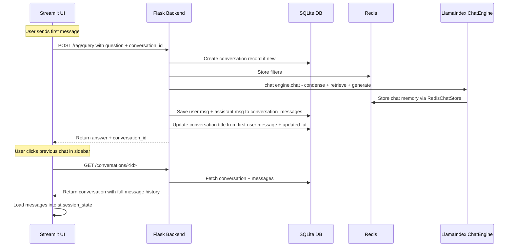
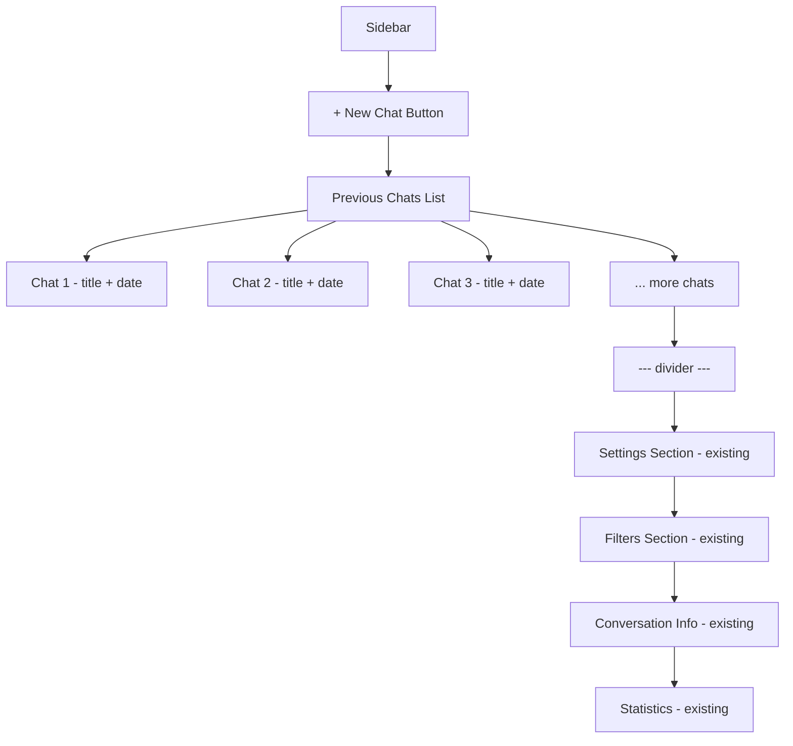
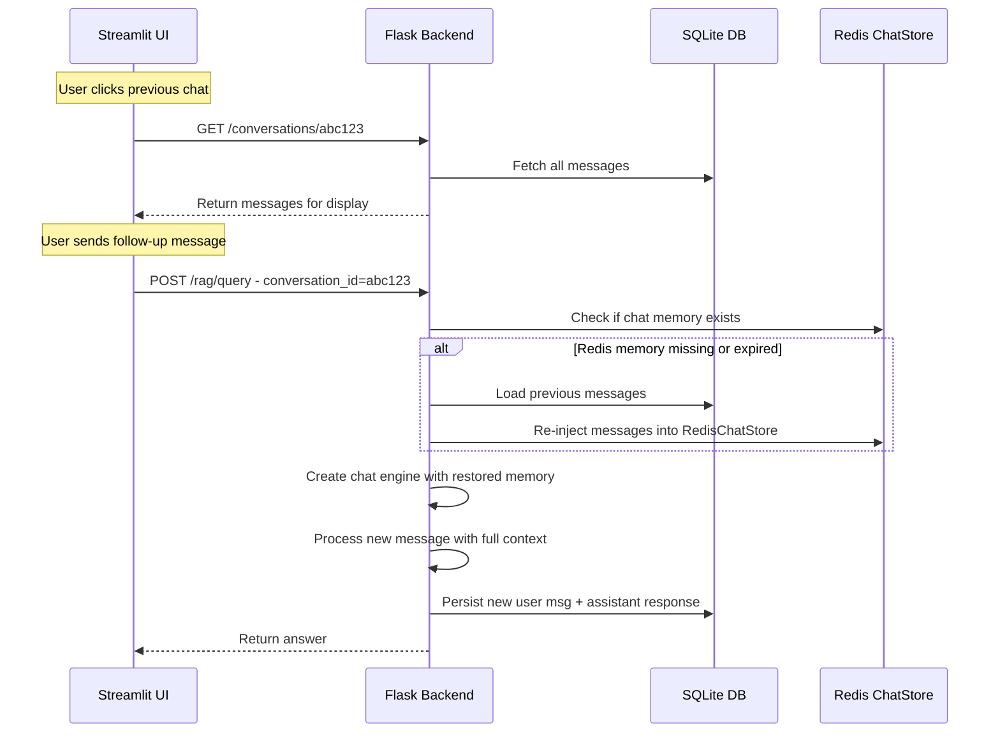

# Previous Chats Feature — Architecture Plan

## Overview

Add a ChatGPT-style "previous chats" list to the Streamlit UI sidebar, allowing users to see, resume, rename, and delete past conversations. Conversations and their messages will be persisted in SQLite (alongside existing settings), independent of Redis TTL expiration.

## Current State

- **Conversations are ephemeral**: stored in `st.session_state` (lost on refresh) and Redis `RedisChatStore` (auto-expires via `session_ttl_minutes`, default 30 min)
- **No persistent conversation record**: no database table, no list API, no titles
- **"New Chat" button** just clears `st.session_state` — doesn't save anything
- **Storage**: Redis (chat memory + filters), Qdrant (vector store), SQLite (settings only)

## Architecture

### Data Flow



### SQLite Schema (new tables in `data/settings.db`)

```sql
CREATE TABLE IF NOT EXISTS conversations (
    id TEXT PRIMARY KEY,              -- UUID, same as conversation_id in Redis
    title TEXT NOT NULL DEFAULT '',   -- Auto-generated from first user message
    created_at TIMESTAMP DEFAULT CURRENT_TIMESTAMP,
    updated_at TIMESTAMP DEFAULT CURRENT_TIMESTAMP,
    filters TEXT DEFAULT '{}',        -- JSON: active filters at time of conversation
    message_count INTEGER DEFAULT 0
);

CREATE TABLE IF NOT EXISTS conversation_messages (
    id INTEGER PRIMARY KEY AUTOINCREMENT,
    conversation_id TEXT NOT NULL,
    role TEXT NOT NULL,               -- 'user' or 'assistant'
    content TEXT NOT NULL,
    created_at TIMESTAMP DEFAULT CURRENT_TIMESTAMP,
    FOREIGN KEY (conversation_id) REFERENCES conversations(id) ON DELETE CASCADE
);

CREATE INDEX IF NOT EXISTS idx_conv_messages_conv_id 
    ON conversation_messages(conversation_id);
CREATE INDEX IF NOT EXISTS idx_conversations_updated 
    ON conversations(updated_at DESC);
```

### Auto-Titling Strategy

- **Title** = first user message, truncated to 60 characters with ellipsis
- No extra LLM call needed (fast, zero cost)
- Users can rename via the sidebar UI (calls `PUT /conversations/<id>`)
- Title is set when the first message is processed in `/rag/query`

### Backend API Endpoints

All new endpoints added to [`src/app.py`](src/app.py):

| Method | Endpoint | Description |
|--------|----------|-------------|
| `GET` | `/conversations` | List all conversations, sorted by `updated_at` DESC. Returns `id, title, created_at, updated_at, message_count, filters`. |
| `GET` | `/conversations/<id>` | Get single conversation with all messages. |
| `POST` | `/conversations` | Create a new empty conversation (optional: with title). Returns `id`. |
| `PUT` | `/conversations/<id>` | Update conversation title. |
| `DELETE` | `/conversations/<id>` | Delete conversation + messages from SQLite + Redis. |

### Modified Endpoint

**`POST /rag/query`** — Modified to auto-persist conversations:

1. If `conversation_id` is not provided or doesn't exist in SQLite → create new conversation record
2. After LLM responds → save both user message and assistant response to `conversation_messages`
3. If this is the first message → set conversation title from truncated user question
4. Update `updated_at` and `message_count` on conversation record

### UI Changes — Sidebar Layout



**Sidebar modifications in [`ui/app.py`](ui/app.py):**

1. **New Chat button** at the top (replaces the old "New" button buried in conversation info)
2. **Scrollable chat list** — fetched from `GET /conversations` API
3. Each chat entry shows: title (truncated), relative time (e.g., "2 hours ago")
4. **Click to load**: clicking a chat calls `GET /conversations/<id>`, loads messages into `st.session_state`, sets `conversation_id`
5. **Rename**: inline edit or small edit icon → calls `PUT /conversations/<id>`
6. **Delete**: small trash icon → calls `DELETE /conversations/<id>` with confirmation
7. The **active conversation** is highlighted in the list

### New Module: `src/conversations_db.py`

Separate module for conversation persistence (mirrors pattern of [`settings_db.py`](src/settings_db.py)):

- `init_conversations_db()` — Create tables if not exist
- `create_conversation(id, title, filters)` → conversation dict
- `get_conversation(id)` → conversation dict with messages
- `list_conversations(limit, offset)` → list of conversation summaries
- `update_conversation_title(id, title)` → bool
- `add_message(conversation_id, role, content)` → message dict
- `delete_conversation(id)` → bool
- `conversation_exists(id)` → bool

### Relationship: SQLite vs Redis

| Concern | Storage | Purpose |
|---------|---------|---------|
| Conversation list + metadata | SQLite | Persistent, survives Redis restarts |
| Full message history for UI | SQLite | Load previous chats, display in UI |
| LLM chat memory for context window | Redis `RedisChatStore` | LlamaIndex chat engine context |
| Conversation filters | Redis hash | Session-scoped, auto-expire |

**Key insight**: SQLite is the source of truth for the UI conversation list and message history. Redis handles the LlamaIndex chat memory for the LLM context window. When Redis memory expires or is lost, it is **automatically restored from SQLite** — so conversation context is never lost.

### Chat Memory Restoration (No Expired Context)

When a user resumes a previous conversation, the backend ensures the LLM always has full context:

1. UI calls `GET /conversations/<id>` → gets full message history from SQLite for display
2. When the user sends a follow-up, `POST /rag/query` checks if Redis has chat memory for this `conversation_id`
3. If missing (expired or Redis restart), messages are **re-injected from SQLite into RedisChatStore**
4. The LlamaIndex chat engine is created with restored memory → LLM has full conversational context



**Implementation in `/rag/query`:**
- Before calling `rag.create_chat_engine()`, check if Redis has chat memory for this `conversation_id`
- If not, load the last N messages from SQLite (capped by `session_max_history` setting) and populate `RedisChatStore`
- Add a helper method `restore_chat_memory(conversation_id)` in `src/conversations_db.py` or `src/llamaindex_rag.py`

### Edge Cases

1. **Redis restarted or memory expired**: Chat memory is auto-restored from SQLite on next query — no data loss, no degraded LLM context.
2. **Page refresh**: Conversation is preserved in SQLite, sidebar reloads the list, active conversation restored via session state.
3. **Concurrent sessions**: SQLite WAL mode handles concurrent reads. Writes are serialized by SQLite.
4. **Very long conversations**: Only the last N messages (configurable via `session_max_history`, default 20 turns) are injected into Redis to stay within token limits.

## Files to Create/Modify

### New Files
- `src/conversations_db.py` — Conversation persistence layer (SQLite CRUD)

### Modified Files
- [`src/app.py`](src/app.py) — Add conversation API endpoints, modify `/rag/query` to auto-persist
- [`ui/app.py`](ui/app.py) — Add previous chats sidebar section, load/switch/rename/delete conversations

### Unchanged Files
- [`src/llamaindex_rag.py`](src/llamaindex_rag.py) — No changes needed, chat engine creation stays the same
- [`src/settings_db.py`](src/settings_db.py) — No changes, conversations get their own module
- [`src/config.py`](src/config.py) — No changes
