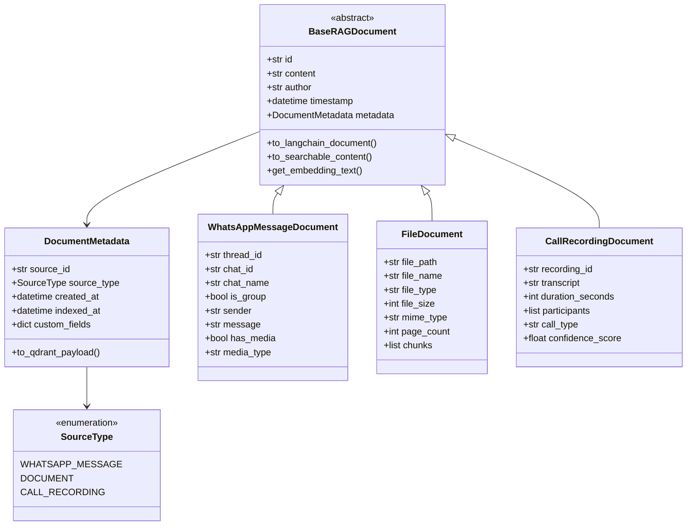
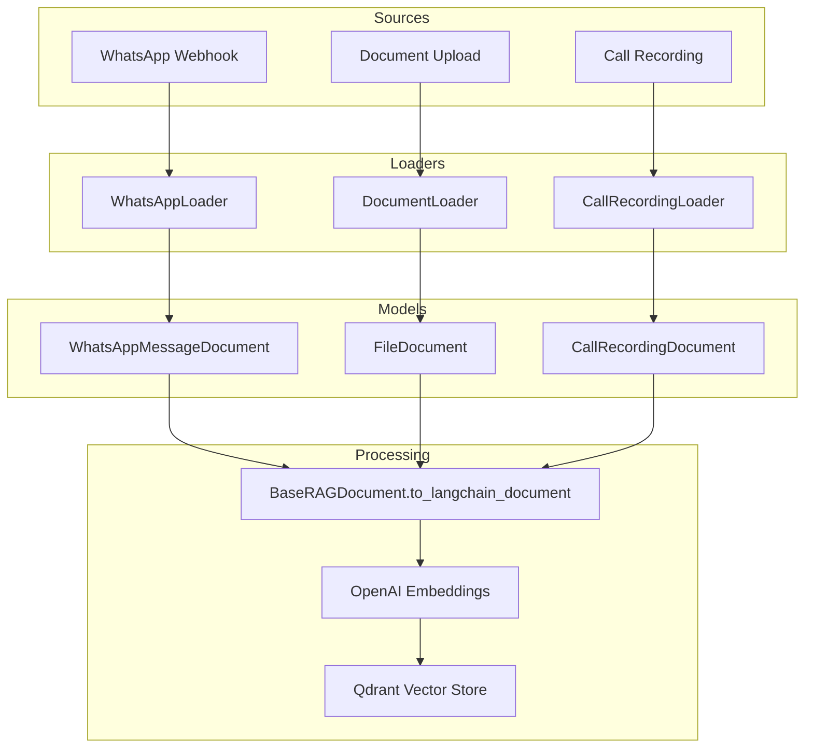

# RAG Document Classes Architecture

## Overview

This plan defines standardized Pydantic v2 classes for handling multiple data sources in the RAG system:
- **WhatsApp Messages** (existing)
- **Documents** (PDF, Word, text files)
- **Call Recordings** (transcribed audio)

## Class Hierarchy Diagram



## Data Flow Diagram



## Detailed Class Specifications

### 1. SourceType Enum

```python
from enum import Enum

class SourceType(str, Enum):
    WHATSAPP_MESSAGE = "whatsapp_message"
    DOCUMENT = "document"
    CALL_RECORDING = "call_recording"
```

### 2. DocumentMetadata Model

Common metadata structure for all document types:

| Field | Type | Description |
|-------|------|-------------|
| `source_id` | str | Unique identifier from source system |
| `source_type` | SourceType | Type of data source |
| `created_at` | datetime | When original content was created |
| `indexed_at` | datetime | When document was added to RAG |
| `tags` | list[str] | Optional tags for filtering |
| `custom_fields` | dict | Source-specific additional data |

### 3. BaseRAGDocument (Abstract Base)

Core fields all documents must have:

| Field | Type | Description |
|-------|------|-------------|
| `id` | str | Unique document ID (UUID) |
| `content` | str | Main textual content for embedding |
| `author` | str | Who created/sent the content |
| `timestamp` | datetime | When content was created |
| `metadata` | DocumentMetadata | Structured metadata |

Key methods:
- `to_langchain_document()` - Convert to LangChain Document for vector store
- `to_searchable_content()` - Format content for display in search results
- `get_embedding_text()` - Get optimized text for embedding generation

### 4. WhatsAppMessageDocument

Extends base with WhatsApp-specific fields:

| Field | Type | Description |
|-------|------|-------------|
| `thread_id` | str | LangGraph thread ID |
| `chat_id` | str | WhatsApp chat ID |
| `chat_name` | str | Name of chat/group |
| `is_group` | bool | Whether group chat |
| `sender` | str | Message sender name |
| `message` | str | Message body text |
| `has_media` | bool | Has media attachment |
| `media_type` | str | MIME type if media |

### 5. FileDocument

For PDF, Word, and text files:

| Field | Type | Description |
|-------|------|-------------|
| `file_path` | str | Original file path |
| `file_name` | str | File name |
| `file_type` | str | Extension (pdf/docx/txt) |
| `file_size` | int | Size in bytes |
| `mime_type` | str | MIME type |
| `page_count` | int | Number of pages |
| `chunks` | list[str] | Chunked content for large docs |

### 6. CallRecordingDocument

For transcribed call recordings:

| Field | Type | Description |
|-------|------|-------------|
| `recording_id` | str | Unique recording ID |
| `transcript` | str | Full transcribed text |
| `duration_seconds` | int | Call duration |
| `participants` | list[str] | Call participants |
| `call_type` | str | incoming/outgoing/conference |
| `confidence_score` | float | Transcription confidence |

## File Structure

```
src/classes/
├── __init__.py          # Package exports
├── base.py              # BaseRAGDocument, DocumentMetadata, SourceType
├── whatsapp.py          # WhatsAppMessageDocument
├── document.py          # FileDocument, FileType
├── call_recording.py    # CallRecordingDocument, CallType
└── loaders/             # (Future: document loaders)
    ├── __init__.py
    ├── base.py          # BaseLoader protocol
    ├── whatsapp.py      # WhatsApp message loader
    ├── document.py      # File document loader
    └── call_recording.py # Call recording loader
```

## Implementation Status

✅ **Completed:**
- `SourceType` enum - Data source classification
- `DocumentMetadata` model - Shared metadata structure
- `BaseRAGDocument` - Abstract base class with common fields
- `WhatsAppMessageDocument` - WhatsApp message documents
- `FileDocument` - PDF, Word, and text file documents
- `CallRecordingDocument` - Transcribed call recordings
- Package structure with `__init__.py` exports

⏳ **Pending:**
- Document loader interfaces
- RAG integration updates

## Integration with Existing RAG

The existing [`RAG.add_message()`](src/rag.py:149) will be refactored to:

1. Accept any `BaseRAGDocument` subclass
2. Use the document's `to_langchain_document()` method
3. Maintain backward compatibility with existing WhatsApp message flow

```python
# New method signature
def add_document(self, document: BaseRAGDocument) -> bool:
    langchain_doc = document.to_langchain_document()
    self.vectorstore.add_documents([langchain_doc])
    return True

# Legacy method for backward compatibility
def add_message(self, thread_id, chat_id, ...) -> bool:
    doc = WhatsAppMessageDocument(
        thread_id=thread_id,
        chat_id=chat_id,
        ...
    )
    return self.add_document(doc)
```

## Implementation Order

1. Create `SourceType` enum and `DocumentMetadata` model
2. Create `BaseRAGDocument` abstract base class
3. Create `WhatsAppMessageDocument` class
4. Create `FileDocument` class
5. Create `CallRecordingDocument` class
6. Create loader interfaces for each document type
7. Refactor existing `RAG.add_message()` to use new models
8. Add unit tests for all new classes
