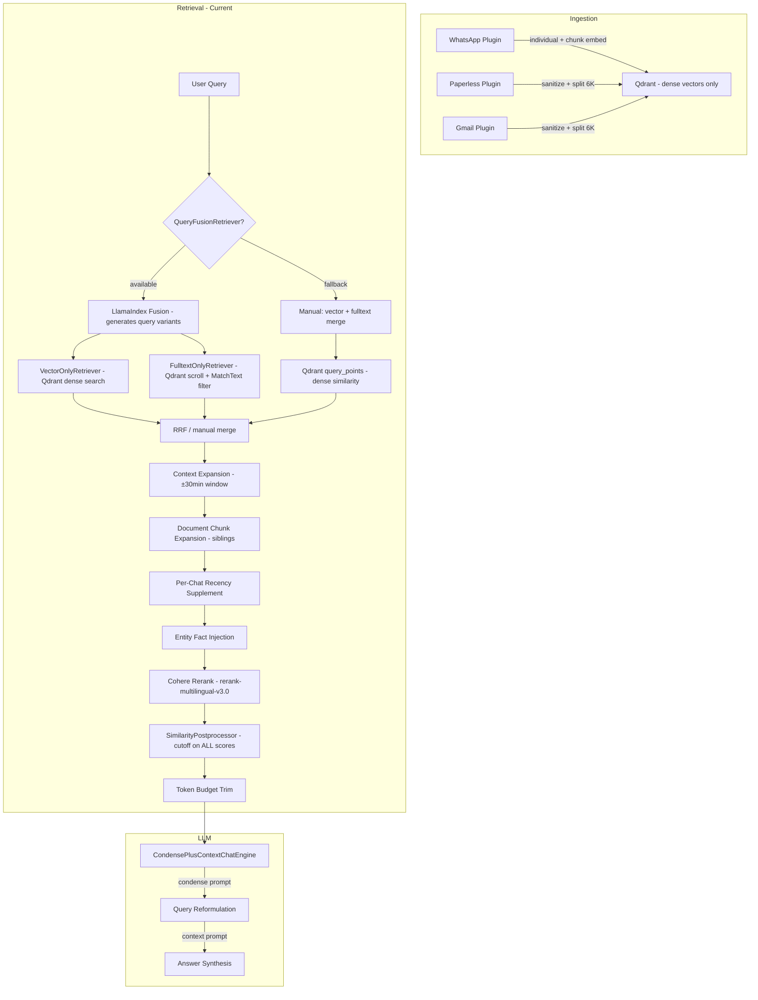
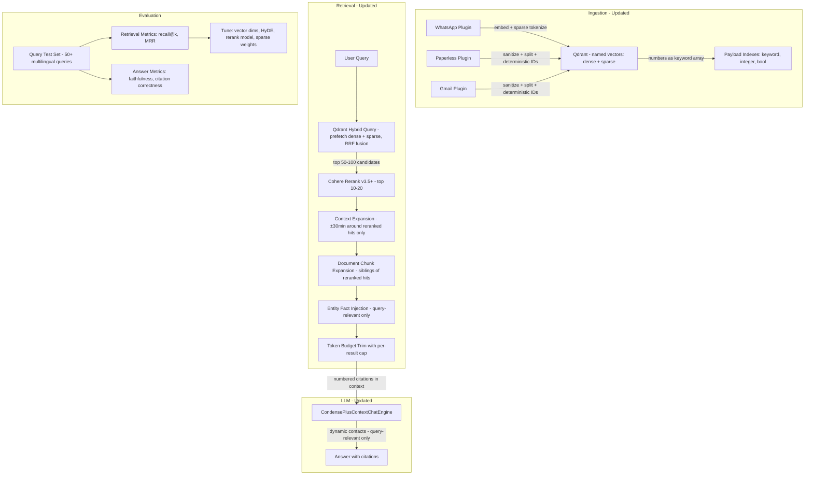

# RAG System Upgrade: Hybrid Retrieval, Score Semantics, Evaluation & Ops

## Current Architecture Summary



### Key Problems Identified in Current Architecture

1. **Full-text search has no ranking** — [`_fulltext_search_by_field()`](src/llamaindex_rag.py:1632) uses `Qdrant scroll + MatchText` filter which returns binary matches with **no score**. Constant heuristic scores (0.95/0.85/0.75) are assigned per field, making within-bucket ordering arbitrary.

2. **Score semantics are broken** — [`SimilarityPostprocessor`](src/llamaindex_rag.py:393) applies a single `similarity_cutoff` to mixed score types: cosine similarity (0-1), constant heuristic scores (0.75-0.95), and Unix timestamps (billions). This makes the cutoff meaningless for non-vector results.

3. **No sparse vectors** — All retrieval is dense-only (OpenAI embeddings). Exact-token matches for Hebrew names, ID numbers, and specific terms rely entirely on the filter-based fulltext approach.

4. **No evaluation harness** — Retrieval quality and answer correctness are tuned by intuition. No regression tests for multilingual queries.

5. **Chunk buffer TTL gap** — [`_buffer_message_for_chunking()`](src/llamaindex_rag.py:894) sets Redis TTL but never flushes on expiry. Low-volume chats silently lose buffered messages when the TTL fires.

6. **Numbers stored as text string** — [`numbers`](src/plugins/paperless/sync.py:475) is stored as space-separated text and searched via fulltext tokenizer. A keyword array index would be faster and exact.

7. **All contacts injected every turn** — [`_build_system_prompt()`](src/llamaindex_rag.py:2556) appends up to 6000 chars of contacts into every system prompt regardless of query relevance.

---

## Phase 1: Fix Score Semantics & Hybrid Retrieval Foundation

**Goal**: Stop mixing incompatible score types and lay groundwork for true hybrid search.

### 1.1 Apply SimilarityPostprocessor only to dense results

**Current**: [`SimilarityPostprocessor`](src/llamaindex_rag.py:393) runs on ALL nodes after reranking — including entity facts (score=1.0), recency nodes (score=timestamp), and fulltext nodes (score=0.75-0.95).

**Change**: Move the similarity cutoff into [`VectorOnlyRetriever._retrieve()`](src/llamaindex_rag.py:3228) (which already has a score filter at line 3254) and remove it from the main postprocessor chain in [`ArchiveRetriever._retrieve()`](src/llamaindex_rag.py:245). After reranking, all scores are cross-encoder relevance scores (0-1 from Cohere) and can be filtered uniformly.

**Files**: [`src/llamaindex_rag.py`](src/llamaindex_rag.py)

### 1.2 Normalize recency scores to 0-1 band

**Current**: [`recency_search()`](src/llamaindex_rag.py:1993) assigns `score=float(timestamp)` which is a number like `1708012345.0`. This breaks any score comparison.

**Change**: Assign recency scores in the 0.3-0.5 range (below semantic results but above the cutoff). Use a decay function: `score = 0.5 * exp(-age_hours / max_age_hours)`.

**Files**: [`src/llamaindex_rag.py`](src/llamaindex_rag.py)

### 1.3 Add sparse vector support to Qdrant collection (Option A: server-side hybrid)

**Current**: Collection has a single unnamed dense vector of 1024 dims.

**Change**:
- Migrate collection to **named vectors**: `dense` (1024-dim cosine) + `sparse` (sparse vector)
- At ingestion time, compute sparse representations using a lightweight BM25/token-frequency approach (no external SPLADE model needed initially — use Qdrant's built-in sparse vector support with manual TF-IDF-style weights)
- At query time, use Qdrant's `prefetch` + `fusion` (RRF) to combine dense + sparse results server-side
- This eliminates the need for the separate [`_fulltext_search()`](src/llamaindex_rag.py:1790) Qdrant scroll calls entirely

**Migration path**: Create a new collection with named vectors, re-index existing data, swap the collection name in config. The existing collection serves as a rollback target.

**Files**: [`src/llamaindex_rag.py`](src/llamaindex_rag.py), [`src/plugins/paperless/sync.py`](src/plugins/paperless/sync.py), [`src/plugins/gmail/sync.py`](src/plugins/gmail/sync.py), [`src/plugins/whatsapp/handler.py`](src/plugins/whatsapp/handler.py)

**Dependencies**: `qdrant-client>=1.7.0` (already met)

### 1.4 Replace fulltext scroll with sparse vector search

**Current**: 4 separate `qdrant_client.scroll()` calls with `MatchText` filters per query.

**Change**: Replace with a single Qdrant hybrid query using `prefetch` for both dense and sparse named vectors, fused via RRF. Fall back to the current fulltext approach if the collection doesn't have sparse vectors (backward compat during migration).

**Files**: [`src/llamaindex_rag.py`](src/llamaindex_rag.py)

---

## Phase 2: Reranking & Retrieval Pipeline Cleanup

### 2.1 Increase rerank candidate pool

**Current**: Reranking is applied to whatever results emerge from search + expansion + recency (variable, often 15-30 nodes). [`rag_rerank_top_n`](src/llamaindex_rag.py:369) defaults to 10.

**Change**: Explicitly retrieve top-N candidates (e.g., 50-100 from dense+sparse hybrid) → rerank top-K (e.g., 10-20). Adjust `rag_rerank_top_n` setting description and default. Move context expansion and document chunk expansion to **after** reranking so only high-quality seeds get expanded.

**Pipeline order change**:
```
hybrid search (50-100 candidates)
  → Cohere rerank (top 10-20)
    → context expansion (±30min around reranked hits)
    → document chunk expansion (siblings of reranked hits)
    → entity fact injection
    → token budget trim
```

**Files**: [`src/llamaindex_rag.py`](src/llamaindex_rag.py)

### 2.2 Upgrade Cohere rerank model

**Current**: [`rerank-multilingual-v3.0`](src/llamaindex_rag.py:370) is the default.

**Change**: Update default to `rerank-v3.5` or newer when available (configurable via existing `rag_rerank_model` setting). Add a note in settings description about model options.

**Files**: [`src/llamaindex_rag.py`](src/llamaindex_rag.py), [`src/settings_db.py`](src/settings_db.py)

### 2.3 Fix conversation chunk buffer TTL gap

**Current**: [`_buffer_message_for_chunking()`](src/llamaindex_rag.py:894) sets `redis.expire(buffer_key, self.CHUNK_BUFFER_TTL)` but there is no flush-on-expiry mechanism. When TTL fires, the buffered messages are silently deleted.

**Change**: Add a periodic flush check — on each new message arrival for any chat, scan for buffers that are close to TTL expiry and flush them. Alternatively, at the start of [`_buffer_message_for_chunking()`](src/llamaindex_rag.py:894), check the current TTL of the buffer key; if it's below a threshold (e.g., < 30s remaining and buffer has ≥ 2 messages), flush before appending.

**Files**: [`src/llamaindex_rag.py`](src/llamaindex_rag.py)

---

## Phase 3: Ingestion & Metadata Improvements

### 3.1 Use deterministic point IDs for idempotent upserts

**Current**: [`_flush_chunk_buffer()`](src/llamaindex_rag.py:1004) and Gmail/Paperless sync use `uuid.uuid4()` for node IDs. Re-ingesting the same content creates duplicate points.

**Change**: Use deterministic IDs: `hash(f"{source}:{source_id}:{chunk_index}")`. This makes re-ingests into idempotent upserts. For WhatsApp messages, the existing `source_id = f"{chat_id}:{timestamp}"` is already deterministic but the node ID uses UUID.

**Files**: [`src/llamaindex_rag.py`](src/llamaindex_rag.py), [`src/plugins/paperless/sync.py`](src/plugins/paperless/sync.py), [`src/plugins/gmail/sync.py`](src/plugins/gmail/sync.py)

### 3.2 Store numbers as keyword array instead of text string

**Current**: [`numbers`](src/plugins/paperless/sync.py:475) is stored as `"038041612 227839586"` (space-separated string) with a text index.

**Change**: Store as `["038041612", "227839586"]` (JSON array) with a keyword payload index. Update [`_ensure_payload_indexes()`](src/llamaindex_rag.py:831) to create a keyword index on `numbers[]`. Update fulltext search to use `MatchValue` on the array instead of `MatchText` on the string.

**Files**: [`src/llamaindex_rag.py`](src/llamaindex_rag.py), [`src/plugins/paperless/sync.py`](src/plugins/paperless/sync.py)

### 3.3 Add sync_run_id and last_modified_ts to payload

**Current**: No way to identify which sync run produced a point or detect source-side edits.

**Change**: Add `sync_run_id` (UUID per sync invocation) and `last_modified_ts` (from source API where available) to node metadata. This enables garbage collection of orphaned points and change detection.

**Files**: [`src/plugins/paperless/sync.py`](src/plugins/paperless/sync.py), [`src/plugins/gmail/sync.py`](src/plugins/gmail/sync.py)

---

## Phase 4: Prompt Optimization & Citations

### 4.1 Dynamic contact injection (query-relevant only)

**Current**: [`_build_system_prompt()`](src/llamaindex_rag.py:2556) injects ALL known contacts (up to 6000 chars) every turn.

**Change**: Two options (configurable via setting):
- **Option A** (simpler): Move contacts from system prompt to a pre-retrieval step. Before search, resolve query tokens against the entity store. Only inject contacts whose names appear in the query.
- **Option B** (more robust): Keep the contact list but make it lazy — only build and inject when the query contains first-name-only references that might be ambiguous.

**Files**: [`src/llamaindex_rag.py`](src/llamaindex_rag.py)

### 4.2 Implement numbered citation protocol

**Current**: Retrieved context is formatted as `"Source | date | sender: content"` strings. No explicit citation mechanism.

**Change**:
- Number each retrieved node in the context string: `[1] Source | date | sender: content`
- Add instruction to the context prompt asking the model to cite `[N]` when referencing specific sources
- Map citation numbers back to payload metadata in the UI response (source, timestamp, chat_name)

**Files**: [`src/llamaindex_rag.py`](src/llamaindex_rag.py), UI display components

---

## Phase 5: Evaluation Harness

### 5.1 Build a multilingual query test set

**Create**: A JSON/YAML file with ~50 test queries covering:
- Hebrew queries, English queries, mixed-script queries
- Multi-turn follow-ups (to test the condense step)
- Intent categories: "find message", "summarize thread", "extract fact", "when did X happen", "who said Y", "find document clause"
- Expected relevant source_ids for each query (ground truth)

**Files**: New `tests/eval/` directory, `tests/eval/query_set.yaml`

### 5.2 Add retrieval evaluation metrics

**Integrate**: LlamaIndex eval modules or Ragas to measure:
- `recall@k` — did we retrieve at least one relevant source?
- `MRR` — mean reciprocal rank of first relevant result
- `faithfulness` — is the answer grounded in retrieved context?
- `citation_correctness` — does the answer cite the right sources?

**Use for**: A/B testing `VECTOR_SIZE` (1024 vs 1536 vs 2048), HyDE on/off, sparse+dense hybrid on/off, rerank model comparison.

**Files**: New `tests/eval/evaluate_rag.py`, `tests/eval/metrics.py`

**Dependencies**: `ragas>=0.1.0` or `deepeval>=0.1.0` (add to requirements.txt)

---

## Phase 6: Operational Hardening

### 6.1 Scheduled Qdrant snapshots

**Change**: Add a snapshot creation endpoint or periodic task that calls `qdrant_client.create_snapshot()`. Store snapshot metadata (timestamp, point count, collection config) in SQLite for auditability.

**Files**: [`src/llamaindex_rag.py`](src/llamaindex_rag.py) or new `src/utils/backup.py`

### 6.2 HNSW index tuning settings

**Current**: Default Qdrant HNSW params.

**Change**: Expose `m`, `ef_construct`, and `ef` as configurable settings. Apply on collection creation. Document the tradeoff (higher values = better recall, slower indexing).

**Files**: [`src/llamaindex_rag.py`](src/llamaindex_rag.py), [`src/settings_db.py`](src/settings_db.py)

### 6.3 Scalar quantization for production scale

**Current**: Full float32 vectors.

**Change**: Add a setting `rag_quantization_enabled` (default false). When true, configure scalar quantization on the collection to reduce memory by ~4×. Only enable after retrieval quality is stabilized via the evaluation harness.

**Files**: [`src/llamaindex_rag.py`](src/llamaindex_rag.py)

### 6.4 Restrict Hebrew morphology expansions to failure-driven cases

**Current**: [`_expand_hebrew_tokens()`](src/llamaindex_rag.py:1493) aggressively strips prefixes and generates verb root variants for all Hebrew tokens.

**Change**: Make morphology expansion configurable. Add logging to track which expansions actually contribute to successful matches. Gradually restrict expansions to specific query intents (names, IDs, "did X say Y" patterns) based on logged data.

**Files**: [`src/llamaindex_rag.py`](src/llamaindex_rag.py)

---

## Target Architecture After All Phases



---

## Implementation Priority Sequence

| Priority | Task | Phase | Rationale |
|----------|------|-------|-----------|
| **P0** | Fix score semantics (1.1, 1.2) | 1 | Correctness bug — current cutoff is meaningless |
| **P0** | Fix chunk buffer TTL gap (2.3) | 2 | Data loss bug — messages silently dropped |
| **P1** | Add sparse vectors + hybrid retrieval (1.3, 1.4) | 1 | Biggest retrieval quality improvement |
| **P1** | Reorder pipeline: rerank before expansion (2.1) | 2 | Reduces noise in context, saves Qdrant queries |
| **P2** | Deterministic point IDs (3.1) | 3 | Enables safe re-syncs |
| **P2** | Numbers as keyword array (3.2) | 3 | Exact match > tokenized text for IDs |
| **P2** | Build evaluation harness (5.1, 5.2) | 5 | Required for evidence-driven tuning |
| **P3** | Dynamic contact injection (4.1) | 4 | Token cost reduction |
| **P3** | Numbered citations (4.2) | 4 | User trust & attribution |
| **P3** | Upgrade Cohere model (2.2) | 2 | Simple config change |
| **P4** | Sync metadata improvements (3.3) | 3 | Operational hygiene |
| **P4** | Qdrant snapshots (6.1) | 6 | Backup safety |
| **P4** | HNSW tuning + quantization (6.2, 6.3) | 6 | Scale preparation |
| **P4** | Restrict morphology expansions (6.4) | 6 | Needs eval data to guide |

---

## New Dependencies

```
# Add to requirements.txt for sparse vector support
fastembed>=0.1.0          # Optional: for SPLADE sparse encoding
# Add for evaluation harness
ragas>=0.1.0              # RAG evaluation metrics
# OR
deepeval>=0.1.0           # Alternative evaluation framework
```

## Settings Keys to Add

| Key | Default | Description |
|-----|---------|-------------|
| `rag_hybrid_enabled` | `false` | Enable sparse+dense hybrid retrieval |
| `rag_sparse_weight` | `0.3` | Weight for sparse vector in RRF fusion |
| `rag_rerank_candidates` | `50` | Number of candidates to fetch before reranking |
| `rag_rerank_model` | `rerank-v3.5` | Updated default Cohere rerank model |
| `rag_quantization_enabled` | `false` | Enable scalar quantization for memory savings |
| `rag_contacts_injection_mode` | `all` | Contact injection: all, query-relevant, disabled |
| `rag_citation_enabled` | `true` | Enable numbered citation protocol |
| `rag_snapshot_interval_hours` | `24` | Hours between automatic Qdrant snapshots |

## Risk Mitigation

- **Named vectors migration**: Requires collection recreation. Use a new collection name during migration; keep old collection as rollback target. Swap via config setting.
- **Sparse vector quality**: Start with simple TF-IDF sparse vectors; upgrade to SPLADE only if evaluation shows clear benefit.
- **Reranking pipeline reorder**: Test with evaluation harness before deploying. The current order (expand then rerank) may be better for some query types.
- **Backward compatibility**: All new features gated behind settings flags (default off). Existing behavior unchanged until explicitly enabled.
