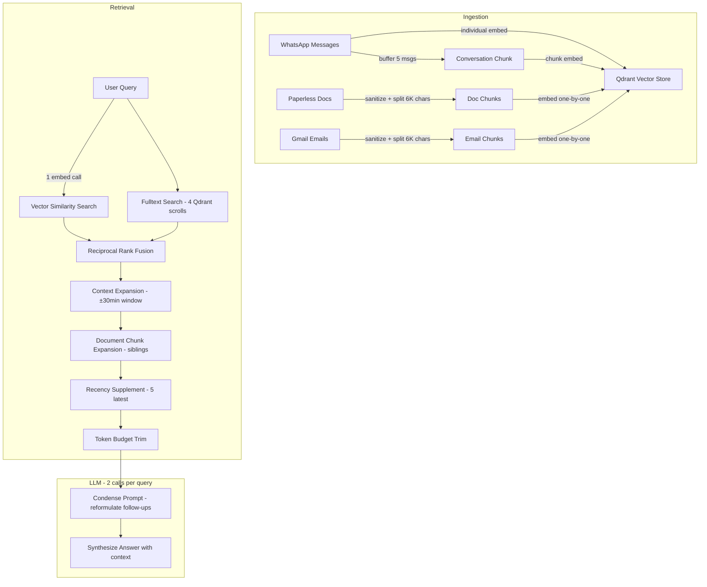
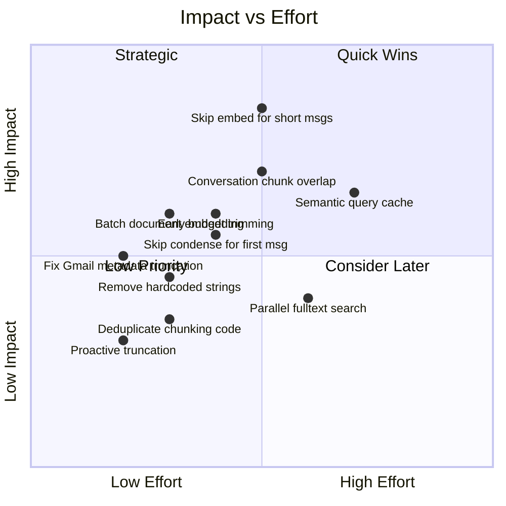

# RAG Pipeline Improvements Plan

## Current Architecture Overview



## Issues Found & Proposed Improvements

---

### 1. DOUBLE EMBEDDING PER WHATSAPP MESSAGE — Major Cost Savings

**Problem**: Every WhatsApp message is embedded TWICE:
- Individually via [`add_message()`](src/llamaindex_rag.py:734) → `index.insert_nodes([node])` (line 799)
- Also buffered, then the conversation chunk is embedded via [`_flush_chunk_buffer()`](src/llamaindex_rag.py:659) → `index.insert_nodes([chunk_node])` (line 722)

For every 5 messages: **6 embedding API calls** (5 individual + 1 chunk). That is a ~20% overhead on WhatsApp ingestion.

**Proposed Solution**: Introduce a configurable **minimum message length threshold** (read from settings, e.g. `rag_min_solo_embed_chars`). Messages shorter than this threshold are ONLY buffered for conversation chunking — no individual embedding. Messages above the threshold still get individual embeddings because they carry enough semantic meaning on their own.

**Estimated Impact**: ~20-40% reduction in WhatsApp embedding costs (most chat messages are short).

---

### 2. BATCH EMBEDDING FOR DOCUMENT CHUNKS — Cost & Speed

**Problem**: Both [`DocumentSyncer.sync_documents()`](src/plugins/paperless/sync.py:414) and [`EmailSyncer.sync_emails()`](src/plugins/gmail/sync.py:587) embed chunks one-by-one via `self.rag.add_node(node)` in a loop. Each call triggers a separate embedding API call and Qdrant upsert.

**Proposed Solution**: Collect all chunks for a document, then call [`add_nodes()`](src/llamaindex_rag.py:864) once. This lets LlamaIndex batch the embedding API call (one HTTP request for all chunks of a document instead of N separate requests). Also reduces Qdrant round-trips.

**Estimated Impact**: Fewer HTTP round-trips. No direct token cost savings (same total tokens), but significantly faster sync and reduced latency overhead.

---

### 3. GMAIL MESSAGE METADATA TRUNCATION — Quality Fix

**Problem**: In [`EmailSyncer.sync_emails()`](src/plugins/gmail/sync.py:743), the message metadata is truncated:
```python
chunk_meta["message"] = chunk[:2000]
```
But Paperless sync already stores the full chunk text (line 629 in paperless/sync.py). This inconsistency means Gmail fulltext search misses content beyond 2000 chars in the `message` field.

**Proposed Solution**: Align Gmail sync with Paperless — store the full chunk text in the `message` metadata field. This was already fixed for Paperless in a prior iteration.

---

### 4. HARDCODED HEBREW PREFIXES — User Constraint Violation

**Problem**: [`_HEBREW_PREFIXES`](src/llamaindex_rag.py:1044) is hardcoded:
```python
_HEBREW_PREFIXES = "הבלמשכו"
```
User explicitly stated: "I never want to hardcode words or letters."

Also hardcoded:
- Hebrew day name mapping in [`_build_system_prompt()`](src/llamaindex_rag.py:2056)
- Email signature markers in [`_sanitize_email_content()`](src/plugins/gmail/sync.py:167): `"Sent from my iPhone"`, `"Sent from my Galaxy"`

**Proposed Solution**:
- Move `_HEBREW_PREFIXES` to a settings key (e.g. `rag_morphology_prefixes`) so it is configurable
- Replace the hardcoded Hebrew day name dict with Python's `locale` module or the `babel` library, or move to a settings-driven translation map
- Move email signature markers to a settings key (e.g. `gmail_signature_markers`) as a comma-separated list

---

### 5. DEDUPLICATE SHARED CHUNKING CODE — Maintainability

**Problem**: [`_split_text()`](src/plugins/paperless/sync.py:296), [`_is_quality_chunk()`](src/plugins/paperless/sync.py:263), [`_strip_unicode_control()`](src/plugins/paperless/sync.py:54), and [`_strip_html()`](src/plugins/paperless/sync.py:126) are copy-pasted between:
- [`src/plugins/paperless/sync.py`](src/plugins/paperless/sync.py)
- [`src/plugins/gmail/sync.py`](src/plugins/gmail/sync.py)

**Proposed Solution**: Extract shared functions into a new `src/utils/text_processing.py` module. Both sync files import from there. Constants like `MAX_CHUNK_CHARS`, `CHUNK_OVERLAP_CHARS`, `MIN_CONTENT_CHARS`, `MIN_WORD_CHAR_RATIO` should also be centralized (and ideally read from settings for configurability).

---

### 6. CONVERSATION CHUNKING IMPROVEMENTS — Quality

**Problem**: Current chunking has several limitations:
- Fixed size of 5 messages ([`CHUNK_MAX_MESSAGES`](src/llamaindex_rag.py:609)) — not configurable via settings
- No overlap between chunks: messages 1-5 form chunk 1, messages 6-10 form chunk 2. The context boundary between message 5 and 6 is lost.
- Buffer TTL of 120s means slow conversations produce orphaned buffers with < 2 messages that never get chunked
- Chunk text includes formatted timestamps which dilute the semantic embedding

**Proposed Solution**:
- Make `CHUNK_MAX_MESSAGES` and `CHUNK_BUFFER_TTL` configurable via settings
- Add a sliding window overlap: when chunk N is flushed, keep the last 1-2 messages in the buffer as context seed for chunk N+1
- On TTL expiration, flush any buffer with ≥ 2 messages (currently they just expire and are lost — Redis TTL deletes the key). Add a periodic background check or rely on the next incoming message to trigger a flush.
- Consider a token-based chunking threshold instead of message-count, so 5 one-word messages produce a different chunk size than 5 paragraph-length messages

---

### 7. SKIP CONDENSE LLM CALL FOR FIRST MESSAGES — Cost Savings

**Problem**: [`CondensePlusContextChatEngine`](src/llamaindex_rag.py:2222) always makes 2 LLM calls per query:
1. Condense prompt (reformulate follow-up into standalone question)
2. Synthesize answer with retrieved context

For the **first message** in a conversation (no chat history), the condense step is completely wasteful — it just returns the original question unchanged.

**Proposed Solution**: This is a LlamaIndex engine behavior we cannot easily override without subclassing. However, we could:
- Check if the memory buffer is empty before creating the engine
- If empty, use a simpler `ContextChatEngine` (no condense step) for the first query, saving one LLM call per new conversation
- Switch to `CondensePlusContextChatEngine` for subsequent queries in the same conversation

**Estimated Impact**: Saves 1 LLM call for every new conversation start. With gpt-4o at $0.0025/1K in + $0.01/1K out, this saves ~$0.002-0.01 per first query depending on prompt size.

---

### 8. SEMANTIC QUERY CACHE — Cost Savings

**Problem**: Every query triggers a new embedding API call. Users frequently ask similar questions, and repeated queries within the same session trigger duplicate embedding calls.

**Proposed Solution**: Implement a lightweight Redis-backed semantic query cache:
- Cache key: hash of the query text
- Cache value: the embedding vector + search results (serialized)
- TTL: configurable (e.g. 5 minutes for embeddings, shorter for results)
- This avoids re-embedding identical queries and can also skip Qdrant searches for exact-match repeated queries

**Estimated Impact**: Varies by usage pattern. For chatbot scenarios with follow-ups, could save 20-30% of embedding calls.

---

### 9. CONTEXT EXPANSION OVER-FETCHING — Cost & Token Savings

**Problem**: The retrieval pipeline stacks multiple expansion steps:
1. Base search returns `k` results (default 10)
2. [`expand_context()`](src/llamaindex_rag.py:1654) fetches up to `k*2` = 20 surrounding messages
3. [`expand_document_chunks()`](src/llamaindex_rag.py:1762) fetches up to `k*3` = 30 total
4. Recency supplement adds 5 more
5. Then [`MAX_CONTEXT_TOKENS`](src/llamaindex_rag.py:282) budget trims results back down

This means we make many Qdrant queries to fetch 30+ results, then **throw most of them away** at the budget trimming step.

**Proposed Solution**: Apply the token budget earlier in the pipeline. After each expansion step, check remaining budget before proceeding to the next expansion. This reduces unnecessary Qdrant queries for context that will be trimmed anyway.

---

### 10. CONFIGURABLE EMBEDDING MODEL WITH QUALITY/COST TRADEOFF — Cost Option

**Current State**: Using `text-embedding-3-large` at $0.00013/1K tokens. This is already configurable via [`embedding_model`](src/settings_db.py:160) setting.

**Observation**: `text-embedding-3-small` costs $0.00002/1K tokens (6.5× cheaper) but underperforms on Hebrew. The current choice is correct for multilingual use.

**Proposed Improvement**: Add a settings description or UI tooltip explaining the cost/quality tradeoff, so users who don't need Hebrew support can consciously switch to the cheaper model. No code change needed — just documentation.

---

### 11. FULLTEXT SEARCH RUNS 4 SEPARATE QDRANT QUERIES — Efficiency

**Problem**: [`_fulltext_search()`](src/llamaindex_rag.py:1330) runs one `scroll()` per field (sender, chat_name, message, numbers). Each is a separate HTTP roundtrip to Qdrant.

**Proposed Solution**: This is hard to combine due to Qdrant's filter semantics — each field needs different `should` conditions. However, we could run them in parallel using `asyncio` or `ThreadPoolExecutor`. This doesn't reduce Qdrant load but reduces wall-clock latency.

---

### 12. EMBEDDING SAFETY TRUNCATION LOGIC — Robustness

**Problem**: [`EMBEDDING_MAX_CHARS = 7_000`](src/llamaindex_rag.py:824) is applied reactively — it only truncates AFTER a 400 error occurs. The first attempt with the full text always fails for oversized content.

**Proposed Solution**: Pre-check text length before calling `insert_nodes()`. If text exceeds `EMBEDDING_MAX_CHARS`, truncate proactively. This avoids one wasted API call per oversized document.

---

## Priority Matrix



## Suggested Implementation Order

1. **Remove hardcoded strings** — User constraint, simple settings move
2. **Fix Gmail metadata truncation** — One-line fix, aligns with Paperless
3. **Deduplicate shared chunking code** — Extract to `utils/text_processing.py`
4. **Skip embedding for short WhatsApp messages** — Biggest cost savings
5. **Batch document chunk embedding** — Speed improvement for syncs
6. **Apply early budget trimming in retrieval** — Reduce wasted Qdrant queries
7. **Proactive embedding truncation** — Avoid wasted API calls
8. **Conversation chunking improvements** — Overlap, configurable size
9. **Skip condense for first message** — Save 1 LLM call per new conversation
10. **Semantic query cache** — More complex, evaluate ROI first
11. **Parallel fulltext search** — Latency improvement, lower priority
