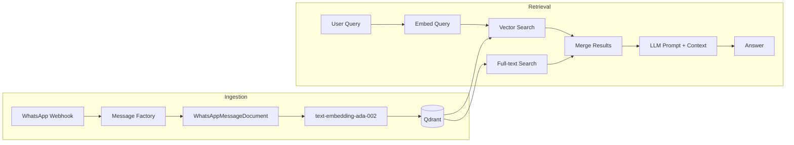
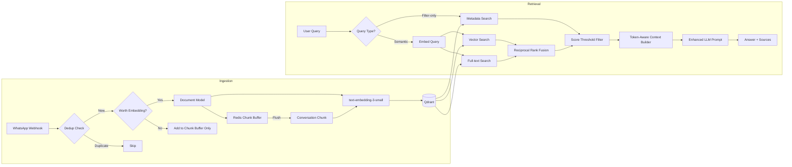

# RAG System Optimization Plan

## Executive Summary

A deep audit of the RAG system reveals that while the **architecture is fundamentally sound** — Qdrant vector store, LlamaIndex integration, Pydantic document hierarchy, hybrid search, Redis caching — there are **14 concrete optimization opportunities** across embedding quality, storage efficiency, retrieval accuracy, and query intelligence. Most of the value comes from 5 high-impact changes.

---

## Current Architecture



### What Works Well

| Aspect | Details |
|--------|---------|
| **Document hierarchy** | Clean `BaseRAGDocument` → `WhatsAppMessageDocument` / `FileDocument` / `CallRecordingDocument` with Pydantic v2 |
| **Hybrid search** | Combines vector similarity + full-text search on metadata fields |
| **Redis caching** | Chat/sender lists use Redis SETs with incremental updates on each `add_message()` |
| **Lazy LLM init** | LLM is only configured on first `query()` call, not at startup |
| **Text indexes** | Qdrant text indexes on `sender`, `chat_name`, `message` for full-text search |
| **Singleton pattern** | Single RAG instance shared across Flask app |

---

## Issues Found (Ranked by Impact)

### 🔴 Issue 1: No Message Grouping — Loss of Conversational Context ⏳ PENDING

**File:** [`src/llamaindex_rag.py:add_message()`](src/llamaindex_rag.py:276)

**Problem:** Each WhatsApp message is stored as an **isolated point** in Qdrant. A message like _"yes I will be there"_ has zero context about what "there" refers to. When a user asks _"did anyone confirm for the meeting?"_, the semantic search may find this message but the LLM has no surrounding context to interpret it.

**Current behavior:**
```
Point 1: "Date: 10:25 | Sender: David | Message: Are we meeting at 3pm?"
Point 2: "Date: 10:26 | Sender: John  | Message: yes I will be there"
Point 3: "Date: 10:27 | Sender: Sarah | Message: me too"
```

Each point is embedded independently — "yes I will be there" and "me too" are nearly meaningless in isolation.

**Recommendation:** Implement a **sliding-window conversation chunking** strategy:

```
Chunk 1 (10:25-10:27):
  [10:25] David: Are we meeting at 3pm?
  [10:26] John: yes I will be there
  [10:27] Sarah: me too
```

This gives each embedded chunk enough context for the LLM to understand what is being discussed.

**Proposed approach:**
- Buffer incoming messages per chat in Redis with a short TTL (e.g., 2 minutes)
- When the buffer reaches N messages (e.g., 5) or times out, flush as a single chunk
- Each chunk includes all individual messages concatenated, plus metadata from the first/last message
- Individual messages are still stored as separate points for exact-match retrieval
- The chunk is stored as an additional "context" point with `source_type: "conversation_chunk"`

---

### ~~🔴 Issue 2: Embedding Text is Bloated with Redundant Metadata~~ ✅ DONE

**File:** [`src/models/whatsapp.py:get_embedding_text()`](src/models/whatsapp.py:133)

**Problem:** The embedding text includes data that is already stored as filterable metadata fields:

```python
# Current output:
"Date: 31/12/2024 10:30 | Sender name: David Pickel | First name: David | Last name: Pickel | Group: Family Chat | Message: hello everyone"
```

This wastes ~60% of the embedding tokens on metadata that:
- Is already stored in Qdrant payload fields (`sender`, `chat_name`, `timestamp`)
- Is already filterable via Qdrant filters
- Dilutes the semantic signal of the actual message content

**Applied:** `WhatsAppMessageDocument.get_embedding_text()` in `models/whatsapp.py` now uses lean format: `"{sender} in {chat_name} {message}"`. Metadata stored as Qdrant payload fields for filtering.

---

### ~~🟡 Issue 3: Legacy Embedding Model~~ ✅ DONE

**Applied:** Upgraded to `text-embedding-3-large` with `dimensions=1024` for optimal Hebrew+English multilingual support. Configurable via `settings.embedding_model`.

---

### ~~🟡 Issue 4: Naive Hybrid Search Merge~~ ✅ DONE

**Applied:** `_reciprocal_rank_fusion()` method in `llamaindex_rag.py` merges vector and full-text results using standard RRF scoring with `rrf_k=60`.

---

### ~~🟡 Issue 5: No Relevance Score Threshold~~ ✅ DONE

**Applied:** `MINIMUM_SIMILARITY_SCORE` (configurable via `settings.rag_min_score`) filters out low-scoring vector results before merging.

---

### 🟡 Issue 6: Embedding Waste on Low-Value Messages ⏳ PENDING

**File:** [`src/llamaindex_rag.py:add_message()`](src/llamaindex_rag.py:276)

**Problem:** Every single message gets an embedding, including:
- "ok" / "👍" / "lol" / "thanks" / "good" / "yes" / "no"
- System messages like "[image]" or "[sticker]"
- Very short messages with no semantic content

Each embedding costs ~$0.00002 with ada-002 (less with 3-small), but at scale with thousands of messages per day, this adds up. More importantly, these low-value embeddings consume Qdrant storage and can be returned as irrelevant search results.

**Recommendation:** Filter before embedding:

```python
MIN_MESSAGE_LENGTH = 10  # characters
SKIP_PATTERNS = {"ok", "lol", "thanks", "👍", "❤️", "yes", "no", "haha", ...}

def should_embed(message: str) -> bool:
    stripped = message.strip().lower()
    if len(stripped) < MIN_MESSAGE_LENGTH:
        return False
    if stripped in SKIP_PATTERNS:
        return False
    return True
```

These messages should still be stored in conversation chunks (Issue 1) for context, but don't need individual embeddings.

---

### ~~🟢 Issue 7: Missing Qdrant Payload Indexes~~ ✅ DONE

**Applied:** `_ensure_payload_indexes()` creates indexes on `timestamp` (INTEGER), `source_type` (KEYWORD), `is_group` (BOOL), and `source_id` (KEYWORD).

---

### ~~🟢 Issue 8: No Message Deduplication~~ ✅ DONE

**Applied:** `_message_exists()` checks for existing `source_id` via Qdrant scroll with keyword index before inserting.

---

### ~~🟢 Issue 9: Context Window Not Managed in query()~~ ✅ DONE

**Applied:** The manual `query()` method was replaced by `CondensePlusContextChatEngine` which handles context window management via `ChatMemoryBuffer` with configurable `token_limit`. `MAX_CONTEXT_TOKENS` is configurable via `settings.rag_max_context_tokens`.

---

### 🟢 Issue 10: Collection Name is Misleading ⏳ PENDING

**File:** [`src/llamaindex_rag.py:COLLECTION_NAME`](src/llamaindex_rag.py:81)

**Problem:** `COLLECTION_NAME = "whatsapp_messages"` but the collection stores WhatsApp messages, file documents, AND call recordings. This is confusing and limits future optimization (e.g., different vector sizes per doc type).

**Recommendation:** Rename to `"documents"` or `"knowledge_base"`. This is a low-effort change with high clarity benefit. Can be done alongside any re-indexing effort.

---

### 🟢 Issue 11: Full-text Search Doesn't Distinguish Field Relevance ⏳ PENDING

**File:** [`src/llamaindex_rag.py:_fulltext_search()`](src/llamaindex_rag.py:442)

**Problem:** The `should` filter matches the query against `sender`, `chat_name`, AND `message` with equal weight. A search for "David" returns messages FROM David, IN chats named David, and ABOUT David — all mixed together with no way to distinguish which field matched.

**Recommendation:** When the query appears to be a person name (detected via entity extraction), prioritize `sender` field matches. This can be done by running separate full-text queries per field and assigning different scores:

```python
# Sender matches get highest full-text score
sender_results = search_by_field("sender", query, score=0.95)
# Chat name matches get medium score
chat_results = search_by_field("chat_name", query, score=0.85)
# Message content matches get lower score
message_results = search_by_field("message", query, score=0.75)
```

---

### ~~🟢 Issue 12: No Metadata-Only Search Path~~ ✅ DONE

**Applied:** `search()` accepts `metadata_only=True` parameter and `_metadata_search()` method handles filter-only queries without vector search.

---

### ~~🟢 Issue 13: Redis Cache TTL vs Incremental Updates Conflict~~ ✅ DONE

**Applied:** `_update_cached_lists()` refreshes TTL on every incremental update via `redis.expire()` after each `sadd()`.

---

### ~~🟢 Issue 14: LLM Prompt in query() Lacks Structure~~ ✅ DONE

**Applied:** `_build_system_prompt()` includes structured instructions: cite specific messages, synthesize multiple sources, don't fabricate, answer in same language, with current date/time in both English and Hebrew.

---

## Proposed Architecture (After Optimizations)



---

## Implementation Priority

### ~~Phase 1: High Impact, Low Risk~~ ✅ ALL DONE

| # | Change | Status |
|---|--------|--------|
| 1 | Add relevance score threshold | ✅ Done |
| 2 | Fix hybrid search merge with RRF | ✅ Done |
| 3 | Add missing Qdrant payload indexes | ✅ Done |
| 4 | Add message deduplication | ✅ Done |
| 5 | Refresh Redis cache TTL on updates | ✅ Done |
| 6 | Token-aware context building | ✅ Done (via ChatMemoryBuffer) |

### Phase 2: Medium Impact ⚠️ MOSTLY DONE

| # | Change | Status |
|---|--------|--------|
| 7 | Upgrade embedding model | ✅ Done (text-embedding-3-large) |
| 8 | Lean embedding text | ✅ Done |
| 9 | Filter low-value messages from embedding | ⏳ Pending |
| 10 | Enhanced LLM prompt | ✅ Done |

### Phase 3: Architectural Improvements ⚠️ MOSTLY PENDING

| # | Change | Status |
|---|--------|--------|
| 11 | Conversation chunking (sliding window) | ⏳ Pending |
| 12 | Field-aware full-text search scoring | ⏳ Pending |
| 13 | Metadata-only search path | ✅ Done |
| 14 | Rename collection to "knowledge_base" | ⏳ Pending |

---

## Key Decision Points

Before implementation, we should decide:

1. **Re-indexing strategy:** When upgrading embedding model + text format, should we:
   - (a) Re-index everything (clean, but requires downtime)
   - (b) Create new collection + migrate gradually
   - (c) Accept mixed embeddings (new format going forward)

2. **Conversation chunking:** Should chunks:
   - (a) Replace individual message points (simpler, less storage)
   - (b) Exist alongside individual points (more flexibility, more storage)
   
3. **Low-value message filtering:** Should filtered messages:
   - (a) Not be stored at all
   - (b) Be stored without embeddings (metadata only)
   - (c) Only appear in conversation chunks

4. **Score threshold:** Should it be:
   - (a) Fixed (e.g., 0.5)
   - (b) Configurable via env var
   - (c) Dynamic based on score distribution of results
