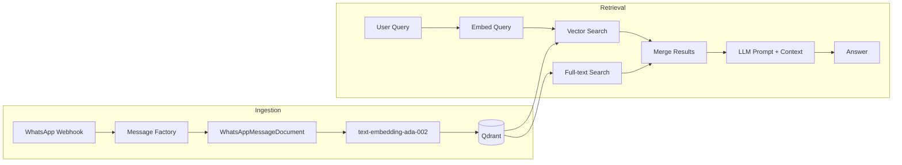
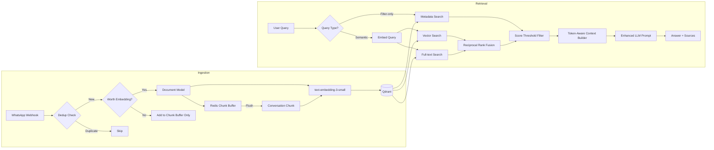

# RAG System Optimization Plan

## Executive Summary

A deep audit of the RAG system reveals that while the **architecture is fundamentally sound** — Qdrant vector store, LlamaIndex integration, Pydantic document hierarchy, hybrid search, Redis caching — there are **14 concrete optimization opportunities** across embedding quality, storage efficiency, retrieval accuracy, and query intelligence. Most of the value comes from 5 high-impact changes.

---

## Current Architecture



### What Works Well

| Aspect | Details |
|--------|---------|
| **Document hierarchy** | Clean `BaseRAGDocument` → `WhatsAppMessageDocument` / `FileDocument` / `CallRecordingDocument` with Pydantic v2 |
| **Hybrid search** | Combines vector similarity + full-text search on metadata fields |
| **Redis caching** | Chat/sender lists use Redis SETs with incremental updates on each `add_message()` |
| **Lazy LLM init** | LLM is only configured on first `query()` call, not at startup |
| **Text indexes** | Qdrant text indexes on `sender`, `chat_name`, `message` for full-text search |
| **Singleton pattern** | Single RAG instance shared across Flask app |

---

## Issues Found (Ranked by Impact)

### 🔴 Issue 1: No Message Grouping — Loss of Conversational Context

**File:** [`src/llamaindex_rag.py:add_message()`](src/llamaindex_rag.py:276)

**Problem:** Each WhatsApp message is stored as an **isolated point** in Qdrant. A message like _"yes I will be there"_ has zero context about what "there" refers to. When a user asks _"did anyone confirm for the meeting?"_, the semantic search may find this message but the LLM has no surrounding context to interpret it.

**Current behavior:**
```
Point 1: "Date: 10:25 | Sender: David | Message: Are we meeting at 3pm?"
Point 2: "Date: 10:26 | Sender: John  | Message: yes I will be there"
Point 3: "Date: 10:27 | Sender: Sarah | Message: me too"
```

Each point is embedded independently — "yes I will be there" and "me too" are nearly meaningless in isolation.

**Recommendation:** Implement a **sliding-window conversation chunking** strategy:

```
Chunk 1 (10:25-10:27):
  [10:25] David: Are we meeting at 3pm?
  [10:26] John: yes I will be there
  [10:27] Sarah: me too
```

This gives each embedded chunk enough context for the LLM to understand what is being discussed.

**Proposed approach:**
- Buffer incoming messages per chat in Redis with a short TTL (e.g., 2 minutes)
- When the buffer reaches N messages (e.g., 5) or times out, flush as a single chunk
- Each chunk includes all individual messages concatenated, plus metadata from the first/last message
- Individual messages are still stored as separate points for exact-match retrieval
- The chunk is stored as an additional "context" point with `source_type: "conversation_chunk"`

---

### 🔴 Issue 2: Embedding Text is Bloated with Redundant Metadata

**File:** [`src/models/whatsapp.py:get_embedding_text()`](src/models/whatsapp.py:133)

**Problem:** The embedding text includes data that is already stored as filterable metadata fields:

```python
# Current output:
"Date: 31/12/2024 10:30 | Sender name: David Pickel | First name: David | Last name: Pickel | Group: Family Chat | Message: hello everyone"
```

This wastes ~60% of the embedding tokens on metadata that:
- Is already stored in Qdrant payload fields (`sender`, `chat_name`, `timestamp`)
- Is already filterable via Qdrant filters
- Dilutes the semantic signal of the actual message content

**Impact:** The embedding vector represents "Date: 31/12/2024 10:30 | Sender name: David Pickel..." more than it represents the actual message "hello everyone". Semantic search for _"greetings"_ may not find this message because the embedding is dominated by metadata noise.

**Recommendation:** Lean embedding text focused on semantic content:

```python
# Proposed:
def get_embedding_text(self) -> str:
    parts = []
    if self.sender:
        parts.append(f"{self.sender}")
    if self.chat_name and self.is_group:
        parts.append(f"in {self.chat_name}")
    parts.append(self.message)
    return " ".join(parts)
    # Result: "David Pickel in Family Chat: hello everyone"
```

**Note:** Sender name should remain in the embedding (but shorter) because users often ask _"what did David say about X?"_ — the name must be in the embedding for this to work semantically. Dates should NOT be in the embedding because date filtering is better done via metadata filters.

**Migration consideration:** Changing the embedding text format means existing embeddings become inconsistent with new ones. Options:
1. **Re-index all** — Best quality, requires downtime
2. **New collection** — Run both collections during transition
3. **Accept gradual drift** — New messages use new format, old ones stay as-is (acceptable for chat data where recency matters most)

---

### 🟡 Issue 3: Legacy Embedding Model

**File:** [`src/llamaindex_rag.py:_configure_embedding()`](src/llamaindex_rag.py:116)

**Problem:** Using `text-embedding-ada-002` (legacy). OpenAI's `text-embedding-3-small` is:
- **5x cheaper** per token
- **Better quality** on MTEB benchmarks
- **Same dimensions** (1536) — drop-in replacement
- Supports **dimension reduction** if storage is a concern

**Recommendation:** Switch to `text-embedding-3-small`. This is already noted in the [current improvements plan](plans/current-improvements-plan.md) but deserves emphasis because it directly affects retrieval quality AND cost.

---

### 🟡 Issue 4: Naive Hybrid Search Merge

**File:** [`src/llamaindex_rag.py:search()`](src/llamaindex_rag.py:524)

**Problem:** The hybrid merge strategy has three issues:

1. **All full-text results get score=1.0** regardless of match quality
2. **Full-text results are inserted at position 0** (before all vector results), even if the vector results are more relevant
3. **No score normalization** between the two search types

```python
# Current (line 654):
for ft_result in fulltext_results:
    if ft_result.node and ft_result.node.id_ not in seen_ids:
        merged.insert(0, ft_result)  # Always at the beginning!
```

**Impact:** A query like _"what is the latest news?"_ will surface any message containing the word "news" (full-text match) before semantically relevant messages about current events (vector match).

**Recommendation:** Implement Reciprocal Rank Fusion (RRF):

```python
def reciprocal_rank_fusion(vector_results, fulltext_results, k=60):
    """Merge results using RRF scoring."""
    scores = {}
    for rank, result in enumerate(vector_results):
        node_id = result.node.id_
        scores[node_id] = scores.get(node_id, 0) + 1.0 / (k + rank + 1)
    for rank, result in enumerate(fulltext_results):
        node_id = result.node.id_
        scores[node_id] = scores.get(node_id, 0) + 1.0 / (k + rank + 1)
    # Sort by combined score, return top-k
```

RRF is the standard approach for hybrid search and doesn't require score normalization.

---

### 🟡 Issue 5: No Relevance Score Threshold

**File:** [`src/llamaindex_rag.py:search()`](src/llamaindex_rag.py:524)

**Problem:** All results are returned regardless of cosine similarity score. With `k=10`, the system returns 10 results even if only 2 are relevant. Low-scoring results pollute the LLM context and can cause hallucinations.

**Example:** Query _"what did David say about the project deadline?"_ returns:
- Score 0.92: David's message about the deadline ✅
- Score 0.85: David's message about another project ✅
- Score 0.41: Random message mentioning "project" ❌
- Score 0.38: Random message mentioning "David" ❌

**Recommendation:** Add a configurable minimum score threshold:

```python
MINIMUM_SIMILARITY_SCORE = 0.5  # Configurable via env

valid_results = [r for r in results if r.score >= MINIMUM_SIMILARITY_SCORE]
```

---

### 🟡 Issue 6: Embedding Waste on Low-Value Messages

**File:** [`src/llamaindex_rag.py:add_message()`](src/llamaindex_rag.py:276)

**Problem:** Every single message gets an embedding, including:
- "ok" / "👍" / "lol" / "thanks" / "good" / "yes" / "no"
- System messages like "[image]" or "[sticker]"
- Very short messages with no semantic content

Each embedding costs ~$0.00002 with ada-002 (less with 3-small), but at scale with thousands of messages per day, this adds up. More importantly, these low-value embeddings consume Qdrant storage and can be returned as irrelevant search results.

**Recommendation:** Filter before embedding:

```python
MIN_MESSAGE_LENGTH = 10  # characters
SKIP_PATTERNS = {"ok", "lol", "thanks", "👍", "❤️", "yes", "no", "haha", ...}

def should_embed(message: str) -> bool:
    stripped = message.strip().lower()
    if len(stripped) < MIN_MESSAGE_LENGTH:
        return False
    if stripped in SKIP_PATTERNS:
        return False
    return True
```

These messages should still be stored in conversation chunks (Issue 1) for context, but don't need individual embeddings.

---

### 🟢 Issue 7: Missing Qdrant Payload Indexes

**File:** [`src/llamaindex_rag.py:_ensure_text_indexes()`](src/llamaindex_rag.py:222)

**Problem:** Only text indexes are created. The `timestamp`, `is_group`, and `source_type` fields have no payload indexes, meaning filters on these fields require Qdrant to scan all points.

**Recommendation:** Add keyword/integer indexes:

```python
# Integer index on timestamp for range queries
self.qdrant_client.create_payload_index(
    collection_name=self.COLLECTION_NAME,
    field_name="timestamp",
    field_schema=PayloadSchemaType.INTEGER
)

# Keyword index on source_type for filtering
self.qdrant_client.create_payload_index(
    collection_name=self.COLLECTION_NAME,
    field_name="source_type",
    field_schema=PayloadSchemaType.KEYWORD
)

# Bool index on is_group
self.qdrant_client.create_payload_index(
    collection_name=self.COLLECTION_NAME,
    field_name="is_group",
    field_schema=PayloadSchemaType.BOOL
)
```

---

### 🟢 Issue 8: No Message Deduplication

**File:** [`src/llamaindex_rag.py:add_message()`](src/llamaindex_rag.py:276)

**Problem:** If WAHA retries a webhook (due to timeout/error), the same message is stored multiple times. The `source_id` is `{chat_id}:{timestamp}`, but no check is performed before insertion.

**Recommendation:** Check for existing documents before inserting:

```python
def _message_exists(self, chat_id: str, timestamp: str) -> bool:
    source_id = f"{chat_id}:{timestamp}"
    results, _ = self.qdrant_client.scroll(
        collection_name=self.COLLECTION_NAME,
        scroll_filter=Filter(must=[
            FieldCondition(key="source_id", match=MatchValue(value=source_id))
        ]),
        limit=1,
        with_payload=False,
        with_vectors=False
    )
    return len(results) > 0
```

Add a `source_id` keyword index to make this check efficient.

---

### 🟢 Issue 9: Context Window Not Managed in query()

**File:** [`src/llamaindex_rag.py:query()`](src/llamaindex_rag.py:668)

**Problem:** The `query()` method concatenates all retrieved results into a single context string with no size limit:

```python
context = "\n".join(context_parts)  # Could be arbitrarily large
```

With `k=10` and long messages, the prompt could exceed the model's context window or waste tokens on less-relevant results.

**Recommendation:** Implement token-aware context building:

```python
import tiktoken

MAX_CONTEXT_TOKENS = 3000  # Leave room for prompt + response

enc = tiktoken.encoding_for_model("gpt-4o")
context_parts = []
total_tokens = 0

for result in results:
    text = result.node.text
    tokens = len(enc.encode(text))
    if total_tokens + tokens > MAX_CONTEXT_TOKENS:
        break
    context_parts.append(text)
    total_tokens += tokens
```

---

### 🟢 Issue 10: Collection Name is Misleading

**File:** [`src/llamaindex_rag.py:COLLECTION_NAME`](src/llamaindex_rag.py:81)

**Problem:** `COLLECTION_NAME = "whatsapp_messages"` but the collection stores WhatsApp messages, file documents, AND call recordings. This is confusing and limits future optimization (e.g., different vector sizes per doc type).

**Recommendation:** Rename to `"documents"` or `"knowledge_base"`. This is a low-effort change with high clarity benefit. Can be done alongside any re-indexing effort.

---

### 🟢 Issue 11: Full-text Search Doesn't Distinguish Field Relevance

**File:** [`src/llamaindex_rag.py:_fulltext_search()`](src/llamaindex_rag.py:442)

**Problem:** The `should` filter matches the query against `sender`, `chat_name`, AND `message` with equal weight. A search for "David" returns messages FROM David, IN chats named David, and ABOUT David — all mixed together with no way to distinguish which field matched.

**Recommendation:** When the query appears to be a person name (detected via entity extraction), prioritize `sender` field matches. This can be done by running separate full-text queries per field and assigning different scores:

```python
# Sender matches get highest full-text score
sender_results = search_by_field("sender", query, score=0.95)
# Chat name matches get medium score
chat_results = search_by_field("chat_name", query, score=0.85)
# Message content matches get lower score
message_results = search_by_field("message", query, score=0.75)
```

---

### 🟢 Issue 12: No Metadata-Only Search Path

**File:** [`src/llamaindex_rag.py:search()`](src/llamaindex_rag.py:524)

**Problem:** Queries like _"show me all messages from David in Family Group last week"_ trigger a full vector search when only metadata filters are needed. This wastes an embedding API call and may return less relevant results than a pure metadata filter.

**Recommendation:** Detect filter-only queries and skip vector search:

```python
def search(self, query, k, filter_chat_name, filter_sender, filter_days,
           metadata_only=False):
    if metadata_only or self._is_filter_only_query(query):
        return self._metadata_search(filter_chat_name, filter_sender, filter_days, k)
    # ... existing hybrid search
```

---

### 🟢 Issue 13: Redis Cache TTL vs Incremental Updates Conflict

**File:** [`src/llamaindex_rag.py:REDIS_LISTS_TTL`](src/llamaindex_rag.py:793)

**Problem:** The Redis cache for chat/sender lists has a 1-hour TTL (`REDIS_LISTS_TTL = 3600`), but the cache is incrementally updated on every `add_message()` call. The TTL can cause the cache to expire and trigger a full Qdrant scan rebuild, even though the cache was being kept current incrementally.

**Recommendation:** Either:
1. Remove the TTL entirely (rely on incremental updates + manual invalidation)
2. Set a much longer TTL (24h) as a safety net
3. Refresh TTL on every incremental update

Option 3 is simplest:
```python
def _update_cached_lists(self, chat_name=None, sender=None):
    redis = get_redis_client()
    if chat_name:
        redis.sadd(self.REDIS_CHAT_SET_KEY, chat_name)
        redis.expire(self.REDIS_CHAT_SET_KEY, self.REDIS_LISTS_TTL)  # Reset TTL
    if sender:
        redis.sadd(self.REDIS_SENDER_SET_KEY, sender)
        redis.expire(self.REDIS_SENDER_SET_KEY, self.REDIS_LISTS_TTL)  # Reset TTL
```

---

### 🟢 Issue 14: LLM Prompt in query() Lacks Structure

**File:** [`src/llamaindex_rag.py:query()`](src/llamaindex_rag.py:741)

**Problem:** The prompt sent to the LLM is basic — no structured output format, no source attribution, no chain-of-thought, no use of session established facts.

**Recommendation:** Enhance prompt with:
- Source attribution instructions ("cite specific messages")
- Structured thinking ("first identify relevant messages, then synthesize")
- Session context ("established facts from this conversation: ...")
- Confidence indication ("if unsure, say so")

---

## Proposed Architecture (After Optimizations)



---

## Implementation Priority

### Phase 1: High Impact, Low Risk
These changes improve quality and reduce cost without requiring re-indexing.

| # | Change | Impact | Files |
|---|--------|--------|-------|
| 1 | Add relevance score threshold | Reduces hallucinations | `llamaindex_rag.py` |
| 2 | Fix hybrid search merge with RRF | Better result ranking | `llamaindex_rag.py` |
| 3 | Add missing Qdrant payload indexes | Faster filtered queries | `llamaindex_rag.py` |
| 4 | Add message deduplication | Prevents duplicates | `llamaindex_rag.py` |
| 5 | Refresh Redis cache TTL on updates | Prevents unnecessary rebuilds | `llamaindex_rag.py` |
| 6 | Token-aware context building | Prevents context overflow | `llamaindex_rag.py` |

### Phase 2: Medium Impact, Requires Embedding Changes
These improve embedding quality but affect new messages only (old ones keep old format).

| # | Change | Impact | Files |
|---|--------|--------|-------|
| 7 | Upgrade to text-embedding-3-small | Better quality, lower cost | `llamaindex_rag.py` |
| 8 | Lean embedding text (remove metadata bloat) | Better semantic search | `models/whatsapp.py` |
| 9 | Filter low-value messages from embedding | Cost savings | `llamaindex_rag.py` |
| 10 | Enhanced LLM prompt with source attribution | Better answers | `llamaindex_rag.py` |

### Phase 3: Architectural Improvements
These require more design work and testing.

| # | Change | Impact | Files |
|---|--------|--------|-------|
| 11 | Conversation chunking (sliding window) | Major context improvement | `llamaindex_rag.py`, new buffer logic |
| 12 | Field-aware full-text search scoring | Better name/chat queries | `llamaindex_rag.py` |
| 13 | Metadata-only search path | Skip unnecessary embeddings | `llamaindex_rag.py` |
| 14 | Rename collection to "knowledge_base" | Clarity (do during re-index) | `llamaindex_rag.py` |

---

## Key Decision Points

Before implementation, we should decide:

1. **Re-indexing strategy:** When upgrading embedding model + text format, should we:
   - (a) Re-index everything (clean, but requires downtime)
   - (b) Create new collection + migrate gradually
   - (c) Accept mixed embeddings (new format going forward)

2. **Conversation chunking:** Should chunks:
   - (a) Replace individual message points (simpler, less storage)
   - (b) Exist alongside individual points (more flexibility, more storage)
   
3. **Low-value message filtering:** Should filtered messages:
   - (a) Not be stored at all
   - (b) Be stored without embeddings (metadata only)
   - (c) Only appear in conversation chunks

4. **Score threshold:** Should it be:
   - (a) Fixed (e.g., 0.5)
   - (b) Configurable via env var
   - (c) Dynamic based on score distribution of results
