# Call Recordings Page Redesign — Architecture Plan

## Overview

Replace the current inline call recordings table (embedded in Settings → Plugins → Call Recordings) with a **dedicated `/recordings` page** featuring:

- A proper data table with sortable columns
- Filter toolbar (status, date range, speaker, free-text search)
- Speaker assignment UI (rename "Speaker A" / "Speaker B" in transcript text)
- Configurable "My Name" setting so one speaker can be identified as "me"
- Full action set: approve, transcribe, retranscribe, restart, delete

---

## Current Architecture


### Current DB Schema (`call_recording_files`)
| Column | Type | Purpose |
|--------|------|---------|
| content_hash | TEXT UNIQUE | Primary identifier |
| filename | TEXT | Original filename |
| file_path | TEXT | Disk path |
| file_size | INTEGER | Bytes |
| extension | TEXT | Audio format |
| modified_at | TEXT | Recording date/time |
| status | TEXT | pending/transcribing/transcribed/approved/error |
| transcript_text | TEXT | Full transcription with speaker labels |
| language | TEXT | Detected language code |
| duration_seconds | INTEGER | Audio duration |
| confidence | REAL | Transcription confidence |
| participants | TEXT JSON | Auto-detected participant names |
| contact_name | TEXT | User-editable contact name |
| phone_number | TEXT | Contact phone |
| error_message | TEXT | Error details |
| source_id | TEXT | Qdrant source_id after approval |
| transcription_started_at | TEXT | Timestamp |
| transcription_progress | TEXT | Live progress message |
| created_at | TEXT | Row creation time |
| updated_at | TEXT | Last modification |

---

## Proposed Architecture

```mermaid
flowchart TD
    subgraph New Dedicated Page
        RP[/recordings Route]
        RP --> LO[Layout with Sidebar]
        LO --> RPG[recordings_page Component]
        RPG --> HDR[Header: Title + Stats + Actions]
        RPG --> FLT[Filter Toolbar]
        RPG --> TBL[Data Table]
        RPG --> EXP[Expandable Row Detail]
    end

    subgraph Filter Toolbar
        FLT --> F1[Status Dropdown]
        FLT --> F2[Date Range Picker]
        FLT --> F3[Speaker Name Search]
        FLT --> F4[Free-text Search]
    end

    subgraph Table Columns
        TBL --> C1[Date/Time]
        TBL --> C2[Contact/Speaker]
        TBL --> C3[Duration]
        TBL --> C4[Speakers Count]
        TBL --> C5[Status Badge]
        TBL --> C6[Language]
        TBL --> C7[Actions]
    end

    subgraph Expandable Detail
        EXP --> T1[Full Transcript with Speaker Labels]
        EXP --> T2[Speaker A Assignment Dropdown]
        EXP --> T3[Speaker B Assignment Dropdown]
        EXP --> T4[Apply Speaker Names Button]
    end

    subgraph Backend Changes
        BE1[New setting: call_recordings_my_name]
        BE2[New DB cols: speaker_a_label + speaker_b_label]
        BE3[PUT /files/hash/speakers Endpoint]
    end
```

---

## Detailed Changes

### 1. Backend — New Setting: `call_recordings_my_name`

**File:** `src/plugins/call_recordings/plugin.py`

Add to [`get_default_settings()`](src/plugins/call_recordings/plugin.py:80):
```python
(
    "call_recordings_my_name",
    "",
    "call_recordings",
    "text",
    "Your display name — used as default for 'Speaker A' in transcriptions",
),
```

Also add to [`SETTING_LABELS`](ui-reflex/ui_reflex/state.py:137) in the UI state:
```python
"call_recordings_my_name": "My Name (Speaker Default)",
```

### 2. Backend — DB Schema Migration

**File:** `src/plugins/call_recordings/db.py`

Add two new columns to the `call_recording_files` table:

| Column | Type | Default | Purpose |
|--------|------|---------|---------|
| speaker_a_label | TEXT | '' | User-assigned name for Speaker A |
| speaker_b_label | TEXT | '' | User-assigned name for Speaker B |

Add migration in [`init_table()`](src/plugins/call_recordings/db.py:62):
```python
_migrate_speaker_columns(conn)
```

New migration function:
```python
def _migrate_speaker_columns(conn):
    for col in ("speaker_a_label", "speaker_b_label"):
        try:
            conn.execute(f"SELECT {col} FROM call_recording_files LIMIT 1")
        except sqlite3.OperationalError:
            conn.execute(
                f"ALTER TABLE call_recording_files ADD COLUMN {col} TEXT DEFAULT ''"
            )
```

### 3. Backend — Speaker Label Replacement Endpoint

**File:** `src/plugins/call_recordings/plugin.py`

New route in [`get_blueprint()`](src/plugins/call_recordings/plugin.py:422):

```
PUT /plugins/call_recordings/files/<content_hash>/speakers
```

**Request body:**
```json
{
    "speaker_a": "David",
    "speaker_b": "Amir Adar"
}
```

**Logic:**
1. Read `transcript_text` from DB
2. Replace `"Speaker A:"` → `"David:"` and `"Speaker B:"` → `"Amir Adar:"` in the transcript text
3. Store the new labels in `speaker_a_label` / `speaker_b_label` columns
4. Write the updated transcript text back to DB
5. If the file is already `approved`, re-index in Qdrant with updated text

### 4. Backend — New DB Helper Functions

**File:** `src/plugins/call_recordings/db.py`

```python
def update_speaker_labels(
    content_hash: str,
    speaker_a: str = "",
    speaker_b: str = "",
    updated_transcript: str = "",
) -> bool:
    """Update speaker labels and optionally the transcript text."""
```

```python
def count_speakers(transcript_text: str) -> int:
    """Count unique speaker labels in a transcript."""
```

### 5. Backend — Expose Speaker Data in API Response

**File:** `src/plugins/call_recordings/db.py` — [`list_files()`](src/plugins/call_recordings/db.py:197)

The existing `SELECT *` already returns all columns, so `speaker_a_label` and `speaker_b_label` will be included automatically after the migration. No changes needed to `list_files()`.

### 6. Frontend — New Page Component

**File:** `ui-reflex/ui_reflex/components/recordings_page.py` (NEW)

Structure:
```python
def recordings_page() -> rx.Component:
    """Dedicated call recordings management page."""
    return rx.box(
        rx.flex(
            _recordings_header(),      # Title + stats bar + scan/upload
            _filter_toolbar(),          # Status, date, search filters
            _recordings_table(),        # Main data table
            direction="column",
        ),
    )
```

#### 6a. Header Section
- Page title "📞 Call Recordings"
- Stats badges: total count, pending, transcribed, approved, errors
- Action buttons: Scan Files, Upload, Refresh
- Upload drop zone (compact)

#### 6b. Filter Toolbar
- **Status filter:** Dropdown — All / Pending / Transcribing / Transcribed / Approved / Error
- **Date range:** From/to date inputs filtering on `modified_at`
- **Search:** Free-text input filtering on filename, contact_name, phone_number, transcript_text
- **Clear filters** button

#### 6c. Data Table

| Column | Source | Sortable | Width |
|--------|--------|----------|-------|
| Date & Time | `modified_at` parsed | Yes | 140px |
| Contact | `contact_name` or filename-parsed name | Yes | 160px |
| Duration | `duration_seconds` formatted as M:SS | Yes | 80px |
| Speakers | Count of unique `Speaker X:` labels in transcript | No | 70px |
| Language | `language` code badge | No | 60px |
| Status | Colored badge | Yes | 100px |
| Actions | Icon buttons | No | 120px |

#### 6d. Expandable Row Detail

Clicking a row expands to show:
1. **Full transcript** — read-only text area with speaker labels highlighted
2. **Speaker assignment panel:**
   - "Speaker A is:" dropdown — options: [My Name setting value], entity store names, contact_name, "Custom..."
   - "Speaker B is:" dropdown — same options
   - "Apply Names" button → calls PUT /speakers endpoint
3. **Metadata edit** — contact name, phone number inputs
4. **Error message** display (if status=error)

#### 6e. Action Buttons (per row)

| Action | Icon | Visible When | Handler |
|--------|------|-------------|---------|
| Transcribe | mic | status = pending/error | `retry_transcription` |
| Re-transcribe | mic | status = transcribed/approved | `retry_transcription` |
| Restart | rotate-ccw | status = transcribing | `restart_stuck_transcription` |
| Approve | check-circle | status = transcribed | `approve_recording` |
| Delete | trash-2 | status != approved | `delete_recording` |

### 7. Frontend — State Changes

**File:** `ui-reflex/ui_reflex/state.py`

New state variables:
```python
# --- Recordings page ---
recordings_expanded_hash: str = ""            # Which row is expanded
recordings_speaker_a: str = ""                # Speaker A dropdown value
recordings_speaker_b: str = ""                # Speaker B dropdown value
recordings_entity_names: list[str] = []       # Entity names for dropdown
recordings_filter_date_from: str = ""         # Date filter
recordings_filter_date_to: str = ""           # Date filter
recordings_sort_column: str = "modified_at"   # Sort column
recordings_sort_asc: bool = False             # Sort direction
```

New computed vars:
```python
@rx.var(cache=True)
def recordings_table_data(self) -> list[dict[str, str]]:
    """Filtered, sorted recording files with parsed date/time and speaker count."""
    # Parse modified_at into separate date and time strings
    # Count speakers from transcript_text
    # Apply date range filters
    # Apply sort
```

New event handlers:
```python
async def toggle_recording_detail(self, content_hash: str): ...
async def save_speaker_labels(self, content_hash: str): ...
async def load_entity_names_for_speakers(self): ...
async def on_recordings_load(self): ...
```

### 8. Frontend — API Client

**File:** `ui-reflex/ui_reflex/api_client.py`

New function:
```python
async def update_speaker_labels(
    content_hash: str,
    speaker_a: str = "",
    speaker_b: str = "",
) -> dict[str, Any]:
    """Update speaker labels and rename in transcript text."""
```

### 9. Frontend — Route Registration

**File:** `ui-reflex/ui_reflex/ui_reflex.py`

```python
from .components.recordings_page import recordings_page

def recordings() -> rx.Component:
    return layout(recordings_page())

app.add_page(
    recordings,
    route="/recordings",
    title="Recordings — RAG Assistant",
    on_load=AppState.on_recordings_load,
)
```

### 10. Frontend — Sidebar Navigation

**File:** `ui-reflex/ui_reflex/components/sidebar.py`

Add a "📞 Recordings" navigation link between the existing Chat and Entities links.

### 11. Settings Page — Replace Inline Table with Link

**File:** `ui-reflex/ui_reflex/components/settings_page.py`

In [`_call_recordings_actions()`](ui-reflex/ui_reflex/components/settings_page.py:504), replace the full recordings table with:
- Settings configuration (keep existing)
- A prominent "Open Recordings Manager →" link/button pointing to `/recordings`
- Keep the scan/upload buttons for quick access

---

## Speaker Assignment Flow

```mermaid
sequenceDiagram
    participant U as User
    participant UI as Recordings Page
    participant API as Flask Backend
    participant DB as SQLite

    U->>UI: Expand row, click Speaker A dropdown
    UI->>API: GET /entities?q=... (autocomplete)
    API->>DB: Search persons
    DB-->>API: Person list
    API-->>UI: Entity names

    U->>UI: Select Speaker A = My Name, Speaker B = Amir
    U->>UI: Click Apply Names

    UI->>API: PUT /files/hash/speakers
    Note right of API: speaker_a=David, speaker_b=Amir
    API->>DB: Read transcript_text
    DB-->>API: Speaker A: Hello...\nSpeaker B: Hi...
    API->>API: Replace Speaker A → David, Speaker B → Amir
    API->>DB: Write updated transcript + labels
    DB-->>API: OK
    API-->>UI: Updated record
    UI->>UI: Refresh table row
```



---

## File Changes Summary

| File | Action | Description |
|------|--------|-------------|
| `src/plugins/call_recordings/plugin.py` | MODIFY | Add `call_recordings_my_name` setting, add PUT /speakers endpoint |
| `src/plugins/call_recordings/db.py` | MODIFY | Add speaker columns migration, `update_speaker_labels()` helper |
| `ui-reflex/ui_reflex/components/recordings_page.py` | CREATE | New dedicated recordings page component |
| `ui-reflex/ui_reflex/state.py` | MODIFY | Add recordings state vars, computed vars, event handlers |
| `ui-reflex/ui_reflex/api_client.py` | MODIFY | Add `update_speaker_labels()` function |
| `ui-reflex/ui_reflex/ui_reflex.py` | MODIFY | Register `/recordings` route |
| `ui-reflex/ui_reflex/components/sidebar.py` | MODIFY | Add Recordings nav link |
| `ui-reflex/ui_reflex/components/settings_page.py` | MODIFY | Replace inline table with link to /recordings |
