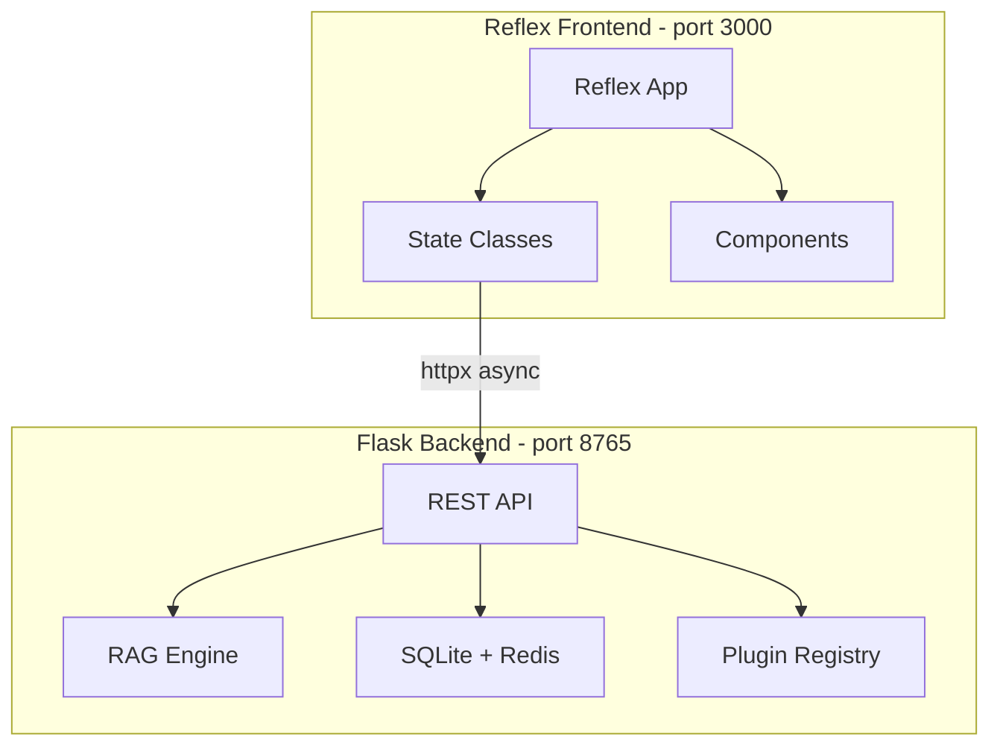

# Reflex UI Migration Plan

## Why Move Away from Streamlit

### Hard Limitations Hit
| Issue | Streamlit Behavior | Reflex Solution |
|-------|-------------------|-----------------|
| Popover menu | Renders as `˅` chevron, not `⋮` dots | Radix `rx.popover` with custom trigger |
| Page re-renders | Every click triggers full page reload | Reactive state — only changed components re-render |
| Hover-to-reveal | CSS opacity hacks break on DOM changes | Native CSS `:hover` on stable DOM |
| Chat streaming | Only `st.write_stream` (full response) | Token-by-token via async event handlers |
| Auto-grow input | `st.chat_input` is fixed height | `rx.text_area` with auto-resize |
| Custom icons | Limited to emoji | Lucide icons via `rx.icon` |
| Mobile responsive | Basically uncontrollable | Full Tailwind responsive classes |
| Animations | CSS-only, no JS transitions | Framer Motion / CSS transitions |

### What We Keep
- **Flask backend API** — zero changes needed, already clean REST
- **API client logic** — port `ui/utils/api.py` to async httpx
- **Time grouping utils** — reuse `ui/utils/time_utils.py` as-is
- **Session/state design** — same concepts, better implementation

---

## Architecture



### Key Architectural Decisions

1. **Reflex as thin frontend only** — Flask backend stays untouched
2. **Async API calls** — use `httpx.AsyncClient` for non-blocking requests
3. **State management** — single `AppState` class with sub-states
4. **Tailwind CSS** — for all styling, no custom CSS injection hacks
5. **Component-based** — each UI section is a reusable Reflex component

---

## File Structure

```
ui-reflex/
├── rxconfig.py                 # Reflex config: app name, API URL, tailwind
├── requirements.txt            # reflex, httpx
├── assets/
│   └── favicon.ico
├── app/
│   ├── __init__.py
│   ├── app.py                  # Main app: rx.App, routing, theme
│   ├── state/
│   │   ├── __init__.py
│   │   ├── app_state.py        # Root state: conversations, messages, filters
│   │   ├── chat_state.py       # Chat-specific: send message, streaming
│   │   └── settings_state.py   # Settings: config, plugins, health
│   ├── api/
│   │   ├── __init__.py
│   │   └── client.py           # Async API client, ported from utils/api.py
│   ├── components/
│   │   ├── __init__.py
│   │   ├── layout.py           # Main layout: sidebar + content area
│   │   ├── sidebar.py          # Dark sidebar: new chat, conversations, health
│   │   ├── chat_area.py        # Chat messages, input bar, filter chips
│   │   ├── empty_state.py      # Landing page with suggestions
│   │   ├── message_bubble.py   # Single chat message component
│   │   ├── source_card.py      # Collapsible source citation
│   │   └── settings_page.py    # Full settings page
│   ├── styles/
│   │   ├── __init__.py
│   │   └── theme.py            # Color tokens, font config, component styles
│   └── utils/
│       ├── __init__.py
│       └── time_utils.py       # Reused from current ui/utils/time_utils.py
```

---

## State Design

### AppState — Root State Class

```python
class AppState(rx.State):
    # Conversation list
    conversations: list[dict] = []
    conversation_id: str = ""
    
    # Chat messages
    messages: list[dict] = []  # {role, content, sources?}
    is_loading: bool = False
    
    # Filters
    active_filters: dict = {}
    
    # UI state
    sidebar_search: str = ""
    show_settings: bool = False
    renaming_id: str = ""
    rename_text: str = ""
    
    # Health
    api_status: str = "unknown"
    health_deps: dict = {}
```

### ChatState — Chat Sub-State

```python
class ChatState(AppState):
    streaming_text: str = ""
    
    async def send_message(self, question: str):
        # Add user message
        self.messages.append({"role": "user", "content": question})
        self.is_loading = True
        yield  # Update UI immediately
        
        # Call API
        data = await api_client.rag_query(
            question=question,
            conversation_id=self.conversation_id,
            filters=self.active_filters,
        )
        
        # Update state
        self.messages.append({
            "role": "assistant",
            "content": data["answer"],
            "sources": data.get("sources", []),
        })
        self.conversation_id = data.get("conversation_id", self.conversation_id)
        self.is_loading = False
```

### SettingsState — Settings Sub-State

```python
class SettingsState(AppState):
    all_settings: dict = {}
    config_meta: dict = {}
    plugins: dict = {}
    
    async def load_settings(self):
        self.all_settings = await api_client.fetch_config()
        self.config_meta = await api_client.fetch_config_meta()
        self.plugins = await api_client.fetch_plugins()
```

---

## Component Mapping: Streamlit → Reflex

### Sidebar

```
Streamlit                          Reflex
─────────                          ─────
st.sidebar:                  →     rx.box with fixed left positioning
st.button New Chat           →     rx.button with Lucide plus icon
st.text_input Search         →     rx.input with search icon
st.button per conversation   →     rx.box with on_click handler
st.popover for ⋮ menu       →     rx.popover with rx.icon_button trigger
st.markdown health dot       →     rx.box with colored dot + text
```

### Chat Area

```
Streamlit                          Reflex
─────────                          ─────
st.chat_message              →     Custom rx.box with avatar + content
st.chat_input                →     rx.el.textarea with auto-resize + send button
st.spinner                   →     Animated dots component
st.expander for sources      →     rx.accordion / rx.collapsible
st.markdown filter chips     →     rx.badge components with close button
```

### Empty State

```
Streamlit                          Reflex
─────────                          ─────
st.markdown HTML blob        →     rx.center with rx.vstack
st.columns + st.button       →     rx.grid with suggestion rx.cards
```

---

## Visual Design Spec

### Layout

```
┌─────────────────────┬─────────────────────────────────────────┐
│  SIDEBAR 280px      │  MAIN CONTENT AREA                      │
│  bg: #171717        │  bg: #ffffff                             │
│  text: #ececec      │  max-width: 768px, centered             │
│                     │                                         │
│  ┌───────────────┐  │                                         │
│  │ + New Chat    │  │     ┌─────────────────────────┐         │
│  └───────────────┘  │     │  🧠 RAG Assistant       │         │
│                     │     │  Ask anything about...   │         │
│  ┌───────────────┐  │     └─────────────────────────┘         │
│  │ 🔍 Search...  │  │                                         │
│  └───────────────┘  │     ┌──────────┐ ┌──────────┐          │
│                     │     │ Suggest 1 │ │ Suggest 2│          │
│  TODAY              │     └──────────┘ └──────────┘          │
│  ┌───────────────┐  │     ┌──────────┐ ┌──────────┐          │
│  │ Conv title  ⋮ │  │     │ Suggest 3 │ │ Suggest 4│          │
│  └───────────────┘  │     └──────────┘ └──────────┘          │
│  ┌───────────────┐  │                                         │
│  │ Conv title  ⋮ │  │                                         │
│  └───────────────┘  │  ┌─────────────────────────────────┐    │
│                     │  │ Ask about your messages...   ➤  │    │
│  YESTERDAY          │  └─────────────────────────────────┘    │
│  ┌───────────────┐  │                                         │
│  │ Conv title  ⋮ │  │                                         │
│  └───────────────┘  │                                         │
│                     │                                         │
│  ─────────────────  │                                         │
│  🟢 API Connected   │                                         │
│  ⚙ Settings         │                                         │
└─────────────────────┴─────────────────────────────────────────┘
```

### Color Tokens

```python
COLORS = {
    # Sidebar - dark theme
    "sidebar_bg": "#171717",
    "sidebar_hover": "#212121",
    "sidebar_active": "#2A2A2A",
    "sidebar_text": "#ECECEC",
    "sidebar_muted": "#888888",
    "sidebar_border": "#2A2A2A",
    
    # Main area - light theme
    "main_bg": "#FFFFFF",
    "user_bubble": "#F3F4F6",
    "assistant_bubble": "#FFFFFF",
    "text_primary": "#374151",
    "text_secondary": "#9CA3AF",
    "border": "#E5E7EB",
    
    # Accent
    "accent": "#10A37F",
    "accent_hover": "#0D8C6D",
    "accent_light": "#E8F5E9",
    
    # Status
    "status_green": "#10A37F",
    "status_yellow": "#F59E0B",
    "status_red": "#EF4444",
}
```

### Typography

```python
FONTS = {
    "body": "system-ui, -apple-system, sans-serif",
    "mono": "ui-monospace, monospace",
    "size_xs": "0.75rem",
    "size_sm": "0.85rem",
    "size_base": "0.95rem",
    "size_lg": "1.25rem",
    "size_xl": "1.5rem",
}
```

---

## Conversation Item — Hover Behavior

One of the key improvements. In Reflex we get real CSS hover:

```
Default state:           Hover state:            Active state:
┌───────────────────┐    ┌───────────────────┐    ┌───────────────────┐
│ Conv title        │    │ Conv title     ⋮  │    │▌Conv title     ⋮  │
│ bg: transparent   │    │ bg: #212121       │    │ bg: #2A2A2A       │
└───────────────────┘    └───────────────────┘    │ border-left: green│
                                                  └───────────────────┘
```

The ⋮ button is `opacity: 0` by default and `opacity: 1` on parent `:hover` — 
pure CSS, no JavaScript, no re-renders.

The popover menu uses Radix UI `rx.popover`:
```
┌─────────────────┐
│ ✏️  Rename       │
│ 🗑️  Delete       │
└─────────────────┘
```

---

## Chat Message Component

```
User message:
┌──────────────────────────────────────────┐
│  👤  What did everyone talk about today? │
│      bg: #F3F4F6, rounded-xl            │
└──────────────────────────────────────────┘

Assistant message:
┌──────────────────────────────────────────┐
│  🧠  Here is a summary of todays...     │
│      bg: #FFFFFF                         │
│                                          │
│  ┌─ 📎 Sources: 5 messages ───────────┐ │
│  │  1. Amir in Family Chat — 92%      │ │
│  │  > Hey did anyone see the...       │ │
│  │  ──────────────────────────        │ │
│  │  2. Sheli in Work Group — 87%      │ │
│  │  > The meeting is scheduled...     │ │
│  └────────────────────────────────────┘ │
└──────────────────────────────────────────┘
```

---

## Chat Input Component

Auto-growing textarea with send button — something Streamlit cannot do:

```
┌──────────────────────────────────────────────────┐
│  [Filter: 💬 Family] [Filter: 📅 7d]       ✕   │
├──────────────────────────────────────────────────┤
│                                                  │
│  Ask about your messages and documents...     ➤  │
│                                                  │
│  textarea: auto-grows up to 200px               │
└──────────────────────────────────────────────────┘
```

Filter chips are `rx.badge` components with an `on_click` close handler.

---

## API Client — Async Port

The existing `ui/utils/api.py` uses synchronous `requests`. 
Port to `httpx.AsyncClient` for non-blocking Reflex event handlers:

```python
import httpx

class APIClient:
    def __init__(self, base_url: str = "http://localhost:8765"):
        self.base_url = base_url
        self.client = httpx.AsyncClient(timeout=300)
    
    async def rag_query(self, question, conversation_id=None, k=10, **filters):
        payload = {"question": question, "k": k}
        if conversation_id:
            payload["conversation_id"] = conversation_id
        # ... add filters
        resp = await self.client.post(f"{self.base_url}/rag/query", json=payload)
        return resp.json()
    
    async def fetch_conversations(self, limit=50):
        resp = await self.client.get(f"{self.base_url}/conversations", params={"limit": limit})
        return resp.json().get("conversations", [])
    
    # ... port remaining methods
```

---

## RTL Support

Hebrew content needs `direction: rtl`. Reflex with Tailwind:

```python
rx.box(
    message_content,
    class_name="[direction:auto] [unicode-bidi:plaintext]",
)
```

This auto-detects text direction per paragraph — same approach as current 
Streamlit CSS but applied properly at the component level.

---

## Migration Strategy

### Phase 1: Scaffold + Core Layout
- Initialize Reflex project in `ui-reflex/`
- Set up Tailwind theme with color tokens
- Build the two-panel layout: dark sidebar + light main area
- Port API client to async httpx

### Phase 2: Sidebar + Conversations
- Conversation list with time grouping
- New Chat button
- Search/filter conversations
- Real hover-to-reveal ⋮ popover with rename/delete
- Health indicator at bottom
- Settings navigation

### Phase 3: Chat Area
- Empty state with suggestion cards
- Chat message rendering with user/assistant bubbles
- Source citations as collapsible sections
- Filter chips display and removal
- Chat input with auto-grow textarea
- Loading/typing indicator

### Phase 4: Settings + Polish
- Full settings page with category sections
- Plugin toggles
- Streaming responses if API supports it
- RTL text support
- Keyboard shortcuts
- Mobile responsive tweaks

### Phase 5: Deployment
- Dockerfile for Reflex app
- Update docker-compose.yml with reflex service
- Environment variable configuration
- Remove old Streamlit UI or keep as fallback

---

## Deployment

### Docker Service Addition

```yaml
# docker-compose.yml addition
reflex-ui:
  build:
    context: ./ui-reflex
    dockerfile: Dockerfile
  container_name: reflex-ui
  restart: unless-stopped
  ports:
    - "3000:3000"
  environment:
    - API_URL=http://app:8765
  depends_on:
    - app
```

### Reflex Dockerfile

```dockerfile
FROM python:3.11-slim
WORKDIR /app
RUN pip install reflex httpx
COPY . .
RUN reflex init
RUN reflex export --frontend-only
CMD ["reflex", "run", "--env", "prod", "--backend-only", "--loglevel", "info"]
# Or serve the static frontend via nginx + backend separately
```

---

## Risks and Mitigations

| Risk | Mitigation |
|------|------------|
| Reflex is newer, smaller ecosystem | Core features are stable; uses Radix UI under the hood |
| Learning curve for State model | Similar to React useState; documented well |
| Build/deploy complexity | Reflex CLI handles bundling; Docker simplifies deployment |
| Performance with many conversations | Virtual scrolling or pagination |
| Reflex version breaking changes | Pin version in requirements.txt |

---

## What Gets Better — Summary

| Feature | Streamlit Now | Reflex After |
|---------|--------------|--------------|
| Popover menu | Chevron dropdown | Real ⋮ icon + Radix popover |
| Hover effects | CSS hacks, unreliable | Native CSS on stable DOM |
| Page transitions | Full re-render | Component-level reactivity |
| Chat streaming | Whole response at once | Token-by-token async |
| Chat input | Fixed height | Auto-growing textarea |
| Icons | Emoji only | Lucide SVG icons |
| Mobile layout | Uncontrollable | Tailwind responsive |
| Animations | None | CSS transitions + Framer |
| Custom components | Limited to st.* | Any React component |
| RTL support | CSS injection | Per-component Tailwind |
