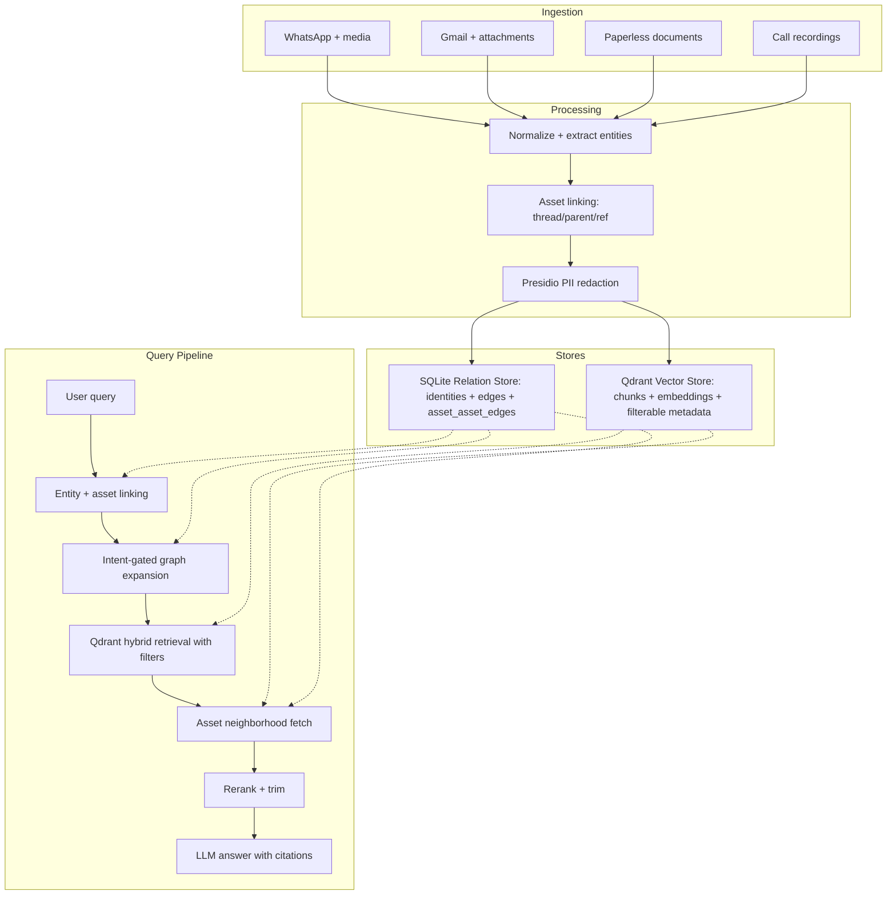
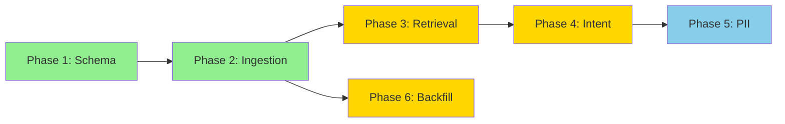

# Relation-Aware RAG Implementation Plan

## Executive Summary

This plan completes the relation-aware retrieval loop in pickeld/lucy. The codebase **already has strong identity↔asset and identity↔identity foundations** — the primary gap is **asset↔asset edges** (threading, containment, cross-references), **query-time asset neighborhood expansion**, **intent-gated graph expansion**, and **PII discipline**. 

The approach is Option A from the analysis: **graph-enhanced RAG with Qdrant + relational edge store (SQLite)** — no new infrastructure required.

---

## Current State Audit

### ✅ Already Implemented (identity↔asset)

| Component | File | Status |
|-----------|------|--------|
| `person_ids` / `mentioned_person_ids` in `DocumentMetadata` | [`models/base.py`](src/models/base.py:215) | ✅ Done |
| Qdrant INTEGER indexes on `person_ids`, `mentioned_person_ids` | [`llamaindex_rag.py`](src/llamaindex_rag.py:1103) | ✅ Done |
| `person_assets` junction table in SQLite | [`entity_db.py`](src/entity_db.py:192) | ✅ Done |
| `person_resolver.py` with LRU-cached resolution | [`person_resolver.py`](src/person_resolver.py:93) | ✅ Done |
| `resolve_and_link()` in ALL ingestion paths | WhatsApp, Gmail, Paperless, Call Recordings | ✅ Done |
| `_person_scoped_search()` for structural filtering | [`llamaindex_rag.py`](src/llamaindex_rag.py:2403) | ✅ Done |
| Entity fact injection + relationship expansion in retriever | [`llamaindex_rag.py`](src/llamaindex_rag.py:168) | ✅ Done |
| `backfill_person_ids.py` migration script | [`backfill_person_ids.py`](src/backfill_person_ids.py:108) | ✅ Done |
| Post-merge Qdrant payload updates | [`llamaindex_rag.py`](src/llamaindex_rag.py:2510) | ✅ Done |

### ✅ Already Implemented (identity↔identity)

| Component | File | Status |
|-----------|------|--------|
| `person_relationships` table with types | [`entity_db.py`](src/entity_db.py:175) | ✅ Done |
| `expand_person_ids_with_relationships()` bidirectional | [`entity_db.py`](src/entity_db.py:1147) | ✅ Done |
| 1-hop expansion in retriever Step 5 | [`llamaindex_rag.py`](src/llamaindex_rag.py:452) | ✅ Done |

### ❌ Not Yet Implemented (the gaps)

| Gap | Impact | Priority |
|-----|--------|----------|
| **Asset↔asset edge schema** (SQLite table + Qdrant payload fields) | Cross-channel coherence broken | 🔴 High |
| **Asset↔asset metadata in ingestion** (thread_id, parent_asset_id standardized) | Threading/attachment links invisible | 🔴 High |
| **Query-time asset neighborhood expansion** | Cannot follow threads/attachments | 🔴 High |
| **Intent-gated graph expansion** (classify when to expand identity vs. asset) | Over-expansion pollutes context | 🟡 Medium |
| **PII/privacy layer** (Presidio preprocessing) | Privacy risk for PII in embeddings | 🟡 Medium |
| **Backfill asset↔asset edges** for existing data | Historical data lacks edges | 🟡 Medium |

### Partial Implementations (need standardization)

- Gmail sync already writes `thread_id` and `parent_source_id` for attachments ([`gmail/sync.py`](src/plugins/gmail/sync.py:619))
- Call recording sync writes `source_id` with `call_recording:` prefix but no `parent_asset_id`
- Paperless sync writes `source_id` with `paperless:` prefix but chunks lack `chunk_group_id`
- WhatsApp conversation chunks have `source_id` like `chunk:{chat_id}:{first_ts}:{last_ts}` but no link back to individual messages

---

## Target Architecture



---

## Phase 1: Asset↔Asset Edge Schema and Metadata

### 1.1 SQLite `asset_asset_edges` Table

Add to [`entity_db.py`](src/entity_db.py:116) `init_entity_db()`:

```sql
CREATE TABLE IF NOT EXISTS asset_asset_edges (
    id INTEGER PRIMARY KEY AUTOINCREMENT,
    src_asset_ref TEXT NOT NULL,
    dst_asset_ref TEXT NOT NULL,
    relation_type TEXT NOT NULL,
    confidence REAL DEFAULT 1.0,
    provenance TEXT,
    created_at TIMESTAMP DEFAULT CURRENT_TIMESTAMP,
    UNIQUE(src_asset_ref, dst_asset_ref, relation_type)
);

CREATE INDEX IF NOT EXISTS idx_aae_src ON asset_asset_edges(src_asset_ref);
CREATE INDEX IF NOT EXISTS idx_aae_dst ON asset_asset_edges(dst_asset_ref);
CREATE INDEX IF NOT EXISTS idx_aae_type ON asset_asset_edges(relation_type);
```

**Relation types:**
- `thread_member` — email thread membership, WhatsApp reply chains
- `attachment_of` — email↔attachment, document↔embedded file
- `chunk_of` — parent document↔chunk (Paperless, call recordings)
- `reply_to` — WhatsApp quoted messages (when available)
- `references` — shared ID number, same calendar UID, etc.
- `transcript_of` — call recording↔transcript chunks

### 1.2 CRUD Functions in `entity_db.py`

New functions to add:
- `link_assets(src_ref, dst_ref, relation_type, confidence, provenance)` — idempotent upsert
- `get_asset_neighbors(asset_ref, relation_types=None, direction='both', limit=50)` — fetch neighborhood
- `get_thread_members(thread_id, limit=100)` — convenience for thread expansion
- `delete_asset_edge(src_ref, dst_ref, relation_type)` — cleanup

### 1.3 New Qdrant Payload Fields + Indexes

Add to [`_ensure_payload_indexes()`](src/llamaindex_rag.py:1089):

```python
# Asset↔asset graph indexes
("asset_id", PayloadSchemaType.KEYWORD, "asset_id keyword index"),
("parent_asset_id", PayloadSchemaType.KEYWORD, "parent_asset_id keyword index"),
("thread_id", PayloadSchemaType.KEYWORD, "thread_id keyword index"),
("chunk_group_id", PayloadSchemaType.KEYWORD, "chunk_group_id keyword index"),
```

**Payload contract (standardized across ALL sources):**

| Field | Type | Indexed? | Notes |
|-------|------|----------|-------|
| `asset_id` | keyword | ✅ | Canonical asset node ID — same across all chunks of a document |
| `parent_asset_id` | keyword | ✅ | For attachments, replies, chunk containment |
| `thread_id` | keyword | ✅ | Email thread or WhatsApp chat thread grouping |
| `chunk_group_id` | keyword | ✅ | Groups chunks from the same ingestion unit |

### 1.4 Files to Modify

- [`src/entity_db.py`](src/entity_db.py) — add table + CRUD
- [`src/llamaindex_rag.py`](src/llamaindex_rag.py:1089) — add payload indexes
- [`src/models/base.py`](src/models/base.py:176) — add `asset_id`, `parent_asset_id`, `thread_id`, `chunk_group_id` to `DocumentMetadata`

---

## Phase 2: Ingestion-Time Asset↔Asset Linking

### 2.1 Standardize Asset ID Generation

Create a new module `src/asset_linker.py` that provides:

```python
def generate_asset_id(source: str, source_id: str) -> str:
    """Generate canonical asset_id from source + source_id.
    
    All chunks of the same document/email/call share the same asset_id.
    Individual chunks get unique point IDs but share this asset_id.
    """

def link_attachment(parent_ref: str, child_ref: str, provenance: str) -> None:
    """Create attachment_of edge in SQLite."""

def link_thread_member(thread_id: str, asset_ref: str, provenance: str) -> None:
    """Create thread_member edge in SQLite."""

def link_chunk(parent_ref: str, chunk_ref: str, provenance: str) -> None:
    """Create chunk_of edge in SQLite."""
```

### 2.2 WhatsApp Ingestion ([`llamaindex_rag.py:add_message()`](src/llamaindex_rag.py:1372))

Changes:
- Generate `asset_id` from `f"whatsapp:{chat_id}:{timestamp}"`
- Set `thread_id` to `chat_id` (all messages in a chat share the thread)
- When conversation chunks are created in [`_flush_chunk_buffer()`](src/llamaindex_rag.py:1280), set `chunk_group_id` and create `chunk_of` edges linking the chunk to its constituent messages
- Set `parent_asset_id` when reply metadata is available (WhatsApp quoted messages)

### 2.3 Gmail Ingestion ([`gmail/sync.py`](src/plugins/gmail/sync.py:473))

Changes:
- Generate `asset_id` from `f"gmail:{msg_id}"`
- `thread_id` already exists — ensure it is indexed
- For attachments: set `parent_asset_id` to the parent email's `asset_id`; create `attachment_of` edge
- `parent_source_id` already written at [line 740](src/plugins/gmail/sync.py:740) — rename to `parent_asset_id` for consistency
- Create `thread_member` edges for emails in the same `thread_id`

### 2.4 Paperless Ingestion ([`paperless/sync.py`](src/plugins/paperless/sync.py:258))

Changes:
- Generate `asset_id` from `f"paperless:{doc_id}"` (shared across all chunks)
- Set `chunk_group_id` to the same value so all chunks of one document are grouped
- Create `chunk_of` edges from each chunk back to the parent `asset_id`

### 2.5 Call Recording Ingestion ([`call_recordings/sync.py`](src/plugins/call_recordings/sync.py:485))

Changes:
- Generate `asset_id` from `f"call_recording:{content_hash}"` (shared across transcript chunks)
- Set `chunk_group_id` to the same value
- Create `chunk_of` edges from each transcript chunk back to the parent `asset_id`
- Create `transcript_of` edge from transcript to the audio file reference

### 2.6 Files to Modify

- New: `src/asset_linker.py`
- [`src/llamaindex_rag.py`](src/llamaindex_rag.py:1372) — `add_message()`, `_flush_chunk_buffer()`
- [`src/plugins/gmail/sync.py`](src/plugins/gmail/sync.py:473) — `sync_emails()`
- [`src/plugins/paperless/sync.py`](src/plugins/paperless/sync.py:258) — `sync_documents()`
- [`src/plugins/call_recordings/sync.py`](src/plugins/call_recordings/sync.py:485) — `approve_file()`
- [`src/models/base.py`](src/models/base.py:228) — `to_qdrant_payload()` to emit new fields
- [`src/models/whatsapp.py`](src/models/whatsapp.py:189) — `to_llama_index_node()` 
- [`src/models/document.py`](src/models/document.py:257) — `to_llama_index_node()`
- [`src/models/call_recording.py`](src/models/call_recording.py:234) — `to_llama_index_node()`

---

## Phase 3: Query-Time Asset Neighborhood Expansion

### 3.1 Asset Neighborhood Fetcher

Add a new method to [`LlamaIndexRAG`](src/llamaindex_rag.py:542):

```python
def expand_asset_neighborhood(
    self,
    results: List[NodeWithScore],
    max_total: int = 30,
    expand_threads: bool = True,
    expand_attachments: bool = True,
    expand_chunks: bool = True,  # already partially done by expand_document_chunks
) -> List[NodeWithScore]:
```

This method:
1. For each result, check `parent_asset_id` — if set, fetch the parent asset from Qdrant
2. For each result, check `thread_id` — if set and `expand_threads=True`, fetch N most recent thread members via Qdrant filter on `thread_id`
3. For each result, query `asset_asset_edges` for `attachment_of` edges — fetch the attachment points from Qdrant
4. Deduplicate, score slightly below originals, respect token budget

### 3.2 Integration into Retrieval Pipeline

Insert asset neighborhood expansion into [`ArchiveRetriever._retrieve()`](src/llamaindex_rag.py:285) as a new step between existing steps:

Current pipeline:
1. Hybrid search
2. Cohere rerank
3. Context expansion (time-window)
4. Document chunk expansion
5. Per-chat recency supplement
6. Entity fact injection + person-scoped search
7. Token budget trim

**New pipeline:**
1. Hybrid search
2. Cohere rerank
3. Context expansion (time-window) — existing
4. Document chunk expansion — existing, **enhanced** to use `chunk_group_id`
5. **NEW: Asset neighborhood expansion** (parent emails, attachments, thread siblings)
6. Per-chat recency supplement
7. Entity fact injection + person-scoped search
8. Token budget trim

### 3.3 Enhance `expand_document_chunks()` 

The existing [`expand_document_chunks()`](src/llamaindex_rag.py:2923) already handles Paperless + call recording chunks. Enhance it to also use `chunk_group_id` as a grouping key (more reliable than prefix-matching on `source_id`).

### 3.4 Files to Modify

- [`src/llamaindex_rag.py`](src/llamaindex_rag.py:285) — new `expand_asset_neighborhood()`, update `_retrieve()` pipeline
- [`src/entity_db.py`](src/entity_db.py) — `get_asset_neighbors()` used by the expansion

---

## Phase 4: Intent-Gated Graph Expansion

### 4.1 Query Intent Classifier

Create `src/query_intent.py`:

```python
class QueryIntent(Enum):
    PERSON_FACTS = "person_facts"        # "How old is Shiran?" → expand identity facts
    PERSON_HISTORY = "person_history"     # "What did Shiran say?" → expand person assets
    FAMILY_CONTEXT = "family_context"     # "Tell me about Shiran's family" → expand relationships
    ASSET_THREAD = "asset_thread"        # "Show me the email thread" → expand thread
    ASSET_ATTACHMENT = "asset_attachment" # "The contract attachment" → expand attachments
    CROSS_CHANNEL = "cross_channel"      # "The call about the invoice email" → expand across channels
    GENERAL = "general"                  # No special expansion needed

def classify_query_intent(query: str, resolved_entities: list, resolved_assets: list) -> List[QueryIntent]:
```

**Strategy:** Use a lightweight rule-based classifier first (keyword patterns + entity resolution results), with the option to upgrade to LLM-based classification later. This avoids adding LLM latency to every query.

### 4.2 Expansion Rules by Intent

| Intent | Identity Expansion | Asset Expansion | Max Depth |
|--------|-------------------|-----------------|-----------|
| `PERSON_FACTS` | None (facts already injected) | None | 0 |
| `PERSON_HISTORY` | None | Person-scoped search (existing) | 0 |
| `FAMILY_CONTEXT` | Expand family edges (spouse/child/parent) | Person-scoped search on expanded IDs | 1 |
| `ASSET_THREAD` | None | Thread expansion via `thread_id` | 1 |
| `ASSET_ATTACHMENT` | None | Attachment expansion via `parent_asset_id` | 1 |
| `CROSS_CHANNEL` | None | Full neighborhood expansion | 2 |
| `GENERAL` | None | Basic document chunk expansion only | 0 |

### 4.3 Gate Graph Expansion in Retriever

Modify the expansion logic in [`_retrieve()`](src/llamaindex_rag.py:285):

```python
# Classify intent before expansion steps
intents = classify_query_intent(query, resolved_person_ids, [])

# Only expand relationships if family/team intent detected
if QueryIntent.FAMILY_CONTEXT in intents:
    expanded_ids = entity_db.expand_person_ids_with_relationships(...)
else:
    expanded_ids = resolved_person_ids  # No expansion

# Only expand asset neighborhood for thread/attachment/cross-channel intents
if any(i in intents for i in [QueryIntent.ASSET_THREAD, QueryIntent.ASSET_ATTACHMENT, QueryIntent.CROSS_CHANNEL]):
    results = self._rag.expand_asset_neighborhood(results, ...)
```

### 4.4 Files to Create/Modify

- New: `src/query_intent.py`
- [`src/llamaindex_rag.py`](src/llamaindex_rag.py:285) — gate expansion by intent

---

## Phase 5: PII/Privacy Layer with Presidio

### 5.1 Presidio Integration Module

Create `src/pii_redactor.py`:

```python
class PIIRedactor:
    """Configurable PII detection and redaction using Microsoft Presidio."""
    
    def __init__(self, config: dict):
        """Config specifies per-channel policies."""
    
    def detect(self, text: str, channel: str) -> List[PIIEntity]:
        """Detect PII entities in text."""
    
    def redact(self, text: str, channel: str) -> str:
        """Apply redaction policy for the channel."""
    
    def redact_for_embedding(self, text: str, channel: str) -> str:
        """Redact text before embedding generation."""
```

### 5.2 Channel-Specific Policies

```python
DEFAULT_POLICIES = {
    "whatsapp": {
        "entities": ["PHONE_NUMBER", "EMAIL_ADDRESS", "CREDIT_CARD", "IBAN_CODE"],
        "action": "hash",  # Replace with hash for reversibility
    },
    "gmail": {
        "entities": ["PHONE_NUMBER", "CREDIT_CARD", "IBAN_CODE", "IL_ID_NUMBER"],
        "action": "replace",  # Replace with <TYPE> placeholder
    },
    "paperless": {
        "entities": ["CREDIT_CARD", "IBAN_CODE"],
        "action": "redact",  # Full redaction for documents
    },
    "call_recording": {
        "entities": ["PHONE_NUMBER", "CREDIT_CARD"],
        "action": "replace",
    },
}
```

### 5.3 Integration Points

1. **Ingestion-time**: Apply `redact_for_embedding()` before creating `TextNode.text` (the embedding text). Store original in metadata with access control flag.
2. **Context-time**: Apply `redact()` in [`_extract_text_from_payload()`](src/llamaindex_rag.py:1642) before assembling LLM context, unless the user has privileged access.
3. **Hebrew NLP support**: Presidio supports custom recognizers — add Hebrew ID number (teudat zehut), Hebrew phone format recognizers.

### 5.4 Custom Hebrew Recognizers

Presidio allows custom regex-based recognizers. Add:
- **IL ID Number** (תעודת זהות): 9-digit with Luhn check
- **IL Phone Number**: `05X-XXX-XXXX` and `+972-5X-XXX-XXXX` patterns
- **IL Bank Account**: Israeli bank account patterns

### 5.5 Feature Flag

Gate behind `pii_redaction_enabled` setting (default: `false`) so it can be enabled incrementally.

### 5.6 Dependencies

Add to [`requirements.txt`](requirements.txt):
```
presidio-analyzer>=2.2
presidio-anonymizer>=2.2
```

### 5.7 Files to Create/Modify

- New: `src/pii_redactor.py`
- [`src/llamaindex_rag.py`](src/llamaindex_rag.py:1642) — optional redaction in `_extract_text_from_payload()`
- [`src/plugins/gmail/sync.py`](src/plugins/gmail/sync.py) — pre-embedding redaction
- [`src/plugins/paperless/sync.py`](src/plugins/paperless/sync.py) — pre-embedding redaction
- [`src/plugins/call_recordings/sync.py`](src/plugins/call_recordings/sync.py) — pre-embedding redaction
- [`requirements.txt`](requirements.txt) — add Presidio dependencies

---

## Phase 6: Backfill Existing Data with Asset↔Asset Edges

### 6.1 Backfill Script

Create `src/backfill_asset_edges.py` modeled on the existing [`backfill_person_ids.py`](src/backfill_person_ids.py):

1. **Scroll all Qdrant points**
2. **For each point**, based on `source`:
   - **Gmail**: Extract `thread_id` → create `thread_member` edges for all points sharing that `thread_id`; extract `parent_source_id` → create `attachment_of` edges
   - **Paperless**: Group by `source_id` prefix → create `chunk_of` edges
   - **Call recordings**: Group by `source_id` prefix → create `chunk_of` edges
   - **WhatsApp**: Set `thread_id = chat_id` for all messages
3. **Update Qdrant payloads** with `asset_id`, `parent_asset_id`, `thread_id`, `chunk_group_id`
4. **Populate `asset_asset_edges`** table

### 6.2 Idempotency

Like `backfill_person_ids.py`, the script uses:
- `INSERT OR IGNORE` for edge creation
- Skip points that already have `asset_id` populated
- `--dry-run` and `--limit` flags

### 6.3 Files to Create

- New: `src/backfill_asset_edges.py`

---

## Phase 7: Interactive Graph Visualization

### 7.1 Library Selection

Use **react-force-graph-2d** via Reflex custom component wrapping. This React library provides interactive force-directed graph rendering with drag, zoom, click events — similar to Neo4j Browser.

Alternative: Cytoscape.js via `rx.html()` iframe embed if React wrapping proves difficult.

### 7.2 Extended Graph Data API

Extend [`get_graph_data()`](src/entity_db.py:1909) to return a unified graph with both identity and asset nodes:

```python
def get_full_graph_data(
    limit_persons: int = 100,
    limit_assets_per_person: int = 10,
    include_asset_edges: bool = True,
) -> Dict[str, Any]:
    """Build a full graph with person nodes, asset nodes, and all edge types."""
```

Returns:
- **Person nodes**: `{id, type: "person", label, facts_count, aliases_count}`
- **Asset nodes**: `{id, type: "whatsapp_msg"|"document"|"call_recording"|"gmail", label, timestamp}`
- **Identity↔identity edges**: `{source, target, type: "spouse"|"parent"|...}`
- **Identity↔asset edges**: `{source, target, type: "sender"|"mentioned"|...}`
- **Asset↔asset edges**: `{source, target, type: "attachment_of"|"thread_member"|...}`

### 7.3 New API Endpoint

Add `GET /entities/graph/full` to [`app.py`](src/app.py) that returns the extended graph data.

### 7.4 Reflex Graph Component

Create `ui-reflex/ui_reflex/components/graph_view.py`:

- Wrap `react-force-graph-2d` as a Reflex custom component
- Node rendering: color-code by type (person=blue, whatsapp=green, document=orange, call=purple, gmail=red)
- Node shape: person=circle, others=square
- Edge rendering: color-code by relation type
- Click-to-expand: clicking a person node loads their assets; clicking an asset loads related assets
- Hover tooltip: shows node details (facts for persons, preview for assets)
- Zoom/pan/drag support (built into react-force-graph)

### 7.5 Replace Existing Graph Tab

Replace the flat card list in [`_graph_tab()`](ui-reflex/ui_reflex/components/entities_page.py:1295) with the interactive graph component. Keep the existing card view as a fallback/alternative view.

### 7.6 Files to Create/Modify

- New: `ui-reflex/ui_reflex/components/graph_view.py`
- [`src/entity_db.py`](src/entity_db.py) — add `get_full_graph_data()`
- [`src/app.py`](src/app.py) — add `/entities/graph/full` endpoint
- [`ui-reflex/ui_reflex/api_client.py`](ui-reflex/ui_reflex/api_client.py) — add `fetch_full_entity_graph()`
- [`ui-reflex/ui_reflex/state.py`](ui-reflex/ui_reflex/state.py) — add graph state vars
- [`ui-reflex/ui_reflex/components/entities_page.py`](ui-reflex/ui_reflex/components/entities_page.py) — integrate graph view
- [`ui-reflex/requirements.txt`](ui-reflex/requirements.txt) — add react-force-graph wrapper if needed

---

## Migration Strategy



**Deployment order:**
1. **Phase 1** (schema) — additive, no breaking changes
2. **Phase 2** (ingestion) — dual-write new fields; old code unaffected
3. **Phase 6** (backfill) — can run in parallel with Phase 3 development
4. **Phase 3** (retrieval) — behind feature flag `asset_neighborhood_expansion_enabled`
5. **Phase 4** (intent) — refines Phase 3; can be developed incrementally
6. **Phase 5** (PII) — independent; behind `pii_redaction_enabled` flag

**Backward compatibility:**
- All new Qdrant fields are optional — existing points without them work fine
- All new SQLite tables use `IF NOT EXISTS`
- Feature flags gate new retrieval behavior
- No existing API contracts change

---

## Sample Query Flows

### Flow 1: Cross-channel person query

> "What did Alex tell me about the invoice, and did we discuss it on the call too?"

1. **Entity linking**: resolve "Alex" → `identity_id = 42`
2. **Intent classification**: `PERSON_HISTORY` + `CROSS_CHANNEL`
3. **Qdrant hybrid search** with filter `person_ids contains 42 OR mentioned_person_ids contains 42`, topic terms "invoice"
4. **Asset neighborhood expansion**: if a hit is a Gmail email, follow `parent_asset_id` to include attachments; if a hit is a call transcript chunk, include sibling chunks via `chunk_group_id`
5. **Rerank and answer** with cross-channel citations

### Flow 2: Thread + attachment query

> "Show me the context around the contract attachment from last week's email"

1. **Asset linking**: detect "contract attachment" → search for email attachment assets by filename → identify `asset_id`
2. **Neighborhood fetch**: follow `parent_asset_id` to email body; follow `thread_id` to sibling emails; cap by timestamp
3. **Semantic retrieval**: optionally run second vector search constrained to `thread_id`
4. **Answer** with citations to both attachment and parent email

### Flow 3: Family context query

> "Tell me about Shiran's family"

1. **Entity linking**: resolve "Shiran" → `person_id = 42`
2. **Intent classification**: `FAMILY_CONTEXT`
3. **Relationship expansion**: traverse family edges → spouse=David(17), child=Mia(23) → expanded IDs = [42, 17, 23]
4. **Person-scoped search**: Qdrant filter `person_ids in [42, 17, 23]`
5. **Entity facts injection**: facts for all three persons
6. **Answer** with family context from multiple sources

---

## Files Summary

### New Files
| File | Purpose |
|------|---------|
| `src/asset_linker.py` | Asset↔asset edge creation at ingestion time |
| `src/query_intent.py` | Query intent classification for gated expansion |
| `src/pii_redactor.py` | Presidio-based PII detection and redaction |
| `src/backfill_asset_edges.py` | One-time backfill of asset↔asset edges |

### Modified Files
| File | Changes |
|------|---------|
| [`src/entity_db.py`](src/entity_db.py) | Add `asset_asset_edges` table + CRUD functions |
| [`src/llamaindex_rag.py`](src/llamaindex_rag.py) | New Qdrant indexes, `expand_asset_neighborhood()`, updated `_retrieve()` pipeline |
| [`src/models/base.py`](src/models/base.py) | Add `asset_id`, `parent_asset_id`, `thread_id`, `chunk_group_id` to `DocumentMetadata` |
| [`src/models/whatsapp.py`](src/models/whatsapp.py) | Emit new fields in `to_llama_index_node()` |
| [`src/models/document.py`](src/models/document.py) | Emit new fields in `to_llama_index_node()` |
| [`src/models/call_recording.py`](src/models/call_recording.py) | Emit new fields in `to_llama_index_node()` |
| [`src/plugins/gmail/sync.py`](src/plugins/gmail/sync.py) | Standardize asset fields + create edges |
| [`src/plugins/paperless/sync.py`](src/plugins/paperless/sync.py) | Standardize asset fields + create edges |
| [`src/plugins/call_recordings/sync.py`](src/plugins/call_recordings/sync.py) | Standardize asset fields + create edges |
| [`requirements.txt`](requirements.txt) | Add Presidio dependencies (Phase 5) |

---

## Key Design Decisions

1. **No new infrastructure** — SQLite + Qdrant is sufficient for the graph scale (hundreds of persons, tens of thousands of assets, shallow traversals)
2. **Feature flags** — all new retrieval behavior is gated so it can be rolled out incrementally
3. **Rule-based intent classification first** — avoids adding LLM latency; can upgrade later
4. **Inline payload pointers + edge table** — dual representation: fast Qdrant filters via `thread_id`/`parent_asset_id`, and rich traversal via `asset_asset_edges` SQL
5. **Presidio for PII** — pluggable, OSS, supports custom recognizers for Hebrew
