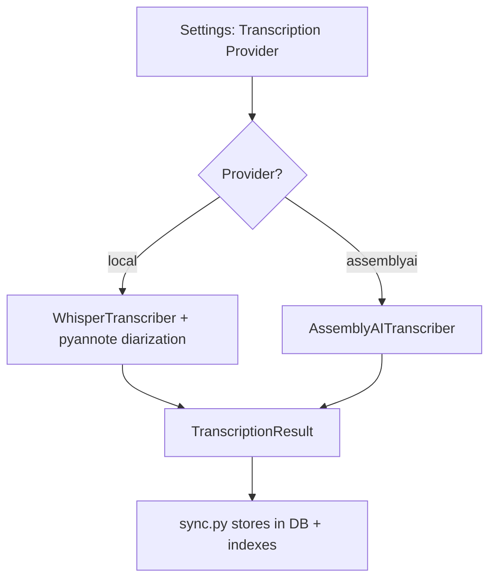

# Remote Transcription Feature Plan

## Goal
Add the ability to choose between **local** (faster-whisper + pyannote) and **AssemblyAI** (remote API with built-in diarization) for call recording transcription, configured via the Settings UI.

## Why AssemblyAI
- **Transcription + speaker diarization in a single API call** — no need for separate pyannote
- Clean Python SDK: `pip install assemblyai`
- Auto language detection built-in
- No local GPU/CPU requirements — ideal for weak hardware
- Pricing: Universal-3 Pro $0.12/min, Universal-2 $0.015/min

## Architecture



Both transcribers return the same `TranscriptionResult` dataclass, so `sync.py` needs **zero changes**.

## AssemblyAI API Usage

```python
import assemblyai as aai

aai.settings.api_key = "YOUR_ASSEMBLYAI_KEY"

config = aai.TranscriptionConfig(
    speaker_labels=True,       # Built-in diarization
    language_detection=True,   # Auto-detect language
)

transcript = aai.Transcriber().transcribe(audio_file_path, config)

# Access results
transcript.text           # Full text
transcript.utterances     # [{speaker, text, start, end}, ...]
transcript.words          # [{text, start, end, speaker, confidence}, ...]
transcript.audio_duration # Duration in milliseconds
```

## New Setting

| Key | Default | Type | Description |
|-----|---------|------|-------------|
| `call_recordings_transcription_provider` | `local` | select | Transcription engine: local or assemblyai |
| `assemblyai_api_key` | `` | secret | AssemblyAI API key |
| `call_recordings_assemblyai_model` | `universal-2` | select | AssemblyAI model: universal-3-pro or universal-2 |

## Files to Create/Modify

### 1. NEW: `src/plugins/call_recordings/remote_transcriber.py`
- `AssemblyAITranscriber` class
- Constructor: `api_key`, `model`, `language`
- `transcribe(path, on_progress)` method:
  - Upload audio to AssemblyAI
  - Poll for completion with progress callbacks
  - Convert `transcript.utterances` → `TranscriptionResult` with speaker labels
- `unload_model()` — no-op
- `model_size` property — returns AssemblyAI model name

### 2. MODIFY: `src/plugins/call_recordings/plugin.py`
- Add 3 new settings to `get_default_settings()`
- Add select options for provider and model
- In `initialize()`: read provider setting, instantiate correct transcriber

### 3. MODIFY: `requirements.txt`
- Add `assemblyai>=0.30.0`

### 4. NO CHANGE: `sync.py`, `db.py`, `scanner.py`, UI files
- `sync.py` uses `self.transcriber.transcribe()` — interface is identical
- UI renders settings dynamically — new settings appear automatically

## Implementation Order

1. Create `remote_transcriber.py` with `AssemblyAITranscriber`
2. Add settings and factory logic to `plugin.py`
3. Add `assemblyai` to `requirements.txt`
4. Rebuild Docker and test
