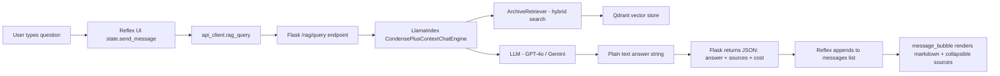
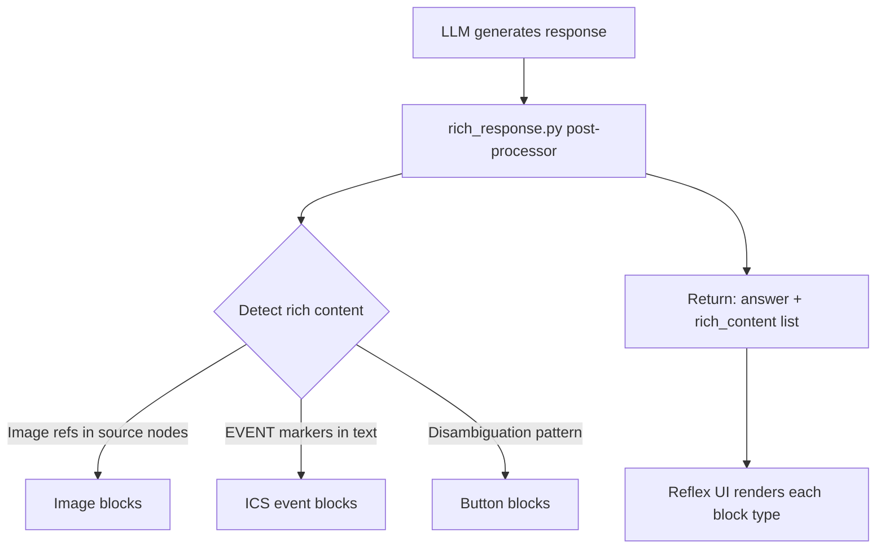
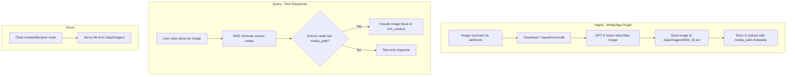
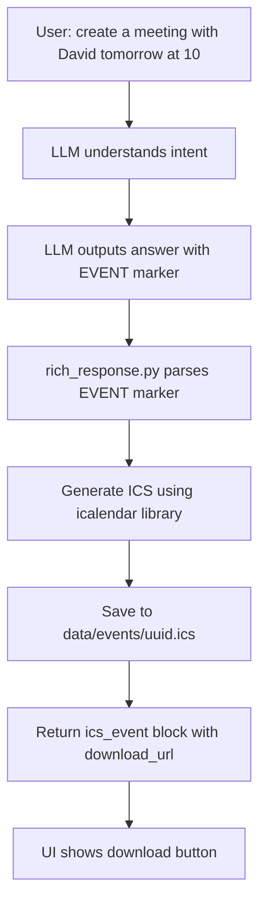
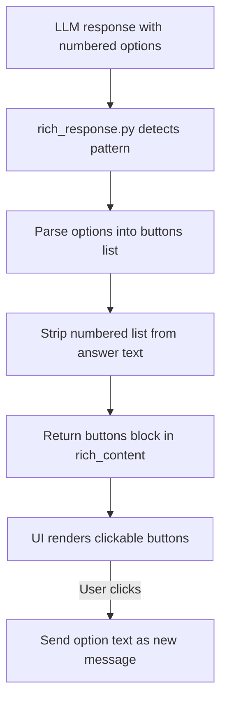
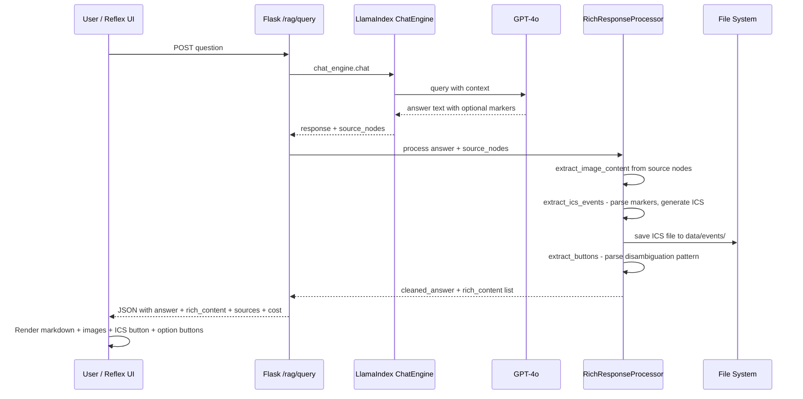

# Rich Response Feature Plan

## Overview

Extend Lucy's response capabilities to support **rich content** beyond plain text/markdown:

1. **Inline images** — When a query references an image from the archive, display it inline
2. **ICS calendar events** — When the user asks to create a calendar event, generate a downloadable `.ics` file
3. **Interactive buttons** — When Lucy asks a disambiguation/clarification question, render the options as clickable buttons

## Current Architecture



### Key Files

| File | Role |
|------|------|
| [`src/app.py`](src/app.py) | Flask API — `/rag/query` endpoint returns `{answer, sources, cost}` |
| [`src/llamaindex_rag.py`](src/llamaindex_rag.py) | RAG engine — `create_chat_engine()`, `_build_system_prompt()` |
| [`src/settings_db.py`](src/settings_db.py) | Default system prompt template |
| [`src/plugins/whatsapp/handler.py`](src/plugins/whatsapp/handler.py) | WhatsApp message handler — `ImageMessage` with base64 media |
| [`ui-reflex/ui_reflex/state.py`](ui-reflex/ui_reflex/state.py) | Reflex state — `send_message()`, message format: `{role, content, sources, cost}` |
| [`ui-reflex/ui_reflex/components/message_bubble.py`](ui-reflex/ui_reflex/components/message_bubble.py) | Message rendering — markdown + collapsible sources |
| [`ui-reflex/ui_reflex/api_client.py`](ui-reflex/ui_reflex/api_client.py) | Async HTTP client calling Flask backend |

### Current Message Format

Messages in Reflex state are `list[dict[str, str]]`:
```python
{"role": "assistant", "content": "markdown text", "sources": "sources_md", "cost": "$0.0012"}
```

The API `/rag/query` returns:
```json
{"answer": "text", "sources": [...], "cost": {...}, "conversation_id": "...", "filters": {...}}
```

---

## Proposed Architecture

### Rich Content Protocol

Extend the API response with a `rich_content` field — a list of typed content blocks that the UI renders specially alongside the text answer.



### Extended API Response

```json
{
  "answer": "Here is the image David sent on 15/02...",
  "rich_content": [
    {
      "type": "image",
      "url": "/media/abc123.jpg",
      "alt": "Photo from David on 15/02",
      "caption": "Image sent by David in Family chat"
    },
    {
      "type": "ics_event",
      "title": "Meeting with David",
      "start": "2026-02-16T10:00:00",
      "end": "2026-02-16T11:00:00",
      "location": "Office",
      "description": "Discuss project updates",
      "download_url": "/media/events/meeting-with-david.ics"
    },
    {
      "type": "buttons",
      "prompt": "I found multiple people named Doron:",
      "options": [
        {"label": "Doron Yazkirovich", "value": "Doron Yazkirovich"},
        {"label": "דורון עלאני", "value": "דורון עלאני"}
      ]
    }
  ],
  "sources": [...],
  "cost": {...}
}
```

### Extended Reflex Message Format

```python
{
    "role": "assistant",
    "content": "markdown text",
    "sources": "sources_md",
    "cost": "$0.0012",
    "rich_content": '[{"type": "image", "url": "/media/abc.jpg", ...}]'  # JSON string
}
```

---

## Feature 1: Inline Image Display

### Problem

Images sent in WhatsApp are described by GPT-4 Vision and stored as text in Qdrant:
```
[Image: A photo showing...] Caption: user caption
```
The `media_url` is stored in metadata but points to ephemeral WAHA URLs. The actual image data is only saved to disk in DEBUG mode.

### Solution



### Changes Required

**1. Always persist images** — [`src/plugins/whatsapp/handler.py`](src/plugins/whatsapp/handler.py)
- Change `MediaMessageBase._save_media_debug()` → `_save_media()` — always save, not just in DEBUG
- Save to `data/images/` instead of `tmp/images/`
- Use message ID as filename: `data/images/{msg_id}.{extension}`
- Store the relative path as `self.saved_path`

**2. Store `media_path` in Qdrant metadata** — [`src/plugins/whatsapp/handler.py`](src/plugins/whatsapp/handler.py:490) + [`src/models/whatsapp.py`](src/models/whatsapp.py)
- Add `media_path` field to `WhatsAppMessageDocument`
- Pass `media_path` from `MediaMessageBase.to_rag_document()` into the document
- Ensure it appears in the Qdrant payload via `to_llama_index_node()`

**3. Image serving endpoint** — [`src/app.py`](src/app.py)
- Add `GET /media/<path:filename>` route that serves files from `data/images/`
- Use `flask.send_from_directory()` with proper MIME types
- Basic security: validate filename, prevent path traversal

**4. Rich content extraction** — New file `src/rich_response.py`
- `extract_image_content(source_nodes)` → scan source nodes for `has_media=True` + `media_path` in metadata
- Return image blocks with `/media/{filename}` URLs

### Image Accessibility from UI

The Reflex UI runs on a different port than the Flask backend. Images are served from Flask at e.g. `http://backend:8765/media/abc.jpg`. The UI already uses `API_URL` for all backend calls, so image URLs should be prefixed with the API base URL on the frontend side.

---

## Feature 2: ICS Calendar Event Generation

### Problem

Users want to say things like "create a meeting with David tomorrow at 10am" and get a downloadable `.ics` file.

### Solution



### LLM Structured Output

Add to system prompt instruction for calendar event creation. When the user asks to create a calendar event, the LLM should include a structured block:

```
[CREATE_EVENT]
title: Meeting with David
start: 2026-02-16T10:00
end: 2026-02-16T11:00
location: Office
description: Discuss project updates
[/CREATE_EVENT]
```

The post-processor strips this from the visible answer and converts it to an ICS block in `rich_content`.

### Changes Required

**1. Add `icalendar` dependency** — [`requirements.txt`](requirements.txt)
- Add `icalendar>=5.0.0`

**2. System prompt extension** — [`src/llamaindex_rag.py`](src/llamaindex_rag.py:2194)
- Add instruction #10 to the system prompt about calendar event creation
- Define the `[CREATE_EVENT]...[/CREATE_EVENT]` marker format
- Instruct to use ISO 8601 datetime format, infer end time if not specified

**3. ICS generation** — `src/rich_response.py`
- `extract_ics_events(answer_text)` → parse `[CREATE_EVENT]` blocks
- Generate ICS content using the `icalendar` library
- Save to `data/events/{uuid}.ics`
- Return cleaned answer text + ics_event rich_content blocks

**4. Event file serving** — [`src/app.py`](src/app.py)
- Extend the `/media/<path:filename>` route to also serve from `data/events/`
- Or add a separate `GET /media/events/<filename>` route
- Set `Content-Type: text/calendar` and `Content-Disposition: attachment`

**5. Events directory** — Ensure `data/events/` is created at startup

---

## Feature 3: Interactive Disambiguation Buttons

### Problem

Currently, disambiguation shows numbered text options:
```
מצאתי כמה אנשים בשם דורון:
1) Doron Yazkirovich
2) דורון עלאני
לאיזה דורון התכוונת?
```

The user needs to type the name. Instead, render these as clickable buttons.

### Solution



### Detection Pattern

The post-processor looks for patterns like:
- Numbered lists following a question: `1) Option A\n2) Option B\n`
- The question mark or "which one" / "לאיזה" / "למי" patterns before or after the list
- Only for assistant messages that end with a clarifying question

### Changes Required

**1. Button extraction** — `src/rich_response.py`
- `extract_buttons(answer_text)` → detect disambiguation patterns
- Parse numbered options using regex: `(\d+)\)\s*(.+)`
- Return the prompt text + options list
- Optionally strip the numbered list from the visible answer since buttons replace it

**2. UI button rendering** — [`ui-reflex/ui_reflex/components/message_bubble.py`](ui-reflex/ui_reflex/components/message_bubble.py)
- Render button blocks as horizontal flex of styled buttons
- Each button shows the option label
- On click → call `AppState.send_suggestion(option_value)`

**3. Button click handler** — [`ui-reflex/ui_reflex/state.py`](ui-reflex/ui_reflex/state.py:911)
- The existing `send_suggestion()` method already handles this — set input text and call `send_message()`
- No changes needed to the handler itself

---

## New File: `src/rich_response.py`

Central module for all rich content post-processing:

```python
class RichResponseProcessor:
    def process(answer: str, source_nodes: list) -> tuple[str, list[dict]]:
        """Post-process LLM answer to extract rich content blocks.
        
        Returns:
            tuple of (cleaned_answer_text, rich_content_list)
        """
        rich_content = []
        
        # 1. Extract images from source nodes
        rich_content.extend(extract_image_content(source_nodes))
        
        # 2. Extract and generate ICS events
        answer, events = extract_ics_events(answer)
        rich_content.extend(events)
        
        # 3. Extract disambiguation buttons
        answer, buttons = extract_buttons(answer)
        rich_content.extend(buttons)
        
        return answer, rich_content
```

---

## Integration Points

### Backend — [`src/app.py`](src/app.py:292) `/rag/query` endpoint

After `response = chat_engine.chat(question)`, add:

```python
from rich_response import RichResponseProcessor

# Post-process for rich content
answer, rich_content = RichResponseProcessor.process(
    answer=str(response),
    source_nodes=response.source_nodes if hasattr(response, 'source_nodes') else [],
)
```

Then include `rich_content` in the JSON response.

### Frontend — [`ui-reflex/ui_reflex/state.py`](ui-reflex/ui_reflex/state.py:844) `send_message()`

Parse `rich_content` from the API response and store as JSON string in the message dict:

```python
self.messages.append({
    "role": "assistant",
    "content": answer,
    "sources": sources_md,
    "cost": cost_str,
    "rich_content": json.dumps(rich_content) if rich_content else "",
})
```

### Frontend — [`ui-reflex/ui_reflex/components/message_bubble.py`](ui-reflex/ui_reflex/components/message_bubble.py:43)

Add rendering for each rich content type below the markdown answer:
- **Images**: `rx.image(src=api_url + url, ...)`
- **ICS events**: Download button with calendar icon
- **Buttons**: Horizontal flex of styled buttons calling `send_suggestion()`

---

## Data Flow Diagram



---

## File Changes Summary

| File | Change Type | Description |
|------|-------------|-------------|
| `src/rich_response.py` | **NEW** | Rich content post-processor module |
| `src/app.py` | MODIFY | Integrate RichResponseProcessor in `/rag/query`; add `/media/` endpoint |
| `src/llamaindex_rag.py` | MODIFY | Extend system prompt with ICS event creation instructions |
| `src/settings_db.py` | MODIFY | Update default system prompt with event creation instruction |
| `src/plugins/whatsapp/handler.py` | MODIFY | Always save images to `data/images/`; store `media_path` |
| `src/models/whatsapp.py` | MODIFY | Add `media_path` field to `WhatsAppMessageDocument` |
| `requirements.txt` | MODIFY | Add `icalendar>=5.0.0` |
| `ui-reflex/ui_reflex/state.py` | MODIFY | Parse and store `rich_content` in messages |
| `ui-reflex/ui_reflex/components/message_bubble.py` | MODIFY | Render images, ICS buttons, disambiguation buttons |
| `data/images/` | **NEW DIR** | Persistent image storage |
| `data/events/` | **NEW DIR** | Generated ICS file storage |

---

## Migration / Backwards Compatibility

- **Existing messages**: Old messages without `rich_content` will render exactly as before — the UI checks for empty `rich_content` and skips rendering
- **Existing images in Qdrant**: These won't have `media_path` metadata. Images saved going forward will have it. No migration needed — old images just won't display inline
- **System prompt**: The new event creation instruction is appended dynamically like the disambiguation rule, so existing custom system prompts are unaffected
- **API response**: The `rich_content` field is additive — existing API consumers that don't know about it will simply ignore it
