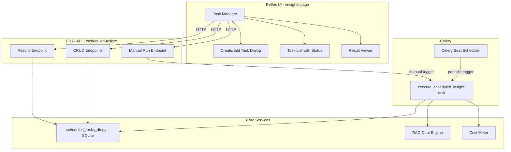

# Scheduled Insights — Architecture Plan

> **Feature**: Proactive, scheduled intelligence queries against the knowledge base.  
> **Status**: Draft  
> **Date**: 2026-02-18

## 1. Overview

Scheduled Insights is a "super assistant" feature that lets the user define recurring queries that run automatically against the RAG knowledge base. The system executes these queries on a schedule (daily, weekly, custom cron), stores the results, and presents them in the UI.

### Examples
- **Daily Briefing** (every morning at 8am): "What should I know about today? Do I have any commitments, meetings, or promises I made to anyone? Are there any deadlines or events I mentioned?"
- **Weekly People Check-in** (every Sunday): "Summarize my interactions this week — who did I talk to the most, any unresolved conversations, anything I promised to follow up on?"
- **Monthly Financial Review**: "What bills, payments, or financial discussions came up this month?"
- **Custom**: Any user-defined prompt with any schedule.

### Key Principles
1. **Reuse the existing RAG pipeline** — queries run through the same `rag.create_chat_engine()` path as the UI
2. **Delivery-channel agnostic** — results are stored centrally; delivery (UI, WhatsApp, Pushbullet, email) is a separate concern for later
3. **Fits the existing architecture** — SQLite for persistence, Celery for scheduling, Flask API for CRUD, Reflex UI for management

---

## 2. Architecture



---

## 3. Database Schema

New file: `src/scheduled_tasks_db.py` — SQLite database at `data/scheduled_tasks.db`

```sql
-- Task definitions
CREATE TABLE scheduled_tasks (
    id              INTEGER PRIMARY KEY AUTOINCREMENT,
    name            TEXT NOT NULL,
    description     TEXT DEFAULT '',
    prompt          TEXT NOT NULL,
    schedule_type   TEXT NOT NULL DEFAULT 'daily',
    schedule_value  TEXT NOT NULL DEFAULT '08:00',
    timezone        TEXT DEFAULT 'Asia/Jerusalem',
    enabled         INTEGER DEFAULT 1,
    filters         TEXT DEFAULT '{}',
    delivery_channel TEXT DEFAULT 'ui',
    created_at      TEXT DEFAULT CURRENT_TIMESTAMP,
    updated_at      TEXT DEFAULT CURRENT_TIMESTAMP,
    last_run_at     TEXT,
    next_run_at     TEXT
);

-- Task execution results
CREATE TABLE task_results (
    id              INTEGER PRIMARY KEY AUTOINCREMENT,
    task_id         INTEGER NOT NULL REFERENCES scheduled_tasks(id) ON DELETE CASCADE,
    answer          TEXT NOT NULL,
    prompt_used     TEXT NOT NULL,
    sources         TEXT DEFAULT '[]',
    cost_usd        REAL DEFAULT 0,
    duration_ms     INTEGER DEFAULT 0,
    status          TEXT DEFAULT 'success',
    error_message   TEXT,
    executed_at     TEXT DEFAULT CURRENT_TIMESTAMP
);

CREATE INDEX idx_task_results_task_id ON task_results(task_id);
CREATE INDEX idx_task_results_executed_at ON task_results(executed_at);
CREATE INDEX idx_scheduled_tasks_enabled ON scheduled_tasks(enabled);
CREATE INDEX idx_scheduled_tasks_next_run ON scheduled_tasks(next_run_at);
```

### Schedule Types

| `schedule_type` | `schedule_value` format | Example |
|---|---|---|
| `daily` | `HH:MM` | `08:00` — runs every day at 8:00 AM |
| `weekly` | `day1,day2 HH:MM` | `mon,wed,fri 09:00` — Mon/Wed/Fri at 9 AM |
| `monthly` | `DD HH:MM` | `01 10:00` — 1st of each month at 10 AM |
| `interval` | `Nm` or `Nh` or `Nd` | `30m` — every 30 minutes |
| `cron` | Standard cron expression | `0 8 * * 1-5` — weekdays at 8 AM |

### Filters (JSON)

```json
{
    "chat_name": "Family Group",
    "sender": "John",
    "days": 7,
    "sources": ["whatsapp", "gmail"],
    "date_from": "2026-01-01",
    "date_to": "2026-02-01"
}
```

---

## 4. Backend Components

### 4.1 `src/scheduled_tasks_db.py` — Database Layer

Functions:
- `init_db()` — Create tables if not exist
- `create_task(name, prompt, schedule_type, schedule_value, ...)` → task dict
- `get_task(task_id)` → task dict with last result
- `list_tasks(include_disabled=False)` → list of task dicts
- `update_task(task_id, **fields)` → updated task dict
- `delete_task(task_id)` → bool
- `toggle_task(task_id)` → new enabled state
- `add_result(task_id, answer, prompt_used, sources, cost_usd, duration_ms, status, error)` → result dict
- `get_results(task_id, limit=20, offset=0)` → list of result dicts
- `get_latest_result(task_id)` → result dict or None
- `update_next_run(task_id, next_run_at)` — update the computed next-run timestamp
- `get_due_tasks()` → list of tasks where `next_run_at <= now AND enabled=1`
- `compute_next_run(schedule_type, schedule_value, timezone, from_time=None)` → datetime

### 4.2 `src/tasks/scheduled.py` — Celery Tasks

Two tasks:

#### `check_scheduled_insights` (periodic — runs every 60 seconds via Beat)
```
1. Call scheduled_tasks_db.get_due_tasks()
2. For each due task, dispatch execute_scheduled_insight.delay(task_id)
3. Update next_run_at for each dispatched task
```

#### `execute_scheduled_insight` (on-demand — dispatched per task)
```
1. Load task definition from DB
2. Build the effective prompt:
   - Inject current date/time context
   - Inject the task's custom prompt
   - Add any filter context
3. Create a RAG chat engine (reusing rag.create_chat_engine())
4. Execute the query
5. Extract answer + sources
6. Record cost via METER.snapshot() delta
7. Store result in task_results table
8. Update last_run_at on the task
```

Task routing: `tasks.scheduled.*` → `default` queue (same as WhatsApp processing)

### 4.3 Flask API Endpoints

All under `/scheduled-tasks/`:

| Method | Path | Description |
|---|---|---|
| `GET` | `/scheduled-tasks` | List all tasks (with latest result) |
| `POST` | `/scheduled-tasks` | Create a new task |
| `GET` | `/scheduled-tasks/<id>` | Get task detail |
| `PUT` | `/scheduled-tasks/<id>` | Update task fields |
| `DELETE` | `/scheduled-tasks/<id>` | Delete task + all results |
| `POST` | `/scheduled-tasks/<id>/toggle` | Enable/disable |
| `POST` | `/scheduled-tasks/<id>/run` | Manual run (dispatches Celery task) |
| `GET` | `/scheduled-tasks/<id>/results` | Paginated result history |
| `GET` | `/scheduled-tasks/templates` | Get pre-built prompt templates |

### 4.4 Prompt Templates

Built-in templates to help users get started:

```python
INSIGHT_TEMPLATES = [
    {
        "name": "Daily Briefing",
        "icon": "☀️",
        "description": "Morning overview of your day",
        "prompt": (
            "Based on my messages and documents, what should I know about today? "
            "Check for: 1) Any meetings, appointments, or events I scheduled or mentioned "
            "2) Promises or commitments I made to anyone "
            "3) Deadlines or tasks I need to handle "
            "4) Birthdays or special occasions for people I know "
            "Organize the results by priority."
        ),
        "schedule_type": "daily",
        "schedule_value": "08:00",
        "filters": {"days": 30},
    },
    {
        "name": "Weekly Summary",
        "icon": "📊",
        "description": "End-of-week interaction summary",
        "prompt": (
            "Summarize my week: "
            "1) Who did I communicate with the most? "
            "2) What were the main topics discussed? "
            "3) Any unresolved conversations or pending follow-ups? "
            "4) Key decisions that were made "
            "Be concise but thorough."
        ),
        "schedule_type": "weekly",
        "schedule_value": "fri 17:00",
        "filters": {"days": 7},
    },
    {
        "name": "Follow-up Tracker",
        "icon": "📋",
        "description": "Find things you promised to do",
        "prompt": (
            "Search my recent messages for anything I promised, agreed to, or said I would do. "
            "Look for phrases like 'I will', 'I'll', 'let me', 'I need to', 'I should', "
            "'אני אעשה', 'אני צריך', 'בוא נעשה', 'אני אשלח'. "
            "List each commitment with who I made it to and when."
        ),
        "schedule_type": "daily",
        "schedule_value": "09:00",
        "filters": {"days": 14},
    },
    {
        "name": "People Check-in",
        "icon": "👥",
        "description": "Who have you not talked to recently?",
        "prompt": (
            "Based on my message history, which of my regular contacts have I NOT "
            "communicated with in the past 2 weeks? Compare recent activity against "
            "the past 3 months to find people I usually talk to but have gone quiet with."
        ),
        "schedule_type": "weekly",
        "schedule_value": "sun 10:00",
        "filters": {"days": 90},
    },
]
```

---

## 5. Celery Beat Integration

### Docker Compose Addition

```yaml
# Celery Beat — periodic task scheduler
worker-beat:
    build: .
    container_name: lucy-worker-beat
    restart: unless-stopped
    logging: *default-logging
    env_file:
      - .env
    environment:
      REDIS_HOST: redis
      QDRANT_HOST: qdrant
      WAHA_BASE_URL: "http://waha:3000"
      CELERY_BROKER_URL: "redis://redis:6379/1"
      CELERY_RESULT_BACKEND: "redis://redis:6379/1"
    command: >
      celery -A tasks beat
      --loglevel=info
      --schedule=/tmp/celerybeat-schedule
    volumes:
      - ./src:/app/src
      - ./.env:/app/.env:ro
      - ./data:/app/data
    depends_on:
      redis:
        condition: service_started
```

### Celery Beat Schedule Configuration

In `src/tasks/__init__.py`, add the periodic checker:

```python
from celery.schedules import crontab

app.conf.beat_schedule = {
    "check-scheduled-insights": {
        "task": "tasks.scheduled.check_scheduled_insights",
        "schedule": 60.0,  # every 60 seconds
    },
}
```

This approach uses a **poll-based scheduler** instead of dynamic Celery Beat entries:
- Celery Beat fires `check_scheduled_insights` every 60 seconds
- That task checks SQLite for any tasks where `next_run_at <= now`
- Dispatches individual `execute_scheduled_insight` tasks as needed

This avoids the complexity of syncing SQLite ↔ Celery Beat schedule dynamically.

---

## 6. UI Design — Insights Page

### 6.1 Page Layout

New page at `/insights` with the standard sidebar layout.

```
┌──────────┬──────────────────────────────────────────────┐
│          │  🔮 Scheduled Insights                       │
│ Sidebar  │                                              │
│          │  [+ New Insight]  [Templates ▾]              │
│          │                                              │
│          │  ┌─────────────────────────────────────────┐ │
│          │  │ ☀️ Daily Briefing        ● Enabled      │ │
│          │  │ Every day at 08:00                      │ │
│          │  │ Last run: 2h ago  │  Next: Tomorrow 8AM │ │
│          │  │ ─────────────────────────────────────── │ │
│          │  │ Latest result preview...                │ │
│          │  │           [View] [Run Now] [⚙ Edit]     │ │
│          │  └─────────────────────────────────────────┘ │
│          │                                              │
│          │  ┌─────────────────────────────────────────┐ │
│          │  │ 📋 Follow-up Tracker     ○ Disabled     │ │
│          │  │ Every day at 09:00                      │ │
│          │  │ Last run: Never  │  Next: —             │ │
│          │  │           [View] [Run Now] [⚙ Edit]     │ │
│          │  └─────────────────────────────────────────┘ │
│          │                                              │
└──────────┴──────────────────────────────────────────────┘
```

### 6.2 Create/Edit Dialog

```
┌─────────────────────────────────────────┐
│ New Scheduled Insight                    │
│                                          │
│ Name:    [Daily Briefing              ]  │
│                                          │
│ Prompt:  [What should I know about    ]  │
│          [today? Check for meetings,  ]  │
│          [commitments, deadlines...   ]  │
│                                          │
│ Schedule: [Daily ▾]  Time: [08:00]      │
│                                          │
│ ▸ Advanced Filters                       │
│   Source: [All ▾]  Days back: [30]      │
│   Chat:   [All ▾]  Sender:   [All ▾]   │
│                                          │
│            [Cancel]  [Save & Enable]     │
└─────────────────────────────────────────┘
```

### 6.3 Result Viewer

```
┌─────────────────────────────────────────┐
│ ☀️ Daily Briefing — Results              │
│                                          │
│ ◉ Today, 08:00  ($0.003)               │
│ ─────────────────────────────────────── │
│ Here is what you should know today:     │
│                                          │
│ 🗓 Meetings:                             │
│ - You told Shiran yesterday you would   │
│   meet at the cafe at 14:00             │
│                                          │
│ ✅ Commitments:                           │
│ - You promised David to send the docs   │
│   by end of week (mentioned 3 days ago) │
│                                          │
│ 📚 Sources (3)  [expand]                │
│                                          │
│ ─────────────────────────────────────── │
│ ○ Yesterday, 08:00  ($0.002)            │
│   [expand to see previous result]       │
│                                          │
│ ○ Feb 16, 08:00  ($0.003)              │
│   [expand to see previous result]       │
└─────────────────────────────────────────┘
```

### 6.4 Sidebar Integration

Add "Insights" link to the sidebar bottom section next to Settings, Entities, Recordings:

```
🔮 Insights  (or use icon "sparkles" / "brain" / "calendar-clock")
```

---

## 7. Prompt Engineering

The task execution builds an effective prompt by wrapping the user's prompt with temporal context:

```python
def build_insight_prompt(task_prompt: str, timezone: str) -> str:
    from datetime import datetime
    from zoneinfo import ZoneInfo
    
    tz = ZoneInfo(timezone)
    now = datetime.now(tz)
    
    return (
        f"Today is {now.strftime('%A, %B %d, %Y')} "
        f"({now.strftime('%d/%m/%Y')}, {now.strftime('%H:%M')} {timezone}).\n\n"
        f"Task: {task_prompt}\n\n"
        f"Important: Base your answer ONLY on the retrieved messages and documents. "
        f"Be specific — cite dates, people, and exact quotes when possible. "
        f"If you find nothing relevant, say so clearly."
    )
```

---

## 8. File Changes Summary

### New Files

| File | Purpose |
|---|---|
| `src/scheduled_tasks_db.py` | SQLite database layer for tasks + results |
| `src/tasks/scheduled.py` | Celery tasks: checker + executor |
| `ui-reflex/ui_reflex/components/insights_page.py` | Reflex UI page component |

### Modified Files

| File | Changes |
|---|---|
| `src/app.py` | Add `/scheduled-tasks/*` API endpoints |
| `src/tasks/__init__.py` | Add beat_schedule config, include `tasks.scheduled` |
| `docker-compose.yml` | Add `worker-beat` service |
| `ui-reflex/ui_reflex/ui_reflex.py` | Add insights page + route |
| `ui-reflex/ui_reflex/state.py` | Add insights state management |
| `ui-reflex/ui_reflex/api_client.py` | Add scheduled tasks API functions |
| `ui-reflex/ui_reflex/components/sidebar.py` | Add Insights nav link |

---

## 9. Future: Delivery Channels

The `delivery_channel` field in the task schema prepares for future delivery plugins:

```
delivery_channel: "ui"              → Show in UI only (Phase 1)
delivery_channel: "whatsapp"        → Send via WAHA sendText API
delivery_channel: "pushbullet"      → Push via Pushbullet API
delivery_channel: "email"           → Send via SMTP/Gmail
delivery_channel: "ui+whatsapp"     → Multiple channels
```

Each channel would implement a simple interface:
```python
class DeliveryChannel:
    def deliver(self, task: dict, result: dict) -> bool: ...
```

This is out of scope for Phase 1 but the schema supports it from day one.

---

## 10. Cost Considerations

Each scheduled insight runs a full RAG query:
- **Embedding cost**: ~$0.000005 per query (embedding the question)
- **LLM cost**: ~$0.002–$0.01 per query (depends on context size + model)
- **Reranking cost**: ~$0.001 per query (Cohere rerank)

**Example**: 3 daily tasks × $0.005/query × 30 days = **~$0.45/month**

The cost is tracked per-result via the existing `METER` system, so users can see exactly how much each insight costs.
