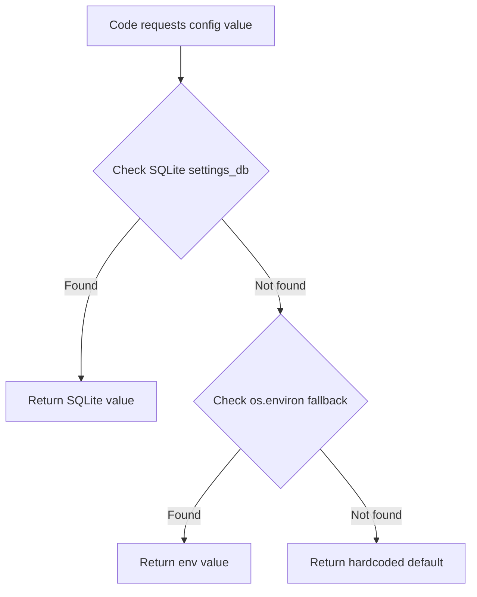

# Settings Page Architecture Plan

## Overview

Create a new Settings page in the Streamlit UI backed by SQLite for persistent configuration storage. **All settings — including API keys and infrastructure — live in SQLite** and are editable through the UI. The `.env` file serves only as a **first-run seed**: on initial startup, values from `.env` are imported into the database. After that, the `.env` is no longer needed.

---

## Architecture

### SQLite-First Configuration Model

```mermaid
flowchart TB
    subgraph First Run Only
        ENV[.env file] -->|seeds initial values| SEED[seed_from_env]
    end

    subgraph SQLite Database
        SECRETS[Secrets - API keys]
        INFRA[Infrastructure - hosts/ports]
        LLM[LLM Settings]
        RAG[RAG Settings]
        WA[WhatsApp Behavior]
        APP[App Settings]
        TRACE[Tracing Settings]
    end

    SEED --> SQLite Database

    subgraph Config Service
        CS[src/settings_db.py]
    end

    SQLite Database --> CS
    CS --> |provides config| FLASK[Flask Backend]
    CS --> |provides config| RAGMOD[RAG Module]
    CS --> |provides config| SESSION[Session Manager]

    subgraph Streamlit UI
        SETTINGS[Settings Page]
        HEALTH[Health Status]
    end

    SETTINGS --> |PUT /config| FLASK
    HEALTH --> |GET /health| FLASK
    FLASK --> |GET /config| SETTINGS
```

### How It Works

1. **First run**: App starts, SQLite DB is empty → `seed_from_env()` reads `.env` values and populates the database with all settings
2. **Normal operation**: All config reads go to SQLite first → env var fallback → hardcoded default
3. **Settings UI**: User edits settings via the Settings page → saved to SQLite via `PUT /config` → takes effect immediately or on next query
4. **No .env needed after seed**: The `.env` file can be deleted after first run; everything lives in the database

### `.env` — First-Run Seed Only

The `.env` file provides initial values on first startup. After seeding, it is no longer read. Environment variables still serve as a fallback if a key is missing from SQLite, which is useful for Docker `env_file` overrides.

### SQLite — All Settings (editable via UI)

| Category | Key | Default | Type | UI Widget | Description |
|----------|-----|---------|------|-----------|-------------|
| **Secrets** | `openai_api_key` | _(from .env)_ | `secret` | password input | OpenAI API key |
| **Secrets** | `google_api_key` | _(from .env)_ | `secret` | password input | Google Gemini API key |
| **Secrets** | `tavily_api_key` | _(from .env)_ | `secret` | password input | Tavily search API key |
| **Secrets** | `waha_api_key` | _(from .env)_ | `secret` | password input | WAHA API key |
| **Secrets** | `langchain_api_key` | _(from .env)_ | `secret` | password input | LangSmith API key |
| **LLM** | `llm_provider` | `openai` | `select` | selectbox | LLM provider: openai or gemini |
| **LLM** | `openai_model` | `gpt-4o` | `text` | text input | OpenAI model name |
| **LLM** | `openai_temperature` | `0.7` | `float` | slider | OpenAI temperature 0.0-2.0 |
| **LLM** | `gemini_model` | `gemini-pro` | `text` | text input | Gemini model name |
| **LLM** | `gemini_temperature` | `0.7` | `float` | slider | Gemini creativity 0.0-2.0 |
| **RAG** | `rag_collection_name` | `whatsapp_messages` | `text` | text input | Qdrant collection name |
| **RAG** | `rag_min_score` | `0.5` | `float` | slider | Minimum similarity score threshold |
| **RAG** | `rag_max_context_tokens` | `3000` | `int` | number input | Max tokens for context window |
| **RAG** | `rag_default_k` | `10` | `int` | number input | Default number of context docs |
| **RAG** | `embedding_model` | `text-embedding-3-small` | `text` | text input | OpenAI embedding model |
| **WhatsApp** | `chat_prefix` | `??` | `text` | text input | Prefix to trigger AI chat |
| **WhatsApp** | `dalle_prefix` | `!!` | `text` | text input | Prefix to trigger DALL-E |
| **WhatsApp** | `waha_session_name` | `default` | `text` | text input | WAHA session name |
| **WhatsApp** | `dalle_model` | `dall-e-3` | `text` | text input | DALL-E model version |
| **Infrastructure** | `redis_host` | `redis` | `text` | text input | Redis server hostname |
| **Infrastructure** | `redis_port` | `6379` | `int` | number input | Redis server port |
| **Infrastructure** | `qdrant_host` | `qdrant` | `text` | text input | Qdrant server hostname |
| **Infrastructure** | `qdrant_port` | `6333` | `int` | number input | Qdrant server port |
| **Infrastructure** | `waha_base_url` | `http://waha:3000` | `text` | text input | WAHA server URL |
| **Infrastructure** | `webhook_url` | `http://app:8765/webhook` | `text` | text input | Webhook callback URL |
| **App** | `log_level` | `DEBUG` | `select` | selectbox | Application log level |
| **App** | `redis_ttl` | `604800` | `int` | number input | Redis key TTL in seconds |
| **App** | `session_ttl_minutes` | `30` | `int` | number input | Conversation session timeout |
| **App** | `session_max_history` | `20` | `int` | number input | Max conversation history turns |
| **Tracing** | `langchain_tracing_v2` | `false` | `bool` | toggle | Enable LangSmith tracing |
| **Tracing** | `langchain_project` | `whatsapp-gpt` | `text` | text input | LangSmith project name |

---

## SQLite Schema

Database file: `data/settings.db` (mounted as Docker volume)

```sql
CREATE TABLE IF NOT EXISTS settings (
    key TEXT PRIMARY KEY,
    value TEXT NOT NULL,
    category TEXT NOT NULL DEFAULT 'app',
    type TEXT NOT NULL DEFAULT 'text',  -- text, int, float, bool, select, secret
    description TEXT,
    updated_at TIMESTAMP DEFAULT CURRENT_TIMESTAMP
);
```

### Seed Logic (first run)

On first startup, `settings_db.init_db()` will:
1. Create the table if it does not exist
2. Check if the table is empty
3. If empty, seed all defaults from the hardcoded defaults table
4. Then overlay any values found in `.env` / environment variables using an env-key mapping:

```python
# Mapping: SQLite key -> environment variable name
ENV_KEY_MAP = {
    'openai_api_key': 'OPENAI_API_KEY',
    'google_api_key': 'GOOGLE_API_KEY',
    'tavily_api_key': 'TAVILY_API_KEY',
    'waha_api_key': 'WAHA_API_KEY',
    'langchain_api_key': 'LANGCHAIN_API_KEY',
    'llm_provider': 'LLM_PROVIDER',
    'openai_model': 'OPENAI_MODEL',
    'openai_temperature': 'OPENAI_TEMPERATURE',
    'gemini_model': 'GEMINI_MODEL',
    'gemini_temperature': 'GEMINI_TEMPERATURE',
    'embedding_model': 'EMBEDDING_MODEL',
    'redis_host': 'REDIS_HOST',
    'redis_port': 'REDIS_PORT',
    'redis_ttl': 'REDIS_TTL',
    'qdrant_host': 'QDRANT_HOST',
    'qdrant_port': 'QDRANT_PORT',
    'waha_base_url': 'WAHA_BASE_URL',
    'waha_session_name': 'WAHA_SESSION_NAME',
    'webhook_url': 'WEBHOOK_URL',
    'chat_prefix': 'CHAT_PREFIX',
    'dalle_prefix': 'DALLE_PREFIX',
    'dalle_model': 'DALLE_MODEL',
    'log_level': 'LOG_LEVEL',
    'session_ttl_minutes': 'SESSION_TTL_MINUTES',
    'session_max_history': 'SESSION_MAX_HISTORY',
    'langchain_tracing_v2': 'LANGCHAIN_TRACING_V2',
    'langchain_project': 'LANGCHAIN_PROJECT',
}
```

---

## New/Modified Files

### New Files

| File | Purpose |
|------|---------|
| `src/settings_db.py` | SQLite settings database: init, seed from env, get, set, get_by_category |
| `ui/pages/1_⚙️_Settings.py` | Streamlit settings page with health status + config forms |
| `data/` | Directory for SQLite database file (gitignored) |

### Modified Files

| File | Change |
|------|--------|
| `src/config.py` | Add `get_setting()` function: SQLite first -> env fallback -> default |
| `src/app.py` | Add `GET /config`, `PUT /config`, `GET /config/categories` API endpoints |
| `src/app.py` | Enhance `GET /health` to include WAHA status |
| `src/llamaindex_rag.py` | Read RAG params from `get_setting()` instead of env/hardcoded |
| `ui/app.py` | Minor: ensure multi-page navigation works with pages/ directory |
| `.env.example` | Add comment explaining it is a first-run seed; keep all vars as reference |
| `docker-compose.yml` | Add `./data:/app/data` volume mount for SQLite persistence |
| `.gitignore` | Add `data/settings.db` |

---

## Backend API Endpoints

### `GET /config`

Returns all settings grouped by category. Secret values are masked.

```json
{
    "secrets": {
        "openai_api_key": {"value": "sk-...***", "type": "secret", "description": "OpenAI API key"},
        "google_api_key": {"value": "****", "type": "secret", "description": "..."}
    },
    "llm": {
        "llm_provider": {"value": "openai", "type": "select", "description": "..."},
        "openai_model": {"value": "gpt-4o", "type": "text", "description": "..."}
    },
    "rag": { },
    "whatsapp": { },
    "infrastructure": { },
    "app": { },
    "tracing": { }
}
```

**Note**: Secret values are returned masked (`sk-ab...xyz`) — showing only first 4 and last 3 characters. The full value is never sent to the frontend unless explicitly editing.

### `PUT /config`

Update one or more settings.

```json
{
    "settings": {
        "llm_provider": "gemini",
        "openai_temperature": "0.5",
        "openai_api_key": "sk-new-key-here"
    }
}
```

Response:
```json
{
    "status": "ok",
    "updated": ["llm_provider", "openai_temperature", "openai_api_key"],
    "restart_required": ["openai_api_key"]
}
```

The `restart_required` field lists settings that affect already-initialized singletons and may need a service restart to take full effect.

### `GET /config/categories`

Returns available categories for filtering.

```json
{
    "categories": ["secrets", "llm", "rag", "whatsapp", "infrastructure", "app", "tracing"]
}
```

### `GET /health` (existing, enhanced)

The existing health endpoint already checks Redis and Qdrant. Enhance to also check WAHA.

```json
{
    "status": "up",
    "dependencies": {
        "redis": "connected",
        "qdrant": "connected",
        "waha": "connected"
    }
}
```

---

## Settings Page UI Layout

```
+-----------------------------------------------------+
|  Settings                                            |
+-----------------------------------------------------+
|                                                      |
|  System Health                                       |
|  +----------+-----------+-----------+                |
|  |  Redis   |  Qdrant   |  WAHA     |                |
|  |  OK      |  OK       |  OK       |                |
|  +----------+-----------+-----------+                |
|                                                      |
|  -------------------------------------------------   |
|                                                      |
|  API Keys and Secrets                                |
|  +---------------------------------------+           |
|  | OpenAI Key:   [********          ]    |           |
|  | Google Key:   [********          ]    |           |
|  | Tavily Key:   [********          ]    |           |
|  | WAHA Key:     [********          ]    |           |
|  | LangSmith Key:[********          ]    |           |
|  +---------------------------------------+           |
|                                                      |
|  LLM Configuration                                   |
|  +---------------------------------------+           |
|  | Provider:     [OpenAI v]              |           |
|  | Model:        [gpt-4o          ]      |           |
|  | Temperature:  [====o===] 0.7          |           |
|  +---------------------------------------+           |
|                                                      |
|  RAG Configuration                                   |
|  +---------------------------------------+           |
|  | Collection:   [whatsapp_messages ]    |           |
|  | Embedding:    [text-embedding-3-s]    |           |
|  | Min Score:    [====o===] 0.5          |           |
|  | Max Tokens:   [3000        ]          |           |
|  | Default K:    [10          ]          |           |
|  +---------------------------------------+           |
|                                                      |
|  WhatsApp Configuration                              |
|  +---------------------------------------+           |
|  | Chat Prefix:  [??              ]      |           |
|  | DALL-E Prefix:[!!              ]      |           |
|  | Session Name: [default         ]      |           |
|  | DALL-E Model: [dall-e-3        ]      |           |
|  +---------------------------------------+           |
|                                                      |
|  Infrastructure                                      |
|  +---------------------------------------+           |
|  | Redis Host:   [redis           ]      |           |
|  | Redis Port:   [6379            ]      |           |
|  | Qdrant Host:  [qdrant          ]      |           |
|  | Qdrant Port:  [6333            ]      |           |
|  | WAHA URL:     [http://waha:3000]      |           |
|  | Webhook URL:  [http://app:8765/]      |           |
|  +---------------------------------------+           |
|                                                      |
|  App Configuration                                   |
|  +---------------------------------------+           |
|  | Log Level:    [DEBUG v]               |           |
|  | Redis TTL:    [604800      ] sec      |           |
|  | Session TTL:  [30          ] min      |           |
|  | Max History:  [20          ]          |           |
|  +---------------------------------------+           |
|                                                      |
|  Tracing - LangSmith                                 |
|  +---------------------------------------+           |
|  | Enabled:      [  ] Toggle             |           |
|  | Project:      [whatsapp-gpt    ]      |           |
|  +---------------------------------------+           |
|                                                      |
|           [ Save Settings ]                          |
|                                                      |
|  -------------------------------------------------   |
|  Note: Infrastructure and API key changes may        |
|  require a service restart to take full effect.      |
+-----------------------------------------------------+
```

---

## Data Flow: Config Resolution



### Config Resolution in Code

The refactored `config.py` will have a `get_setting()` function:

```python
def get_setting(key: str, default: Any = None) -> Any:
    """Get a config value. SQLite first, then env fallback, then default."""
    # 1. Try SQLite first (all settings live here after first run)
    from settings_db import get_setting_value
    value = get_setting_value(key)
    if value is not None:
        return value
    
    # 2. Fall back to environment variable (using ENV_KEY_MAP)
    from settings_db import ENV_KEY_MAP
    env_key = ENV_KEY_MAP.get(key, key.upper())
    value = os.environ.get(env_key)
    if value is not None:
        return value
    
    # 3. Return default
    return default
```

---

## Implementation Order

1. **`src/settings_db.py`** — SQLite module with init, seed from env, get, set, get_all, get_by_category
2. **Refactor `src/config.py`** — Add `get_setting()` that checks SQLite -> env -> default
3. **Backend API endpoints** — Add `/config` CRUD routes to `src/app.py`
4. **Enhance `/health`** — Add WAHA connectivity check
5. **Refactor consumers** — Update `llamaindex_rag.py` and session manager to use `get_setting()`
6. **Settings UI page** — Create `ui/pages/1_⚙️_Settings.py`
7. **Update `ui/app.py`** — Ensure multi-page navigation works
8. **Cleanup** — Update `.env.example`, `.gitignore`, `docker-compose.yml`

---

## Edge Cases and Considerations

- **Thread safety**: Use connection-per-request pattern with `sqlite3.connect()` per call rather than a shared connection
- **Docker**: Mount `./data:/app/data` volume for persistence across container restarts
- **First run**: `settings_db.init_db()` auto-seeds defaults and overlays `.env` values if table is empty
- **Hot reload**: Settings that affect already-initialized singletons (like the RAG LLM or embedding model) may need a service restart. The UI should display a warning for these settings. The `_llm_configured` flag in `LlamaIndexRAG` can be reset to force reconfiguration on next query
- **Validation**: Type-aware validation before saving — temperature must be 0.0-2.0, ports must be valid integers, k must be positive
- **Secret masking**: API keys are masked in the `GET /config` response. The UI shows `st.text_input(type='password')` for secret fields
- **Backward compatibility**: The `Config` class `__getattr__` still works via env vars; `get_setting()` is the new preferred way. Existing code using `config.OPENAI_API_KEY` continues to work through the env var fallback
