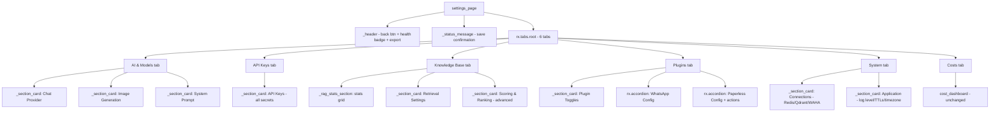

# Settings Page Refactor v2 — UX Redesign

## Problem Statement

The current settings page has 7 horizontal tabs (LLM, Keys, RAG, Plugins, Infra, App, Costs) that dump flat lists of settings with auto-generated labels. The result is messy, unintuitive, and hard to navigate. Specific issues:

1. **Too many tabs** — 7 top-level tabs overwhelm the horizontal tab bar
2. **No visual hierarchy** — each tab is a flat `rx.foreach` list with no grouping
3. **Ugly labels** — auto-generated via `key.replace("_", " ").title()` → "Rag Rrf K", "Openai Temperature"
4. **Misplaced concerns** — Infrastructure and App are separate tabs but logically related
5. **Plugin sub-tabs** — tabs-within-tabs is confusing
6. **System Health wastes space** — full section always visible at the top
7. **No visual cards/sections** — everything blends together

---

## New Tab Structure

Consolidate from **7 tabs → 6 tabs** with better logical grouping:

```
┌───────────────────────────────────────────────────────────────────────┐
│ ← Settings                                     ● Connected  [Export] │
│                                                                       │
│ ┌───────────┐┌──────────┐┌──────────────┐┌────────┐┌──────┐┌──────┐  │
│ │ 🤖 AI     ││ 🔑 Keys  ││ 📚 Knowledge ││🔌 Plug-││⚙️ Sys││💰Cost│  │
│ │ & Models  ││          ││    Base      ││  ins   ││ tem  ││  s   │  │
│ └───────────┘└──────────┘└──────────────┘└────────┘└──────┘└──────┘  │
│──────────────────────────────────────────────────────────────────────│
│                                                                       │
│  ┌─ Section Card ──────────────────────────────────────────────────┐  │
│  │ 💬 Chat Provider                              [Reset Defaults]  │  │
│  │                                                                  │  │
│  │  Provider     [openai ▼]                                         │  │
│  │  Model        [gpt-4o          ]                                 │  │
│  │  Temperature  [0.7             ]                                 │  │
│  └──────────────────────────────────────────────────────────────────┘  │
│                                                                       │
│  ┌─ Section Card ──────────────────────────────────────────────────┐  │
│  │ 🖼️ Image Generation                                             │  │
│  │                                                                  │  │
│  │  Provider     [openai ▼]                                         │  │
│  │  DALL-E Model [dall-e-3        ]                                 │  │
│  └──────────────────────────────────────────────────────────────────┘  │
│                                                                       │
│  ┌─ Section Card ──────────────────────────────────────────────────┐  │
│  │ 📝 System Prompt                                                │  │
│  │                                                                  │  │
│  │  ┌──────────────────────────────────────────────────────────┐    │  │
│  │  │ You are a helpful AI assistant for a personal...         │    │  │
│  │  │                                                          │    │  │
│  │  └──────────────────────────────────────────────────────────┘    │  │
│  └──────────────────────────────────────────────────────────────────┘  │
└───────────────────────────────────────────────────────────────────────┘
```

### Tab → Backend Category Mapping

| New Tab | Backend Categories | Content |
|---------|-------------------|---------|
| **🤖 AI & Models** | `llm` + `whatsapp.dalle_model` | Chat provider, image provider, system prompt |
| **🔑 API Keys** | `secrets` | All secret-type settings |
| **📚 Knowledge Base** | `rag` | RAG stats dashboard + all RAG settings in sections |
| **🔌 Plugins** | `plugins` + per-plugin cats | Toggles + accordion per plugin |
| **⚙️ System** | `infrastructure` + `app` | Two sections: Connections + Application |
| **💰 Costs** | n/a | Cost tracking dashboard (unchanged) |

---

## Component Hierarchy



---

## Detailed Tab Contents

### 🤖 AI & Models

Three section cards with curated settings (not a flat dump):

**Chat Provider** section:
| Setting Key | Display Label | Type | Conditional |
|------------|---------------|------|-------------|
| `llm_provider` | Provider | select | — |
| `openai_model` | Model | text | only if provider=openai |
| `openai_temperature` | Temperature | float | only if provider=openai |
| `gemini_model` | Model | text | only if provider=gemini |
| `gemini_temperature` | Temperature | float | only if provider=gemini |

**Image Generation** section:
| Setting Key | Display Label | Type | Conditional |
|------------|---------------|------|-------------|
| `image_provider` | Provider | select | — |
| `dalle_model` | DALL-E Model | text | only if provider=openai |
| `imagen_model` | Imagen Model | text | only if provider=google |

**System Prompt** section:
| Setting Key | Display Label | Type |
|------------|---------------|------|
| `system_prompt` | System Prompt | textarea |

### 🔑 API Keys

Single section card with all secrets:

| Setting Key | Display Label |
|------------|---------------|
| `openai_api_key` | OpenAI API Key |
| `google_api_key` | Google API Key |
| `waha_api_key` | WAHA API Key |

### 📚 Knowledge Base

**Vector Store Statistics** (existing stats grid — unchanged):
- Total Vectors, WhatsApp Messages, Documents, Collection Name
- Qdrant Dashboard link

**Retrieval Settings** section:
| Setting Key | Display Label |
|------------|---------------|
| `rag_collection_name` | Collection Name |
| `embedding_model` | Embedding Model |
| `rag_vector_size` | Vector Dimensions |
| `rag_default_k` | Documents to Retrieve |
| `rag_max_context_tokens` | Max Context Tokens |
| `rag_context_window_seconds` | Context Time Window |
| `rag_min_score` | Minimum Similarity Score |

**Scoring & Ranking** section (collapsible/advanced):
| Setting Key | Display Label |
|------------|---------------|
| `rag_rrf_k` | RRF Smoothing Constant |
| `rag_fulltext_score_sender` | Sender Match Score |
| `rag_fulltext_score_chat_name` | Chat Name Match Score |
| `rag_fulltext_score_message` | Message Content Match Score |

### 🔌 Plugins

**Plugin Toggles** section at top — enable/disable switches for each plugin.

Then **accordion items** for each plugin (replaces sub-tabs):

```
┌─────────────────────────────────────────────────────────┐
│ ▸ 💬 WhatsApp                                           │
├─────────────────────────────────────────────────────────┤
│ ▾ 📄 Paperless-NGX                                      │
│                                                          │
│   Server URL       [http://paperless:8000       ]        │
│   API Token        [●●●●...xyz  👁 💾]                   │
│   Sync Interval    [3600                        ]        │
│   ...                                                    │
│                                                          │
│   [🔌 Test Connection]  [🔄 Start Sync]                  │
│   ✅ Connected successfully                              │
└─────────────────────────────────────────────────────────┘
```

### ⚙️ System

**Connections** section:
| Setting Key | Display Label |
|------------|---------------|
| `redis_host` | Redis Host |
| `redis_port` | Redis Port |
| `qdrant_host` | Qdrant Host |
| `qdrant_port` | Qdrant Port |
| `waha_base_url` | WAHA Server URL |
| `webhook_url` | Webhook Callback URL |
| `ui_api_url` | UI API URL |

**Application** section:
| Setting Key | Display Label |
|------------|---------------|
| `log_level` | Log Level |
| `timezone` | Timezone |
| `redis_ttl` | Cache TTL |
| `session_ttl_minutes` | Session Timeout |
| `session_max_history` | Max History Turns |
| `cost_tracking_enabled` | Cost Tracking |

### 💰 Costs

Unchanged — uses existing `cost_dashboard()` component.

---

## Header Redesign

Compact the header: back button + title on left, health badge + export on right.

```
┌──────────────────────────────────────────────────────────┐
│ ← Settings                       ● Connected   [Export]  │
└──────────────────────────────────────────────────────────┘
```

The health indicator becomes a small colored dot + label inline in the header, replacing the full "System Health" section that currently wastes vertical space.

---

## Human-Readable Labels

Add a `SETTING_LABELS` dictionary in `settings_page.py` to map setting keys to proper display names:

```python
SETTING_LABELS: dict[str, str] = {
    "llm_provider": "Provider",
    "openai_model": "Model",
    "openai_temperature": "Temperature",
    "gemini_model": "Model",
    "gemini_temperature": "Temperature",
    "image_provider": "Provider",
    "imagen_model": "Imagen Model",
    "dalle_model": "DALL-E Model",
    "system_prompt": "System Prompt",
    "openai_api_key": "OpenAI API Key",
    "google_api_key": "Google API Key",
    "waha_api_key": "WAHA API Key",
    "rag_collection_name": "Collection Name",
    "rag_min_score": "Minimum Similarity Score",
    "rag_max_context_tokens": "Max Context Tokens",
    "rag_default_k": "Documents to Retrieve",
    "rag_context_window_seconds": "Context Time Window (seconds)",
    "embedding_model": "Embedding Model",
    "rag_vector_size": "Vector Dimensions",
    "rag_rrf_k": "RRF Smoothing Constant",
    "rag_fulltext_score_sender": "Sender Match Score",
    "rag_fulltext_score_chat_name": "Chat Name Match Score",
    "rag_fulltext_score_message": "Message Content Score",
    "redis_host": "Redis Host",
    "redis_port": "Redis Port",
    "qdrant_host": "Qdrant Host",
    "qdrant_port": "Qdrant Port",
    "waha_base_url": "WAHA Server URL",
    "webhook_url": "Webhook URL",
    "ui_api_url": "UI API URL",
    "log_level": "Log Level",
    "timezone": "Timezone",
    "redis_ttl": "Cache TTL (seconds)",
    "session_ttl_minutes": "Session Timeout (minutes)",
    "session_max_history": "Max History Turns",
    "cost_tracking_enabled": "Cost Tracking",
    "chat_prefix": "Chat Trigger Prefix",
    "dalle_prefix": "Image Generation Prefix",
    "waha_session_name": "Session Name",
}
```

The `_render_setting` function checks this dict first, falls back to description or auto-generated label.

---

## Section Card Component

New shared component `_section_card()` that wraps settings in a visually distinct card:

```python
def _section_card(title: str, icon: str, children: list[rx.Component],
                  reset_category: str = "") -> rx.Component:
    return rx.box(
        rx.flex(
            rx.flex(
                rx.icon(icon, size=16),
                rx.text(title, font_weight="600", font_size="0.875rem"),
                align="center", gap="2",
            ),
            # Optional reset button
            rx.cond(reset_category != "", _reset_button(reset_category), rx.fragment()),
            justify="between", align="center",
            class_name="mb-3",
        ),
        *children,
        class_name="settings-card",  # Styled via CSS
    )
```

---

## CSS Additions

```css
/* Settings page cards */
.settings-card {
    background: white;
    border: 1px solid #E5E7EB;
    border-radius: 0.75rem;
    padding: 1.25rem;
    margin-bottom: 1rem;
}

.settings-card:hover {
    border-color: #D1D5DB;
}
```

---

## State Changes

### New Computed Vars

```python
@rx.var(cache=True)
def ai_chat_settings(self) -> list[dict[str, str]]:
    """LLM provider settings filtered by current selection."""
    # Same filtering logic as current llm_settings_list but excludes
    # system_prompt and image_provider/imagen_model

@rx.var(cache=True)
def ai_image_settings(self) -> list[dict[str, str]]:
    """Image provider settings — image_provider + conditional model."""
    # Includes dalle_model from whatsapp category

@rx.var(cache=True)
def system_prompt_setting(self) -> list[dict[str, str]]:
    """Just the system_prompt setting."""

@rx.var(cache=True)
def rag_retrieval_settings(self) -> list[dict[str, str]]:
    """Core RAG settings: collection, model, k, tokens, min_score."""

@rx.var(cache=True)
def rag_scoring_settings(self) -> list[dict[str, str]]:
    """Advanced RAG scoring: rrf_k, fulltext scores."""

@rx.var(cache=True)
def connections_settings_list(self) -> list[dict[str, str]]:
    """Infrastructure settings for the Connections section."""

@rx.var(cache=True)
def application_settings_list(self) -> list[dict[str, str]]:
    """App settings for the Application section."""
```

### Label Resolution

Update `_cat_settings()` to accept an optional label override dict, or add label resolution in the computed var:

```python
def _cat_settings(self, category: str, keys: list[str] | None = None) -> list[dict[str, str]]:
    """Return settings for a category, optionally filtered to specific keys."""
    # If keys provided, only include those keys (in order)
    # Apply SETTING_LABELS for display name
```

---

## Files to Modify

| File | Change Type | Description |
|------|-------------|-------------|
| `ui-reflex/ui_reflex/components/settings_page.py` | **Major rewrite** | New tab structure, section cards, label map, accordion plugins |
| `ui-reflex/ui_reflex/state.py` | **Modify** | Add new computed vars for split tab sections |
| `ui-reflex/assets/styles.css` | **Add** | `.settings-card` styles |

No backend changes required — the frontend maps existing backend categories to new UI tabs.

---

## Migration Notes

- **No breaking changes** — backend categories, API endpoints, and data model are unchanged
- **settings_page.py** is a full rewrite — the existing file has no reusable sections
- **state.py** adds new computed vars alongside existing ones (existing vars remain for backward compatibility during development, then can be cleaned up)
- **Cost display** component is untouched — just rendered in the new Costs tab as before
