# Settings Page Refactor — Architecture Plan

## Goal

Refactor the settings page to:
1. Display **all** settings from SQLite, organized by category
2. Move **hardcoded values** from source code into the SQLite settings database
3. Include **plugin settings** (enable/disable + per-plugin configuration)

---

## Current State

### What exists
- **SQLite settings DB** (`src/settings_db.py`) — stores all config as key/value rows with category, type, and description metadata
- **Config API endpoints** (`src/app.py`) — `GET /config`, `PUT /config`, `POST /config/reset`, `GET /config/categories`
- **Plugin architecture** — WhatsApp plugin registers its own settings via `get_default_settings()` into SQLite
- **UI Settings panel** (`ui/components/settings_panel.py`) — currently shows only filters, a basic API URL input, k_results slider, stats, and health

### What's missing
- The UI settings panel does **not** render any SQLite-backed settings
- Several values are **hardcoded** in source code instead of being in the DB
- No backend endpoint exposes **config metadata** (SELECT_OPTIONS, CATEGORY_META) for the UI
- Plugin settings are registered in SQLite but **not shown** in the UI

---

## Hardcoded Values to Migrate

| Value | Current Location | Proposed SQLite Key | Category | Type |
|-------|-----------------|---------------------|----------|------|
| `VECTOR_SIZE = 1024` | `src/llamaindex_rag.py:170` | `rag_vector_size` | rag | int |
| `RRF_K = 60` | `src/llamaindex_rag.py:173` | `rag_rrf_k` | rag | int |
| `"Asia/Jerusalem"` timezone | `llamaindex_rag.py`, `whatsapp/handler.py`, `models/base.py` | `timezone` | app | text |
| System prompt template | `llamaindex_rag.py:1233-1246` | `system_prompt` | llm | text |
| `api_url = "http://localhost:8765"` | `ui/app.py:61`, `ui/utils/api.py:16` | `ui_api_url` | app | text |

> **Note**: `FULLTEXT_SCORE_*` constants in `llamaindex_rag.py` are internal tuning parameters; we can leave them hardcoded for now unless the user wants fine-grained tuning.

---

## Architecture

### Data Flow


### New Backend Endpoint: `GET /config/meta`

Returns metadata needed by the UI to render proper form controls:

```json
{
  "category_meta": {
    "plugins": {"label": "🔌 Plugins", "order": "-1"},
    "secrets": {"label": "🔑 API Keys & Secrets", "order": "0"},
    "llm": {"label": "🤖 LLM Configuration", "order": "1"},
    ...
  },
  "select_options": {
    "llm_provider": ["openai", "gemini"],
    "log_level": ["DEBUG", "INFO", "WARNING", "ERROR"]
  }
}
```

### Settings Panel UI Layout

```mermaid
flowchart TD
    SP[Settings Panel - Full Page or Sidebar] --> TABS[Category Tabs / Accordions]
    TABS --> PLUGINS[🔌 Plugins]
    TABS --> SECRETS[🔑 API Keys]
    TABS --> LLM[🤖 LLM Config]
    TABS --> RAG[🔍 RAG Config]
    TABS --> WHATSAPP[💬 WhatsApp]
    TABS --> INFRA[🏗️ Infrastructure]
    TABS --> APP[🔧 App Config]
    TABS --> TRACING[📊 Tracing]

    PLUGINS --> P_TOGGLE[Plugin Enable/Disable Toggles]
    PLUGINS --> P_SETTINGS[Per-Plugin Settings]
    
    LLM --> L_PROVIDER[Provider Select: openai/gemini]
    LLM --> L_MODEL[Model Name: text input]
    LLM --> L_TEMP[Temperature: float slider]
    LLM --> L_PROMPT[System Prompt: textarea]
    
    RAG --> R_COLLECTION[Collection Name: text]
    RAG --> R_SCORE[Min Score: float slider]
    RAG --> R_K[Default K: int]
    RAG --> R_TOKENS[Max Context Tokens: int]
    RAG --> R_EMBED[Embedding Model: text]
    RAG --> R_VECTOR[Vector Size: int]
    RAG --> R_RRF[RRF K: int]
```



Each setting is rendered based on its `type`:
- **text** → `st.text_input`
- **secret** → `st.text_input` with `type="password"`, showing masked value
- **int** → `st.number_input` with `step=1`
- **float** → `st.number_input` with `step=0.1`
- **bool** → `st.toggle`
- **select** → `st.selectbox` using options from `SELECT_OPTIONS`

---

## Files to Modify

### Backend (`src/`)

| File | Changes |
|------|---------|
| `src/settings_db.py` | Add new entries to `DEFAULT_SETTINGS`: `timezone`, `rag_vector_size`, `rag_rrf_k`, `system_prompt`, `ui_api_url` |
| `src/app.py` | Add `GET /config/meta` endpoint returning `CATEGORY_META` + `SELECT_OPTIONS` |
| `src/llamaindex_rag.py` | Read `VECTOR_SIZE`, `RRF_K`, timezone, and system_prompt from `settings` instead of hardcoding |
| `src/plugins/whatsapp/handler.py` | Read timezone from `settings.timezone` |
| `src/whatsapp/handler.py` | Read timezone from `settings.timezone` |
| `src/models/base.py` | Read timezone from `settings.timezone` |

### Frontend (`ui/`)

| File | Changes |
|------|---------|
| `ui/components/settings_panel.py` | **Full rewrite** — fetch settings from `/config` + `/config/meta`, render by category with proper input types, save changes via `PUT /config` |
| `ui/utils/api.py` | Add `fetch_config_meta()` function; optionally read `ui_api_url` from config |
| `ui/app.py` | Remove hardcoded `api_url` default; optionally bootstrap from saved config |

---

## Detailed Change Descriptions

### 1. New SQLite Settings

Add to `DEFAULT_SETTINGS` in `src/settings_db.py`:

```python
# App
("timezone", "Asia/Jerusalem", "app", "text", "Timezone for date/time display"),
("ui_api_url", "http://localhost:8765", "app", "text", "Backend API URL for UI"),

# RAG
("rag_vector_size", "1024", "rag", "int", "Embedding vector dimensions"),
("rag_rrf_k", "60", "rag", "int", "Reciprocal Rank Fusion constant"),

# LLM
("system_prompt", "<default prompt text>", "llm", "text", "System prompt for the AI assistant"),
```

Also add to `ENV_KEY_MAP`:
```python
"timezone": "TIMEZONE",
"ui_api_url": "UI_API_URL",
"rag_vector_size": "RAG_VECTOR_SIZE",
"rag_rrf_k": "RAG_RRF_K",
"system_prompt": "SYSTEM_PROMPT",
```

### 2. New `/config/meta` Endpoint

In `src/app.py`:
```python
@app.route("/config/meta", methods=["GET"])
def get_config_meta():
    import settings_db
    return jsonify({
        "category_meta": settings_db.CATEGORY_META,
        "select_options": settings_db.SELECT_OPTIONS,
    }), 200
```

### 3. Refactored Settings Panel

The new `ui/components/settings_panel.py` will:

1. **Fetch** all settings from `GET /config` and metadata from `GET /config/meta`
2. **Sort** categories by `CATEGORY_META` order
3. **Render** each category as an `st.expander` with the category label from metadata
4. For the **Plugins** category: render enable/disable toggles, then render sub-categories for each plugin's settings
5. For each setting, render the **appropriate input widget** based on type
6. **Save** button per category that calls `PUT /config` with changes
7. **Reset** button per category that calls `POST /config/reset`

### 4. Plugin Settings in UI

Plugin settings flow:
1. Plugin `get_default_settings()` returns settings with the plugin name as category (e.g., "whatsapp")
2. Registry registers them in SQLite via `register_plugin_settings()`
3. Registry also registers `plugin_<name>_enabled` in the "plugins" category
4. UI fetches all settings → sees "plugins" category with enable toggles → sees "whatsapp" category with plugin-specific settings
5. Both show up naturally in the category-based rendering

---

## Migration Safety

- **Existing settings preserved**: `register_plugin_settings()` uses `INSERT OR IGNORE` — existing values are never overwritten
- **New settings**: Added to `DEFAULT_SETTINGS` array; on next DB init they'll be seeded only if the table is empty. For existing databases, we need a one-time migration or use `INSERT OR IGNORE` logic in `init_db()`
- **Database migration**: Add a `_seed_missing_defaults()` call in `init_db()` that runs `INSERT OR IGNORE` for all `DEFAULT_SETTINGS` entries, ensuring new settings are added to existing databases without overwriting user values

---

## Risk Assessment

- **Low risk**: UI refactor (purely additive, no backend logic changes)
- **Low risk**: New API endpoint (additive)
- **Medium risk**: Moving hardcoded values to DB reads — need to ensure settings exist before code accesses them; the `init_db()` auto-init on import handles this
- **Low risk**: System prompt in DB — allows customization but default is the current hardcoded text
