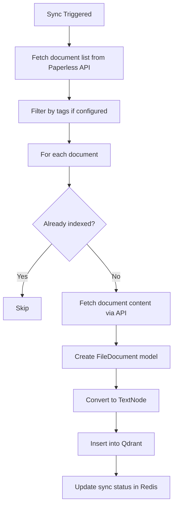
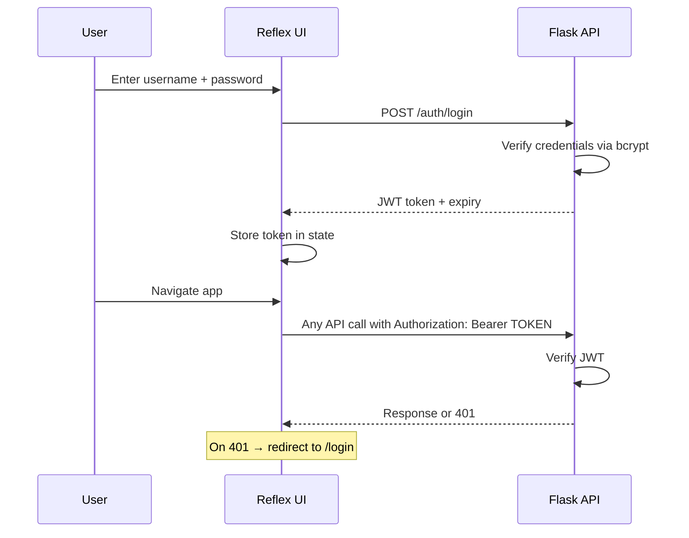

# Settings UI Fixes & Enhancements Plan

## Overview

Six UI issues, tabbed settings layout, Paperless-NGX plugin, and authentication — organized into implementation phases.

---

## Phase 1A: Backend Cleanup & New Settings

### 1. Remove LangSmith

**Files:** [`src/settings_db.py`](src/settings_db.py), [`.env.example`](.env.example)

Remove from:
- `DEFAULT_SETTINGS` — 3 tuples: `langchain_tracing_v2`, `langchain_project`, `langchain_api_key`
- `ENV_KEY_MAP` — 3 entries: `langchain_api_key`, `langchain_tracing_v2`, `langchain_project`
- `CATEGORY_META` — remove `tracing` entry
- `.env.example` — remove Tracing section + `LANGCHAIN_API_KEY` line

### 2. Remove Tavily

**Files:** [`src/settings_db.py`](src/settings_db.py), [`.env.example`](.env.example)

Remove from:
- `DEFAULT_SETTINGS` — `tavily_api_key` tuple
- `ENV_KEY_MAP` — `tavily_api_key` mapping
- `.env.example` — `TAVILY_API_KEY` line

### 3. Add Image Generation Provider

**File:** [`src/settings_db.py`](src/settings_db.py)

Add to `DEFAULT_SETTINGS` in the `llm` category:
```python
("image_provider", "openai", "llm", "select", "Image generation provider: openai or google"),
("imagen_model", "imagen-3.0-generate-002", "llm", "text", "Google Imagen model name"),
```

Add to `SELECT_OPTIONS`:
```python
"image_provider": ["openai", "google"],
```

Add to `ENV_KEY_MAP`:
```python
"image_provider": "IMAGE_PROVIDER",
"imagen_model": "IMAGEN_MODEL",
```

### 4. Add Export/Import API Endpoints

**File:** [`src/app.py`](src/app.py)

- `GET /config/export` — returns all settings as JSON with secrets **unmasked** (for backup)
- `POST /config/import` — accepts JSON dict, calls `set_settings()` for each key

---

## Phase 1B: Settings UI Overhaul (Tabbed Layout)

### Tab Structure

```
┌──────────────────────────────────────────────────────────────┐
│ ← Settings                              [Export] [Import]    │
│                                                              │
│ ┌──────┐┌──────┐┌─────┐┌────────┐┌───────┐┌─────┐           │
│ │🤖 LLM││🔑Keys││🔍RAG││🔌Plugins││🏗️Infra ││🔧App│           │
│ └──────┘└──────┘└─────┘└────────┘└───────┘└─────┘           │
│─────────────────────────────────────────────────────────────│
│                                                              │
│  Tab content area                                            │
│                                                              │
└──────────────────────────────────────────────────────────────┘
```

### Tab Contents

**🤖 LLM Tab** (category: `llm`)
- LLM Provider dropdown (openai / gemini)
- Conditional: if openai → show openai_model, openai_temperature
- Conditional: if gemini → show gemini_model, gemini_temperature
- Image Provider dropdown (openai / google)
- Conditional: if openai → show dalle_model (from whatsapp category)
- Conditional: if google → show imagen_model
- System prompt textarea

**🔑 API Keys Tab** (category: `secrets`)
- All secret-type settings with password inputs
- OpenAI API Key, Google API Key, WAHA API Key

**🔍 RAG Tab** (category: `rag`)
- RAG Statistics section at top (bound to `AppState.rag_stats`)
  - Total Documents count
  - Collection name
  - Qdrant dashboard link
- All RAG settings below

**🔌 Plugins Tab** (categories: `plugins` + per-plugin categories)
- Plugin enable/disable toggles at the top
- Sub-tabs for each discovered plugin config:

```
  ┌────────────┐┌────────────────┐
  │💬 WhatsApp ││📄 Paperless-NGX│
  └────────────┘└────────────────┘
  ─────────────────────────────────
  Chat Prefix: ??
  DALL-E Prefix: !!
  WAHA Session: default
  ...
```

**🏗️ Infrastructure Tab** (category: `infrastructure`)
- Redis host/port
- Qdrant host/port

**🔧 App Tab** (category: `app`)
- Log level (select dropdown)
- Redis TTL, Session TTL, Session max history
- Timezone
- UI API URL

### State Changes

**File:** [`ui-reflex/ui_reflex/state.py`](ui-reflex/ui_reflex/state.py)

New state vars:
```python
settings_tab: str = "llm"           # Active top-level tab
plugin_tab: str = ""                # Active plugin sub-tab
```

New computed vars:
```python
@rx.var
def rag_total_docs(self) -> str:    # Extract from rag_stats
@rx.var
def rag_collection(self) -> str:    # Extract from rag_stats
@rx.var
def select_options(self) -> dict:   # From config_meta
@rx.var
def plugin_categories(self) -> list: # Plugin-specific categories for sub-tabs
@rx.var
def tab_settings(self) -> list:     # Settings filtered for current tab
```

Modified handlers:
- `load_conversation()` — add `return rx.redirect('/')`
- Add `export_settings()` / `import_settings()` handlers

### Component Architecture

**File:** [`ui-reflex/ui_reflex/components/settings_page.py`](ui-reflex/ui_reflex/components/settings_page.py) — full rewrite

```python
settings_page()
├── _header()           # Back button + title + Export/Import buttons
├── _health_section()   # System health (unchanged)
├── rx.tabs.root()      # Tab container
│   ├── rx.tabs.list()  # Tab triggers
│   │   ├── "🤖 LLM"
│   │   ├── "🔑 Keys"
│   │   ├── "🔍 RAG"
│   │   ├── "🔌 Plugins"
│   │   ├── "🏗️ Infra"
│   │   └── "🔧 App"
│   └── rx.tabs.content() × 6  # Tab panels
│       ├── _llm_tab()
│       │   ├── _provider_section()  # LLM provider select + conditional fields
│       │   ├── _image_section()     # Image provider select + conditional fields
│       │   └── _system_prompt()     # Textarea for prompt
│       ├── _keys_tab()              # Secret inputs
│       ├── _rag_tab()
│       │   ├── _stats_section()     # Bound to rag_stats
│       │   └── _rag_settings()      # RAG config inputs
│       ├── _plugins_tab()
│       │   ├── _plugin_toggles()    # Enable/disable switches
│       │   └── rx.tabs.root()       # Nested sub-tabs per plugin
│       ├── _infra_tab()
│       └── _app_tab()
└── _setting_input()    # Shared: handles text/secret/bool/select/float/int types
```

---

## Phase 1C: Paperless-NGX Plugin

### Overview

Paperless-NGX is a document management system with a REST API. The plugin will:
1. Connect to a Paperless-NGX instance via its API
2. Sync documents (fetch content, tags, correspondents)
3. Index document text + metadata in the RAG vector store
4. Support manual sync trigger and periodic background sync

### Plugin Files

```
src/plugins/paperless/
├── __init__.py
├── plugin.py        # PaperlessPlugin(ChannelPlugin) — main class
├── client.py        # PaperlessClient — API wrapper
└── sync.py          # Document sync logic (fetch + index)
```

### Plugin Settings

```python
# Default settings registered in settings_db
("paperless_url", "http://paperless:8000", "paperless", "text", "Paperless-NGX server URL"),
("paperless_token", "", "paperless", "secret", "Paperless-NGX API token"),
("paperless_sync_interval", "3600", "paperless", "int", "Sync interval in seconds (0 = manual only)"),
("paperless_sync_tags", "", "paperless", "text", "Comma-separated tag names to sync (empty = all)"),
("paperless_max_docs", "1000", "paperless", "int", "Maximum documents to sync per run"),
```

### Blueprint Routes

```
/plugins/paperless/sync          POST  — Trigger manual document sync
/plugins/paperless/sync/status   GET   — Get sync status (running/idle, last_sync, doc_count)
/plugins/paperless/webhook       POST  — Receive Paperless-NGX post-consumption webhook
```

### Sync Logic



### Document Model

Uses existing [`FileDocument`](src/models/document.py) model (or a new `PaperlessDocument` subclass) with metadata:
- `source`: "paperless"
- `content_type`: "document"
- `chat_name`: document title (for consistent RAG search)
- `sender`: correspondent name (maps to sender field for search)
- `tags`: Paperless-NGX tags
- `document_type`: Paperless-NGX document type
- `source_id`: `paperless:{document_id}` for deduplication

### Health Check

```python
def health_check(self) -> Dict[str, str]:
    # GET {paperless_url}/api/ with auth header
    # Return {"paperless": "connected"} or {"paperless": "error: ..."}
```

---

## Phase 2: Authentication (JWT-based)

### Architecture



### Components

**New file: `src/auth.py`**
- `create_user(username, password)` — bcrypt hash + store in users table
- `verify_user(username, password)` — bcrypt verify
- `create_token(username)` — JWT with expiry
- `verify_token(token)` — decode and validate JWT
- `@require_auth` decorator for Flask endpoints

**Exempt endpoints** (no auth required):
- `GET /health`
- `POST /auth/login`
- `POST /plugins/*/webhook` (incoming webhooks from external services)

**New Reflex page: `login_page.py`**
- Username/password form
- Error message display
- Redirect to `/` on successful login

**Settings:**
- `admin_username` (default: "admin", category: auth)
- `admin_password_hash` (bcrypt, seeded from `ADMIN_PASSWORD` env var)
- `jwt_secret` (auto-generated, stored in settings_db)
- `jwt_expiry_hours` (default: 24)

---

## Files Summary

### Phase 1A — Backend
| File | Change |
|------|--------|
| `src/settings_db.py` | Remove LangSmith/Tavily, add image_provider/imagen_model |
| `src/app.py` | Add GET /config/export, POST /config/import |
| `.env.example` | Remove LangSmith + Tavily, add IMAGE_PROVIDER |

### Phase 1B — Frontend
| File | Change |
|------|--------|
| `ui-reflex/ui_reflex/state.py` | Tab state, computed vars, redirect, export/import handlers |
| `ui-reflex/ui_reflex/api_client.py` | Add export/import functions |
| `ui-reflex/ui_reflex/components/settings_page.py` | Full rewrite: tabbed layout |

### Phase 1C — Paperless Plugin
| File | Change |
|------|--------|
| `src/plugins/paperless/__init__.py` | NEW — package init |
| `src/plugins/paperless/plugin.py` | NEW — PaperlessPlugin class |
| `src/plugins/paperless/client.py` | NEW — Paperless API client |
| `src/plugins/paperless/sync.py` | NEW — Document sync logic |

### Phase 2 — Authentication
| File | Change |
|------|--------|
| `src/auth.py` | NEW — JWT auth module |
| `src/settings_db.py` | Add users table, auth settings |
| `src/app.py` | Add auth endpoints + @require_auth |
| `ui-reflex/ui_reflex/state.py` | Auth token, login/logout |
| `ui-reflex/ui_reflex/api_client.py` | Auth headers |
| `ui-reflex/ui_reflex/components/login_page.py` | NEW — login form |
| `ui-reflex/ui_reflex/ui_reflex.py` | Add /login route |
