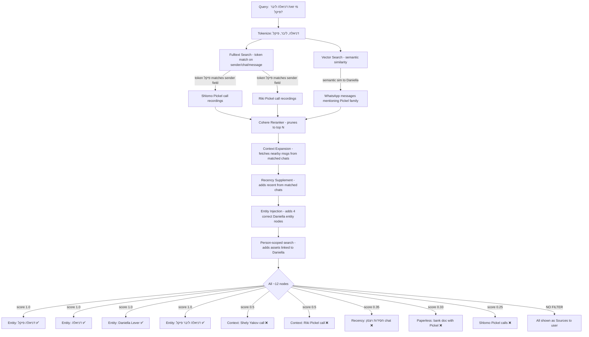
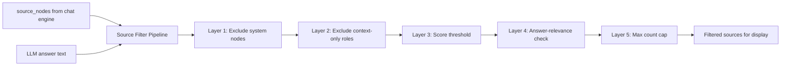

# Source Relevance Filtering Plan

## Problem Statement

When a user asks about a specific person (e.g., "מי זאת דניאלה ליבר פיקל?"), the system returns **irrelevant sources** alongside the correct answer. For example, call recordings from Shlomo Pickel, Shely Yakov, and Riki Pickel appear as sources even though they have nothing to do with Daniella.

The LLM's **answer is correct** — it only references relevant Entity Store facts. But the **sources list** shown to the user is polluted with noise.

## Root Cause Analysis

The retrieval pipeline correctly casts a wide net to give the LLM maximum context — this is good for answer quality. However, **all retriever nodes are dumped as user-facing sources** without any filtering.

### How irrelevant sources enter the pipeline



### Specific causes

1. **Fulltext token `פיקל` is too broad** — matches ALL Pickel family members via `_fulltext_search` sender field
2. **Context expansion amplifies noise** — matched chats from irrelevant Pickel calls get their surrounding messages pulled in at score 0.5
3. **Recency supplement adds unrelated chats** — recent messages from chats that appeared in results get added
4. **No source filtering before display** — `app.py` lines 347-362 dump ALL `source_nodes` to the user

## Solution Design

The fix is a **multi-layer source filtering pipeline** applied between the retriever output and the user-facing sources display. The retriever continues fetching broad context for the LLM (which produces good answers), but sources shown to the user are filtered for relevance.

### Architecture



### Layer Details

#### Layer 1: Exclude system/placeholder nodes (existing)
Already done in `app.py` — skips nodes where `source == "system"`.

#### Layer 2: Exclude context-only nodes (NEW — metadata tagging)
Tag nodes that were added purely for LLM context with a `source_role` metadata field. These nodes are important for the LLM but should NOT appear as user-visible sources.

Nodes to tag:
- **Context expansion** nodes → `source_role: "context_expansion"` (score 0.5 in `expand_context()`)
- **Recency supplement** nodes → `source_role: "recency_supplement"` (added in `_retrieve()` step 4)
- **Asset neighborhood** nodes → `source_role: "asset_neighborhood"` (score 0.35-0.40 in `expand_asset_neighborhood()`)

Nodes to NOT tag (always show):
- Entity fact injection nodes (score 1.0, `source: "entity_store"`)
- Primary search results (from `search()` and Cohere rerank)
- Person-scoped search results
- Document chunk siblings (from `expand_document_chunks()` — these complete a document the user asked about)

#### Layer 3: Score threshold
Only display sources above a configurable minimum score. Default: **0.5** (catches most noise from recency/asset expansion at 0.3-0.45).

Setting: `source_display_min_score` (default: `"0.5"`)

#### Layer 4: Answer-relevance check
Check if the source content is **referenced in the LLM answer**. A source is considered relevant if any of these match:
- Source `sender` name appears in the answer text
- Source `chat_name` appears in the answer text
- For entity store sources: always relevant (they're factual answers)
- For call recordings/documents: check if any distinctive content from the source snippet appears in the answer

This is a lightweight string-matching check, not an LLM call.

Setting: `source_display_answer_filter` (default: `"true"`)

#### Layer 5: Max count cap
Limit the number of displayed sources to prevent information overload.

Setting: `source_display_max_count` (default: `"8"`)

## Implementation Plan

### File Changes

#### 1. `src/llamaindex_rag.py` — Tag context-only nodes with `source_role` metadata

Add `source_role` metadata to nodes in three locations:

**a) `expand_context()` method (~line 3124)** — tag expanded nodes:
```python
node = TextNode(
    text=text,
    metadata={..., "source_role": "context_expansion"},
    id_=record_id,
)
```

**b) `_retrieve()` step 4 recency supplement (~line 489)** — tag recency nodes:
```python
for nws in chat_recent:
    if nws.node and nws.node.id_ not in existing_ids:
        # Tag recency supplement nodes
        if nws.node:
            meta = getattr(nws.node, "metadata", {})
            meta["source_role"] = "recency_supplement"
        existing_ids.add(nws.node.id_)
        results.append(nws)
```

**c) `expand_asset_neighborhood()` method (~lines 3398, 3436, 3474)** — tag neighborhood nodes:
```python
node = TextNode(
    text=text,
    metadata={..., "source_role": "asset_neighborhood"},
    id_=record_id,
)
```

#### 2. `src/rich_response.py` — Add source filtering function

Add a new method `filter_sources_for_display()` to `RichResponseProcessor`:

```python
def filter_sources_for_display(
    self,
    source_nodes: List[Any],
    answer: str,
    min_score: float = 0.5,
    max_count: int = 8,
    exclude_roles: Optional[Set[str]] = None,
    answer_filter: bool = True,
) -> List[Any]:
    """Filter source nodes to only show relevant ones to the user."""
```

This function applies the 5-layer pipeline described above and returns filtered `source_nodes`.

#### 3. `src/app.py` — Integrate filtering into `rag_query()`

In the `rag_query()` endpoint (~lines 347-362), add filtering between extracting source_nodes and building the sources list:

```python
# Extract source documents
source_nodes = []
if hasattr(response, 'source_nodes') and response.source_nodes:
    source_nodes = response.source_nodes

# NEW: Filter sources for display relevance
display_nodes = rich_processor.filter_sources_for_display(
    source_nodes=source_nodes,
    answer=answer,
)

sources = []
for node_with_score in display_nodes:
    # ... existing source extraction logic
```

#### 4. Settings (no schema changes needed)

Add three new settings to `settings_db.py` SETTING_DEFINITIONS in the RAG category:

| Key | Default | Type | Description |
|-----|---------|------|-------------|
| `source_display_min_score` | `0.5` | text | Minimum score for a source to be shown to user |
| `source_display_max_count` | `8` | text | Maximum number of sources to display |
| `source_display_filter_enabled` | `true` | text | Enable/disable source filtering |

## Expected Results for Daniella Query

**Before (current):**
12 sources shown — including Shely Yakov, Shlomo Pickel, Riki Pickel call recordings, Paperless bank documents, and random WhatsApp group messages.

**After (with filtering):**
4-5 sources shown:
1. ✅ Entity Store: דניאלה פיקל (score 1.0, entity_store)
2. ✅ Entity Store: דניאלה (score 1.0, entity_store) 
3. ✅ Entity Store: Daniella Lever / דניאלה ליבר (score 1.0, entity_store)
4. ✅ Entity Store: דניאלה ליבר פיקל (score 1.0, entity_store)
5. ✅ Any person-scoped search result directly about Daniella (score 0.85)

Filtered out:
- ❌ Shely Yakov call (score 0.5, context_expansion role → excluded by Layer 2)
- ❌ Riki Pickel call (score 0.5, context_expansion → excluded by Layer 2)
- ❌ חסידות ויצמן messages (score 0.33, below threshold → excluded by Layer 3)
- ❌ Bank document (score 0.33, sender not in answer → excluded by Layer 4)
- ❌ Shlomo Pickel calls (score 0.25, below threshold → excluded by Layer 3)

## Risk Assessment

- **Low risk**: The LLM still receives ALL context nodes for generating its answer — only the user-facing sources display is filtered
- **No retrieval quality impact**: The retrieval pipeline is unchanged
- **Configurable**: Every filter layer can be tuned or disabled via settings
- **Backward compatible**: Default behavior with `source_display_filter_enabled=false` shows all sources as before
