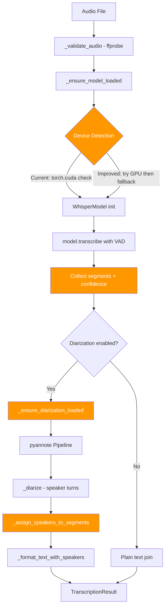
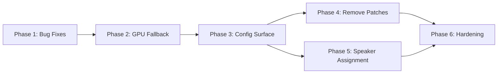

# Transcriber Module Improvements — Implementation Plan

Based on a deep research review of the `faster-whisper` + `pyannote` diarization stack, this plan addresses correctness bugs, robustness gaps, configuration limitations, and maintenance risks in [`transcriber.py`](src/plugins/call_recordings/transcriber.py).

## Current State Summary

The transcriber module in [`WhisperTranscriber`](src/plugins/call_recordings/transcriber.py:68) has solid foundations:
- Lazy model loading with caching
- Audio pre-validation via `ffprobe`
- Anti-hallucination defaults (`condition_on_previous_text=False`, VAD filter)
- Speaker diarization via pyannote with overlap-based alignment

However, the deep research review identified **10 categories** of improvements ranging from a real bug to architectural hardening.

---

## Architecture Overview



**Orange nodes** = areas with identified improvements.

---

## Phase 1: Correctness & Quick Wins

### 1.1 Fix `avg_logprob` confidence bug

**File:** [`transcriber.py:619-620`](src/plugins/call_recordings/transcriber.py:619)

**Bug:** The current code treats `avg_logprob == 0.0` as falsy, returning `0.5` instead of `exp(0) = 1.0`:

```python
# CURRENT (buggy)
avg_logprob = seg.avg_logprob or 0.0
segment_confidence = math.exp(avg_logprob) if avg_logprob else 0.5

# FIXED
avg_logprob = seg.avg_logprob  # may be None or float
if avg_logprob is not None:
    segment_confidence = math.exp(avg_logprob)
else:
    segment_confidence = 0.5  # missing data sentinel
```

**Impact:** Correct confidence scores; prevents misleading quality metrics stored in the DB via [`sync.py:382`](src/plugins/call_recordings/sync.py:382).

### 1.2 Add thread locks to lazy-load methods

**File:** [`transcriber.py:115`](src/plugins/call_recordings/transcriber.py:115) and [`transcriber.py:212`](src/plugins/call_recordings/transcriber.py:212)

**Problem:** [`_ensure_model_loaded()`](src/plugins/call_recordings/transcriber.py:115) and [`_ensure_diarization_loaded()`](src/plugins/call_recordings/transcriber.py:212) have no synchronization. The [`CallRecordingSyncer`](src/plugins/call_recordings/sync.py:50) uses a `ThreadPoolExecutor` at [`sync.py:82`](src/plugins/call_recordings/sync.py:82), so concurrent calls can cause double-loads or partial initialization.

**Fix:** Add `threading.Lock()` to `__init__` and guard both lazy-load methods:

```python
import threading

class WhisperTranscriber:
    def __init__(self, ...):
        ...
        self._model_lock = threading.Lock()
        self._diarization_lock = threading.Lock()

    def _ensure_model_loaded(self):
        if self._model is not None:
            return
        with self._model_lock:
            if self._model is not None:  # double-check
                return
            # ... existing load logic
```

---

## Phase 2: Robustness — Device Detection & GPU Fallback

### 2.1 Replace `torch.cuda.is_available()` with try-GPU-then-fallback

**File:** [`transcriber.py:132-150`](src/plugins/call_recordings/transcriber.py:132)

**Problem:** `torch.cuda.is_available()` does not guarantee CTranslate2 GPU readiness. CTranslate2 has its own CUDA/cuDNN version requirements independent of PyTorch.

**Fix:** Attempt GPU initialization first; on any CTranslate2 exception, fall back to CPU:

```python
def _ensure_model_loaded(self):
    from faster_whisper import WhisperModel

    # Try GPU first, fall back to CPU
    for device, compute_type in [("cuda", "float16"), ("cpu", "int8")]:
        try:
            self._model = WhisperModel(
                self._model_size,
                device=device,
                compute_type=compute_type,
                ...
            )
            logger.info(f"Loaded model on {device} with {compute_type}")
            return
        except Exception as e:
            if device == "cuda":
                logger.warning(f"GPU init failed, falling back to CPU: {e}")
            else:
                raise  # CPU failure is fatal
```

### 2.2 Support `compute_type="auto"` option

CTranslate2 supports `auto` which selects the fastest type for the current hardware. Surface this as a configuration option with `auto` as the default to reduce environment-specific issues.

---

## Phase 3: Configuration Surface Area

### 3.1 Expand `WhisperTranscriber.__init__` parameters

**File:** [`transcriber.py:86-103`](src/plugins/call_recordings/transcriber.py:86)

Add configurable parameters that are currently hardcoded or using defaults:

| Parameter | Current | Proposed | Purpose |
|-----------|---------|----------|---------|
| `device` | auto-detected | `"auto"`, `"cpu"`, `"cuda"` | Explicit device control |
| `compute_type` | `int8`/`float16` | `"auto"`, `"int8"`, `"float16"` | Match hardware capabilities |
| `cpu_threads` | `multiprocessing.cpu_count()` | configurable int or `0` for auto | Control resource usage |
| `num_workers` | `min(cpu_count, 4)` | configurable | Parallel decoding workers |
| `download_root` | HF default cache | configurable path | Model cache location |
| `local_files_only` | `False` | configurable bool | Offline/air-gapped support |

### 3.2 Expand `transcribe()` parameters

**File:** [`transcriber.py:554`](src/plugins/call_recordings/transcriber.py:554)

Allow callers to override transcription behavior:

| Parameter | Current | Proposed | Purpose |
|-----------|---------|----------|---------|
| `language` | auto-detect | optional override | Skip detection for known languages |
| `beam_size` | `5` | configurable | Speed/accuracy tradeoff |
| `word_timestamps` | not used | optional bool | Better diarization alignment |
| `initial_prompt` | not used | optional string | Domain-specific vocabulary hints |

**Wire these to plugin settings:**

**File:** [`plugin.py:69-120`](src/plugins/call_recordings/plugin.py:69)

Add new settings:
- `call_recordings_whisper_language` — Force language or leave blank for auto
- `call_recordings_whisper_compute_type` — `auto`, `int8`, `float16`
- `call_recordings_word_timestamps` — Enable word-level timestamps for better diarization

### 3.3 Make diarization pipeline name configurable

**File:** [`transcriber.py:320-321`](src/plugins/call_recordings/transcriber.py:320)

Currently hardcoded to `"pyannote/speaker-diarization-3.1"`. The newer `pyannote/speaker-diarization-community-1` is reported to outperform 3.1 on key metrics.

Add a `diarization_model` parameter to `__init__` with default `"pyannote/speaker-diarization-3.1"` and a corresponding plugin setting.

---

## Phase 4: Remove Monkey Patches — Version-Aware Compatibility

### 4.1 Replace torchaudio shims with version-aware strategy

**File:** [`transcriber.py:248-287`](src/plugins/call_recordings/transcriber.py:248)

**Problem:** Patching `torchaudio.list_audio_backends()` to return `["soundfile"]` conflicts with pyannote >= 4.0 which dropped soundfile backend support entirely in favor of FFmpeg-only I/O.

**Fix:**
```python
import pyannote.audio
pyannote_version = tuple(int(x) for x in pyannote.audio.__version__.split(".")[:2])

if pyannote_version >= (4, 0):
    # pyannote 4+ uses ffmpeg only — no torchaudio shims needed
    # Verify ffmpeg is available
    _verify_ffmpeg_available()
else:
    # pyannote 3.x — apply legacy torchaudio shims only if needed
    _apply_torchaudio_shims()
```

### 4.2 Replace huggingface_hub monkey patch with version-aware auth

**File:** [`transcriber.py:292-312`](src/plugins/call_recordings/transcriber.py:292)

**Problem:** Patching `hf_hub_download` globally can affect other libraries.

**Fix:**
```python
import pyannote.audio
pyannote_version = tuple(int(x) for x in pyannote.audio.__version__.split(".")[:2])

if pyannote_version >= (4, 0):
    # pyannote 4+ uses token= kwarg natively
    pipeline = Pipeline.from_pretrained(model_name, token=hf_token)
else:
    # pyannote 3.x uses use_auth_token=
    pipeline = Pipeline.from_pretrained(model_name, use_auth_token=hf_token)
```

### 4.3 Improve diarization error messaging

**File:** [`transcriber.py:342-348`](src/plugins/call_recordings/transcriber.py:342)

Distinguish between:
- Token missing → guide to Settings
- Token present but 403 GatedRepo → guide to HuggingFace model acceptance page
- Import error → guide to pip install
- Other runtime error → log full traceback

---

## Phase 5: Speaker Assignment Improvements

### 5.1 Improve overlap-based assignment for edge cases

**File:** [`transcriber.py:398-433`](src/plugins/call_recordings/transcriber.py:398)

**Current weakness:** When overlap is zero or near-zero, defaults to `"Speaker A"` which can cause incorrect attribution.

**Improvements:**
1. When overlap < 100ms threshold, use **segment midpoint proximity** instead
2. Combine overlap duration with midpoint distance as a weighted score
3. Avoid hard-coded `"Speaker A"` fallback — use nearest speaker instead

```python
def _assign_speakers_to_segments(self, segments, diarization_turns):
    OVERLAP_THRESHOLD = 0.1  # 100ms

    for seg in segments:
        seg_mid = (seg["start"] + seg["end"]) / 2
        best_speaker = None
        best_score = -1

        for turn_start, turn_end, speaker in diarization_turns:
            overlap = max(0, min(seg["end"], turn_end) - max(seg["start"], turn_start))

            if overlap > OVERLAP_THRESHOLD:
                score = overlap
            else:
                # Fallback: proximity of segment midpoint to turn center
                turn_mid = (turn_start + turn_end) / 2
                distance = abs(seg_mid - turn_mid)
                score = 1.0 / (1.0 + distance)  # inverse distance

            if score > best_score:
                best_score = score
                best_speaker = speaker

        seg["speaker"] = best_speaker or "Unknown Speaker"
    return segments
```

### 5.2 Optional word-level speaker assignment

When `word_timestamps=True` is enabled, assign speaker per-word then aggregate to segment level. This significantly reduces misattribution in multi-speaker segments.

This is a larger feature that depends on Phase 3.2 — only implement if word timestamps are enabled.

---

## Phase 6: Dependency & Operational Hardening

### 6.1 Pin dependency version ranges

**File:** [`requirements.txt:49-58`](requirements.txt:49)

```
# Current (too loose)
faster-whisper>=1.0.0
torch>=2.0
pyannote.audio>=3.1

# Improved (bounded)
faster-whisper>=1.0.0,<2.0
torch>=2.0,<3.0
pyannote.audio>=3.1,<5.0
torchaudio>=2.0,<3.0
```

### 6.2 Add offline/air-gapped support

**File:** [`transcriber.py:166`](src/plugins/call_recordings/transcriber.py:166)

Pass `download_root` and `local_files_only` to `WhisperModel()`:
```python
self._model = WhisperModel(
    self._model_size,
    device=device,
    compute_type=compute_type,
    download_root=self._download_root,
    local_files_only=self._local_files_only,
    ...
)
```

For pyannote, support loading pipeline from a local directory:
```python
if os.path.isdir(diarization_model):
    pipeline = Pipeline.from_pretrained(diarization_model)  # local path
else:
    pipeline = Pipeline.from_pretrained(diarization_model, token=hf_token)
```

### 6.3 Add `torch.load` shim scope control

**File:** [`transcriber.py:235-245`](src/plugins/call_recordings/transcriber.py:235)

The current `torch.load` patch is global and permanent. Scope it to pyannote loading only:

```python
# Apply patch
torch.load = _patched_torch_load
try:
    pipeline = Pipeline.from_pretrained(...)
finally:
    torch.load = _orig_torch_load  # restore immediately
```

---

## Implementation Order and Dependencies



**Recommended implementation sequence:**

1. **Phase 1** — Zero-risk correctness fixes, no API changes
2. **Phase 2** — Improves reliability on diverse hardware
3. **Phase 3** — Expands API surface; requires plugin settings changes
4. **Phase 4** — Reduces fragility; depends on Phase 3 for version-aware config
5. **Phase 5** — Improves output quality; can benefit from Phase 3 word timestamps
6. **Phase 6** — Operational polish; depends on all prior phases being stable

---

## Files Modified

| File | Changes |
|------|---------|
| [`src/plugins/call_recordings/transcriber.py`](src/plugins/call_recordings/transcriber.py) | All phases — bug fix, locks, GPU fallback, config params, patch removal, speaker assignment |
| [`src/plugins/call_recordings/plugin.py`](src/plugins/call_recordings/plugin.py) | Phase 3 — new settings for compute_type, language, word_timestamps, diarization_model |
| [`requirements.txt`](requirements.txt) | Phase 6 — pin version upper bounds |

No changes needed to [`scanner.py`](src/plugins/call_recordings/scanner.py), [`sync.py`](src/plugins/call_recordings/sync.py), or [`db.py`](src/plugins/call_recordings/db.py).
