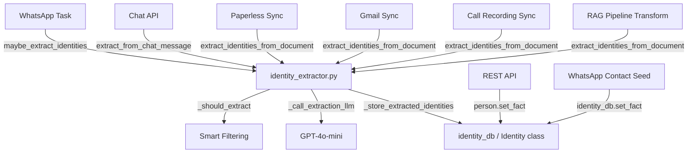
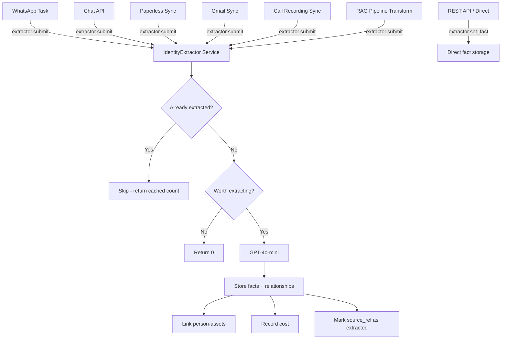

# Unified IdentityExtractor Service

## Problem

Identity/fact extraction is spread across 3 public functions in [`identity_extractor.py`](src/identity_extractor.py) with 6 call sites. Each caller does its own try/except wrapping, builds source-specific parameters, and has no deduplication or batching. There's no single authority deciding *what* to extract, *when*, or *whether* it's already been done.

## Current Architecture

### Call Sites (6 callers)

| Caller | Function Used | Source Type |
|--------|--------------|-------------|
| [`tasks/whatsapp.py:102`](src/tasks/whatsapp.py:102) | `maybe_extract_identities()` | WhatsApp message |
| [`app.py:402`](src/app.py:402) | `extract_from_chat_message()` | User chat correction |
| [`plugins/paperless/sync.py:567`](src/plugins/paperless/sync.py:567) | `extract_identities_from_document()` | Paperless document |
| [`plugins/gmail/sync.py:717`](src/plugins/gmail/sync.py:717) | `extract_identities_from_document()` | Gmail email |
| [`plugins/call_recordings/sync.py:697`](src/plugins/call_recordings/sync.py:697) | `extract_identities_from_document()` | Call recording transcript |
| [`llamaindex_rag.py:4966`](src/llamaindex_rag.py:4966) | `extract_identities_from_document()` | RAG pipeline transform |

### Direct `set_fact()` Calls (bypass LLM)

| Caller | Purpose |
|--------|---------|
| [`app.py:1212`](src/app.py:1212) | Manual fact edit via REST API |
| [`identity_db.py:1581`](src/identity_db.py:1581) | `is_business` flag from WhatsApp contact seed |

### Current Flow



## Proposed Architecture: `IdentityExtractor` Service

A singleton service class that all callers fire-and-forget content into. The service owns:

1. **Smart filtering** — should we extract at all?
2. **Deduplication** — have we already extracted from this source_ref?
3. **LLM extraction** — single prompt + model config
4. **Storage** — facts, relationships, person-asset links
5. **Cost tracking** — centralized meter integration

### New Flow



### Class API

```python
class IdentityExtractor:
    """Singleton service for all identity/fact extraction.
    
    Usage:
        from identity_extractor import extractor
        
        # Fire-and-forget from any source
        extractor.submit(
            content='I am turning 32 next week!',
            source=ExtractionSource.WHATSAPP_MESSAGE,
            source_ref='chat:972501234567@c.us:1708012345',
            sender='Shiran Waintrob',
            chat_name='Shiran Waintrob',
            timestamp='1708012345',
            sender_whatsapp_id='972501234567@c.us',
        )
        
        # Direct fact storage - no LLM, for manual edits and known facts
        extractor.set_fact(
            person_id=42,
            key='city',
            value='Tel Aviv',
            confidence=0.9,
            source_type='manual',
        )
    """
```

### `ExtractionSource` Enum

```python
class ExtractionSource(str, Enum):
    WHATSAPP_MESSAGE = 'whatsapp'
    CHAT_CORRECTION = 'chat_correction'
    PAPERLESS_DOCUMENT = 'paperless'
    GMAIL_EMAIL = 'gmail'
    CALL_RECORDING = 'call_recording'
    RAG_PIPELINE = 'rag_pipeline'
    MANUAL = 'manual'
```

### `submit()` — Universal Extraction Entry Point

```python
def submit(
    self,
    content: str,
    source: ExtractionSource,
    source_ref: str = '',
    *,
    sender: str = '',
    chat_name: str = '',
    timestamp: str = '',
    sender_whatsapp_id: str | None = None,
    chat_id: str = '',
    is_document: bool = False,
    llm_context: str = '',  # For chat corrections: assistant response context
    confidence: float | None = None,  # Override default per-source confidence
) -> int:
    """Submit content for identity extraction.
    
    The service decides whether to extract based on:
    1. Global enabled setting
    2. Source-specific enabled settings
    3. Dedup check against source_ref
    4. Smart content filtering (length, patterns, etc.)
    
    Returns:
        Number of facts stored (0 if skipped/filtered/deduped)
    """
```

### Source-Specific Behavior Table

| Source | Filtering | Confidence | Dedup Key | Special Logic |
|--------|-----------|-----------|-----------|---------------|
| `WHATSAPP_MESSAGE` | Smart filter: length + patterns | 0.6 | `chat:{chat_id}:{timestamp}` | Skip groups if configured |
| `CHAT_CORRECTION` | Smart filter | 0.8 | `chat_correction:{conversation_id}` | Include LLM context for pronoun resolution |
| `PAPERLESS_DOCUMENT` | Always extract | 0.6 | `paperless:{doc_id}` | Truncate to 4000 chars |
| `GMAIL_EMAIL` | Always extract | 0.6 | `gmail:{msg_id}` | Truncate to 4000 chars |
| `CALL_RECORDING` | Always extract | 0.6 | `call_recording:{hash}` | Truncate to 4000 chars |
| `RAG_PIPELINE` | Length check, source filter | 0.6 | source_id from metadata | Only paperless/gmail content types |

### Deduplication Strategy

Track extracted source_refs in a lightweight SQLite table:

```sql
CREATE TABLE IF NOT EXISTS extraction_log (
    source_ref TEXT PRIMARY KEY,
    extracted_at TIMESTAMP DEFAULT CURRENT_TIMESTAMP,
    facts_stored INTEGER DEFAULT 0,
    source_type TEXT
);
```

When [`submit()`](src/identity_extractor.py) is called:
1. Check `extraction_log` for `source_ref`
2. If found → return cached `facts_stored` count
3. If not found → proceed with extraction → record in log

This prevents re-extracting the same WhatsApp message or document during re-syncs.

### `set_fact()` — Direct Fact Storage (No LLM)

```python
def set_fact(
    self,
    person_id: int,
    key: str,
    value: str,
    confidence: float = 0.8,
    source_type: str = 'manual',
    source_ref: str | None = None,
    source_quote: str | None = None,
) -> None:
    """Store a fact directly without LLM extraction.
    
    Used for:
    - Manual edits via REST API
    - Known structured data (is_business flag, etc.)
    """
```

### Singleton Access

```python
# Module-level singleton
_instance: IdentityExtractor | None = None

def get_extractor() -> IdentityExtractor:
    """Get or create the singleton IdentityExtractor service."""
    global _instance
    if _instance is None:
        _instance = IdentityExtractor()
    return _instance

# Convenience alias
extractor = get_extractor
```

## Migration Plan

### Phase 1: Build the Service Class

Refactor [`identity_extractor.py`](src/identity_extractor.py) into the `IdentityExtractor` class:

- Move [`_EXTRACTION_SYSTEM_PROMPT`](src/identity_extractor.py:35), [`_build_extraction_user_prompt()`](src/identity_extractor.py:76), [`_should_extract()`](src/identity_extractor.py:125), [`_call_extraction_llm()`](src/identity_extractor.py:165), [`_store_extracted_identities()`](src/identity_extractor.py:223) into the class as private methods
- Add `ExtractionSource` enum
- Implement `submit()` with source-specific routing logic
- Implement `set_fact()` for direct storage
- Add `extraction_log` table to [`identity_db.py`](src/identity_db.py) for dedup tracking
- Keep backward-compatible module-level functions that delegate to the singleton (temporary)

### Phase 2: Migrate All 6 Callers

Update each caller to use the new API:

1. **[`tasks/whatsapp.py`](src/tasks/whatsapp.py:100)**: Replace `maybe_extract_identities()` with `extractor.submit(source=WHATSAPP_MESSAGE, ...)`
2. **[`app.py`](src/app.py:400)**: Replace `extract_from_chat_message()` with `extractor.submit(source=CHAT_CORRECTION, ...)`
3. **[`plugins/paperless/sync.py`](src/plugins/paperless/sync.py:565)**: Replace `extract_identities_from_document()` with `extractor.submit(source=PAPERLESS_DOCUMENT, ...)`
4. **[`plugins/gmail/sync.py`](src/plugins/gmail/sync.py:715)**: Replace `extract_identities_from_document()` with `extractor.submit(source=GMAIL_EMAIL, ...)`
5. **[`plugins/call_recordings/sync.py`](src/plugins/call_recordings/sync.py:695)**: Replace `extractor.submit(source=CALL_RECORDING, ...)`
6. **[`llamaindex_rag.py`](src/llamaindex_rag.py:4948)**: Replace with `extractor.submit(source=RAG_PIPELINE, ...)`

### Phase 3: Migrate Direct Fact Callers

7. **[`app.py`](src/app.py:1212)**: Replace `person.set_fact()` with `extractor.set_fact()` in the REST endpoint
8. **[`identity_db.py`](src/identity_db.py:1581)**: Replace `set_fact()` call in `seed_from_whatsapp_contacts()` with `extractor.set_fact()`

### Phase 4: Cleanup

- Remove the 3 old module-level functions
- Remove the [`IdentityExtractionTransform`](src/llamaindex_rag.py:4909) class from llamaindex_rag.py — its logic moves into the service
- Update [`settings_db.py`](src/settings_db.py) setting descriptions if needed

## File Changes Summary

| File | Change |
|------|--------|
| [`src/identity_extractor.py`](src/identity_extractor.py) | Major rewrite → `IdentityExtractor` class |
| [`src/identity_db.py`](src/identity_db.py) | Add `extraction_log` table + `check_extracted()` / `mark_extracted()` |
| [`src/tasks/whatsapp.py`](src/tasks/whatsapp.py) | Update import + call site |
| [`src/app.py`](src/app.py) | Update 2 call sites (chat extraction + manual fact) |
| [`src/plugins/paperless/sync.py`](src/plugins/paperless/sync.py) | Update import + call site |
| [`src/plugins/gmail/sync.py`](src/plugins/gmail/sync.py) | Update import + call site |
| [`src/plugins/call_recordings/sync.py`](src/plugins/call_recordings/sync.py) | Update import + call site |
| [`src/llamaindex_rag.py`](src/llamaindex_rag.py) | Remove `IdentityExtractionTransform`, update call site |
