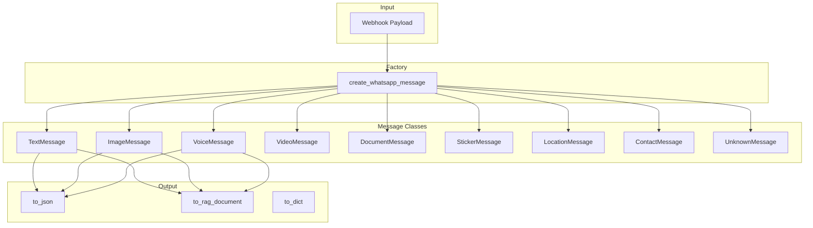

# WhatsApp Message JSON Schema for LangGraph/AI Models

## Overview

This document describes the implementation of a standardized JSON output from the WhatsApp message classes, optimized for consumption by LangGraph and AI models.

## Implementation Summary

The implementation uses a **class hierarchy** where each message content type has its own class inheriting from the abstract base `WhatsappMSG` class.

## Class Hierarchy

```
WhatsappMSG (Abstract Base)
├── TextMessage
├── MediaMessageBase (Abstract)
│   ├── ImageMessage
│   ├── VoiceMessage
│   ├── VideoMessage
│   ├── DocumentMessage
│   └── StickerMessage
├── LocationMessage
├── ContactMessage
└── UnknownMessage
```

## Usage

```python
from whatsapp import create_whatsapp_message

# Create appropriate message type from webhook payload
msg = create_whatsapp_message(payload)

# Get JSON output optimized for LangGraph/AI
json_output = msg.to_json()

# Access type-specific attributes
if isinstance(msg, ImageMessage):
    msg.description = "AI-generated image description"
    
if isinstance(msg, VoiceMessage):
    msg.transcription = "Transcribed text from audio"
```

## JSON Output Schema

### Common Structure (all message types)

```json
{
  "type": "whatsapp_message",
  "version": "1.0",
  "content_type": "text|image|voice|video|document|sticker|location|contact|unknown",
  "timestamp": {
    "unix": 1707648000,
    "iso": "2024-02-11T12:00:00+02:00",
    "formatted": "11/02/2024 12:00"
  },
  "chat": {
    "id": "972501234567@c.us",
    "name": "John Doe",
    "type": "direct|group"
  },
  "sender": {
    "id": "972501234567@c.us",
    "name": "John Doe",
    "number": "972501234567",
    "is_business": false
  },
  "context": {
    "is_group": false,
    "formatted_message": "[11/02/2024 12:00] John Doe: Hello, how are you?"
  },
  "content": {
    "type": "text",
    "text": "Hello, how are you?",
    "media": null
  }
}
```

### Content Type Variations

#### TextMessage
```json
{
  "content": {
    "type": "text",
    "text": "Hello, how are you?",
    "media": null
  }
}
```

#### ImageMessage
```json
{
  "content": {
    "type": "image",
    "text": "Check out this photo!",
    "media": {
      "mime_type": "image/jpeg",
      "url": "https://...",
      "base64": "...",
      "description": "AI-generated description (optional)"
    }
  }
}
```

#### VoiceMessage
```json
{
  "content": {
    "type": "voice",
    "text": "Transcription text (if available)",
    "media": {
      "mime_type": "audio/ogg",
      "url": "https://...",
      "base64": "...",
      "transcription": "Transcribed text (optional)"
    }
  }
}
```

#### VideoMessage
```json
{
  "content": {
    "type": "video",
    "text": "Video caption",
    "media": {
      "mime_type": "video/mp4",
      "url": "https://...",
      "base64": "..."
    }
  }
}
```

#### DocumentMessage
```json
{
  "content": {
    "type": "document",
    "text": "Document caption",
    "media": {
      "mime_type": "application/pdf",
      "url": "https://...",
      "base64": "...",
      "filename": "document.pdf"
    }
  }
}
```

#### LocationMessage
```json
{
  "content": {
    "type": "location",
    "text": "Coffee Shop",
    "media": null,
    "location": {
      "latitude": 32.0853,
      "longitude": 34.7818,
      "name": "Coffee Shop"
    }
  }
}
```

#### ContactMessage
```json
{
  "content": {
    "type": "contact",
    "text": "Shared contact: John Smith",
    "media": null,
    "contact": {
      "name": "John Smith",
      "vcard": "BEGIN:VCARD..."
    }
  }
}
```

## Files Modified

- **[`src/whatsapp.py`](../src/whatsapp.py)** - Complete rewrite with class hierarchy
- **[`src/app.py`](../src/app.py)** - Updated to use `create_whatsapp_message()` factory

## Key Features

1. **Type-specific classes** - Each message type has dedicated handling
2. **Factory function** - `create_whatsapp_message(payload)` automatically creates the right type
3. **AI hooks** - `ImageMessage.description` and `VoiceMessage.transcription` for AI enrichment
4. **Standard JSON** - Consistent structure optimized for LangGraph consumption
5. **RAG support** - `to_rag_document()` preserved for vector store indexing

## ContentType Enum

```python
class ContentType(str, Enum):
    TEXT = "text"
    IMAGE = "image"
    VOICE = "voice"
    VIDEO = "video"
    DOCUMENT = "document"
    STICKER = "sticker"
    LOCATION = "location"
    CONTACT = "contact"
    UNKNOWN = "unknown"
```

## Architecture Diagram



## Migration Notes

The old `WhatsappMSG` class and `MediaMessage` class have been removed. Use:

```python
# OLD (deprecated)
# from whatsapp import WhatsappMSG
# msg = WhatsappMSG(payload)

# NEW
from whatsapp import create_whatsapp_message
msg = create_whatsapp_message(payload)
json_output = msg.to_json()
```
